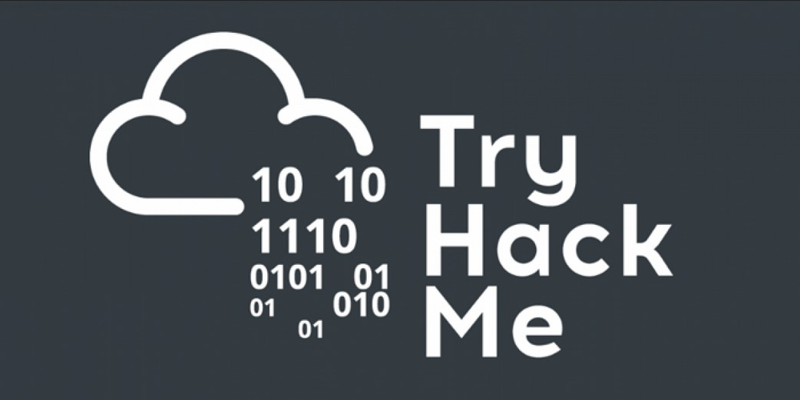

<!---->

##### 🧭 LEARNING PATH
# 🛡️ Pre Security

| 📘 **Modules** | 🧪 **Hands-on Labs** | 🎯 **Difficulty Level** |
|:---------------:|:-------------------:|:-----------------------:|
| 5 | 18 | 🟢 Easy |

Welcome to my walkthrough documentation for the **Pre-Security Learning Path** on the **TryHackMe** platform.
This guide is designed to support **beginners in cybersecurity** by building the essential technical foundation needed to start your journey.
Before you can attack or defend any technology, it’s crucial to understand how that technology works — and that’s exactly what this path helps you achieve.

**Before hacking something, you first need to understand the basics:**
- **Cyber security basics** 
- **Networking basics and weaknesses** 
- **The web and common attacks** 
- **Learn to use the Linux operating system** 

💡 Note: I highly encourage you to **try each room on your own first**. Use this walkthrough only when you’re truly stuck or need a small push in the right direction.

This documentation serves as an educational companion, not a shortcut.
Stay curious, keep learning — and happy hacking! 🛡️💻

## SECTION 1: Introduction to Cyber Security

[Offensive Security Intro]()  
[Defensive Security Intro]()  
[Career in Cyber]()  

## SECTION 2: Network Fundamentals

[What is Networking?]()  
[Intro to LAN]()  
[OSI Model]()  
[Packets & Frames]()  
[Extending Your Network]()  

## SECTION 3: How The Web Works

[DNS in Detail]()  
[HTTP in Detail]()  
[How Websites Work]()  
[Putting It All Together]()  

## SECTION 4: Linux Fundamentals

[Linux Fundamentals Part 1]()  
[Linux Fundamentals Part 2]()  
[Linux Fundamentals Part 3]()  

## SECTION 5: Windows Fundamentals

[Windows Fundamentals 1]()  
[Windows Fundamentals 2]()  
[Windows Fundamentals 3]()  

