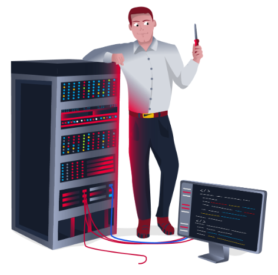

# Careers in Cyber
Learn about the different careers in cyber security.

### Task 1 Introduction

Let's start exploring the different roles in cyber security!

### Task 2 Security Analyst

  
#### Responsible for maintaining the security of an organisation's data

Security analysts are integral to constructing security measures across organisations to protect the company from attacks. Analysts explore and evaluate company networks to uncover actionable data and recommendations for engineers to develop preventative measures. This job role requires working with various stakeholders to gain an understanding of security requirements and the security landscape.
Responsibilities

- Working with various stakeholders to analyse the cyber security throughout the company
- Compile ongoing reports about the safety of networks, documenting security issues and measures taken in response
- Develop security plans, incorporating research on new attack tools and trends, and measures needed across teams to maintain data security.

Learning Paths

TryHackMe's learning paths will give you both the fundamental technical knowledge and hands-on experience, which is crucial to becoming a successful Security Analyst.

- Pre Security
- Cyber Security 101
- SOC Level 1

Relevant Career Guides

[Becoming a Cyber Security Analyst](https://tryhackme.com/careers/cyber-security-analyst)  
[How to Become a Level 1 SOC Analyst](https://tryhackme.com/resources/blog/become-level-1-soc-analyst)  
[A Day in the Life of a SOC Analyst](https://tryhackme.com/resources/blog/interview-with-soc-analyst)  
[The Ultimate SOC L1 Analyst Interview Guide](https://tryhackme.com/resources/blog/soc-analyst-interview-guide)  
[From Student to SOC Analyst: Hayden’s Success Story](https://tryhackme.com/resources/blog/haydens-success-story)  

### Task 3 Security Engineer

  
#### Design, monitor and maintain security controls, networks, and systems to help prevent cyberattacks

Security engineers develop and implement security solutions using threats and vulnerability data - often sourced from members of the security workforce. Security engineers work across circumventing a breadth of attacks, including web application attacks, network threats, and evolving trends and tactics. The ultimate goal is to retain and adopt security measures to mitigate the risk of attack and data loss.
Responsibilities

- Testing and screening security measures across software
- Monitor networks and reports to update systems and mitigate vulnerabilities
- Identify and implement systems needed for optimal security

Learning Paths

TryHackMe's learning paths will give you both the fundamental technical knowledge and hands-on experience, which is crucial to becoming a successful Security Engineer.

- SOC Level 1
- JR Penetration Tester
- Offensive Pentesting

Relevant Career Guides

[Becoming a Security Engineer](https://tryhackme.com/r/careers/security-engineer)  
[How to Become a Security Engineer](https://tryhackme.com/r/resources/blog/become-security-engineer)  
[A Day in the Life of a Security Engineer](https://tryhackme.com/r/resources/blog/interview-with-security-engineer)  
[Preparing for a Security Engineering Interview](https://tryhackme.com/r/resources/blog/security-engineer-interview-guide)  
[Becoming a Security Engineer: Richárd’s Success Story](https://tryhackme.com/r/resources/blog/richard-success-story)  

### Task 4 Incident Responder

  
#### Identifies and mitigates attacks whilst an attackers operations are still unfolding

Incident responders respond productively and efficiently to security breaches. Responsibilities include creating plans, policies, and protocols for organisations to enact during and following incidents. This is often a highly pressurised position with assessments and responses required in real-time, as attacks are unfolding. Incident response metrics include MTTD, MTTA, and MTTR - the meantime to detect, acknowledge, and recover (from attacks.) The aim is to achieve a swift and effective response, retain financial standing and avoid negative breach implications. Ultimately, incident responders protect the company's data, reputation, and financial standing from cyber attacks.
Responsibilities

- Developing and adopting a thorough, actionable incident response plan
- Maintaining strong security best practices and supporting incident response measures
- Post-incident reporting and preparation for future attacks, considering learnings and adaptations to take from incidents

Learning Paths

TryHackMe's learning paths will give you both the fundamental technical knowledge and hands-on experience, which is crucial to becoming a successful Incident Responder.

- SOC Level 1

### Task 5 Digital Forensics Examiner

 
#### Responsible for using digital forensics to investigate incidents and crimes

If you like to play detective, this might be the perfect job. If you are working as part of a law-enforcement department, you would be focused on collecting and analysing evidence to help solve crimes: charging the guilty and exonerating the innocent. On the other hand, if your work falls under defending a company's network, you will be using your forensic skills to analyse incidents, such as policy violations.
Responsibilities

- Collect digital evidence while observing legal procedures
- Analyse digital evidence to find answers related to the case
- Document your findings and report on the case

### Task 6 Malware Analyst

 
#### Analyses all types of malware to learn more about how they work and what they do

A malware analyst's work involves analysing suspicious programs, discovering what they do and writing reports about their findings. A malware analyst is sometimes called a reverse-engineer as their core task revolves around converting compiled programs from machine language to readable code, usually in a low-level language. This work requires the malware analyst to have a strong programming background, especially in low-level languages such as assembly language and C language. The ultimate goal is to learn about all the activities that a malicious program carries out, find out how to detect it and report it.
Responsibilities

- Carry out static analysis of malicious programs, which entails reverse-engineering
- Conduct dynamic analysis of malware samples by observing their activities in a controlled environment
- Document and report all the findings

### Task 7 Penetration Tester

 
#### Responsible for testing technology products for security loopholes

You may see penetration testing referred to as pentesting and ethical hacking. A penetration tester's job role is to test the security of the systems and software within a company - this is achieved through attempts to uncover flaws and vulnerabilities through systemised hacking. Penetration testers exploit these vulnerabilities to evaluate the risk in each instance. The company can then take these insights to rectify issues to prevent a real-world cyberattack.
Responsibilities

- Conduct tests on computer systems, networks, and web-based applications
- Perform security assessments, audits, and analyse policies
- Evaluate and report on insights, recommending actions for attack prevention

Learning Paths

TryHackMe's learning paths will give you both the fundamental technical knowledge and hands-on experience, which is crucial to becoming a successful Penetration Tester.

- Jr Penetration Tester
- Offensive Pentesting

Relevant Career Guides

[Becoming a Penetration Tester](https://tryhackme.com/r/careers/penetration-tester)  
[How to Become a Penetration Tester](https://tryhackme.com/r/resources/blog/how-to-become-a-penetration-tester)  
[Preparing for a Junior Penetration Tester Interview](https://tryhackme.com/r/resources/blog/jr-pentester-interview-guide)  
[From IT Support to Pentester: Tom’s Success Story](https://tryhackme.com/r/resources/blog/tom-success-story)  

### Task 8 Red Teamer

#### Plays the role of an adversary, attacking an organisation and providing feedback from an enemies perspective

Red teamers share similarities to penetration testers, with a more targeted job role. Penetration testers look to uncover many vulnerabilities across systems to keep cyber-defence in good standing, whilst red teamers are enacted to test the company's detection and response capabilities. This job role requires imitating cyber criminals' actions, emulating malicious attacks, retaining access, and avoiding detection. Red team assessments can run for up to a month, typically by a team external to the company. They are often best suited to organisations with mature security programs in place.
Responsibilities

- Emulate the role of a threat actor to uncover exploitable vulnerabilities, maintain access and avoid detection
- Assess organisations' security controls, threat intelligence, and incident response procedures
- Evaluate and report on insights, with actionable data for companies to avoid real-world instances

Learning Paths

TryHackMe's learning paths will give you both the fundamental technical knowledge and hands-on experience, which is crucial to becoming a successful Red Teamer.

- JR Penetration Tester
- Offensive Pentesting
- Red Teamer

Relevant Career Guides

[Red Teaming: Job Roles, Salaries & Opportunities](https://tryhackme.com/r/resources/blog/red-teaming-jobs-salaries-opportunities)

### Task 9 Quiz

[leverage online training to land your dream job](https://tryhackme.com/resources/blog/online-training-for-careers)

