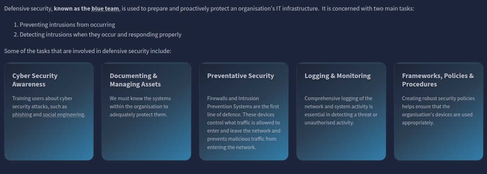
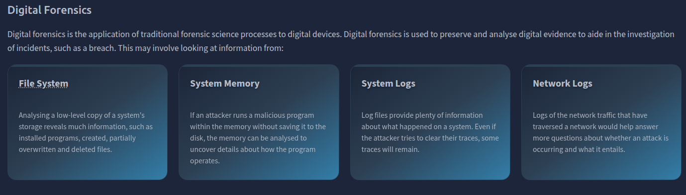
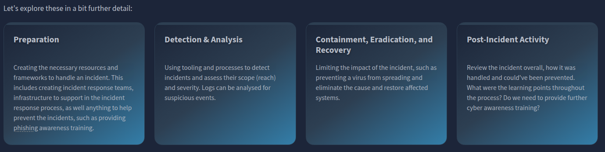
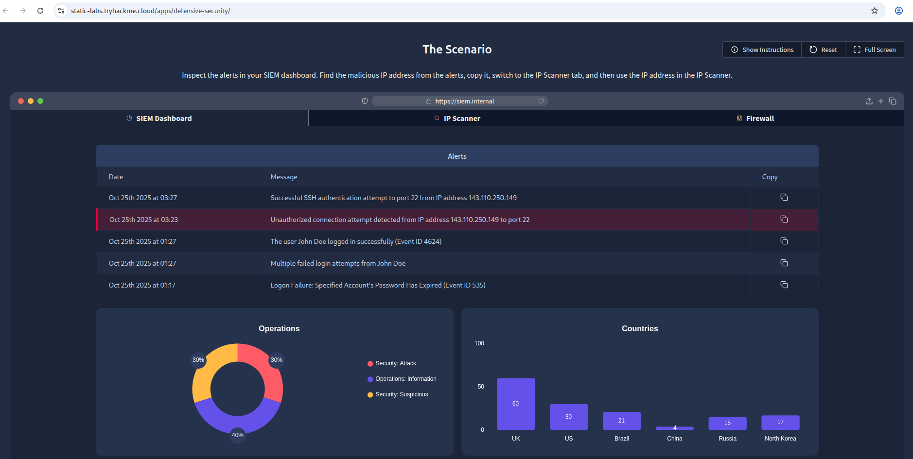
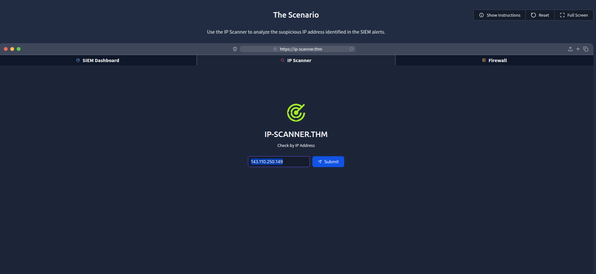
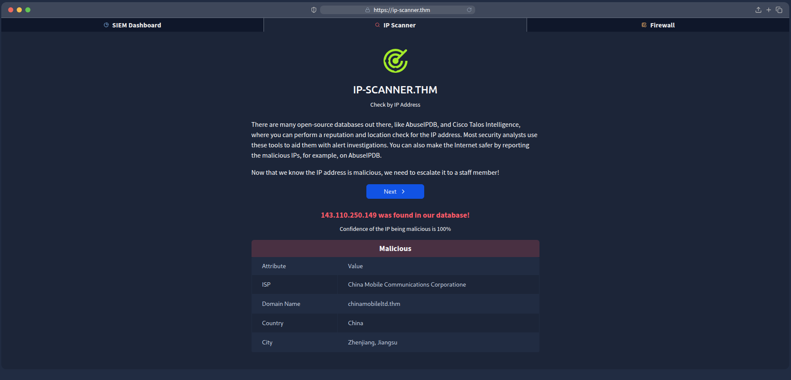
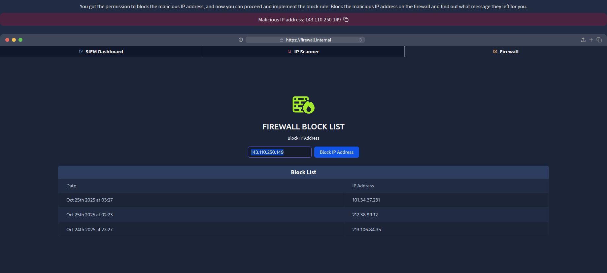

# Defensive Security Intro
Introducing defensive security and related topics, such as Threat Intelligence, SOC, DFIR, Malware Analysis, and SIEM.

### Task 1 Introduction to Defensive Security

Which team focuses on defensive security?
```
✅ Blue Team
```


### Task 2 Exploring the SOC

What would you call a team of cyber security professionals that monitors a network and its systems for malicious events?
```
✅ Security Operations Centre
```


### Task 3 Digital Forensics

An attacker deploys a piece of malicious code that does not save to the disk. What digital forensics technique would we use in this instance?
```
✅ System Memory
```


### Task 4 Incident Response

What phase of the incident response process involves providing "cyber awareness" training to employees?
```
✅ Preparation
```


### Task 5 Practical Example of Defensive Security

What is the flag that you obtained by following along?
```
✅ THREAT-BLOCKED
```







