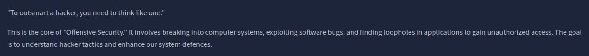
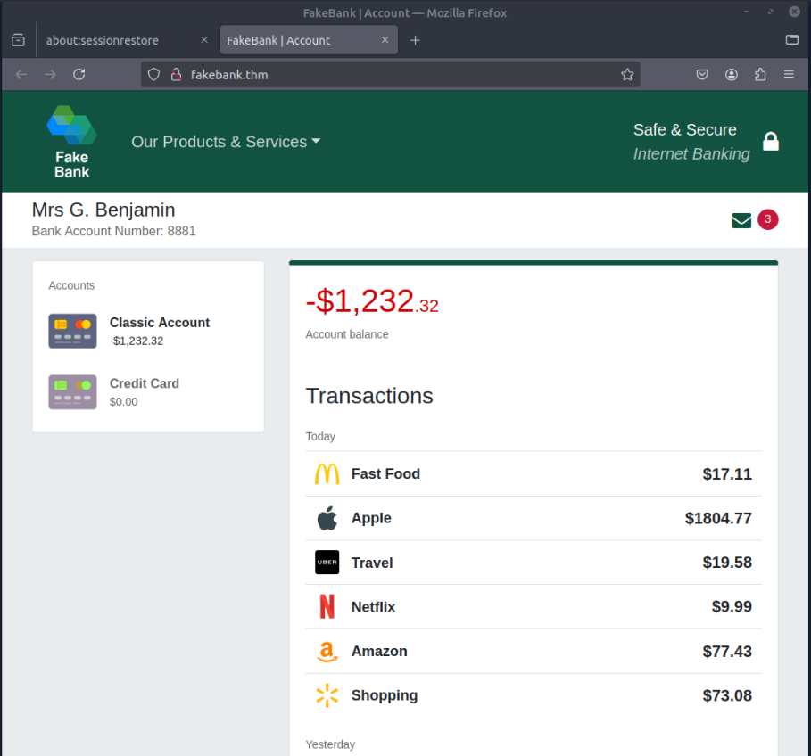
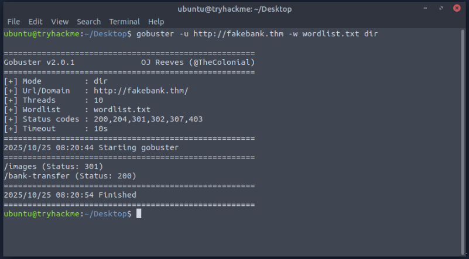
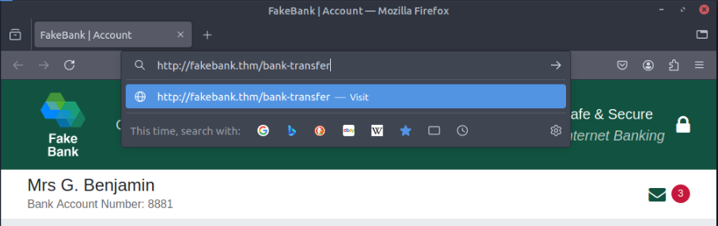
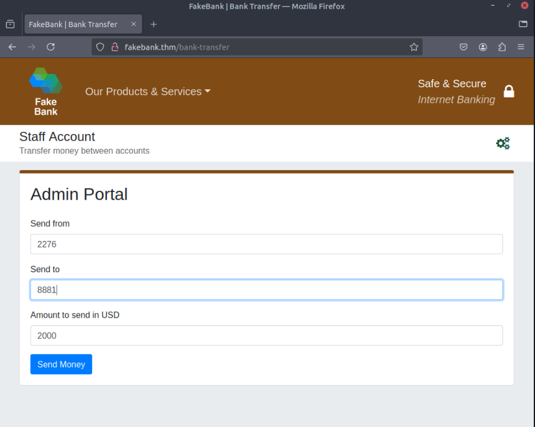
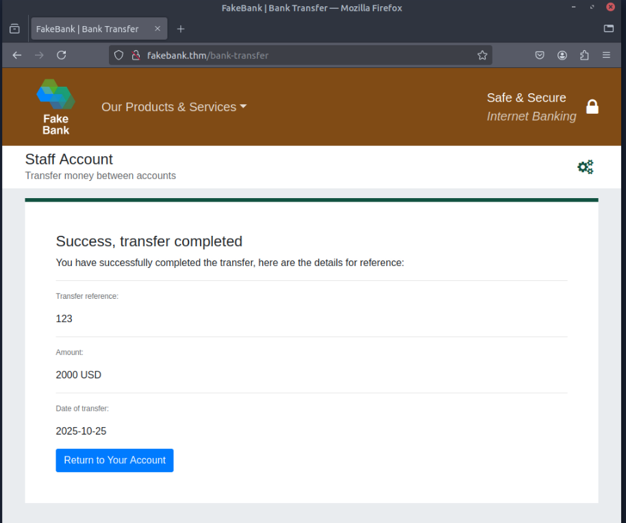
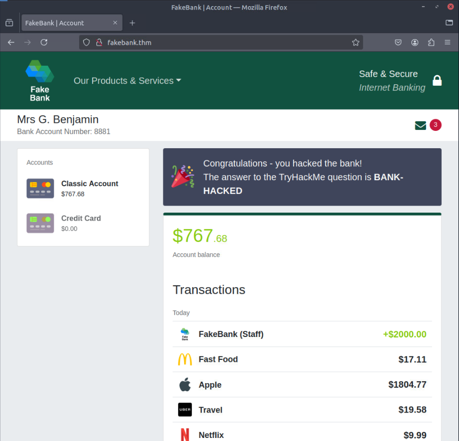

# Offensive Security Intro
Hack your first website (legally in a safe environment) and experience an ethical hacker's job.

### Task 1 What is Offensive Security?

Which of the following options better represents the process where you simulate a hacker's actions to find vulnerabilities in a system?

- Offensive Security
- Defensive Security
```
✅ Offensive Security
```


### Task 2 Hacking your first machine

Above your account balance, you should now see a message indicating the answer to this question. Can you find the answer you need?

```
✅ BANK-HACKED
```







### Task 3 Careers in cyber security

Some Success Story on THM blog:  
[Paul went from a construction worker to a security engineer](https://tryhackme.com/resources/blog/construction-worker-to-security-engineer-how-paul-used-tryhackme-to-land-his-first-job-in-security)  
[Kassandra went from a music teacher to a security professional](https://tryhackme.com/resources/blog/the-teacher-becomes-the-student)  
[Brandon used TryHackMe while at school to get his first job in cyber](https://tryhackme.com/resources/blog/brandons-success-story)  

What careers are there?

The cyber careers lesson goes into more depth about the different careers in cyber. However, here is a short description of a few offensive security roles:

- Penetration Tester - Responsible for testing technology products for finding exploitable security vulnerabilities.
- Red Teamer - Plays the role of an adversary, attacking an organization and providing feedback from an enemy's perspective.
- Security Engineer - Design, monitor, and maintain security controls, networks, and systems to help prevent cyberattacks.


