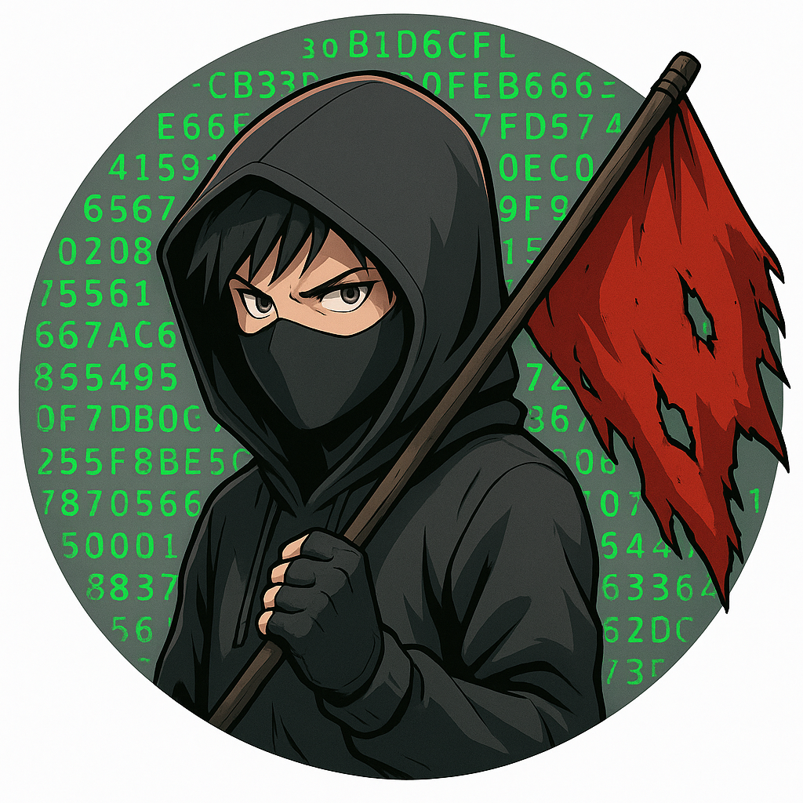

# $whoami

Hey there! I’m **Rithea Cheng**, a cybersecurity enthusiast and CTF player passionate about learning through hands-on challenges. I love exploring topics like ethical hacking, network security, and digital forensics — and sharing my journey so others can learn and grow in this exciting field.

This blog is my space to document CTF walkthroughs, share tips for beginners, and dive into real-world hacking concepts in a fun, educational way. Whether you’re just getting started or sharpening your skills, my goal is to help you understand not just how to solve challenges, but why the solutions work.

# 🌐Links

# 🚩CTF Writeup
## 🎯Overthewire

## 🎯Tryhackme

