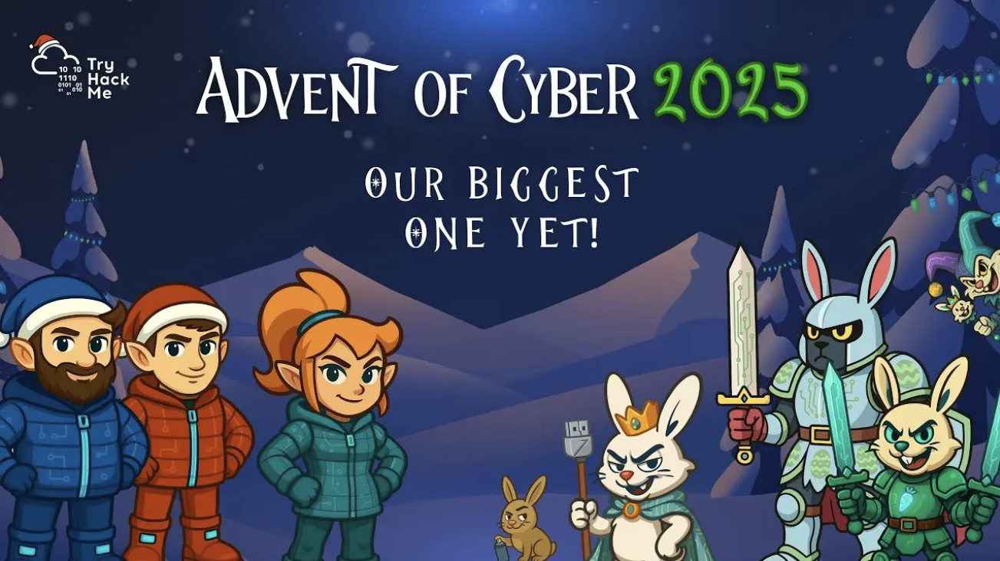

# 🎄 Advent of Cyber 2025 🔐

```
https://tryhackme.com/adventofcyber25
```



**Advent of Cyber 2025** is a beginner-friendly cybersecurity learning event that runs for **25 days**, unlocking a new challenge every day 🎁. It introduces newcomers to the world of cyber defense through **hands-on exercises**, real-world scenarios, and **easy-to-follow lessons**.

Participants will learn **how cyber attacks work**, **how hackers think**, and **how to protect systems, data, and personal information** in today’s digital world 💻🛡️. By completing daily challenges, learners can earn **certificates 📜, digital badges 🏅, and chances to win exciting prizes 🎉**—making it a fun, interactive, and rewarding way to build practical cybersecurity skills, with **no prior experience required**.

[Prep Track](preptrack/)  
[Day 1](day1/)  
[Side Quest 1 Key](sidequest1key/)  
[Day 2](day2/)  
[Day 3](day3/)  
[Day 4](day4/)  
[Day 5](day5/)  
[Day 6](day6/)  
[Day 7](day7/)  
[Day 8](day8/)  
[Day 9](day9/)  
[Side Quest 2 Key](sidequest2key/)  
[Day 10](day10/)  
[Day 11](day11/)  
[Day 12](day12/)  
[Day 13](day13/)  
[Day 14](day14/)  
[Day 15](day15/)  
[Day 16](day16/)  
[Day 17](day17/)  
[Side Quest 3 Key](sidequest3key/)  
[Day 18](day18/)  
[Day 19](day19/)  
[Day 20](day20/)  

<!--
[Day 21](day21/)  
[Side Quest 4 Key](sidequest4key/)  
[Day 22](day22/)  
[Day 23](day23/)  
[Day 24](day24/)
[Side Quest 1](sidequest1/)  
[Side Quest 2](sidequest2/)  
[Side Quest 3](sidequest3/)
[Side Quest 4](sidequest4/)  
-->
 