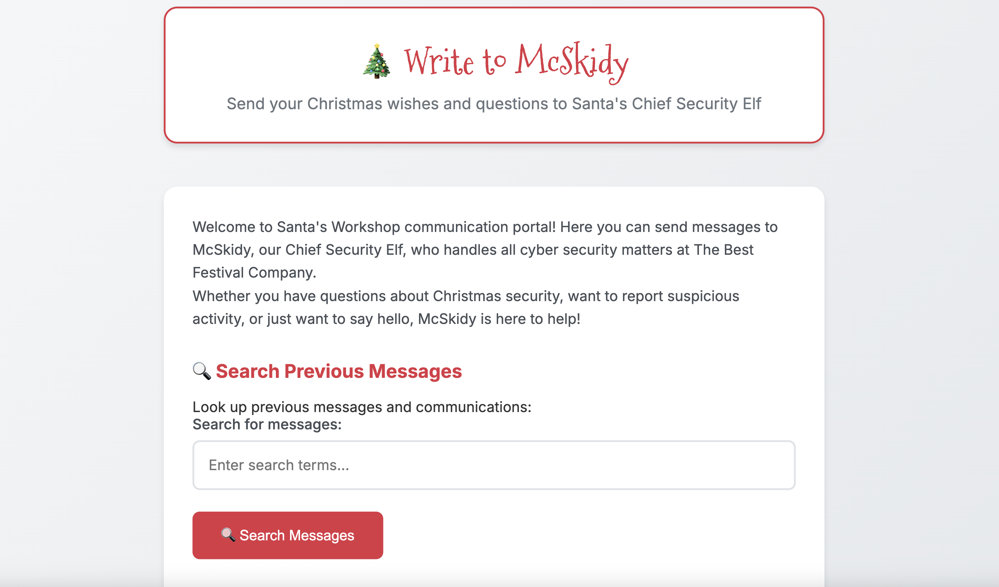
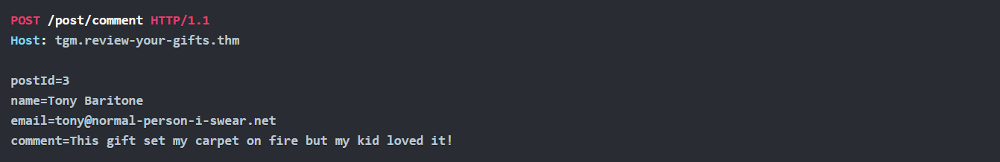
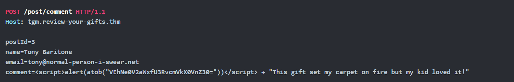
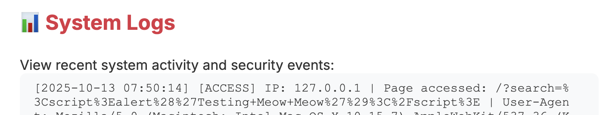

# XSS - Merry XSSMas


Learn about types of XSS vulnerabilities and how to prevent them.

```
https://tryhackme.com/room/xss-aoc2025-c5j8b1m4t6
```

## Task 1 Introduction


After last year's automation and tech modernisation, Santa's workshop got a new makeover. McSkidy has a secure message portal where you can contact her directly with any questions or concerns. However, lately, the logs have been lighting up with unusual activity, ranging from odd messages to suspicious search terms. Even Santa's letters appear to be scripts or random code. Your mission, should you choose to accept it: dig through the logs, uncover the mischief, and figure out who's trying to mess with McSkidy. 

### Learning Objectives

- Understand how XSS works
- Learn to prevent XSS attacks

---

## Task 2 Leave the Cookies, Take the Payload

### Equipment Check

For today's room we will be using a the web app found under `http://MACHINE_IP`. You can use the browser of your AttackBox to navigate to it. You will see a page as shown below:



Let's review some key material regarding potential attacks on websites like this portal, specifically Cross-Site Scripting (XSS). 

XSS is a web application vulnerability that lets attackers (or evil bunnies) inject malicious code (usually JavaScript) into input fields that reflect content viewed by other users (e.g., a form or a comment in a blog). When an application doesn't properly validate or escape user input, that input can be interpreted as code rather than harmless text. This results in malicious code that can steal credentials, deface pages, or impersonate users. Depending on the result, there are various types of XSS.  In today’s task, we focus on **Reflected XSS** and **Stored XSS**.

### Reflected XSS

You see reflected variants when the injection is immediately projected in a response. Imagine a toy search function in an online toy store, you search via:

```
https://trygiftme.thm/search?term=gift
```


But imagine you send this to your friend who is looking for a gift for their nephew (please don't do this):

```
https://trygiftme.thm/search?term=<script>alert( atob("VEhNe0V2aWxfQnVubnl9") )</script>
```

If your friend clicks on the link, it will execute code instead.

**Impact**

You could act, view information, or modify information that your friend or any user could do, view, or access. It's usually exploited via phishing to trick users into clicking a link with malicious code injected.

### Stored XSS

A Stored XSS attack occurs when malicious script is saved on the server and then loaded for every user who views the affected page. Unlike Reflected XSS, which targets individual victims, Stored XSS becomes a "set-and-forget" attack, anyone who loads the page runs the attacker’s script.

To understand how this works, let’s use the example of a simple blog where users can submit comments that get displayed below each post.

### Normal Comment Submission



The server stores this information and displays it whenever someone visits that blog post.

### Malicious Comment Submission (Stored XSS Example)

If the application does not sanitize or filter input, an attacker can submit JavaScript instead of a comment:



Because the comment is saved in the database, every user who opens that blog post will automatically trigger the script.
This lets the attacker run code as if they were the victim in order to perform malicious actions such as: 

- Steal session cookies
- Trigger fake login popups
- Deface the page

### Protecting against XSS

Each service is different, and requires a well-thought-out, secure design and implementation plan, but key practices you can implement are:

- **Disable dangerous rendering raths**: Instead of using the `innerHTML` property, which lets you inject any content directly into HTML, use the `textContent` property instead, it treats input as text and parses it for HTML.
- **Make cookies inaccessible to JS**: Set session cookies with the HttpOnly, Secure, and SameSite attributes to reduce the impact of XSS attacks.
- **Sanitise input/output and encode**:
    - In some situations, applications may need to accept limited HTML input—for example, to allow users to include safe links or basic formatting. However it's critical to sanitize and encode all user-supplied data to prevent security vulnerabilities. Sanitising and encoding removes or escapes any elements that could be interpreted as executable code, such as scripts, event handlers, or JavaScript URLs while preserving safe formatting.

To exploit XSS vulnerabilities, we need some type of input field to inject code. There is a search section, let's start there.

### Exploiting Reflected XSS

To exploit reflected XSS, we can use test payloads to check if the app runs the code injected. If you want to test more advanced payloads, there are cheat sheets online that you can use to craft them. For now, we'll pick the following payload:
``<script>alert('Reflected Meow Meow')</script>``

```
### cheatsheet
https://portswigger.net/web-security/cross-site-scripting/cheat-sheet
```


Inject the code by adding the payload to the search bar and clicking " **Search Messages**". If it shows the alert text, we have confirmed reflected XSS. So, what happened?

- The search input is reflected directly in the results without encoding
- The browser interprets your HTML/JavaScript as executable code
- An alert box appeared, demonstrating successful XSS execution

You can track the behaviour and how the system interprets your actions by checking the " **System Logs**" tab at the bottom of the page:



Now that we have confirmed reflected XSS, let's investigate if it's susceptible to stored XSS. This vector must be different, as it needs to be persisted. Looking at the website, we can see that you are able to send messages, which are stored on the server for McSkidy to view later (as opposed to searching, which is stored temporarily on the client side).

Navigate to the message form, and enter the malicious payload we used before (others work too): 

``script>alert('Stored Meow Meow')</script>``

Click the " Send Message" button. Because messages are stored on the server, every time you navigate to the site or reload, the alert will display.

### Wrapping Up

So it's confirmed! The site is vulnerable to XSS; it's no wonder that unusual payloads have been detected in the logs. The team will now harden the site to prevent future malicious code from being injected.


---

## 🔑 Solution


Which type of XSS attack requires payloads to be persisted on the backend?

```
✅ stored
```

What's the reflected XSS flag?

```
✅ THM{Evil_Bunny}
```

What's the stored XSS flag?

```
✅ THM{Evil_Stored_Egg}
```

