# Phishing - Phishmas Greetings


Learn how to spot phishing emails from Malhare's Eggsploit Bunnies sent to TBFC users.

```
https://tryhackme.com/room/spottingphishing-aoc2025-r2g4f6s8l0
```

## Task 1 Introduction


Since McSkidy’s disappearance, TBFC’s defences have weakened, and now the Email Protection Platform is down.

With filters offline, the staff must triage every suspicious message manually.
The SOC Team suspects Malhare’s Eggsploit Bunnies have sent phishing messages to TBFC’s users to steal credentials and disrupt SOC-mas.


You’ve joined the Incident Response Task Force to help identify which emails are legit or phishing attempts.

But beware, some phishing attempts are clever, disguised as routine TBFC operations, volunteer sign-ups, or SOC-mas event logistics. Every wrong call could bring Wareville one step closer to EAST-mas becoming a reality.


### Learning Objectives

- Spotting phishing emails
- Learn trending phishing techniques
- Understand the differences between spam and phishing

---

## Task 2 Spotting Phishing Emails

### Phishing Overview

Phishing may be one of the oldest cyber tricks, but it’s still one of the most effective. As companies like TBFC strengthen their defences with advanced email filters and security tools, attackers have evolved their tactics to stay one step ahead.

Modern phishing focuses on precision and persuasion. Messages are carefully crafted, often mimicking real people, portals, or internal processes to trick even the most cautious users.

Common intentions behind phishing messages:

- **Credential theft:** Tricking users into revealing passwords or login details.
- **Malware delivery:** Disguising malicious attachments or links as safe content.
- **Data exfiltration:** Gathering sensitive company or personal information.
- **Financial fraud:** Persuading victims to transfer money or approve fake invoices.


In the above image, we can see a sample phishing message from an attacker attempting to impersonate an employee by using a free domain (gmail.com) to modify the employee's payroll and achieve financial fraud.

With corporate perimeters now heavily fortified, phishing remains the easiest path to initial access. It targets the one vulnerability technology can’t fix: people. Even in Wareville, a single convincing email from the Eggsploit Bunnies could open the gates to EAST-mas.

### Why Spam Is Not Phishing?

Spam is just digital noise: annoying, but mostly harmless. Phishing, however, is a precision strike, in this case from Malhare’s Eggsploit Bunnies, crafted to deceive TBFC employees and open a path into the company’s defences.

Spam focuses on quantity over precision. Unlike phishing, which aims to deceive specific users, spam messages are sent in bulk to flood inboxes with unwanted marketing or irrelevant content. Their goal isn’t usually to steal data, but to push exposure or engagement.

Common intentions behind spam messages:

- **Promotion:** Advertising products, services, or events. Often unsolicited or low-quality.
- **Scams:** Spreading fake offers or “get rich quick” schemes to attract clicks.
- **Traffic generation (clickbait):** Driving users to external sites or boosting ad metrics.
- **Data harvesting:** Collecting active email addresses for future campaigns.

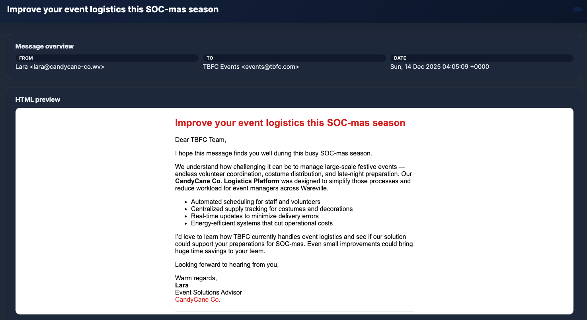

In the above screenshot, it's a sample marketing email offering logistics solutions for the SOC-mas event. We can observe that the intention behind the message is pure marketing.
You need to be careful when analysing each message.**Look for the intention behind it**. Not every unwanted email is a threat; sometimes it’s just spam that poses no real risk to TBFC.

### The Phishmas Takeover

Attackers use some common techniques in almost every phishing attempt. In a phishing attack, at least one of the following techniques is present:

**Impersonation**

Some attackers may act as a person, department, or even a service to lure users. This is a way to gain credibility by impersonating the recipient manager or an important person within the company.

Open the email with the subject "**URGENT: McSkidy VPN access for incident response**" and take a look at the ``From:`` of the message:


We can easily spot impersonation attempts by looking to see if the sender's email matches the internal domain or the standard email structure of the company. In this case, the sender's domain is a free domain from Gmail, which is not aligned with TBFC's domain.

**Social Engineering**

Social engineering in phishing is the art of manipulating people rather than breaking technology. Attackers craft believable stories, emails, calls, or chat messages that exploit emotions (fear, helpfulness, curiosity, urgency) and real-world context to lure the recipients of a message.

Now, read the content of the previous email you had opened. We can spot multiple social engineering techniques:

- **Impersonation:** Is a type of Social Engineering. The attacker is pretending to be McSkidy!
- **Sense of urgency:** We can observe words such as "urgent" and "immediately" to pressure the recipient.
- **Side channel:** The attacker tries to discourage the recipients from reaching McSkidy using his standard communication channels (phone and email address).
- **Malicious intention:** The attacker is trying to trick the user into giving VPN credentials. They can also try to ask for approval of payments, opening malware, or sharing sensitive data.

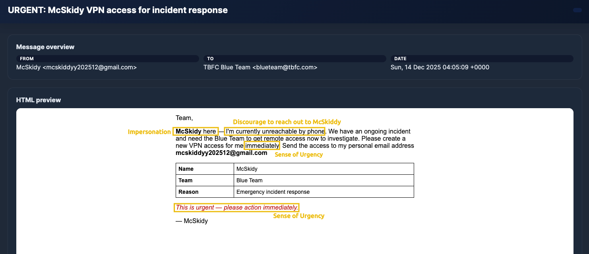

**Typosquatting and Punycode**

You learned that looking at the sender's domain is a good way to spot impersonation attempts coming from external senders. But what if the attacker creates a very similar domain?
That's when typosquatting and punycode enable attackers to leverage users' lack of attention (or awareness)!

Typosquatting is when an attacker registers a common misspelling of an organisation's domain. For example, `glthub.com` instead of `github.com` (note that there is an `L` instead of an `i`).                           

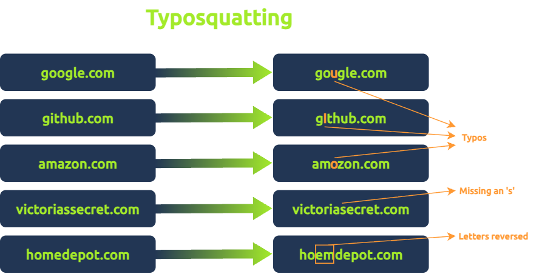

On the other hand, punycode is a special encoding system that converts Unicode characters (used in writing systems like Chinese, Cyrillic, and Arabic) into ASCII. When typing punycodes in the browser URL bar, this will be translated into ASCII format, which is the accepted format by DNS.
With that resource, attackers can replace identical Latin letters; for example, a standard Latin `a` could be replaced with a Greek `α`.

Below we can see an image showing the `tryhackme.com` domain written with тrу instead (Cyrillic `т`, Cyrillic `г`, Cyrillic `у`):

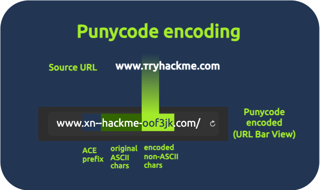

Both techniques enable attackers to register malicious domains and trick users into believing they are receiving emails from the legitimate domain or accessing authentic websites.

Now, let's open the email with the subject "**TBFC-IT shared "Christmas Laptop Upgrade Agreement" with you**".
If we pay attention to the sender of this message, we can identify a Latin letter `ƒ` instead of a normal `f`! It's a clear punycode usage for an email domain.

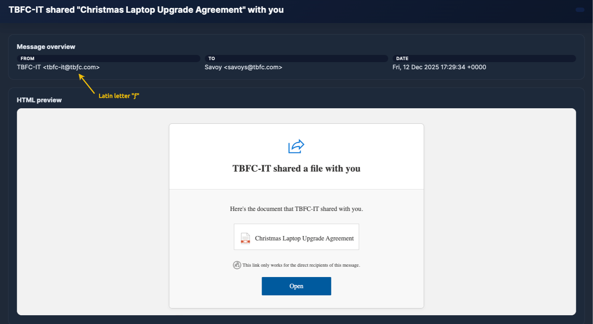

An easy way to identify punycodes is by looking at the field `Return-Path` in the email headers. On the opened email, go down to the headers preview, and you will see the ACE prefix and the encoded non-ASCII characters!

**Spoofing**

Email spoofing is another way attackers can trick users into thinking they are receiving emails from a legitimate domain.
The message looks like it came from a trusted sender (the display name and “From:” you see in the preview), but the underlying headers tell a different story. Modern email clients can easily reject spoofing attempts, but because Wareville email protection is down, some spoofing attempts can pass silently!

Open the email with the subject "**New Audio Message from McSkidy**" and take a look at the ``From:`` field:

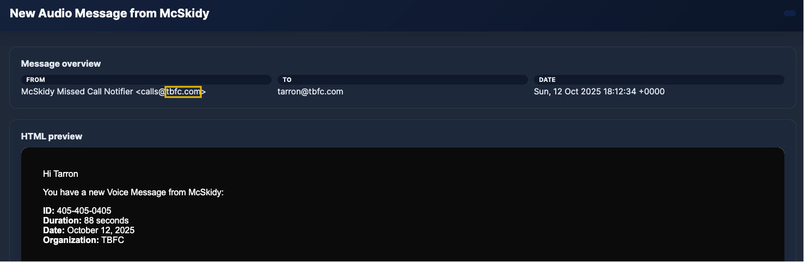

It looks like a real domain from TBFC, but let's check some essential fields in the email headers:

- `Authentication-Results`
- `Return-Path`

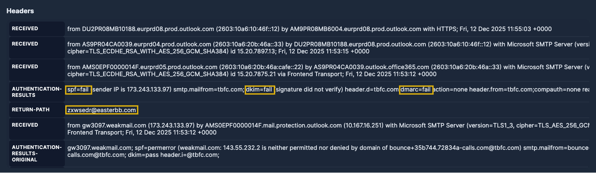

On `Authentication-Results`, SPF, DKIM, and DMARC are security checks that help confirm if an email really comes from who it says it does:

- **SPF:** Says which servers are allowed to send emails for a domain (like a list of approved senders).
- **DKIM:** Adds a digital signature to prove the message wasn’t changed and really came from that domain.
- **DMARC:** Uses SPF and DKIM to decide what to do if something looks fake (for example, send it to spam or block it).

If both SPF and DMARC fail, it’s a strong sign the email is spoofed, meaning the sender isn’t who they claim to be. In this message case, everything failed!

On the `Return-Path` we can see the real mail address `zxwsedr@easterbb.com`. This confirms the spoofing attempt on the missing calls email from TBFC!

**Malicious Attachments**

The most classic way of phishing is attaching malicious files to an email. Usually, these attachments are sent using some sort of social engineering technique in the body.

In the previous email that we analysed, the body tried to trick users into thinking that the attachment was a voice message from McSkidy.
Instead, the file is an ``.html`` file:

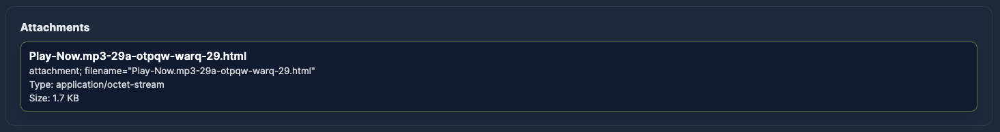

Malicious attachments can have multiple goals. Once opened, these files can install malware, steal passwords, or give attackers access to the device or network. In this case, HTA/HTML files are commonly used for phishing because they run without browser sandboxing, meaning scripts have full access to the endpoint they execute on!

### Trending Phishing

Since email platforms and security tools got much better at blocking suspicious messages and attachments, the Malhare's Eggsploit Bunnies and other attackers had to change their game:

- Instead of sending malware files (which are easily caught), they now focus on tricking users into leaving the company’s secure environment.
- They often use legitimate tools or websites to make their lures look trustworthy and get users to hand over their credentials or download malicious files themselves.

In short, most phishing attacks aren’t about dropping malware directly; they’re focusing on stealing access.

Below you can see a diagram of this trending flow:

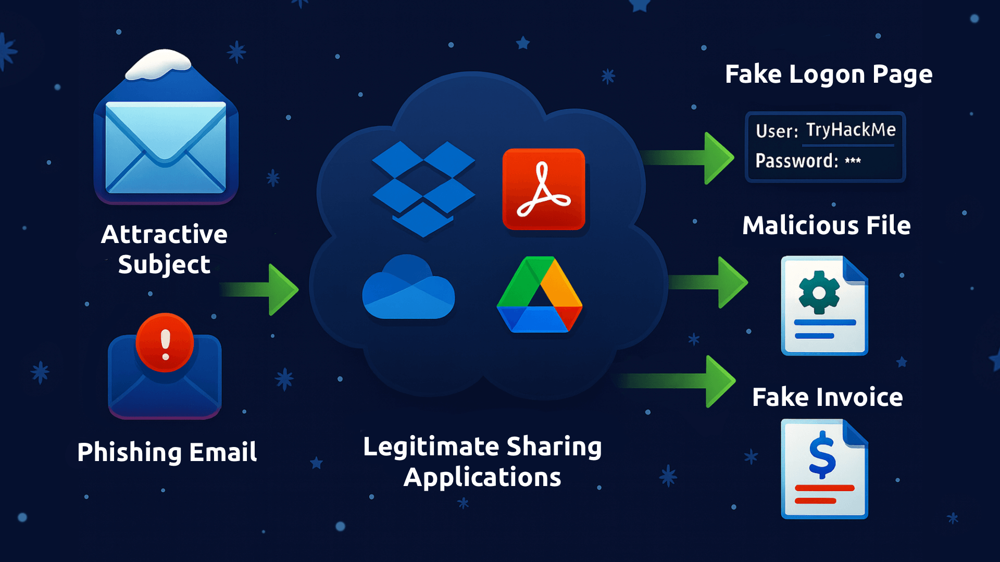

**Legitimate Applications**

We can see attackers hiding behind trusted services such as Dropbox, Google Drive/Docs, and OneDrive, because those links look legitimate and often pass email filters.
The most common scenario involves a shared file containing a very attractive proposal, such as a salary raise document from HR or a laptop upgrade.
Once the user clicks on it, it redirects to a shared document with fake content. The goal is to lure users to access fake login pages to steal credentials or download malicious files.

Let's reopen the email with the subject "**TBFC-IT shared "Christmas Laptop Upgrade Agreement" with you**" and analyse how attackers use it:

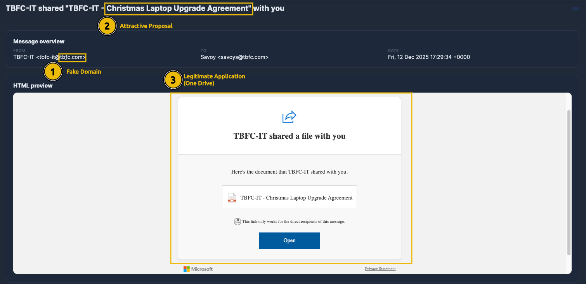

In the above image, we can observe the use of a fake domain with punycodes to trick users, and the use of a legitimate tool (OneDrive), followed by a very attractive proposal. All of these signals have the primary objective of gaining credibility and luring users into thinking it's from the real TBFC IT team.

**Fake Login Pages**

As we learned, credentials are the main goal of attackers nowadays, and fake login pages are their favourite trick for performing this.
It's simple and mimics login pages from multiple typical applications that users interact with in their daily routines. Most of the time, they create fake email platforms, login portals such as Microsoft Office 365 and Google.

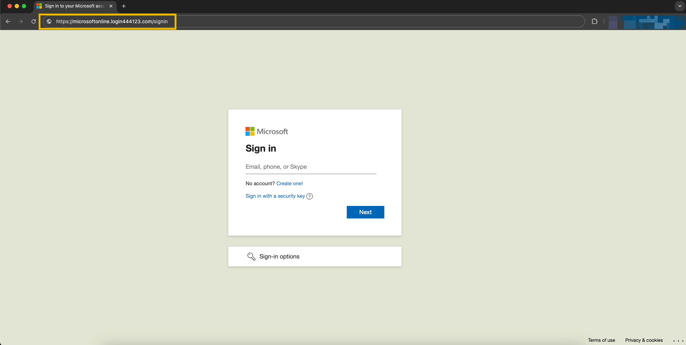

Above it's a Fake Microsoft Login Page sample. We can observe the fake domain `microsoftonline.login444123.com/signin` at the top.

**Side Channel Communications**

Side-channel communication occurs when an attacker moves the conversation off email to another channel, such as SMS, WhatsApp/Telegram, a phone or video call, a texted link, or a shared document platform, to continue the social engineering in a platform without the company's control.

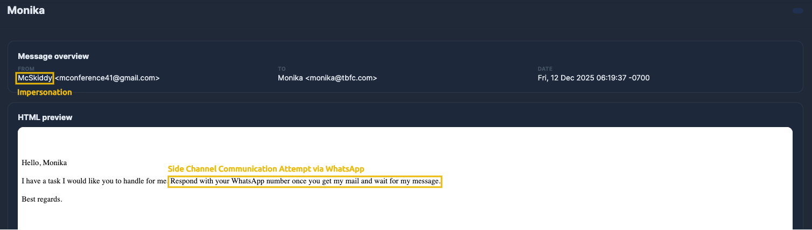

### Time To Spot the Phish and Save SOC-mas!

**Your mission:** Triage the emails, separate spam from phishing, and **identify three clear signals** (for example: spoofing, impersonation, social engineering) for every phishing email you mark.

You'll earn a flag after selecting the right signals for a phishing email. Collect flags for **all phishing emails** to complete the room and secure TBFC’s SOC-mas.

Continue investigating the emails and get the flags for each properly submitted email! Stay sharp, verify before you act, and may your instincts be sharper than the Eggsploit Bunnies’ tricks. Good luck!


---

## 🔑 Solution


Classify the 1st email, what's the flag?

```
✅ THM{yougotnumber1-keep-it-going}
```

Classify the 2nd email. What's the flag?

```
✅ THM{nmumber2-was-not-tha-thard!}
```

Classify the 3rd email. What's the flag?

```
✅ THM{Impersonation-is-areal-thing-keepIt}
```

Classify the 4th email. What's the flag?

```
✅ THM{Get-back-SOC-mas!!}
```

Classify the 5th email. What's the flag?

```
✅ THM{It-was-just-a-sp4m!!}
```

Classify the 6th email. What's the flag?

```
✅ THM{number6-is-the-last-one!-DX!}
```

