# YARA Rules - YARA mean one!


Learn how YARA rules can be used to detect anomalies.

```
https://tryhackme.com/room/yara-aoc2025-q9w1e3y5u7
```

## Task 1 Introduction


When McSkidy went missing, there was chaos and uncertainty at The Best Festival Company (TBFC). However, even in her disappearance, McSkidy was trying to help the TBFC blue team. Taking a page out of the crisis communication process, McSkidy sent what looks like a bunch of images to the blue team from an anonymous location. These images looked like they were related to Easter preparations, but they contained a message sent by McSkidy. The crisis communication process outlines that a message might be sent through a folder of images containing hidden messages that can be decoded if you know the keyword. The blue team has to create a YARA rule that runs on the directory containing the images. The YARA rule must trigger on a keyword followed by a code word. After extracting all the code words in ascending order, the blue team will be able to decode the message.

### Learning Objectives

- Understand the basic concept of YARA.
- Learn when and why we need to use YARA rules.
- Explore different types of YARA rules.
- Learn how to write YARA rules.
- Practically detect malicious indicators using YARA.


---

## Task 2 Yara Rules

### YARA Overview

At this stage, McSkidy, the lead defender, has entrusted you with a mission involving the use of YARA rules. Before jumping into action, let’s take a closer look at what YARA is, how it works, and why it’s such a valuable tool in TBFC’s fight to protect SOC-mas. 

YARA is a tool built to identify and classify malware by searching for unique patterns, the digital fingerprints left behind by attackers. Imagine it as a detective’s notebook for cyber defenders: instead of dusting for prints, YARA scans code, files, and memory for subtle traces that reveal a threat’s identity.


Within TBFC, YARA serves as a silent guardian, scanning through systems and uncovering the faintest traces of malicious activity that others might overlook. Now, as snow drifts over Wareville and the SOC-mas network trembles under threat, it’s your turn to wield this tool and restore the balance.

### Why YARA Matters and When to Use It

You might wonder why McSkidy chose this tool for the mission. In the world of cyberattacks, defenders face an endless stream of alerts, suspicious files, and anomalous network fragments. Not every threat stands out; some hide in plain sight, disguised as harmless documents or scripts. That's where YARA shines.
YARA gives defenders the power to detect malware by its behavior and patterns, not just by name. YARA allows you to define your own rules, providing your own view of what constitutes "malicious" behavior. And you’re not alone, many YARA rules have already been written by defenders from other kingdoms that once faced similar threats. You can use, adapt, and improve these shared rules to strengthen TBFC’s defenses and protect SOC-mas together. For the defenders of SOC-mas, this means faster detection, smarter hunts, and fewer threats slipping by unseen.

In what situations might defenders rely on this tool?

- **Post-incident analysis:** when the security team needs to verify whether traces of malware found on one compromised host still exist elsewhere in the environment.
- **Threat Hunting:** searching through systems and endpoints for signs of known or related malware families.
- **Intelligence-based scans:** applying shared YARA rules from other defenders or kingdoms to detect new indicators of compromise.
- **Memory analysis:** examining active processes in a memory dump for malicious code fragments.

The examples above show common uses of YARA, but defenders often find even more creative ways to apply it during investigations and hunts.

### YARA Values

In the constant battle to protect SOC-mas, time and precision matter most. That’s where YARA shows its true value - it gives defenders clarity in chaos. With YARA, you're not waiting for an antivirus update or a third-party alert. You have the power to create your own rules, detect new variants, and act before the threat spreads. For TBFC's defenders, YARA brings several key advantages:

- **Speed:** quickly scans large sets of files or systems to identify suspicious ones.
- **Flexibility:** detects everything from text strings to binary patterns and complex logic.
- **Control:** lets analysts define exactly what they consider malicious.
- **Shareability:** rules can be reused and improved by other defenders across kingdoms.
- **Visibility:** helps connect scattered clues into a clear picture of the attack.

In short, YARA empowers defenders to move from passive monitoring to active hunting, turning intelligence into action before the attackers strike again.

### YARA Rules

Now that you understand what YARA is and when to use it, it’s time to see how it actually works. To uncover the digital footprints of the evil King Malhare.

A YARA rule is built from several key elements:

- **Metadata:** information about the rule itself: who created it, when, and for what purpose.
- **Strings:** the clues YARA searches for: text, byte sequences, or regular expressions that mark suspicious content.
- **Conditions:** the logic that decides when the rule triggers, combining multiple strings or parameters into a single decision.

Here’s how it looks in practice:

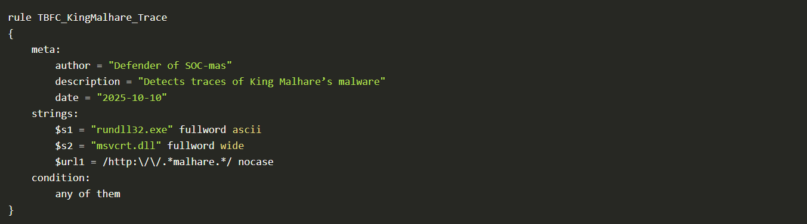

In this example, you can see that the meta section contains fields like author, description, and date. These fields are not required, but they are highly recommended. They help you and other defenders understand what the rule is about, who created it, and when it was written. When your collection of YARA rules grows, having clear metadata will save you time; without it, finding or updating the right rule can quickly become a challenge.
Next, we see the strings section. This is where you define the actual clues, text, byte sequences, or regular expressions that YARA should search for. Finally, the condition section tells YARA when to flag a match, based on the logic you define, in our case, any of the strings.
Together, these three parts form the foundation of every YARA rule. Let’s take a closer look at strings and conditions to understand how they work in practice.

**Strings**

As mentioned earlier, strings are the clues that YARA searches for when scanning files, memory, or other data sources.
They represent the signatures of malicious activity in fragments of text, bytes, or patterns that can reveal the presence of King Malhare's code. In YARA, there are three main types of strings, each with its own purpose. Let’s talk about them and see how they can help defend the kingdom of TBFC.

**Text strings**

Text strings are the simplest and most common type used in YARA rules. They represent words or short text fragments that might appear in a file, script, or memory. By default, YARA treats text strings as ASCII and case-sensitive, but you can modify how they behave using special modifiers - small keywords added after the string definition. The example below shows a simple rule that searches for the word **Christmas** inside a file:

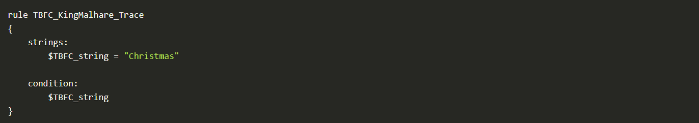

Sometimes, attackers like King Malhare try to hide their code by changing how text looks inside a file - using encoding, case tricks, or even encryption. YARA helps defenders counter these obfuscation methods with a few powerful modifiers that extend the capabilities of text strings:

- **Case-insensitive strings - nocase**

By default, YARA matches text exactly as written. Adding the `nocase` modifier makes the match ignore letter casing, so "Christmas", "CHRISTMAS", or "christmas" will all trigger the same result.


- **Wide-character strings - wide, ascii**

Many Windows executables use two-byte Unicode characters. Adding `wide` tells YARA to also look for this format, while `ascii` enforces a single-byte search. You can use both together:


- **XOR strings - xor**

Malhare's agents often XOR-encode text to hide it from scanners. Using the `xor` modifier, YARA automatically checks all possible single-byte XOR variations of a string - revealing what attackers tried to conceal.

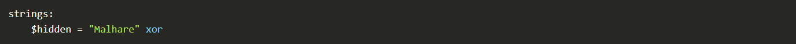

- **Base64 strings - base64, base64wide**

Some malware encodes payloads or commands in Base64. With these modifiers, YARA decodes the content and searches for the original pattern, even when it’s hidden in encoded form.

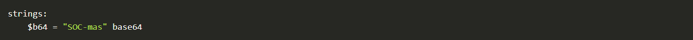

Each of these modifiers makes your rule smarter and more resilient, ensuring that even when King Malhare disguises his code, the defenders of TBFC can still uncover the truth.

- **Hexadecimal strings**

Sometimes, King Malhare's code doesn't leave readable words behind; instead, it hides in raw bytes deep inside executables or memory. That's when hexadecimal strings come to the rescue. Hex strings allow YARA to search for specific byte patterns, written in hexadecimal notation. This is useful when defenders need to detect malware fragments like file headers, shellcode, or binary signatures that can't be represented as plain text.

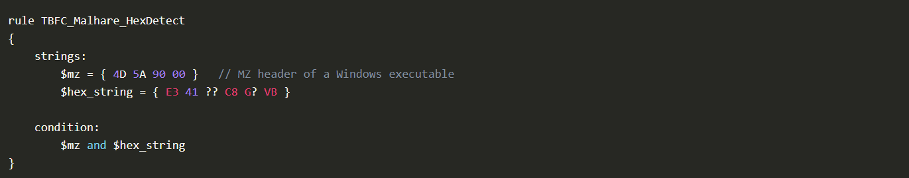

**Regular expression strings**

Not all traces of King Malhare's malware follow a fixed pattern. Sometimes, his code mutates, small changes in file names, URLs, or commands make it harder to detect using plain text or hex strings. That's where regular expressions come in. Regex allows defenders to write flexible search patterns that can match multiple variations of the same malicious string.
It's especially useful for spotting URLs, encoded commands, or filenames that share a structure but differ slightly each time.

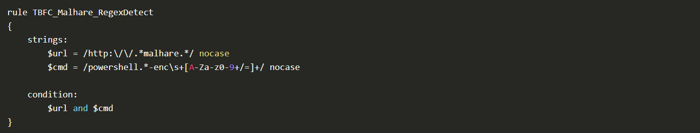

Regex strings are powerful but should be used carefully; they can match a wide range of data and may slow down scans if written too broadly.

**Conditions**

Now that the defenders of TBFC know how to describe what to look for using strings, it's time to learn when YARA should decide that a threat has been found. That logic lives inside the condition section, the heart of every YARA rule. The condition tells YARA when the rule should trigger based on the results of all the string checks. Think of it as the final decision point, the moment when the system confirms: "Yes, this looks like King Malhare's code." Let's look at a few basic examples defenders use in their daily missions.

**Match a single string**

The simplest condition, the rule triggers if one specific string is found. For example, the variable xmas.

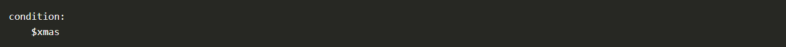

**Match any string**

When multiple strings are defined, the rule can be configured to trigger as soon as any one of them is found:

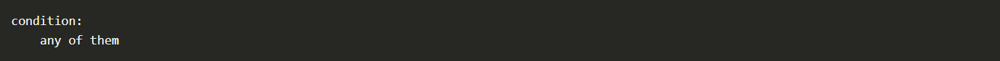

This approach is useful for detecting early signs of compromise; even a single matching clue can be enough to raise attention.

**Match all strings**

To make the rule stricter, you can require that all defined strings appear together:

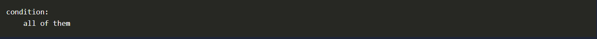

This approach reduces false positives; YARA will only flag a file if every indicator matches.

**Combine logic using: and, or, not**

Defenders often need more control over how rules behave. Logical operators let you combine multiple checks into one condition, just like building a small defensive strategy.

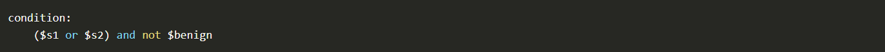

This means the rule will trigger if either $s1 or $s2 is found, but not $benign. In other words: detect suspicious code, but ignore harmless system files.

**Use comparisons like: filesize, entrypoint, or hash**

YARA can also check file properties, not just contents. For example, you can detect files that are unusually small or large, a common trick used by King Malhare to disguise his payloads.

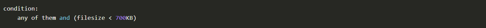

Here, the rule will trigger only when one of the strings matches and the file size is smaller than 700KB.
We've now reviewed the main examples of Conditions, and it's time to move on to the practical use cases where these rules come to life.

### YARA Study Use Cases

The evil kingdom of Malhare used a trojan known as IcedID to steal credentials from systems. McSkidy's analysts discovered that the malicious files spread across Wareville shared a common signature, the same MZ header found in executable malware used by the Dark Kingdom. These samples were small, lightweight loaders designed to infiltrate systems and later summon more dangerous payloads. Let's write our YARA rule.

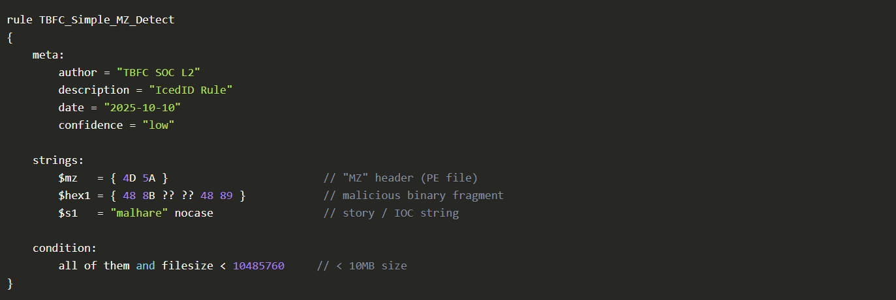

Our analysts saved this to a file named icedid_starter.yar and executed it on one of the hosts. As a result, we can see that one file was detected.

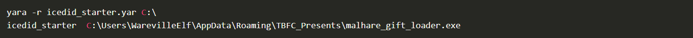

We can use the `man yara` command to find out what flags could be useful in our scenario, and we find the following:

- ``-r`` - Allows YARA to scan directories recursively and follow symlinks
- ``-s`` - Prints the strings found within files that match the rule
Putting everything together, this YARA command recursively scans the C:\ drive using the **icedid_starter.yar** rule file and can optionally display the matching strings when using ``-s``.

Next up is an interesting task where you'll need to create your own YARA rule. Good luck!

### YARA Practical Part

It's time to complete the practical task! The blue team has to search for the keyword ``TBFC:`` followed by an ASCII alphanumeric keyword across the ``/home/ubuntu/Downloads/easter`` directory to extract the message sent by McSkidy. Can you help decode the message sent by McSkidy?


---

## 🔑 Solution


How many images contain the string TBFC?

```
✅ 5
```

What regex would you use to match a string that begins with ``TBFC:`` followed by one or more alphanumeric ASCII characters?

```
✅ /TBFC:[A-Za-z0-9]+/
```

What is the message sent by McSkidy?

```
✅ Find me in HopSec Island
```


