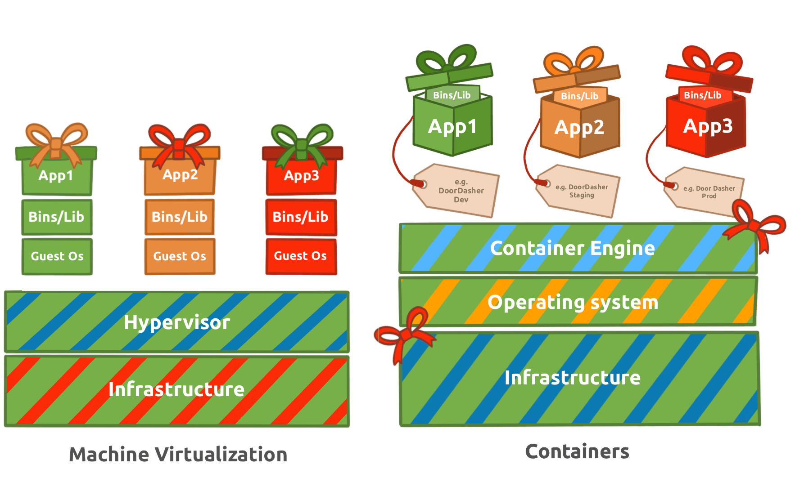
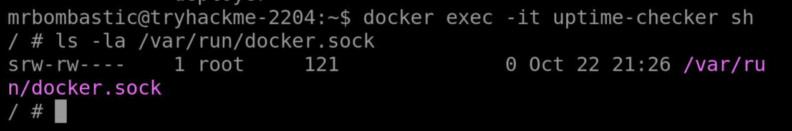

# Containers - DoorDasher's Demise


Continue your Advent of Cyber journey and learn about container security.

```
https://tryhackme.com/room/container-security-aoc2025-z0x3v6n9m2
```

## Task 1 Introduction


It seemed as the sun rose this morning, it had already been decided that today would be another day of chaos in Wareville. At least that’s the feeling all the folks at “DoorDasher” got. DoorDasher is Warevilles local food delivery site, a favourite of the workers in The Best Festival Company, especially on long days when they get home from work and just can’t bring themself to make dinner. We’ve all been there, I’m sure.

Well, one Wareville resident was feeling particularly tired this morning and so decided to order breakfast. Only to find King Malhare and his bandit bunny battalions had seized control of yet another festive favourite. DoorDasher had been completely rebranded as Hopperoo. All of the ware’s favourite dishes had been changed as well. Reports started flooding into the DoorDasher call centre. And not just from customers. The health and safety food org was on the line too, utterly panicked. Apparently, multiple Wareville residents were choking on what turned out to be fragments of Santa’s beard. Wareville authorities were left tangled in confusion today as Hopperoo faced mounting backlash over reports of “culinary impersonation.” Customers across the region claim to have been served what appears to be authentic strands of Santa’s beard in place of traditional noodles.

A spokesperson for the Health & Safety Food Bureau confirmed that several diners required “gentle untangling” and one incident involved a customer “achieving accidental facial hair synchronisation.”


Immediately, one of the security engineers managed to log on and make a script that would restore DoorDasher to its original state, but just before he was able to run it, Sir CarrotBaine caught wind of his attempt and locked him out of the system. All was lost, until the SOC team realised they still had access to the system via their monitoring pod, an uptime checker for the site. Your job? As a SOC team member of DoorDasher, can you escape the container and escalate your privileges so you can finish what your team started and save the site!

### Learning Objectives

- Learn how containers and Docker work, including images, layers, and the container engine
- Explore Docker runtime concepts (sockets, daemon API) and common container escape/privilege-escalation vectors
- Apply these skills to investigate image layers, escape a container, escalate privileges, and restore the DoorDasher service
- DO NOT order “Santa's Beard Pasta”


---

## Task 2 Container Security

### What Are Containers?

To understand what a container is, we first need to understand the problem it fixes. Put plainly, modern applications can be quite complex:

- **Installation:** Depending on the environment the application is being installed in, it’s not uncommon to run into “configuration quirks” which make the process time-consuming and frustrating. 
- **Troubleshooting:** When an application stops working, a lot of time can be wasted determining if it is a problem with the application itself or a problem with the environment it is running in.
- **Conflicts:** Sometimes multiple versions of an application need to be run, or perhaps multiple applications which need (for example) different versions of Python to be installed. This can sometimes lead to conflicts, complicating the process further.

If reading these problems, your brain conjured up the word “isolation” as a solution, well, you’re onto the right track. Containerisation solves these problems by packing applications, along with their dependencies, in one isolated environment. This package is known as a container. In addition to solving all the above problems, containerisation also offers further benefits. One key benefit is how lightweight they are. To understand this, we will now take a (brief) look at container architecture.

**Containers vs VMs**

To illustrate container architecture, let's examine another form of virtualisation: Virtual Machines. Virtual Machines, like the ones you have been booting up on this platform throughout Advent of Cyber.



A virtual machine runs on a hypervisor (software that emulates and manages multiple operating systems on one physical host). It includes a full guest OS, making it heavier but fully isolated. Containers share the host OS kernel, isolating only applications and their dependencies, which makes them lightweight and fast to start. Virtual machines are ideal for running multiple different operating systems or legacy applications, while containers excel at deploying scalable, portable micro-services.

**Applications at Scale**

Microservices are a switch in the style of application architecture, where before it was a lot more common to deploy apps in a monolithic fashion (built as a single unit, a single code base, usually as a single executable ), more and more companies are choosing to break down their application into parts based on business function. This way, if a specific part of their application receives high traffic loads, they can scale that part without having to scale the entire application. This is where the lightweight nature of containers comes into play, making them incredibly easy to scale to meet increasing demands. They became the go-to choice for this (increasingly popular) architecture, and this is why, over the last 10 years, you have started seeing the term more and more. 

You may have noticed a layer labelled “Container Engine” in the diagram. A container engine is software that builds, runs, and manages containers by leveraging the host system’s OS kernel features like namespaces and cgroups. One example of a container engine is Docker, which we will examine in more detail. Docker is a popular container engine that uses Dockerfiles, simple text scripts defining app environments and dependencies, to build, package, and run applications consistently across different systems. Docker is the container engine of choice at “DoorDasher” and so is what we will be interacting with in our interactive lab. 

**Docker**

Docker is an open-source platform for developers to build, deploy, and manage containers. Containers are executable units of software which package and manage the software and components to run a service. They are pretty lightweight because they isolate the application and use the host OS kernel.


**Escape Attack & Sockets**

A container escape is a technique that enables code running inside a container to obtain rights or execute on the host kernel (or other containers) beyond its isolated environment (escaping). For example, creating a privileged container with access to the public internet from a test container with no internet access. 

Containers use a client-server setup on the host. The CLI tools act as the client, sending requests to the container daemon, which handles the actual container management and execution. The runtime exposes an API server via Unix sockets (runtime sockets) to handle CLI and daemon traffic. If an attacker can communicate with that socket from inside the container, they can exploit the runtime (this is how we would create the privileged container with internet access, as mentioned in the previous example).

### Challenge

Your goal is to investigate the Docker layers and restore the defaced Hopperoo website to its original service: DoorDasher. We are going to walk through the steps to beat this challenge together! 

**Access Points**

Now it's time to start using the machine you booted up in task 1. Let's check which services are running with Docker. Run the following command:

`docker ps`

You should see a few services running:


The main service runs at `http://MACHINE_IP:5001`. Explore the web application, and notice the defaced system “Hopperoo”. We know DoorDasher is a food delivery service. Let's explore `uptime-checker`. Sounds interesting.

Run the following command to access the `uptime-checker` container:

`docker exec -it uptime-checker sh`

After logging in, check the socket access by running: `ls -la /var/run/docker.sock`

The Docker documentation mentions that by default, there is a setting called “Enhanced Container Isolation” which blocks containers from mounting the Docker socket to prevent malicious access to the Docker Engine. In some cases, like when running test containers, they need Docker socket access. The socket provides a means to access containers via the API directly. Let's see if we can. Your output should be something like:



I wonder what happens if we try to run Docker commands inside the container. By running `docker ps` again, we can confirm we can perform Docker commands and interact with the API; in other words, we can perform a Docker Escape attack! 

Let's instead try to access the `deployer` container, which is a privileged container. Run the following command:

`docker exec -it deployer bash`

Type `whoami` and check which user we are currently logged in as. Explore the container and find the flag.

Okay, we made it! We have managed to make it to the container where the script to restore the site to its former version is! Save the day, run the recovery_script in the root directory to recover the app using sudo:

`sudo /recovery_script.sh`

With that run, you can see for yourself by refreshing the site (`http://MACHINE_IP:5001`)! As a reward, you should be able to find a flag in the same directory as the script (``/``), which you can read using the `cat` command.


---

## 🔑 Solution


What exact command lists running Docker containers?

```
✅ docker ps
```

What file is used to define the instructions for building a Docker image?

```
✅ Dockerfile
```

What's the flag?

```
✅ THM{DOCKER_ESCAPE_SUCCESS}
```

Bonus Question: There is a secret code contained within the news site running on port `5002`; this code also happens to be the password for the deployer user! They should definitely change their password. Can you find it?

```
✅ DeployMaster2025!
```


