# CyberChef - Hoperation Save McSkidy


The story continues, and the elves mount a rescue and will try to breach the Quantum Fortress's defenses and free McSkidy.

```
https://tryhackme.com/room/encoding-decoding-aoc2025-s1a4z7x0c3
```

## Task 1 Introduction


McSkidy is imprisoned in King Malhare's Quantum Warren. Sir BreachBlocker III was put in charge of securing the fortress and implemented several access controls to prevent any escape. His defenses are worthy of his name.

However, McSkidy managed to send vital clues to his team using harmless bunny pictures. One message revealed that five locks needed to be disabled to secure an escape route. The locks can be broken by examining their logic and leveraging the system's built-in chat for the guards. They can be eluded in revealing vital details or even passwords. However, you will need to speak their language.

### Learning Objectives

- Introduction to encoding/decoding
- Learn how to use CyberChef
- Identify useful information in web applications through HTTP headers

---

## Task 2 Important Concepts

### Encoding and Decoding

Encoding is a method to transform data to ensure compatibility between different systems. It differs from encryption in purpose and process.

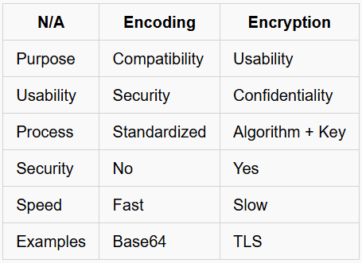

Decoding is the process of converting encoded data back to its original, readable, and usable form.

### CyberChef Overview

CyberChef is also known as the Cyber Swiss Army Knife. Ready to cook some recipes?

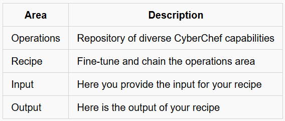

### Simple Example

Try your first recipe:

- Open either the online `CyberChef` version in your regular browser, or use the offline CyberChef version available in the bookmarks section of the AttackBox. Drag and drop the `To Base64` operation from the **Operations** area on the left side to the **Recipe** area in the center, and add `IamRoot` into the **Input** area.
- Add another operation, `From Base64`, to show the initial input again, showcasing chain operations.

**Note:** You can enable/disable an operation in the recipe by toggling the middle button on the right of the operation.

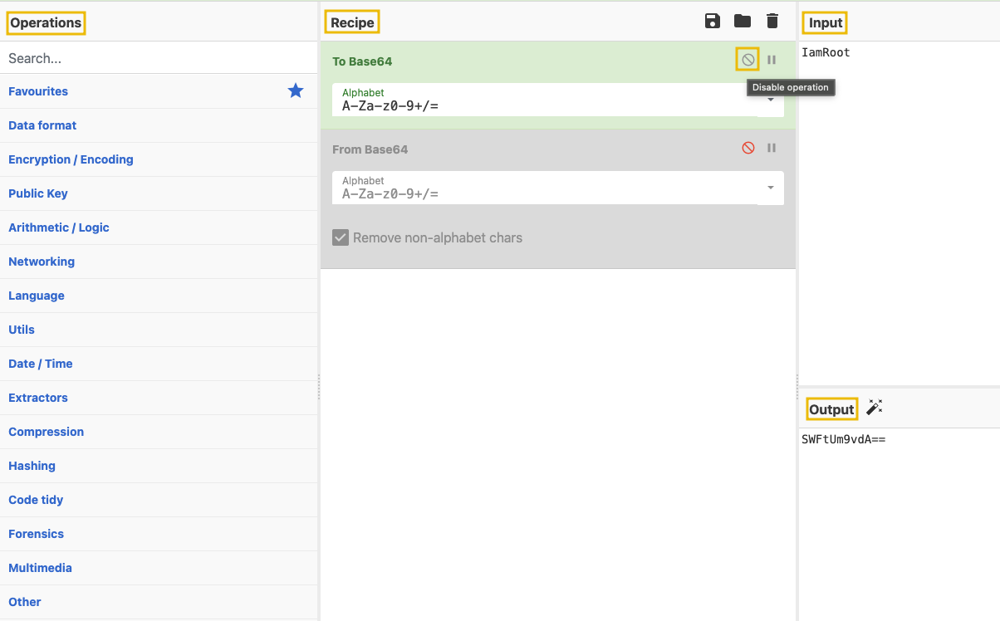

Congratulations! You took the first steps to become a master Chef.

### Inspecting Web Pages

Besides the rendered content of a web page, your browser usually receives and can show additional information.

For this challenge, you will get the chance to have a deeper look at that information and put it to good use.

To do this, depending on your browser, you can access the functionality as shown below:

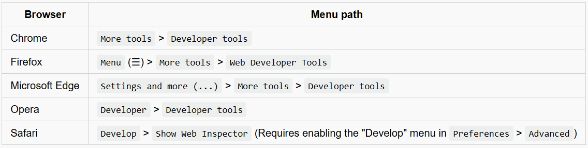

**Note:** For a better experience, you can reposition the console on the right side of the browser. Look for the three dots on the right side of the console.

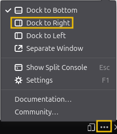

---

## Task 3 First Lock - Outer Gate

### Key Information

If not already, start the target machine, give it a few minutes to boot up, and then, from the AttackBox, you can access the web app at `http://MACHINE_IP:8080`.

McSkidy revealed some vital clues in his message. You will have to leverage any useful piece of information in order to break the locks.

Below are key points to look out for:

- **Chat is Base64 encoded**. Try decoding this in CyberChef. This will be leveraged to extract useful information from the guards. Be aware that from Lock 3 onwards, the guards will take a longer time to respond.

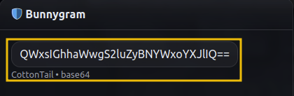

- **Guard name**. This logic will persist throughout the levels. Make sure to note down the guard’s name for each level.

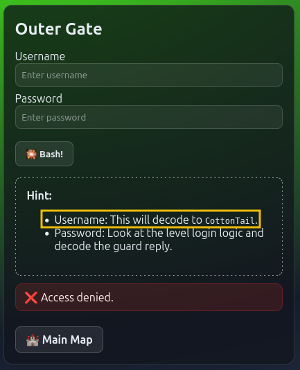

- **Headers**. Again, inspecting the page but switching to the ‘Network’ tab this time. Make sure to refresh the page once after switching to this tab and select the first response.

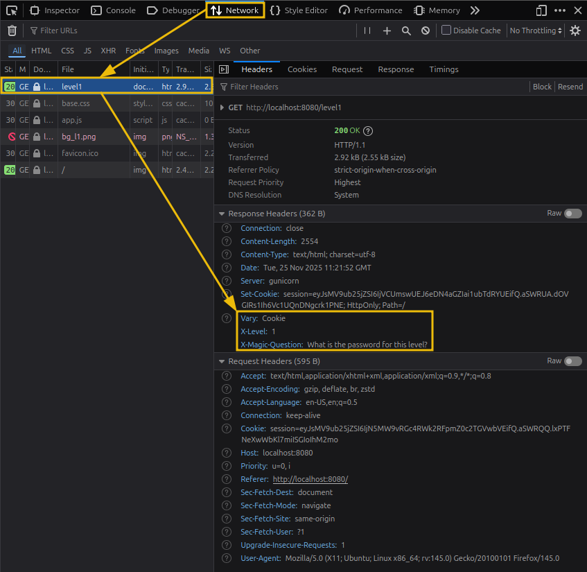

- **Login Logic**. You will inspect the page and switch to the ‘Debugger’ tab. Match the lock with the respective logic. You can also find helpful comments that explain what you need to cook in CyberChef.

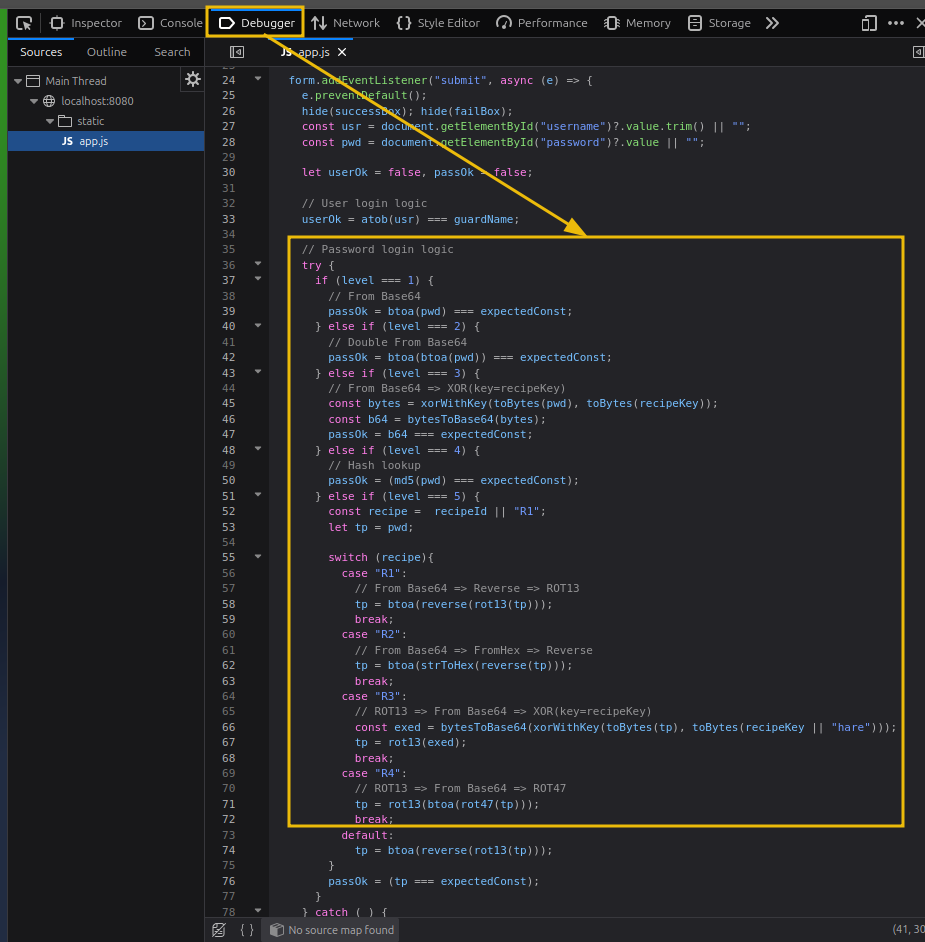

### First Lock - Outer Gate

Ok, it’s time to siege the fortress. Ready?

1. First, identify the guard name and encode it to Base64. You will use this as the username input.

2. Next, using the information from the page headers, identify the magic question and encode it in Base64 as well.

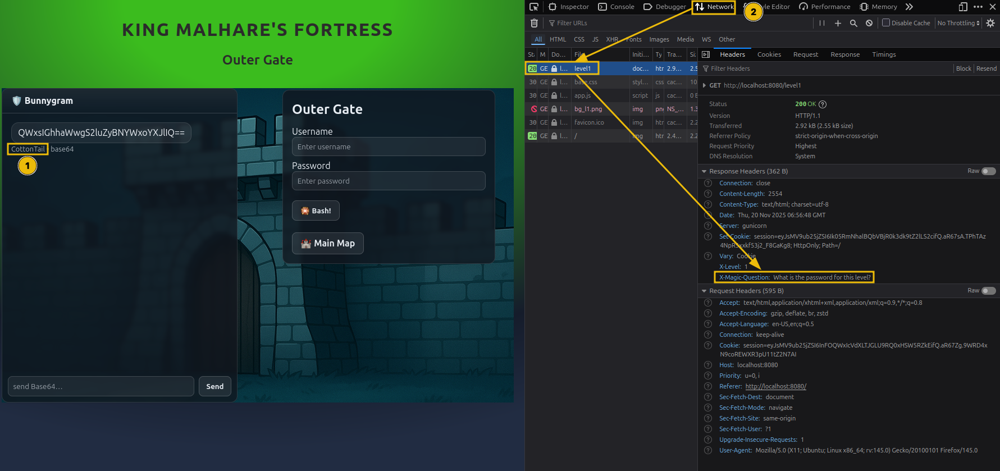

3. Use the encode magic question in the chat. The guard will answer with the encoded level password.

4. Now, switch to the ‘Debugger’ tab and identify the login logic. In this case, the password is encoded to Base 64.

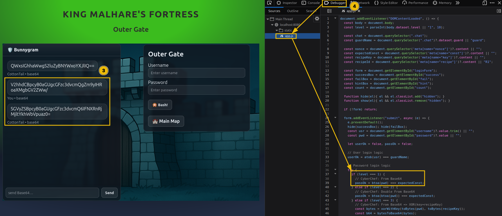

5. By decoding the answer from the guard, you will have the plaintext password.

6. Use the encoded username and plaintext password to log in.

Excellent work! One lock is down, and only four remain to be broken.

---

## 🔑 Solution

What is the password for the first lock?

```
✅ Iamsofluffy
```

---

## Task 4 Second Lock - Outer Wall 

### Second Lock - Outer Wall

Excellent job breaking that first level.

This level nudges the difficulty up a little bit, but don’t worry, you will figure it out. Let’s go!

1. Again, identify the guard's name and save the encoded output for later.

2. Then, extract and encode the magic question and retrieve the encoded password from the guard.

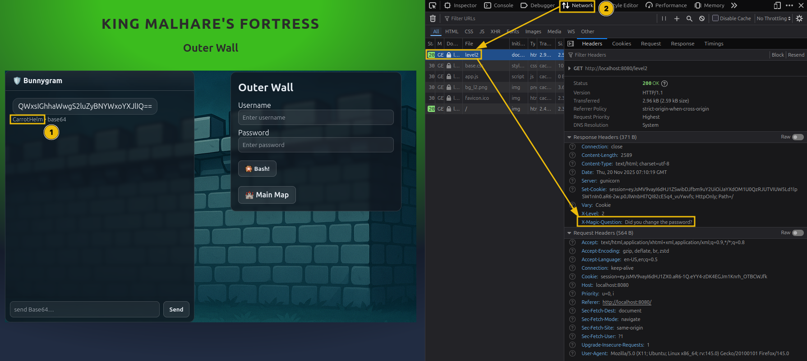

3. Looking again at the login logic, you see that the encoding is applied twice this time. That means you have to decode from Base64 twice.

4. Go ahead and log in with the newfound password and the saved username.

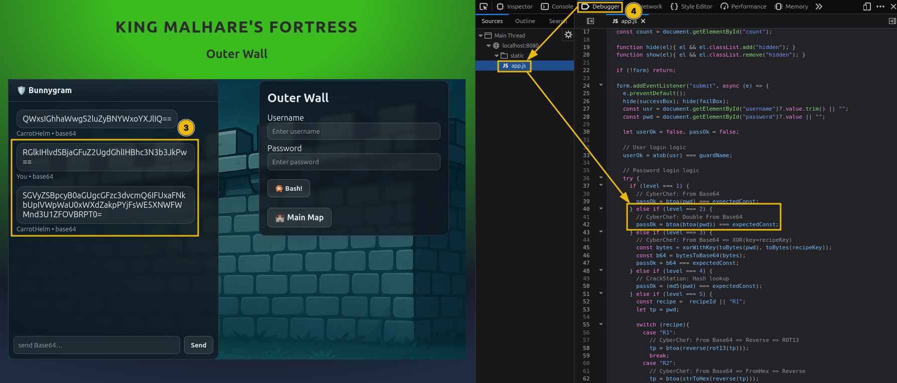

You are getting closer to securing an escape route; only three locks remain. Keep up the good work.


---

## 🔑 Solution

What is the password for the second lock?

```
✅ Itoldyoutochangeit!
```

---

## Task 5 Third Lock - Guard House

### Third Lock - Guard House

So far, so good. As you saw in the previous level, the login logic begins to use chained operations.

This will be the trend for this and the following levels.

1. As always, collect all the needed information (encoded username, encoded password from the guard, XOR key).

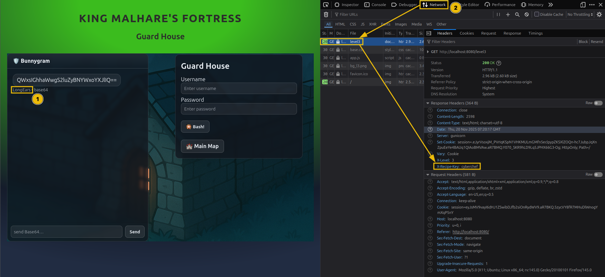

**Note:** From this lock onwards, there is no magic question, but sometimes you can ask the guard nicely to give you the password. It will still need to be decoded as per the login logic. Be aware that the guard may sometimes fall asleep or take a long time to respond (~2-3 minutes) so keeping the message short will help get the answer. Even a simple 'Password please.' will go a long way.

2. If you look at the login logic, there is a slight twist. The password is first XOR’ed with a key and then encoded to Base64.

### Theory Time

XOR is a popular operation that, besides the input data, also uses a key. The process involves a bitwise exclusive OR between the data and key.

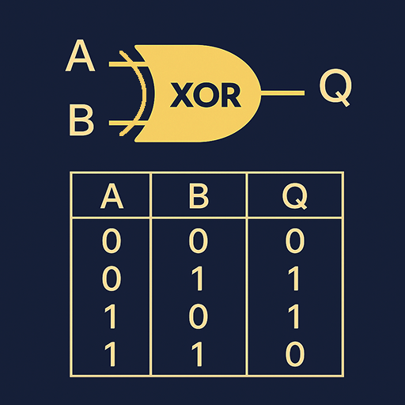

You might ask, “Ok, but how do I reverse this?”. Well, skipping the long math explanation, XOR has a magic property: when you XOR the result with the key again, the new result will be the initial data. Go ahead, try this in CyberChef. Put two XOR operations one after another, use the same key for both, and the output should be identical.

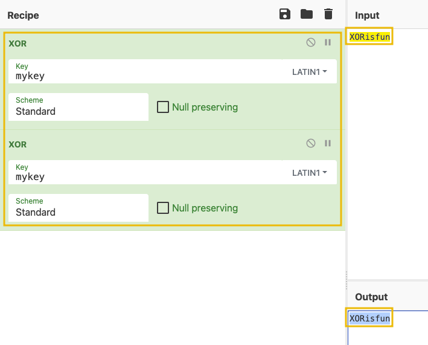

3. With this newfound knowledge, build the needed recipe to find the plaintext password.


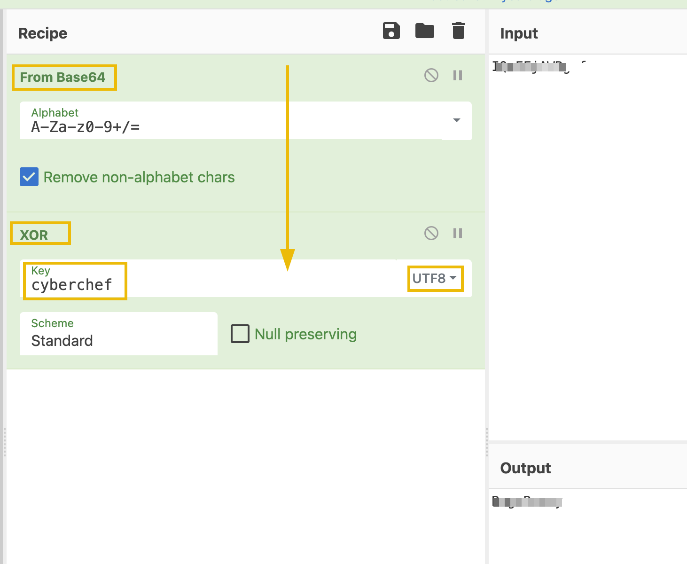

4. Use the credentials and unlock the next level.

---

## 🔑 Solution

What is the password for the third lock?

```
✅ BugsBunny
```

---

## Task 6 Fourth Lock - Inner Castle

### Fourth Lock - Inner Castle

We are almost there. In this level, Sir BreachBlocker III throws you a curveball. Let’s see how to tackle this.

1. But first, go ahead and look at the login logic as before. We will not be needing header information for this one.

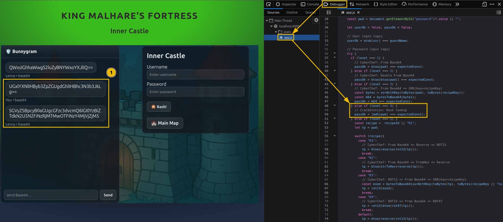

2. After asking the guard for the password and looking at it's reply, it seems a bit odd. At the same time, the login logic shows the use of a MD5 hash.

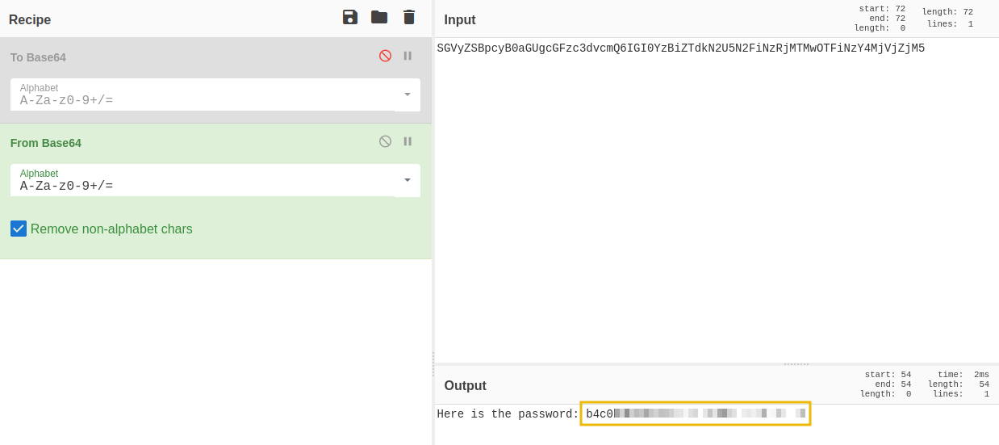

### Theory Time

MD5, or Message-Digest Algorithm 5, is a cryptographic algorithm that produces a fixed-size hash value. While this is supposed to be a one-way function, meaning you cannot reverse it, precomputed hashes can be leveraged to identify the input.

3. Putting the two together, the plaintext password is passed through MD5, and you have the hash. This looks like a job for `CrackStation`.

4. Go ahead and open the site and paste the hash to retrieve the password.

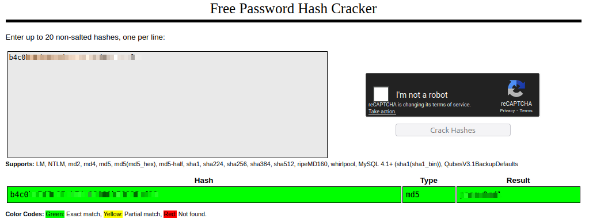

5. Use the credentials and advance to the final level.

Fantastic. One more lock and you will ensure McSkidy has safe passage and escapes.

---

## 🔑 Solution

What is the password for the fourth lock?

```
✅ passw0rd1
```

---

## Task 7 Fifth Lock - Prison Tower

### Fifth Lock - Prison Tower

Ready for the final hurdle?

As the defenses weaken, you receive another hidden message from McSkidy:

“I can see you are ready to break the last lock. Be aware that Sir BreachBlocker III implemented different mechanisms for the last lock, which change occasionally. Make sure you match the correct approach when decoding the password.”

That sounds tricky, but do not despair. You will find a way.

1. Let’s start. Extract the information as before, noting down the encoded guard name.

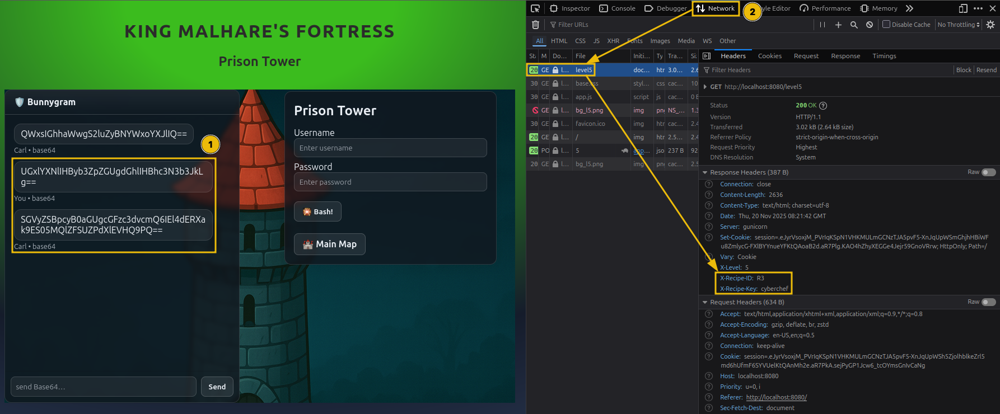

2. Additionally, note the recipe ID from the header and match the corresponding login logic. Below is a quick cheat sheet for decoding each recipe.

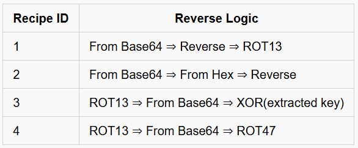

3. Build the reverse recipe with CyberChef and extract the final password.

Finally, the last lock has been breached, and you provided a safe path for McSkidy to escape.

---

## 🔑 Solution

What is the password for the fifth lock?

```
✅ 51rBr34chBl0ck3r
```

What is the retrieved flag?

```
✅ THM{M3D13V4L_D3C0D3R_4D3P7}
```

---

## Task 8 Epilogue

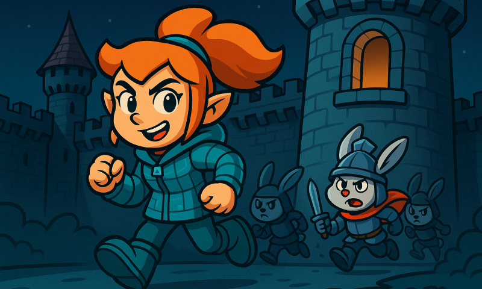

As McSkidy passed by the Inner Castle, she heard a thunderous voice: “Why should Christmas have all the fun?”

McSkidy managed to get back to Wareville just in time as TBFC was about to be hit by another disaster.

---

### Side Quest 3 Key

Looking for the key to Side Quest 3? Hopper has left us this cyberchef link as a lead. See if you can recover the key and access the corresponding challenge in our Side Quest Hub!

```
https://gchq.github.io/CyberChef/#recipe=To_Base64('A-Za-z0-9%2B/%3D')Label('encoder1')ROT13(true,true,false,7)Split('H0','H0%5C%5Cn')Jump('encoder1',8)Fork('%5C%5Cn','%5C%5Cn',false)Zlib_Deflate('Dynamic%20Huffman%20Coding')XOR(%7B'option':'UTF8','string':'h0pp3r'%7D,'Standard',false)To_Base32('A-Z2-7%3D')Merge(true)Generate_Image('Greyscale',1,512)&input=SG9wcGVyIG1hbmFnZWQgdG8gdXNlIEN5YmVyQ2hlZiB0byBzY3JhbWJsZSB0aGUgZWFzdGVyIGVnZyBrZXkgaW1hZ2UuIEhlIHVzZWQgdGhpcyB2ZXJ5IHJlY2lwZSB0byBkbyBpdC4gVGhlIHNjcmFtYmxlZCB2ZXJzaW9uIG9mIHRoZSBlZ2cgY2FuIGJlIGRvd25sb2FkZWQgZnJvbTogCgpodHRwczovL3RyeWhhY2ttZS1pbWFnZXMuczMuYW1hem9uYXdzLmNvbS91c2VyLXVwbG9hZHMvNWVkNTk2MWM2Mjc2ZGY1Njg4OTFjM2VhL3Jvb20tY29udGVudC81ZWQ1OTYxYzYyNzZkZjU2ODg5MWMzZWEtMTc2NTk1NTA3NTkyMC5wbmcKClJldmVyc2UgdGhlIGFsZ29yaXRobSB0byBnZXQgaXQgYmFjayE
```

```
### Side Quest Hub
https://tryhackme.com/adventofcyber25/sidequest
```


