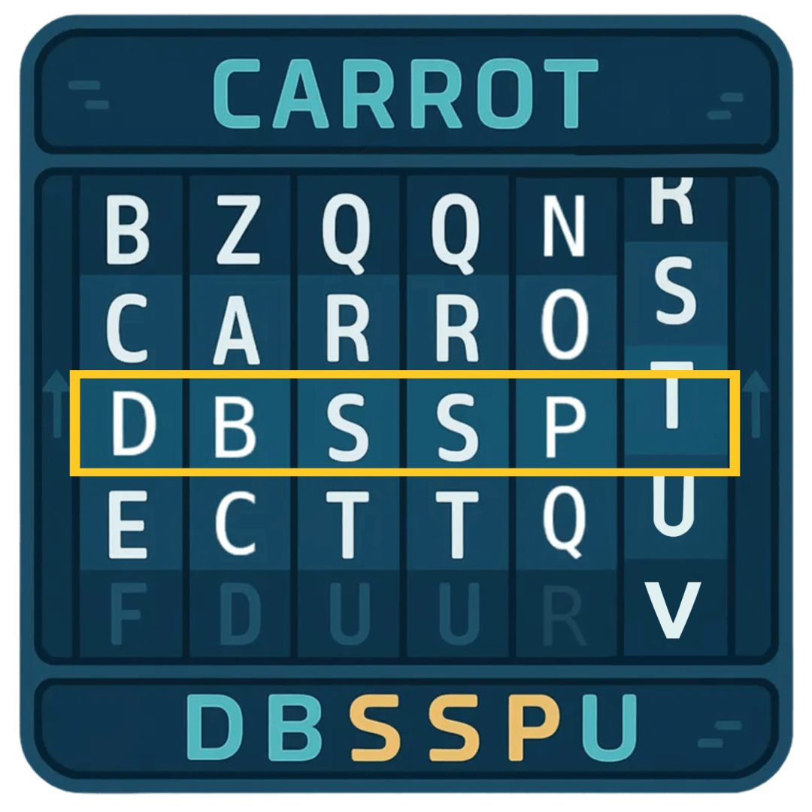
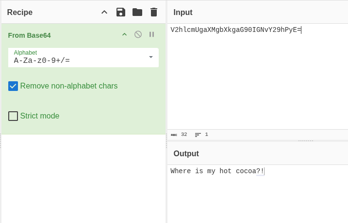
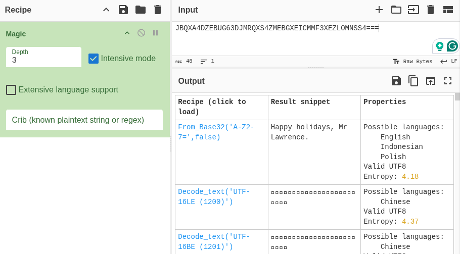
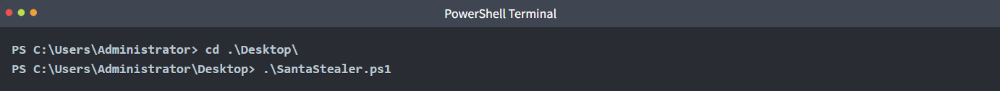

# Obfuscation - The Egg Shell File


McSkidy keeps her focus on a particular alert that caught her interest: an email posing as northpole-hr.

```
https://tryhackme.com/room/obfuscation-aoc2025-e5r8t2y6u9
```

## Task 1 Introduction


WareVille has not felt right since the wormhole appeared. Everyone in TBFC is on high alert: Systems are going haywire, dashboards are spiking, and SOC alerts have been firing nonstop. Amid the chaos, McSkidy keeps her focus on a particular alert that caught her interest: an email posing as northpole-hr. It’s littered with carrot emojis, but the weird thing is this: there is no North Pole human resources department. TBFC’s HR is at theSouth Pole.

Digging further she found a tiny PowerShell file from that email was downloaded. Among the code are random strings of characters, all gibberish, nothing readable at a glance.

McSkidy knows malicious actors often hide code and data using a technique called **obfuscation**. But what is it, really? And how can we decipher it?

### Learning Objectives

- Learn about obfuscation, why and where it is used.
- Learn the difference between encoding, encryption, and obfuscation.
- Learn about obfuscation and the common techniques.
- Use CyberChef to recover plaintext safely.

---

## Task 2 Obfuscation & Deobfuscation

### Understanding the Gibberish

Obfuscation is the practice of making data hard to read and analyze. Attackers use it to evade basic detection and delay investigations. 

Let us say, a security tool will automatically block any file that contains the word `the bandit yeti`. To evade this, attackers can use a simple cipher technique called "ROT1" to hide the string.

ROT1 is a cipher technique that shifts each letter forward by 1 in the alphabet. The letter `a` becomes `b`, `b` becomes `c`, and so on. Using this cipher, `carrot coins go brr` becomes `dbsspu dpjot hp css`.



This can be further complicated by using ROT13, which moves the characters forward by 13 spaces.

### Obfuscation in the Real World

So far, we've kept it simple. In the real world, you’ll encounter a wider range of techniques. 

One slightly more complicated technique would be utilizing `XOR`. Each character is represented as a byte, and each byte is combined with a key using the `XOR` mathematical operation. No need to go into the details as to how it works. The only thing you need to know is that this operation changes the bytes into different bytes, which sometimes makes the resulting text end up with uncommon symbols or non-readable characters.

Obfuscating with XOR is not something that can be easily done manually. But thankfully, there are tools available that can help us with this. One such widely used tool is called CyberChef.

Let's try to obfuscate a string using XOR by following the steps below:

1. Open `CyberChef` by visiting this link in your browser.
2. At the top right, you’ll see an **Input box**. This is where you paste the text you want to change/obfuscate. In our case, use `carrot supremacy`.
3. In the left pane under **Operations**, search for “XOR” and drag it into the middle under **Recipe**. This tells CyberChef to apply that technique to your **Input** text.
4. Each operation has settings you can adjust. In our case, we set the **Key** to `a`. Make sure that the dropdown next to **Key** is set to `HEX`.
5. The obfuscated result should automatically appear in the **Output** section. If it doesn’t, click **BAKE**! at the bottom of the screen.

As you can see above, the string `carrot supremacy` now becomes `ikxxe~*yzxogkis`!

### Detecting Patterns

The good thing about well-known obfuscation techniques is that it's easy to reverse it once you figure out the technique used.

You can use these quick visual clues to guess the obfuscation technique used:

- ROT1 - common words look “one letter off”, spaces stay the same. Easy enough to detect.
- ROT13 - Look for three-letter words. Common ones like  `the` become `gur`. And `and` becomes `naq`. spaces stay the same.
- Base64 - Long strings containing mostly alphanumeric characters (i.e., `A-Z`, `a-z`, `0–9`), sometimes with ``+`` or ``/``, often ending in ``=`` or ``==``.
- XOR - A bit more tricky. Looks like random symbols but stays the same length as the original. If a short secret was reused, you may notice a tiny repeat every few characters.

Once you have a guess on what cipher was used, you can go back to CyberChef, but this time use an operation that does the reverse effect. For example, to deobfuscate Base64 you use `From Base64` instead of `To Base64`.



### Unfamiliar Patterns

Not sure what you’re looking at? It's fine. Even if you don't have an idea of what cipher was used, it is easy enough to keep on trying different operations just to see if the text becomes readable.

CyberChef also includes an operation called `Magic` that automatically guesses and tries common decoders for you. To use it, just add the `Magic` operation and look at the results. It will display multiple results and it's up to you to check which one ends up making sense. You can even check "Intensive mode" to make sure it tests more possibilities before giving up.



Of course, this won’t catch everything (especially custom XOR keys or unusual layers)! So, use it as a hint to help you in figuring it out. For example, one of the questions below cannot be fully solved with the `Magic` operation alone.

### Layered Obfuscation

To make deobfuscation harder, threat actors would often combine multiple techniques, almost like a layered approach.

For example, a script that threat actors want hidden can be compressed with `gzip`, `XOR`'ed with a `x` key, then finally `Base64`-encoded will produce this obfuscated string:

```
H4sIADKZ42gA/32PT2sqQRDE7/MpitGDgrPEJJcXyOGha1xwVaLwyLvI6rbuhP3HTHswm/3uzmggIQfrUD3VzI/u7iDXljepNkFth6KDmYsWnBF2R2OoZOyrPCUDXSKB1UWdEzjZ5hQI8c9oJrU4cn1kyPXbMgRW0X/nF8WLcTSJwvFX9Jr/jUP5i1NOgPeLfjxvtKQQL8RqlOk8jZgKfGJSmTDZZWqxfacdoxFAl0814Rl6j153EyxXkR1VJSe6JNNHAzmOXiHRgnJLPk+iWeiyR63+uIm6Hb5B92NG5YGzK5sm7FnfTSxfzl3rgoJ1tWKjy0NPnpxUHKs0xXT6VBSy7zjZ3A3UY4tmOPjTAs29t4dWQu2vpwyua7niJ7iyCeZJQaIVZ/xwdy/JAQAA
```

To reverse this kind of layered obfuscation, apply the operations in the opposite order: Base64-decode, XOR with x, then decompress gzip. The screenshot below shows how to chain these Operations to recover the original content.


### Unwrapping the Easter Egg

Luckily, McSkidy detected something phishy in the email we received. She extracted a PowerShell script from the PDF and put it on an isolated VM to figure out what it's doing. There is some obfuscation in this script, can you help her understand what it is?

Open **SantaStealer.ps1**, located on the VM's Desktop in Visual Studio by double clicking it (takes a moment to open), and navigate to the "Start here" section of the script. Follow the instructions in the code's comments and save, then run the script from a PowerShell terminal to get your first flag. To open PowerShell, click Start (or press the Windows key), type "PowerShell", and press Enter. In the PowerShell terminal, run the two commands shown in the script’s comments.



There is a second challenge waiting for you. This time, you must obfuscate the malicious actor's API key using **XOR**. Follow the Part 2 instructions in the code's comments and then run the script again to get your last flag!


---

## 🔑 Solution


What is the first flag you get after deobfuscating the C2 URL and running the script?

```
✅ THM{C2_De0bfuscation_29838}
```

What is the second flag you get after obfuscating the API key and running the script again?

```
✅ THM{API_Obfusc4tion_ftw_0283}
```


