# Race Conditions - Toy to The World


Learn how to exploit a race condition attack to oversell the limited-edition SleighToy.

```
https://tryhackme.com/room/race-conditions-aoc2025-d7f0g3h6j9
```

## Task 1 Introduction


The Best Festival Company (TBFC) has launched its limited-edition SleighToy, with only ten pieces available at midnight. Within seconds, thousands rushed to buy one, but something strange happened. **More than ten lucky customers received confirmation emails stating that their orders were successful**. Confusion spread fast. How could everyone have bought the **"last"** toy? McSkidy was called in to investigate.  

She quickly noticed that multiple buyers purchased at the exact moment, slipping through the system’s timing flaw. Sir Carrotbane’s mischievous Bandit Bunnies had found a way to exploit this chaos, flooding the checkout with rapid clicks. By morning, TBFC faced angry shoppers, missing stock, and a mystery that revealed just how dangerous a few milliseconds could be during the holiday rush.

### Learning Objectives

- Understand what race conditions are and how they can affect web applications.
- Learn how to identify and exploit race conditions in web requests.
- How concurrent requests can manipulate stock or transaction values.
- Explore simple mitigation techniques to prevent race condition vulnerabilities.

---

## Task 2 Race Condition

A race condition happens when two or more actions occur at the same time, and the system’s outcome depends on thebunny character showing car racing. order in which they finish. In web applications, this often happens when multiple users or automated requests simultaneously access or modify shared resources, such as inventory or account balances. If proper synchronisation isn’t in place, this can lead to unexpected results, such as duplicate transactions, oversold items, or unauthorised data changes.

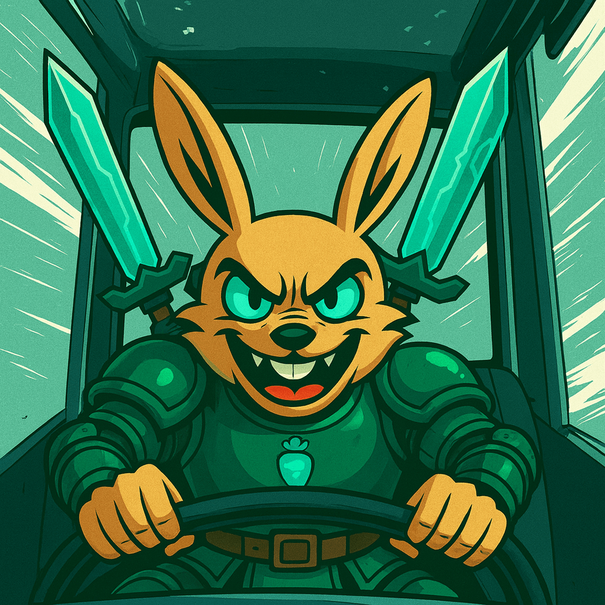

### Types of Race Conditions

Generally, race condition attacks can be divided into three categories:

- **Time-of-Check to Time-of-Use (TOCTOU):** A TOCTOU race condition happens when a program checks something first and uses it later, but the data changes in between. This means what was true at the time of the check might no longer be true when the action happens. It’s like checking if a toy is in stock, and by the time you click **"Buy"** someone else has already bought it. For example, two users buy the same "last item" at the same time because the stock was checked before it was updated.
- **Shared resource:** This occurs when multiple users or systems try to change the same data simultaneously without proper control. Since both updates happen together, the final result depends on which one finishes last, creating confusion. Think of two cashiers updating the same inventory spreadsheet at once, and one overwrites the other’s work.
- **Atomicity violation:** An atomic operation should happen all at once, either fully done or not at all. When parts of a process run separately, another request can sneak in between and cause inconsistent results. It’s like paying for an item, but before the system confirms it, someone else changes the price. For example, a payment is recorded, but the order confirmation fails because another request interrupts the process.

### Time for Some Action

Now that we understand the basic concepts, let's take the example of the TBFC shopping cart app and exploit the race condition.

### Configuring the Environment

First, we will configure Firefox to route traffic through Burp Suite. On the AttackBox, open `Firefox`, click the `FoxyProxy` icon (1) and select the `Burp` profile (2) so all browser requests are sent to Burp, as shown below:

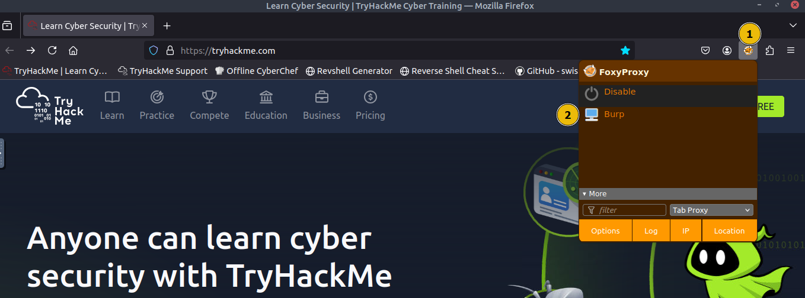

Next, click on the Burp Suite icon on the `Desktop` to launch the application. 

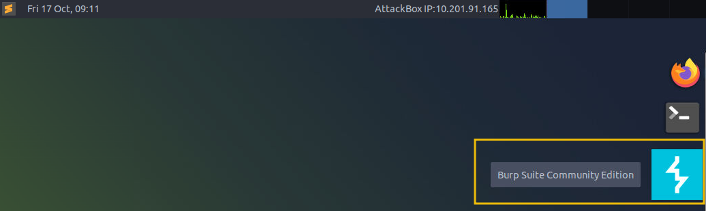

You will see an introductory screen; choose `Temporary project` in memory and click `Next`.

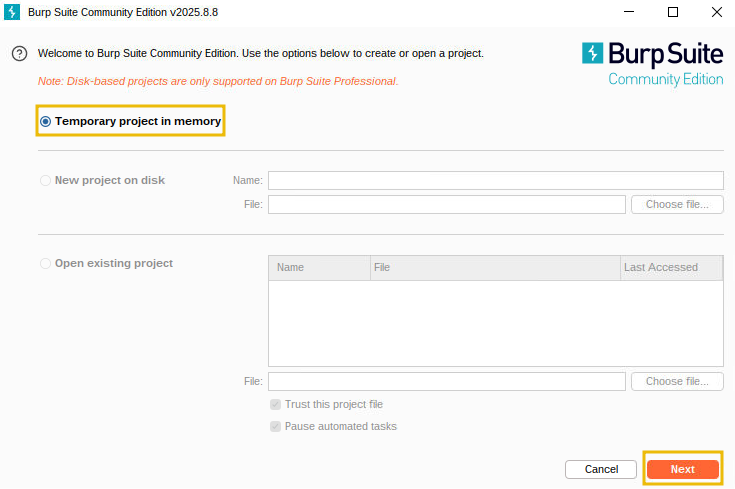

On the configuration screen, click `Start Burp` to start the application.

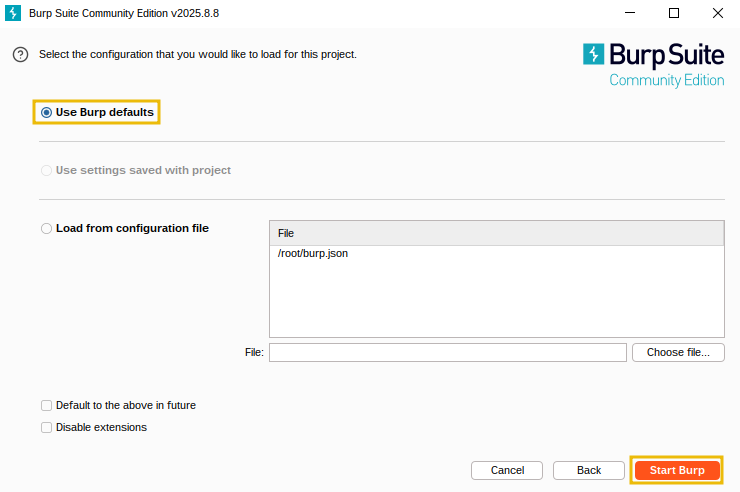

Once the application is started, you will see the following screen, where we will use the `Proxy` and `Repeater` option to exploit the race condition.

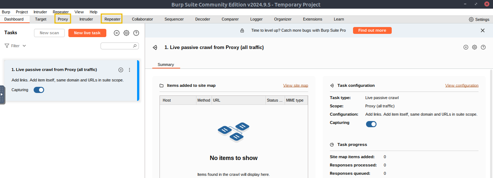

Before proceeding, ensure that you turn off "`Intercept`" in Burp Suite. Open the `Proxy` tab and check the `Intercept` sub-tab; If the button says **"Intercept on"**, click it so it changes to **"Intercept off"**. This step ensures that Burp Suite no longer holds your browser requests and allows them to pass through normally.

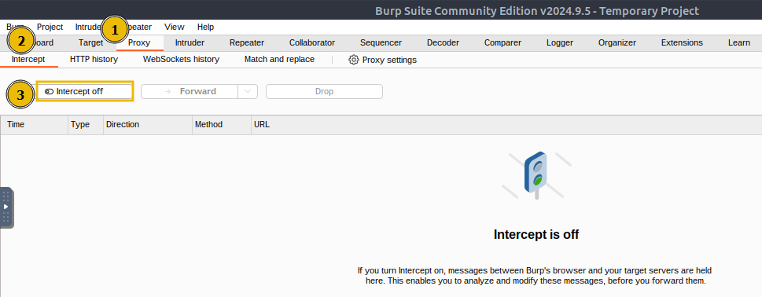

### Making a Legitimate Request

Now that the environment is configured, make a normal request. Open `Firefox`, visit the webapp at `http://MACHINE_IP`, and you will see the following login page:

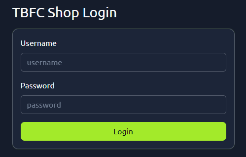

On the site’s login panel, enter the credentials, **username:** `attacker` and **password:** `attacker@123`. After logging in, you’ll arrive at the main dashboard, which shows the limited-edition SleighToy with only 10 units available.

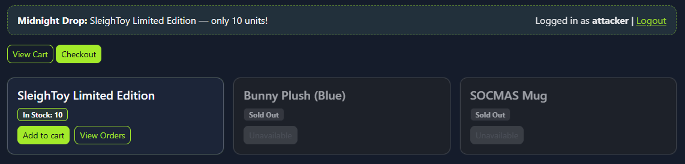

To make a legitimate purchase, click `Add to Cart` for the SleighToy and then click `Checkout` to go to the checkout page.

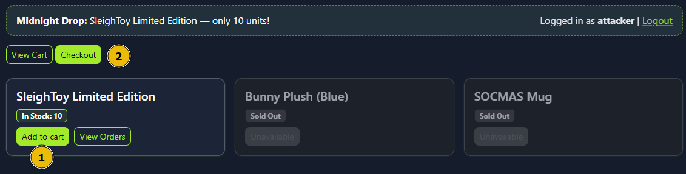

On the checkout page, click `Confirm & Pay` to complete the purchase. You should see a success message confirming the order, as shown below:

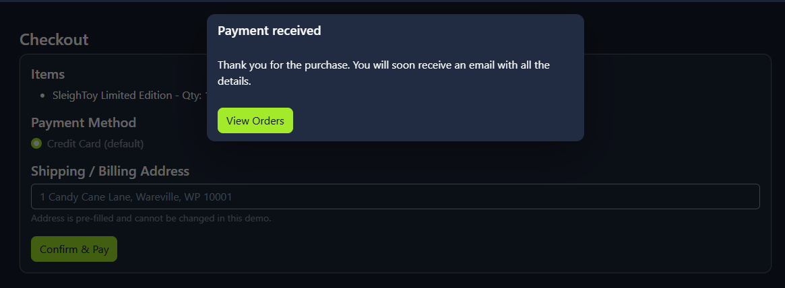

### Exploiting the Race Condition

Now that we have made a legitimate request, navigate back to Burp Suite and click on  `Proxy > HTTP history` and find the **POST** request to the ``/process_checkout`` endpoint created by our legitimate checkout request. Right-click that entry and choose `Send to Repeater`, which will copy the exact HTTP request (headers, cookies, body) into Burp’s Repeater tool as shown below:

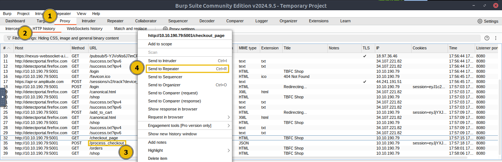

Next, switch to the `Repeater` tab and confirm the request appears there, right-click on the first tab, select `Add tab to group`, and click on `Create tab group`.

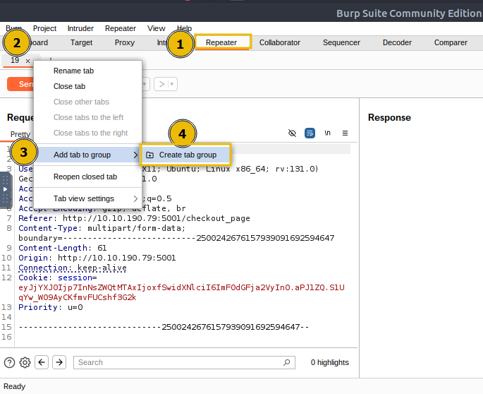

Enter a name for the tab group, such as `cart`, and click **Create**, which will create a tab group named `cart`.

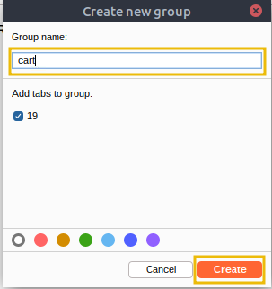

Then, right-click the request tab and select `Duplicate tab`. When prompted, enter the number of copies you want (for example, 15). You’ll now have that many identical request tabs inside the cart group.


Next, use the Repeater toolbar `Send` dropdown menu and ``select Send group in parallel (last-byte sync)``, which launches all copies at once and waits for the final byte from each response, maximising the timing overlap to trigger race conditions.


Once this is done, click **Send group (parallel)**; this will launch all 15 requests to the server simultaneously. The server will attempt to handle them simultaneously, which will cause the timing bug to appear (due to multiple orders being processed at once).

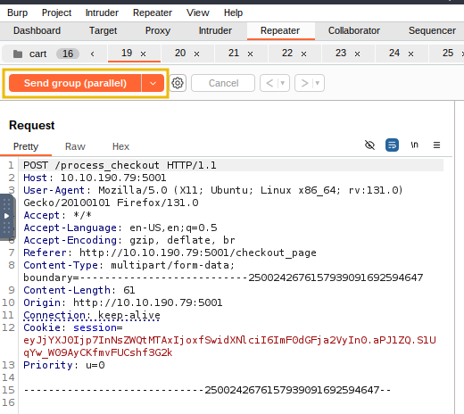

Finally, visit the web app, and you will see multiple confirmed orders and the SleighToy stock reduced (possibly going negative). 

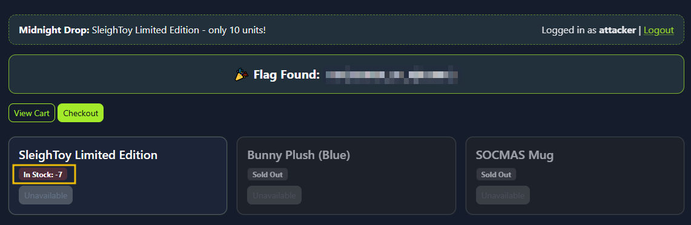

### Mitigation

The attacker logged in and made a normal purchase of the limited SleighToy. Using Burp Suite, he captured the checkout request and sent it multiple times in parallel. Because the app didn’t **handle simultaneous checkouts** correctly, each request succeeded before the stock could update. This allowed the attacker to buy more toys than available, resulting in a race condition and pushing the stock into negative values. Here are a few mitigation measures to avoid the vulnerability:

- Use **atomic database transactions** so stock deduction and order creation execute as a single, consistent operation.
- Perform a **final stock validation** right before committing the transaction to prevent overselling.
- Implement **idempotency keys** for checkout requests to ensure duplicates aren’t processed multiple times.
- Apply **rate limiting** or concurrency controls to block rapid, repeated checkout attempts from the same user or session.


---

## 🔑 Solution


What is the flag value once the stocks are negative for **SleighToy Limited Edition**?

```
✅ THM{WINNER_OF_R@CE007}
```

Repeat the same steps as were done for ordering the SleighToy Limited Edition. What is the flag value once the stocks are negative for **Bunny Plush (Blue)**?

```
✅ THM{WINNER_OF_Bunny_R@ce}
```


