# Splunk Basics - Did you SIEM?


Learn how to ingest and parse custom log data using Splunk.

```
https://tryhackme.com/room/splunkforloganalysis-aoc2025-x8fj2k4rqp
```

## Task 1 Introduction


It’s almost Christmas in Wareville, and the team of The Best Festival Company (TBFC) is busy preparing for the big celebration. Everything is running smoothly until the SOC dashboard flashes red. A ransom message suddenly appears: 


The message comes from King Malhare, the jealous ruler of HopSec Island, who’s tired of Easter being forgotten. He’s sent his Bandit Bunnies to attack TBFC’s systems and turn Christmas into his new holiday, EAST-mas.

With McSkidy missing and the network under attack, the TBFC SOC team will utilize Splunk to determine how the ransomware infiltrated the system and prevent King Malhare’s plan from being compromised before Christmas.


### Learning Objectives

- Ingest and interpret custom log data in Splunk
- Create and apply custom field extractions
- Use Search Processing Language (SPL) to filter and refine search results
- Conduct an investigation within Splunk to uncover key insights

---

## Task 2 Log Analysis with Splunk

### Exploring the Logs

In the Splunk instance, the data has been pre-ingested for us to investigate the incident. On the Splunk interface, click on **Search & Reporting** on the left panel, as shown below:

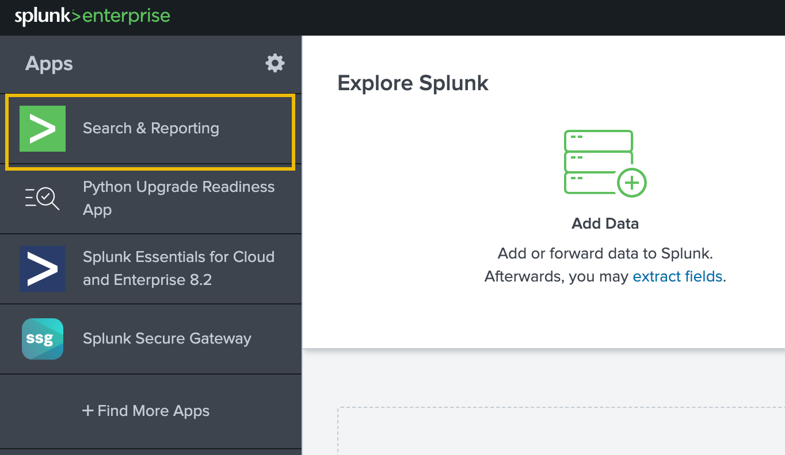

On the next page, type `index=main` in the search bar to show all ingested logs. Note that we will need to select `All time` as the time frame from the dropdown on the right of the search bar.

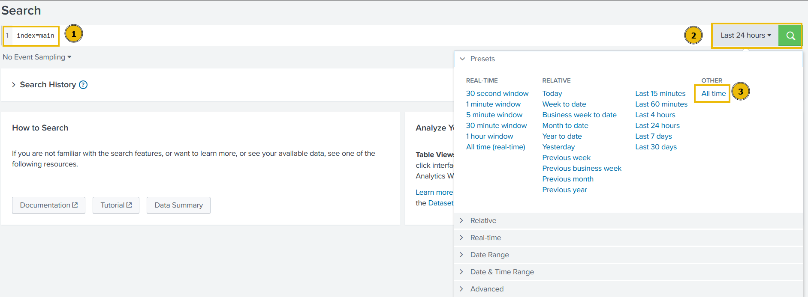

After running the query, we will be presented with two separate datasets that have been pre-ingested into Splunk. We can verify this by clicking on the `sourcetype` field in the fields list on the left of the page.

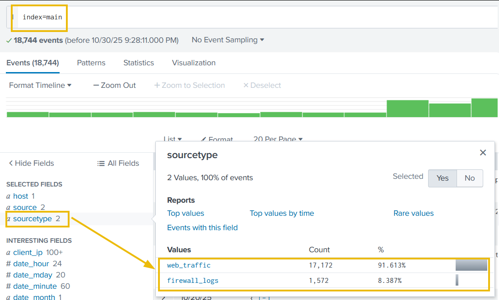

The two datasets are as follows:

- **web_traffic**: This data source contains events related to web connections to and from the web server.
- **firewall_logs**: This data source contains the firewall logs, showing the traffic allowed or blocked. The local IP assigned to the web server is `10.10.1.15`.

Let's explore the logs and investigate the attack on our servers to identify the culprit.

### Initial Triage

Start a basic search across the index using your custom source type `web_traffic`, using the following query:

**Search query:** `index=main sourcetype=web_traffic`

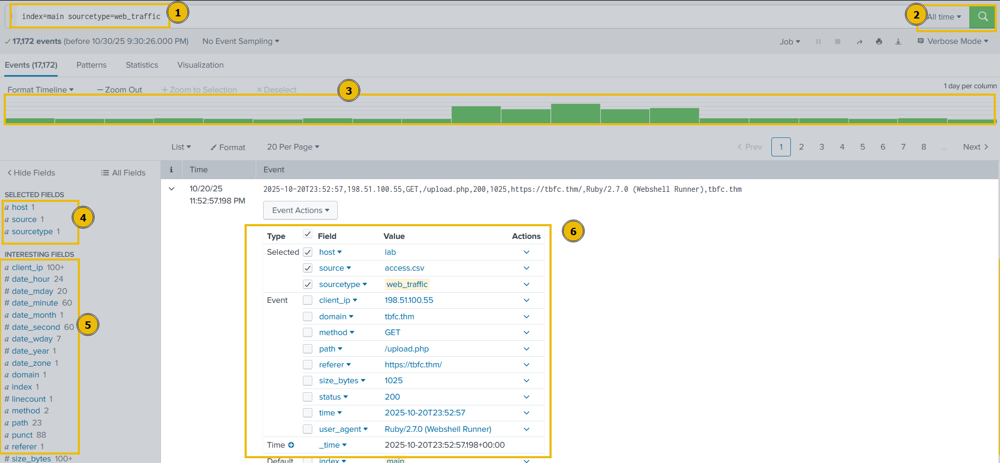

Let's break down our result for a better understanding:

1. **Search query**: This query retrieves all events from the `main` index that were tagged with the custom source type `web_traffic`. This marks the beginning of the investigation.
2. **Time range**: The time range is currently set to **"All time"**. In security analysis, this range would be tightened (e.g., to the spike window) after initial data loading.
3. **Timeline**: This visual histogram shows the distribution of the **17,172 events** over time. The graph indicates the successful **daily log volume** followed by a distinctive **traffic spike** (a period of high activity, likely the attack window).
4. **Selected fields**: These are the fields currently chosen to be displayed in the summary column of the event list (`host`, `source`, `sourcetype`). They represent basic metadata about the log file itself.
5. **Interesting fields**: This pane lists all fields that Splunk has automatically extracted or manually added. Fields prefixed with ``#`` (e.g., ``#date_hour``) are automatically generated by Splunk's time commands. The presence of `user_agent`, `path`, and `client_ip` confirms the successful parsing of the web log structure.
6. **Event details & field extraction**: This section shows the parsed details of a single event with extracted fields like `user_agent`, `path`, `status`, `client_ip`, and more.

Now that we have an understanding of the Splunk layout and how to read the logs in Splunk. Let's continue our analysis of the logs.

### Visualizing the Logs Timeline

Let's chart the total event count over time, grouped by day, to determine the number of events captured per day. This will help us in identifying the day that received an abnormal number of logs.

**Search query:** `index=main sourcetype=web_traffic | timechart span=1d count`


The above results are now showing the event logs captured per day. This could be interesting, as we can see some days getting a high volume of logs. We can also click on the `Visualization` tab to examine the graph for better representation, as shown below:

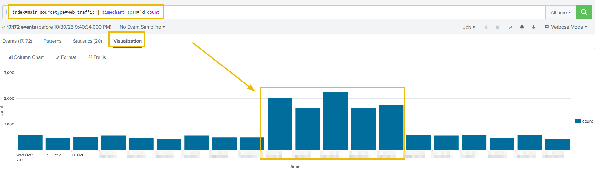

We can append the `reverse` function at the end to display the result in descending order, showing the day with the maximum number of events at the beginning. 

**Search query:** `index=main sourcetype=web_traffic | timechart span=1d count | sort by count | reverse` 

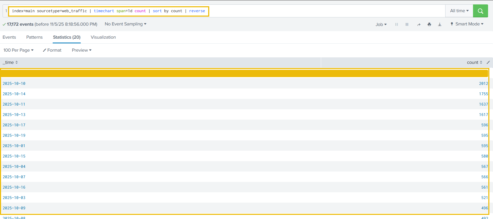

There is a clear period of intense activity during which King Malhare launched his main attack phase.

### Anomaly Detection

Now that we have examined the days with the abnormal logs, using the table and the graph, let's use the same search query to examine various fields to hunt for suspicious values. We need to go back to the `Events` tab to continue.

**User Agent**

Let's click on the `user_agent` field in the left panel, as shown below. It will show us the details about the user agents captured so far. 

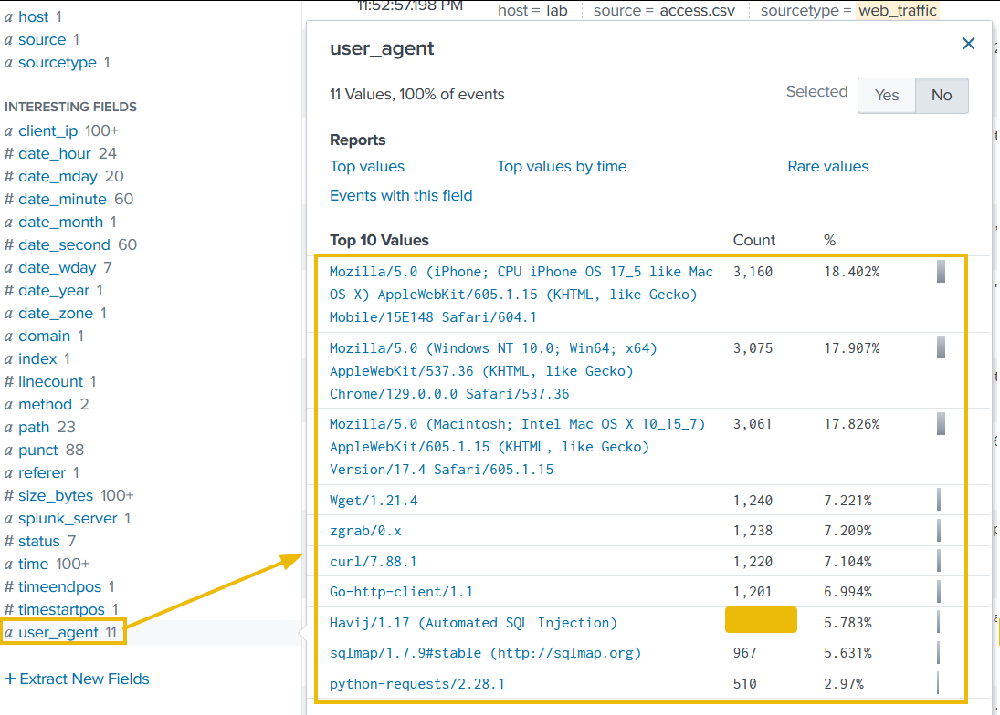

Upon closer examination, it becomes clear that, apart from legitimate user agents like Mozilla's variants, we are receiving a large number of suspicious ones, which we will need to investigate further.

**client_ip**

The second field we will examine is the `client_ip`, which contains the IP addresses of the clients accessing the web server. We can immediately see one particular IP address standing out, which we will investigate further.

**path**

The third field we will examine is path, which contains the URI being requested and accessed by the client IPs. The results shown below clearly indicate some attacks worth investigating.

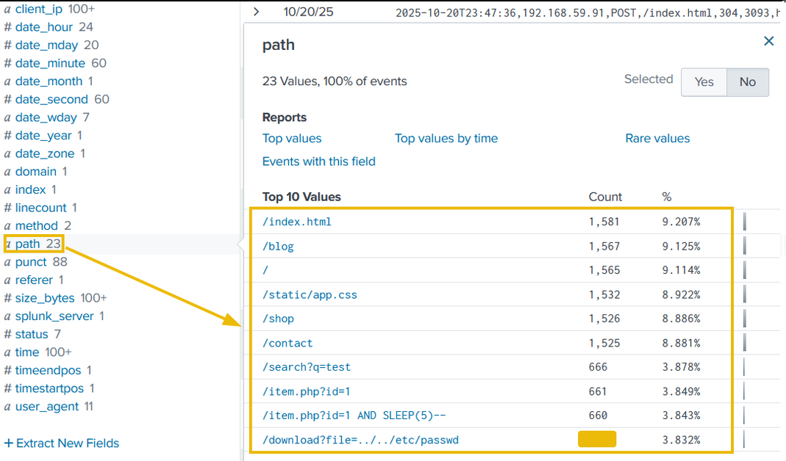

### Filtering out Benign Values

We know King Malhare's bunnies use scripts and tools, not standard browsers. Let's filter out all standard traffic.

Let's exclude common legitimate user agents. The following query will remove legitimate user agents from the results and only show the suspicious ones, which we will further investigate.

**Search query:** ``index=main sourcetype=web_traffic user_agent!=*Mozilla* user_agent!=*Chrome* user_agent!=*Safari* user_agent!=*Firefox*``

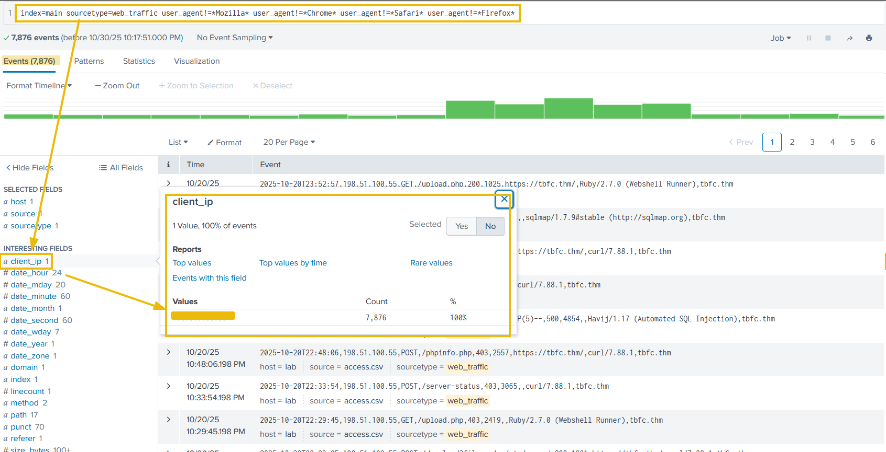

The output reveals interesting results. By clicking on the `client_ip` field we can see a single IP address being responsible for all the suspicious user agents. Let's note that down for further investigation and fill in the **\<REDACTED\>** portions of the upcoming queries with that IP.

### Narrowing Down Suspicious IPs

In real-world scenarios, we often encounter various IP addresses constantly attempting to attack our servers. To narrow down on the IP addresses that do not send requests from common desktop or mobile browsers, we can use the following query:

**Search query:** `sourcetype=web_traffic user_agent!=*Mozilla* user_agent!=*Chrome* user_agent!=*Safari* user_agent!=*Firefox* | stats count by client_ip | sort -count | head 5`

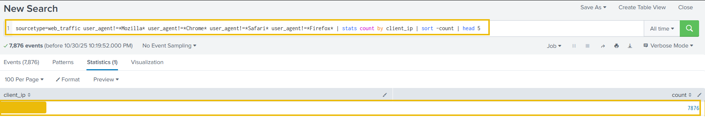

The result confirms the top IP used by the Bandit Bunnies. In the search query, the ``-`` in the `sort -count` part will sort the result by count in reverse order, it's the same as using the reverse function. Let's pick this IP address and filter out to see what the footprints of the activities captured.

### Tracing the Attack Chain

We will now focus on the selected attacker IP to trace their steps chronologically, confirming the use of multiple tools and payloads. Don’t forget to replace **\<REDACTED\>** with the IP we noted down previously.

**Reconnaissance (Footprinting)**

We will start searching for the initial probing of exposed configuration files using the query below:

**Search query:** `sourcetype=web_traffic client_ip="<REDACTED>" AND path IN ("/.env", "/*phpinfo*", "/.git*") | table _time, path, user_agent, status`

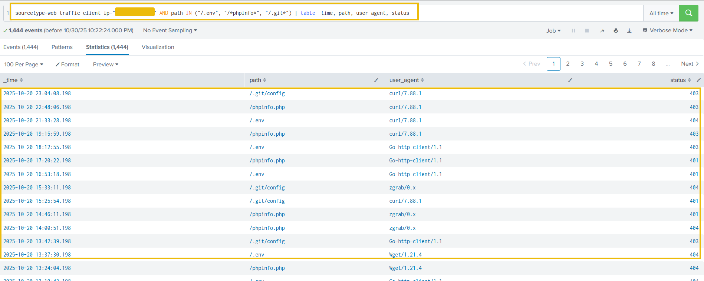

The result confirms the attacker used low-level tools (`curl`, `wget`) and was met with **404/403/401** status codes.

**Enumeration (Vulnerability Testing)**

Search for common path traversal and open redirect vulnerabilities.

**Search query:** ``sourcetype=web_traffic client_ip="<REDACTED>" AND path="*..*" OR path="*redirect*"``

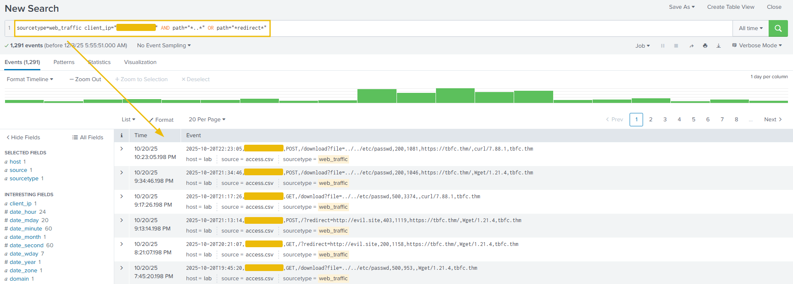

The output shows the resources the attacker is trying to access. Let's update the search query to get the count of the resources requested by the attacker. This search query is filtering on the paths that contain either ``../../`` or the term `redirect` in it, as shown below. This is done to look for footprints of path traversal attempts ``(../../)``. To, we need to update in the search query to escape the characters like ``..\/..\/``.

**Search query:** ``sourcetype=web_traffic client_ip="<REDACTED>" AND path="*..\/..\/*" OR path="*redirect*" | stats count by path``

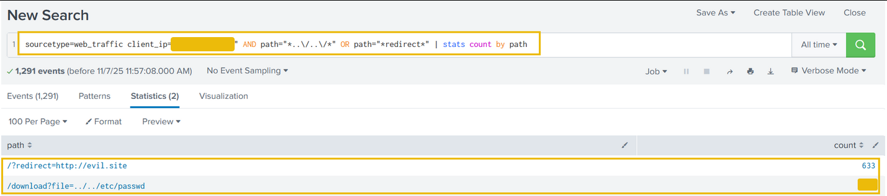

Quite interesting results. Reveals attempts to read system files (``../../*``), showing the attacker moved beyond simple scanning to active vulnerability testing.

**SQL Injection Attack**

Find the automated attack tool and its payload by using the query below:

**Search query:** `sourcetype=web_traffic client_ip="<REDACTED>" AND user_agent IN ("*sqlmap*", "*Havij*") | table _time, path, status`

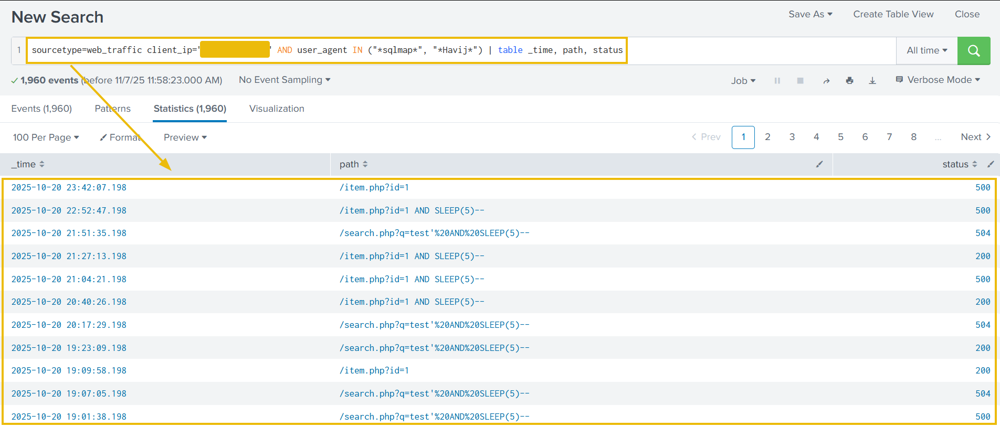

Above results confirms the use of known SQL injection and specific attack strings like ``SLEEP(5)``. A **504** status code often confirms a successful time-based SQL injection attack.

### Exfiltration Attempts

Search for attempts to download large, sensitive files (backups, logs). We can use the query below:

**Search query:** `sourcetype=web_traffic client_ip="<REDACTED>" AND path IN ("*backup.zip*", "*logs.tar.gz*") | table _time path, user_agent`

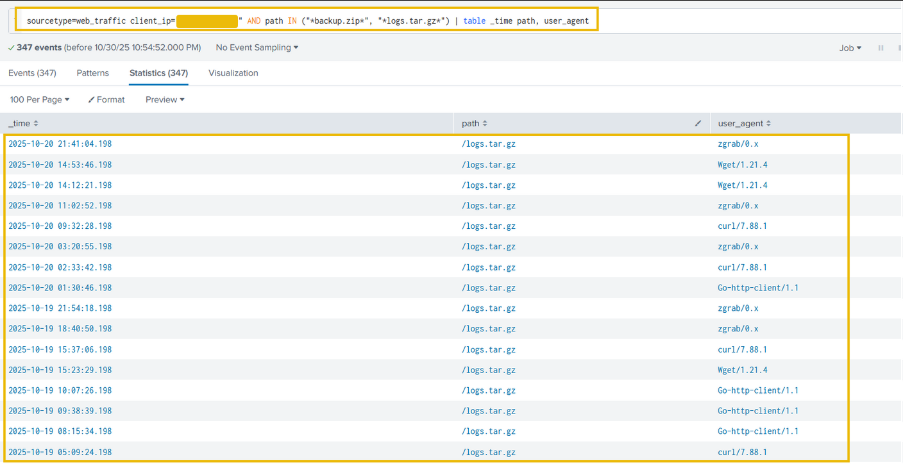

The results indicate the attacker was exfiltrating large chunks of compressed log files using tools like `curl`, `zgrab`, and more. We can confirm the details about these connections in the firewall logs.

### Ransomware Staging & RCE

Requests for sensitive archives like ``/logs.tar.gz`` and ``/config`` indicate the attacker is gathering data for double-extortion. In the logs, we identified some requests related to bunnylock and shell.php. Let's use the following query to see what those search queries are about.

**Search query:** `sourcetype=web_traffic client_ip="<REDACTED>" AND path IN ("*bunnylock.bin*", "*shell.php?cmd=*") | table _time, path, user_agent, status`


Above results clearly confirm a successful webshell. The attacker has gained full control over the web server and is also able to run commands. This type of attack is called Remote code Execution (RCE). The execution of ``/shell.php?cmd=./bunnylock.bin`` indicates a ransomware like program executed on the server. 

### Correlate Outbound C2 Communication

We pivot the search to the `firewall_logs` using the Compromised Server IP (`10.10.1.5`) as the source and the attacker IP as the destination.

**Search query:** `sourcetype=firewall_logs src_ip="10.10.1.5" AND dest_ip="<REDACTED>" AND action="ALLOWED" | table _time, action, protocol, src_ip, dest_ip, dest_port, reason`

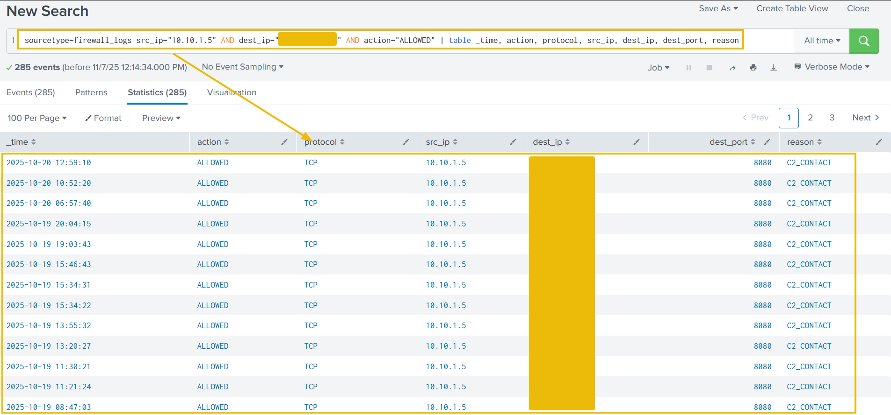

This query proves the server immediately established an **outbound** connection to the attacker's C2 IP on the suspicious `DEST_PORT`. The `ACTION=ALLOWED` and `REASON=C2_CONTACT` fields confirm the malware communication channel was active.

### Volume of Data Exfiltrated

We can also use the sum function to calculate the sum of the bytes transferred, using the bytes_transferred field, as shown below:

**Search Query:** `sourcetype=firewall_logs src_ip="10.10.1.5" AND dest_ip="<REDACTED>" AND action="ALLOWED" | stats sum(bytes_transferred) by src_ip`

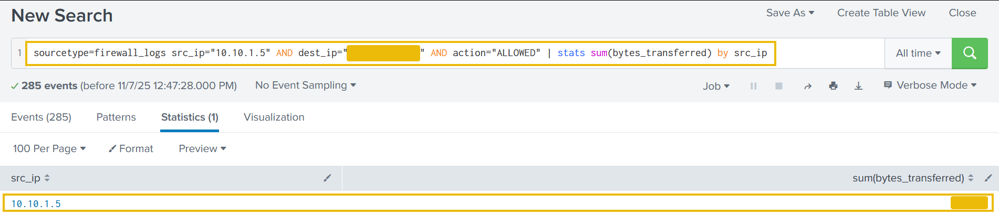

The results show a hugh volume of data transferred from the compromised webserver to C2 server.

### Conclusion

- **Identity found**: The attacker was identified via the highest volume of malicious web traffic originating from the external IP.
- **Intrusion vector**: The attack followed a clear progression in the web logs (`sourcetype=web_traffic`).
- **Reconnaissance**: Probes were initiated via cURL/Wget, looking for configuration files (``/.env``) and testing path traversal vulnerabilities.
- **Exploitation**: The use of `SQLmap` user agents and specific payloads (``SLEEP(5)``) confirmed the successful exploitation phase.
- **Payload delivery**: The Action on Objective was established by the final successful execution of the command `cmd=./bunnylock.bin` via the webshell.
- **C2 confirmation**: The pivot to the firewall logs (`sourcetype=firewall_logs`) proved the post-exploitation activity. The internal, compromised server (`SRC_IP: 10.10.1.5`) established an outbound C2 connection to the attacker's IP.

---

## 🔑 Solution

What is the attacker IP found attacking and compromising the web server?

```
✅ 198.51.100.55
```

Which day was the peak traffic in the logs? (Format: YYYY-MM-DD)

```
✅ 2025-10-12
```

What is the count of Havij user_agent events found in the logs?

```
✅ 993
```

How many path traversal attempts to access sensitive files on the server were observed?

```
✅ 658
```

Examine the firewall logs. How many bytes were transferred to the C2 server IP from the compromised web server?

```
✅ 126167
```


