# Malware Analysis - Egg-xecutable


Discover some common tooling for malware analysis within a sandbox environment.

```
https://tryhackme.com/room/malware-sandbox-aoc2025-SD1zn4fZQt
```

## Task 1 Introduction


The town of Wareville remains quiet in the middle of the night. While the residents of Wareville are nicely tucked up in bed, blissfully unaware, the SOC team at The Best Festival Company (TBFC) remain alert, poised and ready for whatever may face them.

Monitoring their screens, armed with a freshly poured mug of hot cocoa, the elves of the SOC watch their dashboards diligently. 

Suddenly, the elves receive an email in unison from Elf McClause, Head of Elf Affairs, in their inboxes. It reads:

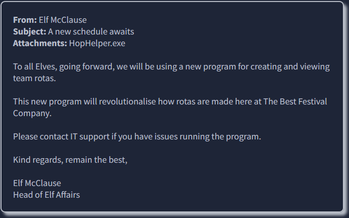

"Why is Elf McClause working at 3AM?" Screams a member of the SOC team in the background. They're right, something is amiss.

Elf McBlue is immediately suspicious. Their years of experience in the SOC have given them the wisdom not to download "out of the blue" executables. Without McSkidy's wisdom, Elf McBlue takes charge, loading up their malware investigation toolkik - the investigation begins.

### Learning Objectives

Today's room will have you taking the place of Elf McBlue, a highly talented member of The Best Festival Company's malware investigation squad. You have been tasked with investigating a highly suspicious executable that is being shared within the company. In today's room, we will be covering the following:

- The principles of malware analysis
- An introduction to sandboxes
- Static vs. dynamic analysis
- Tools of the trade: PeStudio, ProcMon, Regshot

---

## Task 2 Malware Analysis Using Sandboxes

### Principles of Malware Analysis

Malware analysis is the process of examining a malicious file to understand its functionality, operation, and methods for defence against it. By analysing a malicious file or application, we can see exactly how it operates, and therefore, know how to prevent it. For example, could the malicious file communicate with an attacker's server? We can block that server.Malware wrecking havoc over TBFC

Could the malicious file leave traces on the machine? We can use these to determine if the malware has ever infected another device. Instead of fearing malware, we can take a proactive approach by translating technical findings into practical defensive measures and understanding how the malware fits into an attacker's techniques.

There are two main branches of malware analysis: static and dynamic. Static analysis focuses on inspecting a file without executing it, whereas dynamic analysis involves execution. We will come to these shortly.

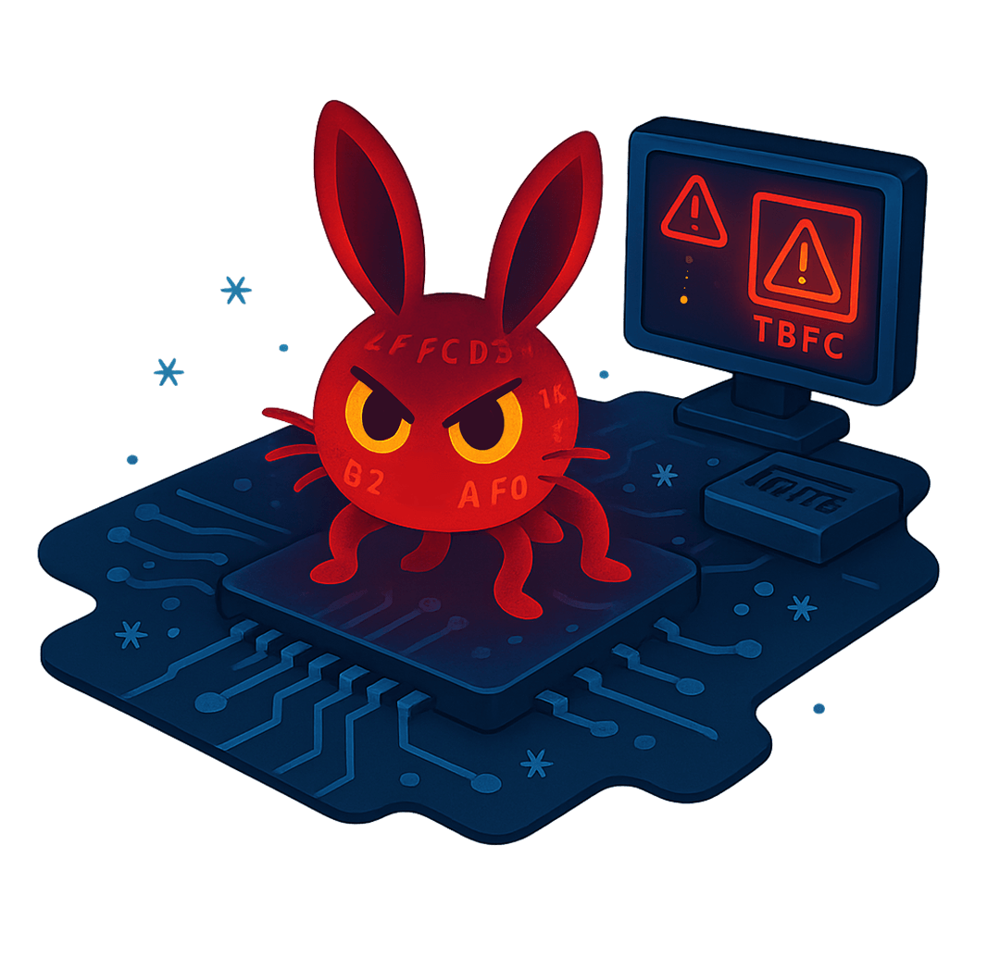

**Sandboxes**

In cyber security, sandboxes are used to execute potentially dangerous code. Think of this as disposable digital play-pens. These sandboxes are safe, isolated environments where potentially malicious applications can perform their actions without risking sensitive data or impacting other systems.

The use of sandboxes is part of the **golden rule in malware analysis: never run dangerous applications on devices you care about.**

Most of the time, sandboxes present themselves as virtual machines. Virtual machines are a popular choice for sandboxing because you can control how the system operates and benefit from features such as snapshotting, which allows you to create and restore the machine to various stages of its status. 

To reiterate, it is **imperative** to understand that potentially malicious code and applications should **only be run in a safe, isolated environment**. From now on, this room will refer to malicious code and applications as samples.

With these fundamentals covered, let's move on to the practical section of today's room. **The following will demonstrate a sample; you must apply these techniques to the `HopHelper.exe` file presented to you** within the "HopHelper" folder on the Desktop of the practical VM.

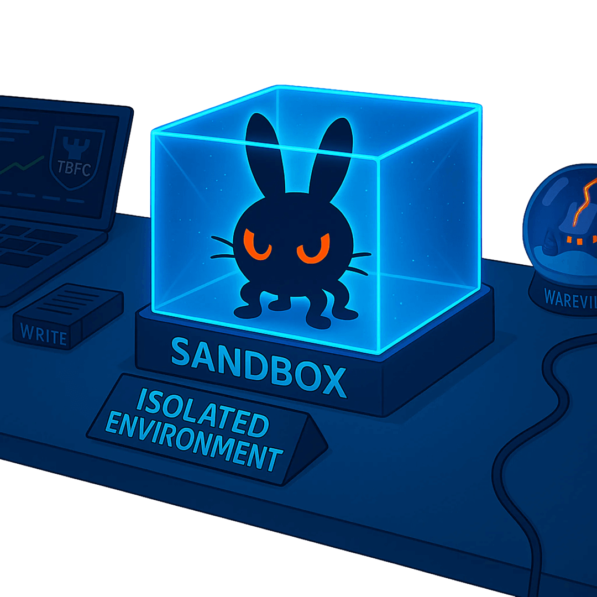

### Interactive: Static Analysis

As we alluded to previously in this room, we use static analysis to gather information about a sample without executing it and digging deep.  

Static analysis can be a quick and effective way to understand how the sample may operate, as well as how it can be identified. Some of the information that can be gathered from static analysis has been included in the table below:

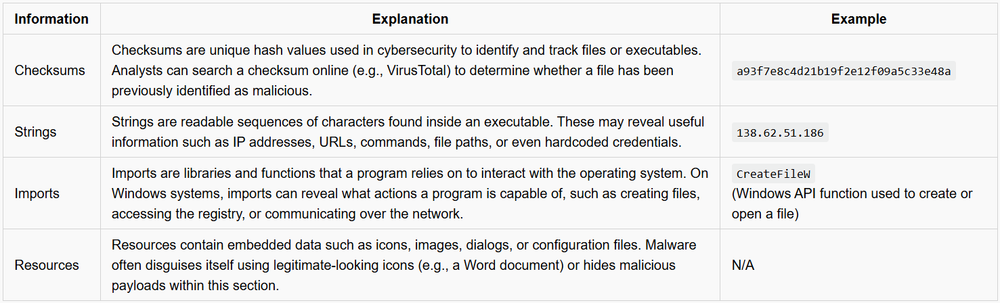

However, it's important to note that regardless of how a sample may appear or function, we don't truly know until it's executed. Attackers use techniques such as obfuscation to obscure how the sample appears, primarily to evade anti-viruses but also to evade a curious analyst.

**Demonstrating PeStudio**

This section of the room will demonstrate using PeStudio on an example called `downloader.exe`. Please note that the information you see will be from this demonstration sample. The sample you will be analysing will be different, but the techniques will still apply.

Please note, it is imperative that you do not launch the `HopHelper.exe` executable yet.

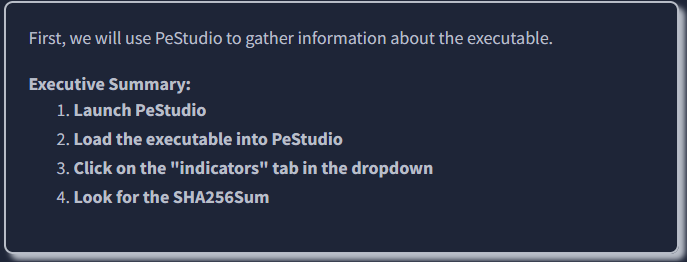

First, we will launch PeStudio and load the executable into it. The shortcut for this has been placed on the Desktop of your analyst machine. You can drag and drop the executable into the PeStudio window, or load it by selecting `File -> Open File` from the toolbar. PeStudio will display some information about the executable.

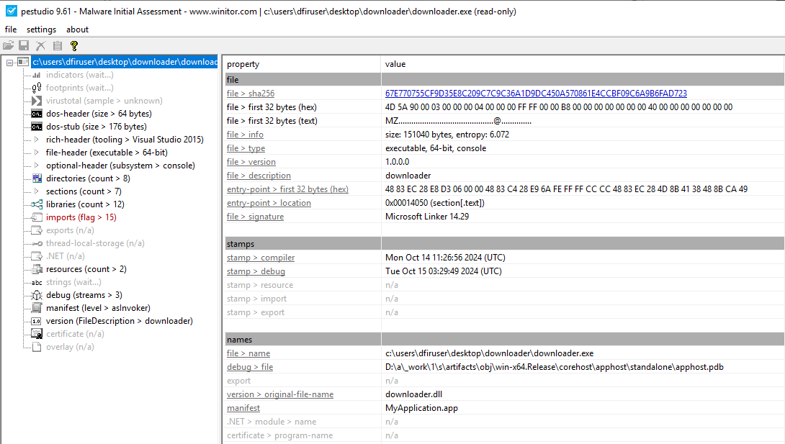

For us, at this stage, the `file > sha256` property within the table is of interest. This value is a checksum, which is a unique identifier for the executable. We can keep a note of this SHA256 as threat intelligence.


Next, we will proceed with reviewing the "Strings" of the executable. You can do this by clicking on the "strings" indicator on the left pane of PeStudio.

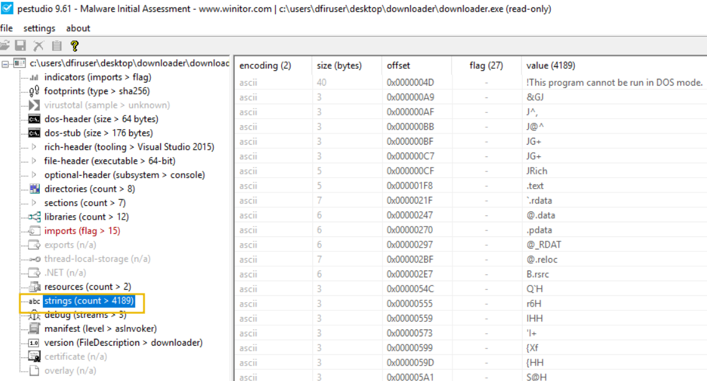

In the context of malware analysis, strings are sequences of readable characters present within an executable. This could be, for example, IP addresses, URLs, commands, or even passwords! As a malware analyst, it's great to have a look at these, as these could reveal the attacker's command infrastructure, which we can use for our defences.

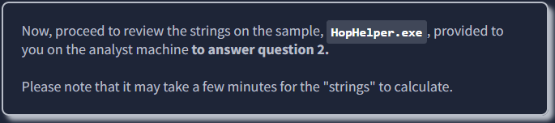

Great! This concludes the static analysis portion of the practical. There's so much more to uncover using static analysis. Feel free to explore if you'd like. Let's proceed to the dynamic analysis below.

### Interactive: Dynamic Analysis

This section of the room provides a brief introduction to dynamic analysis. As you recall, dynamic analysis involves executing the malicious sample to identify its behaviours and how it interacts with the operating system.

**Regshot**

Regshot is a widely used utility, especially when analysing malware on Windows. It works by creating two "snapshots" of the registry—one before the malware is run and another afterwards. The results are then compared to identify any changes.

Malware aims to establish persistence, meaning it seeks to run as soon as the device is switched on. A common technique for malware is to add a `Run` key into the registry, which is frequently used to specify which applications are automatically executed when the device is powered on.

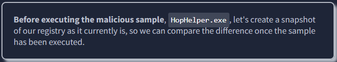

Let's load up Regshot and create a capture of the registry as it currently exists. The shortcut to this has also been placed on the Desktop of the analyst machine.

First, change the output directory of the capture to the user's Desktop using the box with three dots in the "Output path" section.

Then, once set, let's create our first snapshot. Press `1st shot` and then `Shot` on the dropdown. Please note that this may take a few minutes to complete.

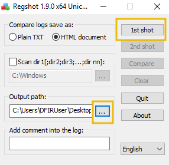

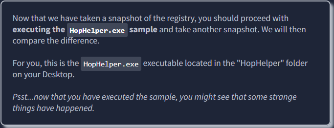

Once we have executed our sample, let's return to Regshot and capture our second snapshot, using the same procedure as above. Click on the **2nd shot button** and press **Shot** in the dropdown. Regshot is now capturing the registry again, and outputting the differences to a file.

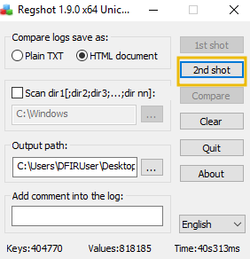

And now, after a few seconds, let's press the **Compare** button that appears.

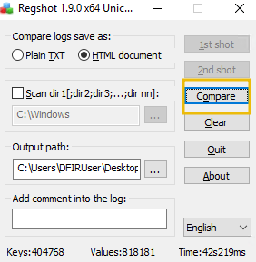

We can search for the executable within the log that opens up. 

**ProcMon**

Next, we will explore using ProcMon (Process Monitor) from the Sysinternals suite to investigate today's sample. Proccess Monitor is used to monitor and investigate how processes are interacting with the Windows operating system. It is a powerful tool that allows us to see exactly what a process is doing. For example, reading and writing registry keys, searching for files, or creating network connections.

Open **Process Monitor (ProcMon)**, the shortcut for this has been placed on the Desktop of the analyst machine. Process Monitor will automatically start capturing events of various processes on the system.

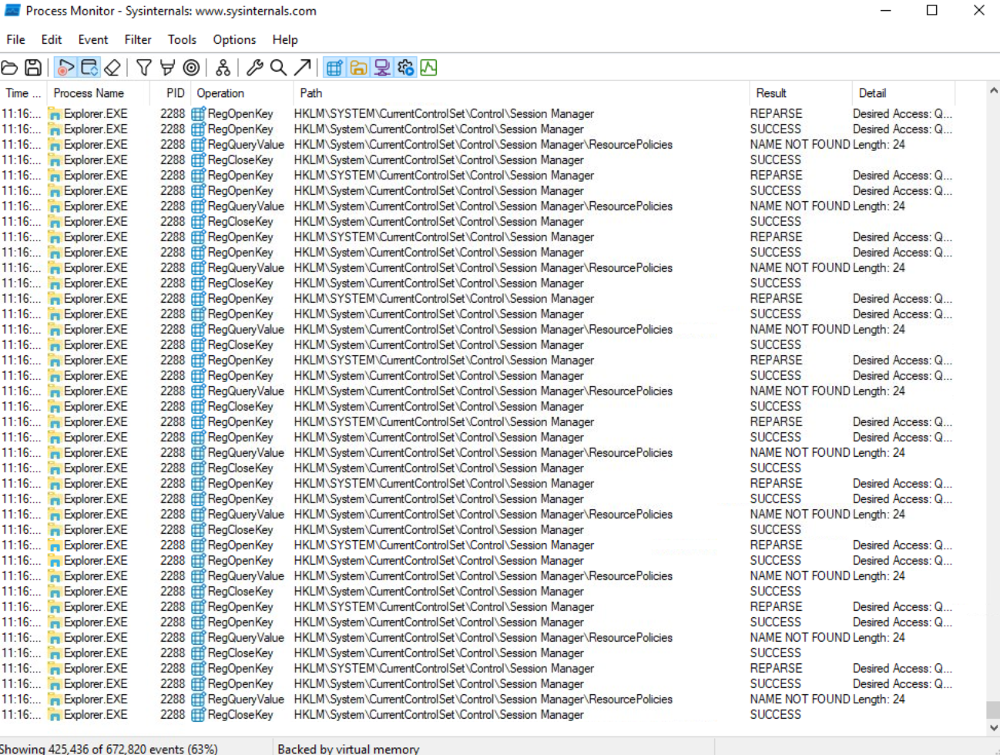

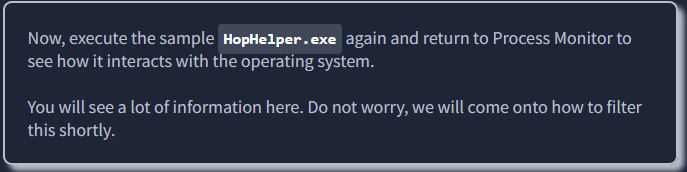

After allowing a minute to pass, ensuring the sample has fully executed, we will now stop capturing. To stop capturing more events, click on the Play button in the toolbar of Process Monitor.

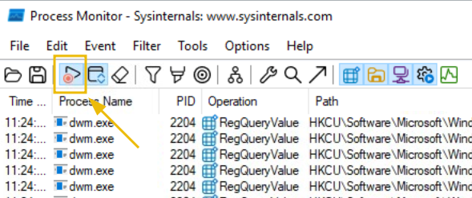

As you can see, there is a lot of information to scroll through here, with the most recent events at the bottom. Here we can see how various system processes are interacting with Windows. Nearly all of it, we don't care about. 

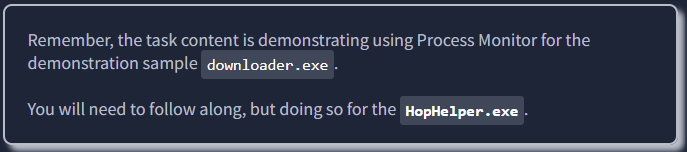

Let's apply some filters. Afterall, for this demonstration, we only care about the `downloader.exe` sample. To do so, click on the Filter button, and then Filter within the dropdown.

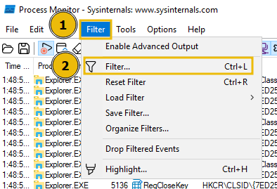

A new window will open.

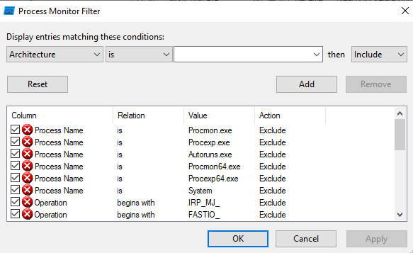

Here we can create some filters to remove some of the noise that we don't care about. Because we want to only look at this `downloader.exe` sample for this demonstration, we can apply a filter like so:

1. Apply the **Process Name** filter
2. Set the condition to **is**
3. Put in the name of the process we wish to see within the text area
4. Press the **Add** button to apply this filter
5. And finally click **OK** to save.

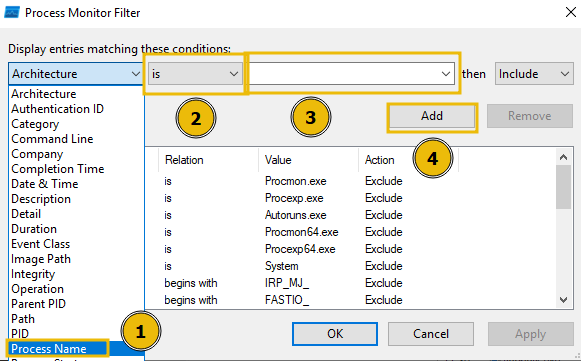

Once done, returning to the main Process Monitor window, we can already see the filter has worked.

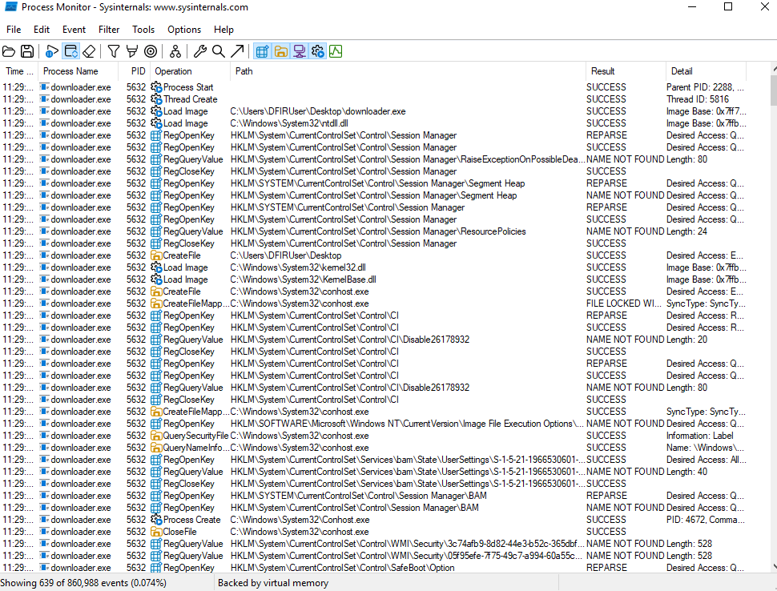

Now it is much easier to investigate how the process is interacting with the operating system. Here are some **Operations** that may be of interest to us:

- RegOpenKey
- CreateFile
- TCP Connect
- TCP Recieve

However, as you can see, there is still a lot of information. We can further apply filters to look for specific things that we want to investigate, such as these aforementioned **Operations**.

To do so, return to the Filter heading and create the **filter** we want to apply. For example, we can filter by **Operations**. Let's do so below, filtering for any TCP **Operation**:

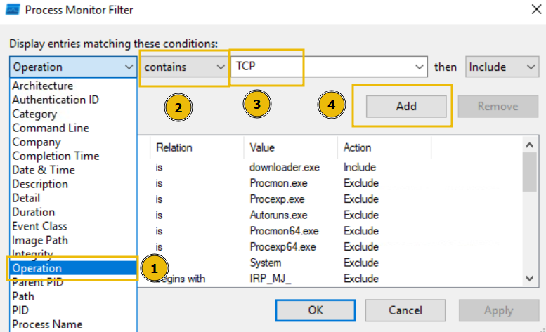

We will now see all Operations that include TCP. Remember, you can remove the filters you've previously applied by pressing the filter in the Filter list, and pressing Remove:

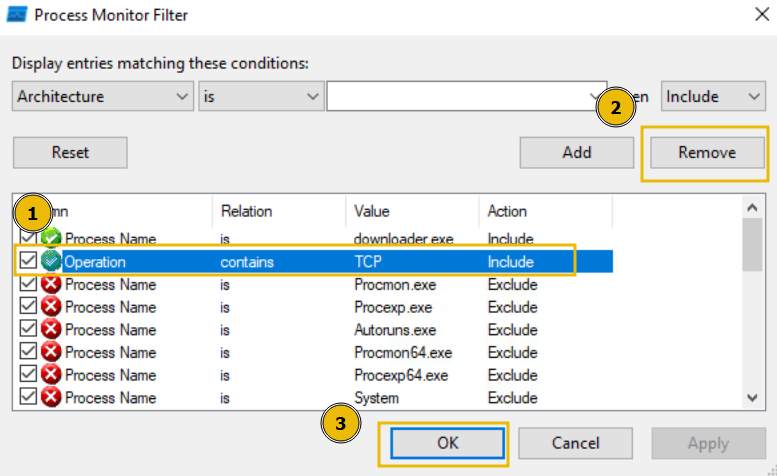

Or, alternatively, if you wish to start over, you can simply press the **Reset Filter** option when clicking on the **Filter** heading.

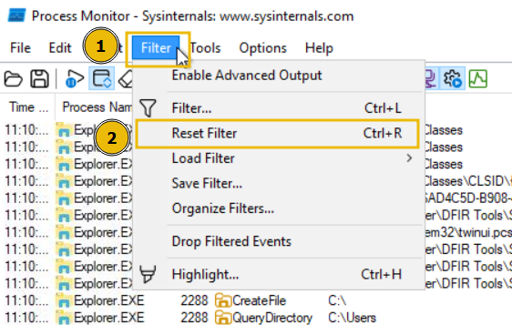

Phew! Well done. That concludes the demonstration for today's room. Remember, you will need to apply what you have learnt here on the **HopHelper.exe** executable that has been placed in the **HopHelper** folder on the analyst Desktop, to answer the questions below.

---

## 🔑 Solution

**Static analysis**: What is the SHA256Sum of the HopHelper.exe?

```
✅ F29C270068F865EF4A747E2683BFA07667BF64E768B38FBB9A2750A3D879CA33
```

**Static analysis**: Within the strings of HopHelper.exe, a flag with the format THM{XXXXX} exists. What is that flag value?

Note, this can be found towards the bottom of the strings output.

```
✅ THM{STRINGS_FOUND}
```

**Dynamic analysis**: What registry value has the HopHelper.exe modified for persistence?

Note: Provide the full path of the key that has been modified

```
✅ HKU\S-1-5-21-1966530601-3185510712-10604624-1008\Software\Microsoft\Windows\CurrentVersion\Run\HopHelper
```

**Dynamic analysis**: Filter the output of ProcMon for "TCP" operations. What network protocol is HopHelper.exe using to communicate?

Make sure to have executed HopHelper.exe while ProcMon was open and capturing events.

```
✅ http
```

**Bonus**: Can you find the web panel that HopHelper.exe is communicating with?

```
✅ No answer needed
```


