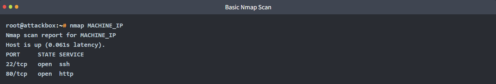
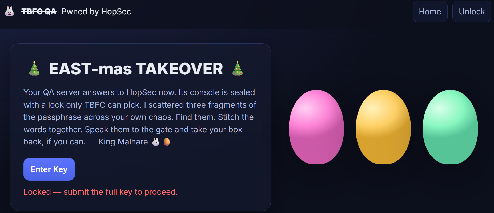
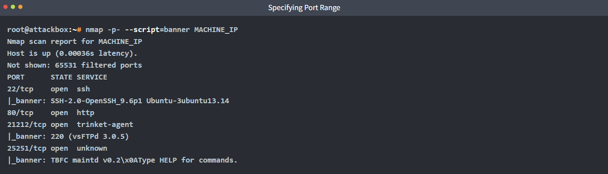
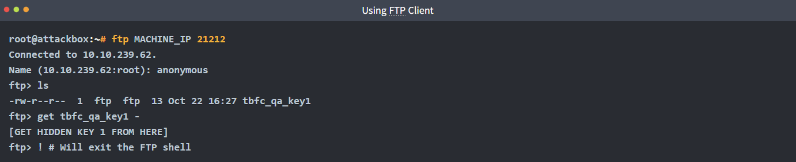
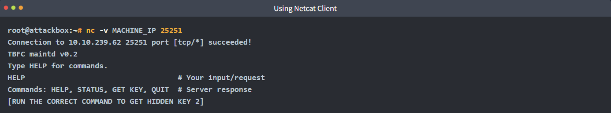
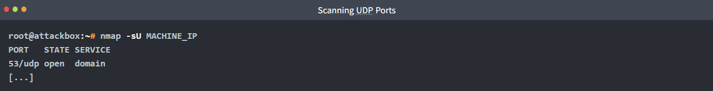
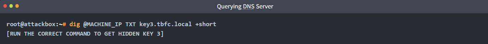
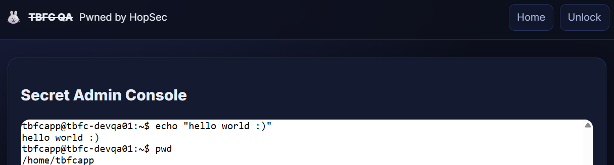
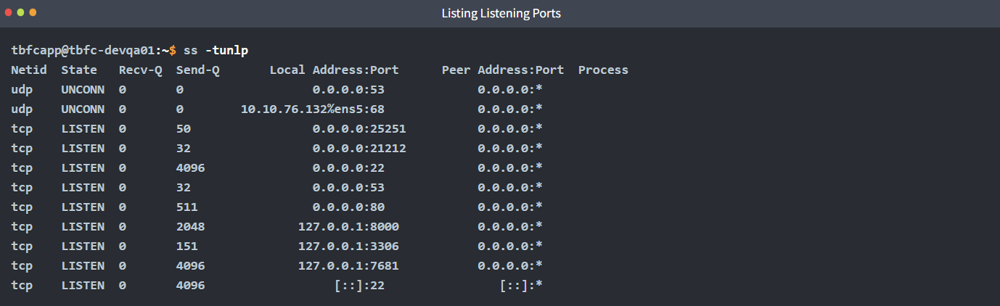
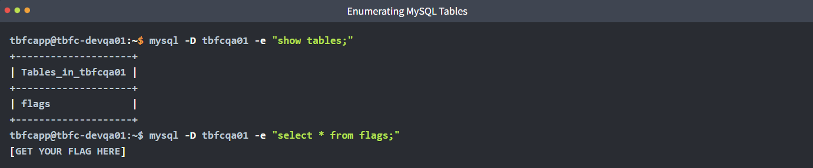

# Network Discovery - Scan-ta Clause


Discover how to scan network ports and uncover what is hidden behind them.

```
https://tryhackme.com/room/networkservices-aoc2025-jnsoqbxgky
```

## Task 1 Introduction


Christmas preparations are delayed - HopSec has breached our QA environment and locked us out! Without it, the TBFC projects can't be tested, and our entire SOC-mas pipeline is frozen. To make things worse, the server is slowly transforming into a twisted EAST-mas node.

Can you uncover HopSec's trail, find a way back into `tbfc-devqa01`, and restore the server before the bunny's takeover is complete? For this task, you'll need to check every place to hide, every opened port that bunnies left unprotected. Good luck!


### Learning Objectives

- Learn the basics of network service discovery with Nmap
- Learn core network protocols and concepts along the way
- Apply your knowledge to find a way back into the server

---

## Task 2 Discover Network Services

### Discovering Exposed Services

Although we lost access to the QA server, at least it's still active, and we know its IP address. That's good news, since now we can counterattack and hopefully find our way back. Ensure you understand basic Networking Concepts like network ports, and let's plan the engagement!

1. Know your target. In our case, it is the `tbfc-devqa01` server with the `MACHINE_IP` IP address.
2. Scan the IP for open ports, especially common ones like 22 for SSH and 80 for HTTP.
3. Explore what's behind the open ports, maybe it's a vulnerable web server running on port 80.
4. Exploit the exposed service, find a way in, and kick out the bad bunnies from the QA server.

Along the practical of today's task you will find three keys.
Keep note of them since you will later need them for the web app.
The format will be `KEYNAME:KEY`.

**The Simplest Port Scan**

There are many tools you can use to scan for open ports, from preinstalled Netcat on Linux and PowerShell on Windows, to specialized, powerful tools like Nmap and Naabu. Let's use Nmap for this task and perform a basic scan from the AttackBox or your own VPN-connected attacking machine. Open a new command line terminal and run the following command:



The command scanned the top 1000 most commonly used ports and reported if any services were running there. The only results you received are an opened SSH port for remote machine access and a HTTP port for a website. This means you can now access the server via SSH (if you know the password), or open the website by visiting `http://MACHINE_IP` from within the AttackBox:



**Scanning Whole Range**

It seems like the website is defaced by bad bunnies, and we don't know the key to enter the admin panel! But worry not. We scanned just 1000 ports, but there are actually 65535 ports where other services can hide! Now let's add the ``-p-`` argument to scan all ports, and ``--script=banner`` to see what's likely behind the port:



Looks like you found a running FTP server and some custom TBFC application. Even though FTP runs on port 21 by default, it's possible to change the port to any other one, such as 21212. Let's try accessing the FTP in anonymous mode with the `ftp` command and see if we can find our way in! You can follow the commands from the terminal below:



**Port Scan Modes**

Good job finding the first flag part. There is nothing more we can see on the FTP server, so let's move on to the custom TBFC app on port 25251. Since it is not a well-known service like HTTP or FTP, your web browser or FTP client won't know how to access it. Luckily, you can always use Netcat (`nc`), a universal tool to interact with network services:



Once you received the key, press `CTRL+C` to exit the Netcat client.

**TCP and UDP Ports**

Congratulations on the second flag! But where to look for the third one? Till now, you have scanned only TCP ports, but there are also 65535 ports for UDP, another transport protocol. And there is a chance HopSec secrets are hiding there, too! You can switch to UDP scan by specifying the ``-sU`` flag:



After a minute you should see an open port 53 associated with DNS - a protocol that drives the modern web by connecting domains to IPs, and many more! DNS is a complex topic and many secrets can hide there, but let's just ask the DNS server if it knows the key by using `dig - a` command to perform advanced DNS queries:



### On-Host Service Discovery

Now that you know all three keys to the `tbfc-devqa01` QA server, it's time to call your TBFC teammates and kick out the bad bunnies. But first, log in to the server's admin panel by visiting `http://MACHINE_IP` from within the AttackBox and access the secret admin console by submitting the combined keys:



**Listing Listening Ports**

Once you have access to the console, there is no need to scan the ports, as you can simply ask the OS to list its open ports, also called listening ports. You can do it by running `ss -tunlp` (or `netstat` on older systems) inside the Secret Admin Console of the web app. In the output, you may see exactly the same services you scanned before listening on `0.0.0.0`, but also some listening on `127.0.0.1` (available only from the host itself):



With root permissions, you can also view the process column. However, for now, let's focus on the `3306` port, which is the default MySQL database port. Usually databases require a password for remote clients, but allow unauthenticated logins from localhost. Since you are already inside the host, let's see the database content by using the `mysql` program:



Great job on finding the flag! You have exposed all bunnies' secrets and regained full access to the QA server. Now it's time to secure all ports and restore the SOC-mas preparation pipeline. But for now, answer the questions below and finish the task!


---

## 🔑 Solution


What evil message do you see on top of the website?

```
✅ Pwned by HopSec
```


What is the first key part found on the FTP server?

```
✅ 3aster_
```

What is the second key part found in the TBFC app?

```
✅ 15_th3_
```

What is the third key part found in the DNS records?

```
✅ n3w_xm45
```

Which port was the MySQL database running on?

```
✅ 3306
```

Finally, what's the flag you found in the database?

```
✅ THM{4ll_s3rvice5_d1sc0vered}
```


