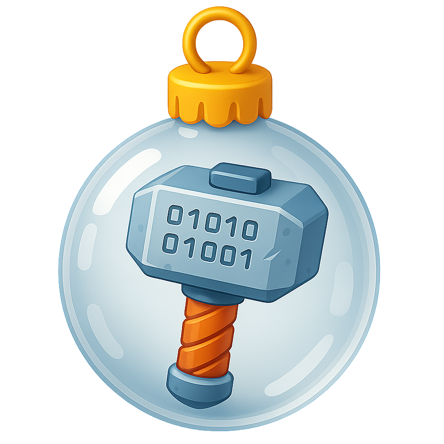
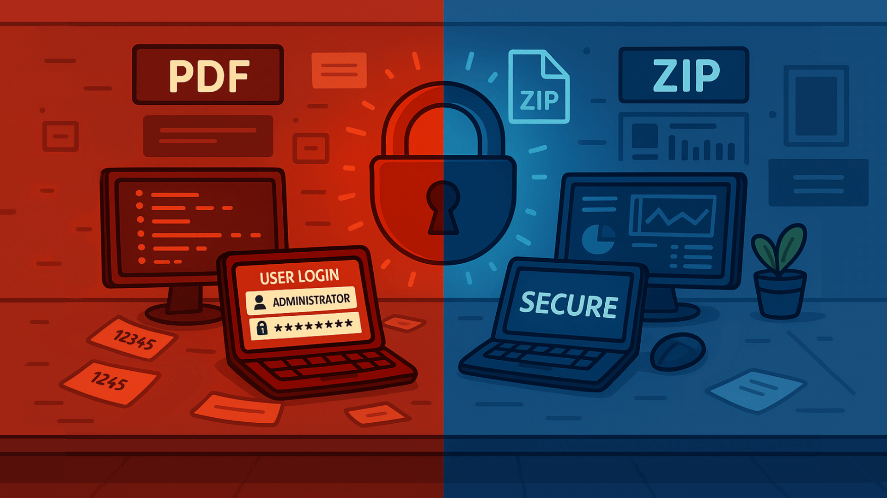
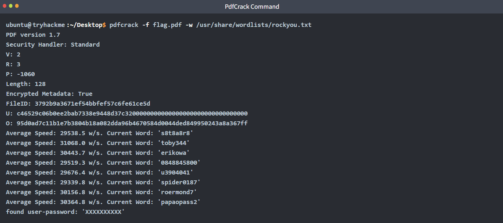
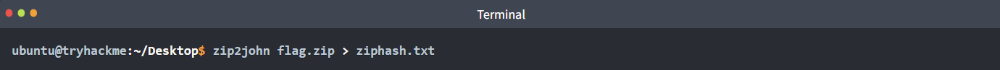
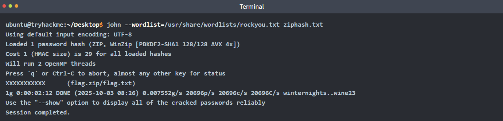
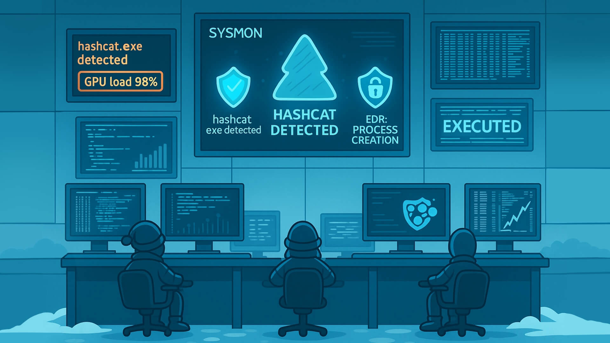
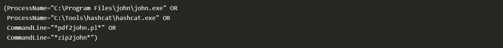
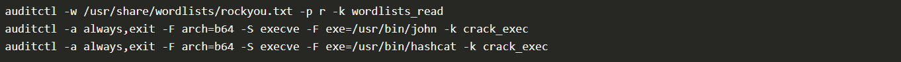
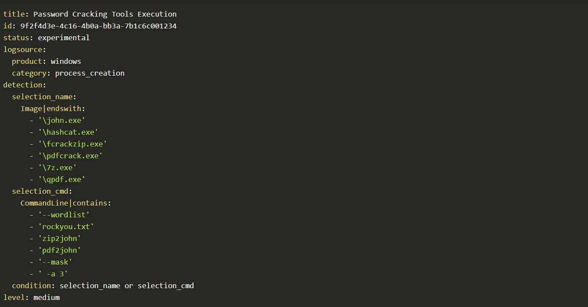

# Passwords - A Cracking Christmas



Learn how to crack password-based encrypted files.

```
https://tryhackme.com/room/attacks-on-ecrypted-files-aoc2025-asdfghj123
```

## Task 1 Introduction


With time between Easter and Christmas being destabilised, the once-quiet systems of The Best Festival Company began showing traces of encrypted data buried deep within their servers. Sir Carrotbane, stumbled upon a series of locked PDF and ZIP files labelled “North Pole Asset List.” Rumours spread that these could contain fragments of **Santa’s master gift registry**, critical information that could help Malhare control the festive balance between both worlds.

Sir Carrotbane sets out to crack the encryption, learning how weak passwords can expose even the most guarded secrets. Can the Elves adapt fast and prevent their secrets from being discovered?

### Learning Objectives

- How password-based encryption protects files such as PDFs and ZIP archives.
- Why weak passwords make encrypted files vulnerable.
- How attackers use dictionary and brute-force attacks to recover passwords.
- A hands-on exercise: cracking the password of an encrypted file to reveal its contents.
- The importance of using strong, complex passwords to defend against these attacks.

A few simple points to remember:

- The strength of protection depends almost entirely on the password. Short or common passwords can be guessed; long, random passwords are far harder to break.
- Different file formats use different algorithms and key derivation methods. For example, PDF encryption and ZIP encryption differ in details (how the key is derived, salt use, number of hash iterations). That affects how easy or hard cracking is.
- Many consumer tools still support legacy or weak modes (particularly older ZIP encryption). That makes some encrypted archives much easier to attack than modern, well-implemented schemes.
- Encryption protects data confidentiality only. It does not prevent someone with access to the encrypted file from trying to guess the password offline.

To make it simple, encryption makes the contents unreadable unless the correct password is known. If the password is weak, an attacker can simply try likely passwords until one works.


---

## Task 2 Attacks Against Encrypted Files

### How Attackers Recover Weak Passwords

Attackers don't usually try to "break" the encryption itself because that would take far too long with modern cryptography. Instead, they focus on guessing the password that protects the file. The two most common ways of doing this are dictionary attacks and brute-force (or mask) attacks.

**Dictionary Attacks**

In a dictionary attack, the attacker uses a predefined list of potential passwords, known as a wordlist, and tests each one until the correct password is found. These wordlists often contain leaked passwords from previous breaches, common substitutions like **password123**, predictable combinations of names and dates, and other patterns that people frequently use. Because many users choose weak or common passwords, dictionary attacks are usually fast and highly effective.

**Mask Attacks**

Brute-force and mask attacks go one step further. A brute-force attack systematically tries every possible combination of characters until it finds the right one. While this guarantees success eventually, the time it takes grows exponentially with the length and complexity of the password.

Mask attacks aim to reduce that time by limiting guesses to a specific format. For example, trying all combinations of three lowercase letters followed by two digits.

By narrowing the search space, mask attacks strike a balance between speed and thoroughness, especially when the attacker has some idea of how the password might be structured.



Practical tips attackers use (and defenders should know about):

- Start with a wordlist (fast wins). Common lists: `rockyou.txt`, `common-passwords.txt`.
- If the wordlist fails, move to targeted wordlists (company names, project names, or data from the target).
- If that fails, try mask or incremental attacks on short passwords (e.g. ``?l?l?l?d?d`` = three lowercase letters + two digits, which is used as a password mask format by password cracking tools).
- Use GPU-accelerated cracking when possible; it dramatically speeds up attacks for some algorithms.
- Keep an eye on resource use: cracking is CPU/GPU intensive. That behaviour can be detected on a monitored endpoint.

### Exercise

You will find the files for this section in the `Desktop` directory of the machine. Switch to it by running `cd Desktop` in your terminal.

**1. Confirm the File Type**

Use the `file` command or open the file with a hex viewer. This helps pick the right tool.


If it's a PDF, proceed with PDF tools. If it's a ZIP, proceed with ZIP tools.

**2. Tools to Use (pick one based on file type)**

- PDF: `pdfcrack`, `john` (via `pdf2john`)
- ZIP: `fcrackzip`, `john` (via `zip2john`)
- General: `john` (very flexible) and `hashcat` (GPU acceleration, more advanced)

**3. Try a Dictionary Attack First (fast, often successful)**

Example: PDF with `pdfcrack` and `rockyou.txt`:



Example: using `john` 

- Create a hash that John can understand: `zip2john flag.zip > ziphash.txt`



- John will report the recovered password if it finds one.



### Detection of Indicators and Telemetry

Offline cracking does not hit login services, so lockouts and failed logon dashboards stay quiet. We can detect the work where it runs, on endpoints and jump boxes. The important signals to monitor include:

**Process creation**: Password cracking has a small set of well-known binaries and command patterns that we can look out for. A mix of process events, file activity, GPU signals, and network touches tied to tooling and wordlists. Our goal is to make the activity obvious without drowning in noise.

- Binaries and aliases: `john`, `hashcat`, `fcrackzip`, `pdfcrack`, `zip2john`, `pdf2john.pl`, `7z`, `qpdf`, `unzip`, `7za`, `perl` invoking `pdf2john.pl`.
- Command‑line traits: ``--wordlist``, ``-w``, ``--rules``, ``--mask``, ``-a 3``, ``-m`` in Hashcat, references to `rockyou.txt`, `SecLists`, `zip2john`, `pdf2john`.
- Potfiles and state: ``~/.john/john.pot``, ``.hashcat/hashcat.potfile``, ``john.rec``.

It's worth noting that on Windows systems, Sysmon Event ID 1 captures process creation with full command line properties, while on Linux, `auditd`, `execve`, or EDR sensors capture binaries and arguments.

**GPU and Resource Artefacts**

GPU cracking is loud. Sudden high utilisation on hosts can be picked up and would need to be investigated.

- `nvidia-smi` shows long‑running processes named `hashcat` or `john`.
- High, steady GPU utilisation and power draw while the fan curve spikes.
- Libraries loaded: `nvcuda.dll`, `OpenCL.dll`, `libcuda.so`, `amdocl64.dll`.



**Network Hints, Light but Useful**

Offline cracking does not need the network once wordlists are present. Yet most operators fetch lists and tools first.

- Downloads of large text files named `rockyou.txt`, or Git clones of popular wordlist repos.
- Package installs, for example `apt install john hashcat`, detected by EDR package telemetry.
- Tool updates and driver fetches for GPU runtimes.

**Unusual File Reads**

Repeated reads of files such as wordlists or encrypted files would need analysis.

**Detections**

Below are some examples of detection rules and hunting queries we can put to use across various environments.

*Sysmon*:



*Linux audit rules, temporary for an investigation*:



*Sigma style rule, Windows process create for cracking tools*:



**Response Playbook**

As security analysts in Wareville, it is important to have a playbook to follow when such incidents occur. The immediate actions to take are:

1. Isolate the host if malicious activity is detected. If it is a lab, tag and suppress.
2. Capture triage artefacts such as process list, process memory dump, `nvidia-smi` sample output, open files, and the encrypted file.
3. Preserve the working directory, wordlists, hash files, and shell history.
4. Review which files were decrypted. Search for follow‑on access, lateral movement or exfiltration.
5. Identify the origin and intent of the activity. Was this authorised? If not, escalate to the IR team.
6. Remediate the activity, rotate affected keys and passwords, and enforce MFA for accounts.
7. Close with education and correct placement of tools into approved sandboxes.


---

## 🔑 Solution


What is the flag inside the encrypted PDF?

```
✅ THM{Cr4ck1ng_PDFs_1s_34$y}
```

What is the flag inside the encrypted zip file?

```
✅ THM{Cr4ck1n6_z1p$_1s_34$yyyy}
```

## Side Quest 2 Key

For those who want another challenge, have a look around the VM to get access to the key for **Side Quest 2**! Accessible through our Side Quest Hub!

```
https://tryhackme.com/adventofcyber25/sidequest
```


