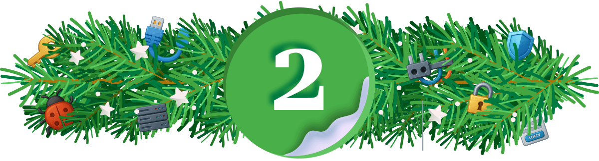
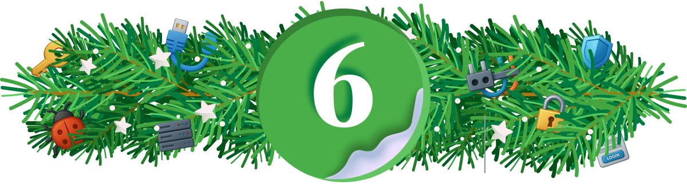
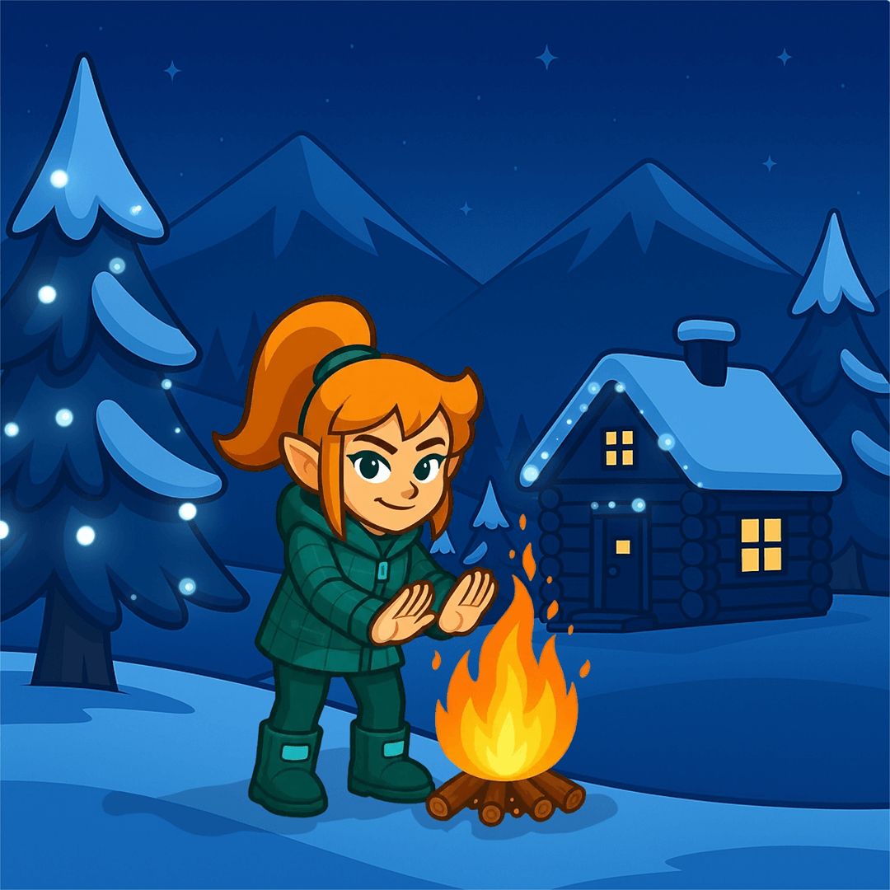

# 🎄 Advent of Cyber Prep Track


Get ready for **Advent of Cyber 2025** with the **"Advent of Cyber Prep Track"**, a series of 🔥 warm-up tasks designed to help beginners build confidence and get fully prepared for this year’s event!

```
https://tryhackme.com/room/adventofcyberpreptrack
```

## Task 1 — 4 Introduction

### 🎁 Main Prizes

This year is our biggest and best prize draw yet, with over **$150,000 worth** of prizes!

In this event, the number of rooms you complete really matters! **For each room completed, you'll receive a raffle ticket**. The more raffle tickets you collect, the higher your chances of winning big!

**Here are the prizes up for grabs:**


**Electronics & Gadgets:**

🖥️ 5 × MacBook Air M4  
📱 3 × iPhone 17  
🎧 15 × Apple AirPods 4  
🖥️ 10 × Samsung Curved Monitors  
🎹 10 × Ornata Gaming Keyboards with Chroma RGB Backlighting  
🛠️ 10 × Flipper Zeros  
🖥️ 10 × Raspberry Pi Compute Module 5 IO Board  
🐍 20 × HAK5 Rubber Ducky  

---

**Event & Experience Prizes:**

🎟️ 3 × DefCon Tickets  
🎓 3 × Sponsored Cyber Bootcamps  

---

**Subscriptions & Certifications:**

💻 500 × THM Subscriptions (1 Month)  
💻 300 × THM Subscriptions (3 Months)  
💻 100 × THM Subscriptions (6 Months)  
💻 80 × THM Subscriptions (12 Months)  
🎁 250 × TryHackMe Swag Gift Cards ($10)  
🎁 200 × TryHackMe Swag Gift Cards ($20)  
🎁 100 × TryHackMe Swag Gift Cards ($50)  
🎁 80 × TryHackMe Swag Gift Cards ($75)  
🎁 20 × TryHackMe Swag Gift Cards ($100)  
🛡️ 5 × BurpSuite 6-Month Subscriptions  
🛡️ 100 × BurpSuite Web Security Certifications  
🛡️ 10 × AWS & Azure Cloud Licenses  
📜 100 × SAL1 Certifications  
📜 100 × PT1 Certifications  

---

### General Rules

**Breaking any of the following rules will result in elimination from the event:**

- ``.tryhackme.com`` and the OpenVPN server are off-limits to probing, scanning, or exploiting
- Users are only authorised to hack machines deployed in the rooms they have access to
- Users are not to target or attack other users
- Users should only enter the event once, using one account
- Regular AoC Days: Do not share questions, but permissible to show in videos or streams
- Side quests: Do not share questions, or hints, including not sharing it in videos or streams
- Cheating
- Usage of bot accounts

---

### How To Qualify

To qualify for the main prizes, you must complete the rooms in the Advent of Cyber 2025 event, starting with Day 1. Only room completions in the Advent of Cyber 2025 roadmap will qualify you for the raffle.

- It doesn't matter when you complete rooms. You just need to complete them by 31st December 2025. For example, if you complete Day 1 on 31st December 2025, you will still receive the same amount of raffle tickets as a user who completes on the day of the task release!
- You don't have to complete all the rooms or complete them in order. The more rooms you complete, the more raffle tickets you get and the higher your chances of winning.

---

### Certificate

Finally, if you complete every room in the event, you will earn a certificate of completion! As your name will be included on the certificate, we advise ensuring your full name is set (and updated) in your profile.

---


### Let's Get Warmed Up

The snow has started falling in **Wareville**, home of *The Best Festival Company (TBFC)*. The team is preparing for SOCMAS, the annual cyber celebration, but something’s not right. Systems are glitching, passwords are failing, and McSkidy suspects something is afoot. This name keeps coming up: **King Malhare**. What could it mean?

Before joining the **SOCMAS Response Team**, you can complete **10 short missions** to ensure you are ready. Each one teaches an essential cyber security skill and uncovers clues to help get you ready for Advent of Cyber 2025.


---

## Task 5 Challenge 1 — Password Pandemonium


### Password Pandemonium

As you log into your new TBFC workstation, an alert pops up:

“Weak passwords detected on 73 TBFC accounts!”

Even McSkidy’s password, `P@ssw0rd123`, has been flagged. Before gaining full access, you’ll need to prove your password prowess.

Strong passwords are one of the simplest yet most effective defences against cyber attacks.

**Objective:**

Create a password that passes all system checks and isn’t found in the leaked password list.

**Steps:**

1. Enter a password with at least 12 characters.
2. Include uppercase, lowercase, numbers, and symbols.
3. Ensure it isn’t in the breach database.

---

What's the flag?

```
✅ THM{StrongStart}
```


---

## Task 6 Challenge 2 — The Suspicious Chocolate.exe



### The Suspicious Chocolate.exe

A shiny USB labelled **“SOCMAS Party Playlist”** appears on your desk. Inside is a mysterious file called `chocolate.exe`.
It looks festive, but who sent it?

In this challenge, you’ll scan the file using a simulated VirusTotal tool to decide whether it’s safe or malicious.
Checking suspicious files is a crucial skill for every defender.

**Objective:**

Determine if `chocolate.exe` is safe or infected.

**Steps:**

1. Click the “Scan” Button.
2. Review the scan report (49 clean results, 1 malicious).
3. Decide correctly whether the file is safe or dangerous.

What's the flag?

```
✅ THM{NotSoSweet}
```


---

## Task 7 Challenge 3 — Welcome to the AttackBox!


### Welcome to the AttackBox!

You step into TBFC’s **AttackBox**, a secure virtual environment built for training. The system hums quietly, waiting for your first command.

This is where defenders learn, break, and rebuild safely. Getting comfortable with the command line is your first step toward cyber mastery.

**Objective:**

Find and read the hidden welcome message inside your AttackBox.

**Steps:**

1. Use `ls` to list files.
2. Use ``cd challenges/`` to change directories.
3. Use ``cat welcome.txt`` to read the text file.

What's the flag?

```
✅ THM{Ready2Hack}
```


---

## Task 8 Challenge 4 — The CMD Conundrum


### The CMD Conundrum

McSkidy’s workstation shows signs of tampering, suspicious files moved, logs wiped, and a strange folder named `mystery_data`.

It’s time to use the **Windows Command Prompt** to uncover what’s hidden.
Learning these commands helps you investigate systems and find what the GUI can’t.

**Objective:**

Find the hidden flag file using Windows commands.

**Steps:**

1. Use `dir` to list visible files.
2. Try `dir /a` to reveal hidden ones.
3. Use `type hidden_flag.txt` to read the flag.

What's the flag?

```
✅ THM{WhereIsMcSkidy}
```


---

## Task 9 Challenge 5 — Linux Lore


### Linux Lore

TBFC’s delivery drones are glitching, dropping eggs instead of presents! McSkidy’s last login came from a Linux server, and something in his account might explain why.

Linux powers most servers worldwide, and knowing how to search within it is a must for any defender.

**Objective:**

Locate McSkidy’s hidden message in his Linux home directory.

**Steps:**

1. Use ``cd /home/mcskidy/`` to enter his folder.
2. Run ``ls -la`` to show all files.
3. Use ``cat .secret_message`` to reveal the flag.

What's the flag?

```
✅ THM{TrustNoBunny}
```


---

## Task 10 Challenge 6 — The Leak in the List



### The Leak in the List

Rumours swirl that TBFC’s data has been leaked. Emails are bouncing, and the staff are panicking.
McSkidy suspects his account might have been part of a breach.

Defenders often use tools like **Have I Been Pwned** to check for compromised accounts. Early detection can stop an attack from spreading.

**Objective:**

Check if McSkidy’s email has appeared in a breach.

**Steps:**

1. Enter `mcskidy@tbfc.com` into the breach checker.
2. Review results for each domain.
3. Identify the one marked “Compromised.”

What's the flag?

```
✅ THM{LeakedAndFound}
```


---

## Task 11 Challenge 7 — WiFi Woes in Wareville


### WiFi Woes in Wareville

The TBFC drones are looping endlessly over Wareville Square. Someone logged into the company router using default credentials!

Securing WiFi is critical. Default passwords are like leaving the front gate wide open.

**Objective:**

Log into the router and secure it with a strong new password.

**Steps:**

1. Log in with username `admin` and password `admin`.
2. Go to “Security Settings.”
3. Set a new strong password that passes validation.

What's the flag?

```
✅ THM{NoMoreDefault}
```


---

## Task 12 Challenge 8 — The App Trap


### The App Trap

McSkidy’s social account has gone rogue, posting strange messages about “EASTMAS.” A suspicious third party app may be behind it.

Learning to review and manage app permissions helps stop data leaks before they start.

**Objective:**

Find and remove the malicious connected app.

**Steps:**

1. Review the list of connected apps.
2. Look for one with unusual permissions (like “password vault” access).
3. Click “Revoke Access.”

What's the flag?

```
✅ THM{AppTrapped}
```


---

## Task 13 Challenge 9 — The Chatbot Confession


### The Chatbot Confession

TBFC’s AI assistant, **FestiveBot**, was meant to help write cheerful emails, but it’s been spilling secrets.
Some messages reveal internal URLs and even passwords.

AI tools can be powerful, but defenders must know how to prevent them from oversharing.

**Objective:**

Identify which chatbot messages contain sensitive information.

**Steps:**

1. Read each line of the conversation.
2. Select the ones containing private data.
3. Submit your findings.

What's the flag?

```
✅ THM{DontFeedTheBot}
```


---

## Task 14 Challenge 10 — The Bunny’s Browser Trail


### The Bunny’s Browser Trail

SOCMAS web servers are showing heavy traffic, but one log entry stands out:
*“User Agent: BunnyOS/1.0 (HopSecBot)”*

Someone or something has infiltrated the system.

User Agent strings help defenders spot automated or suspicious visitors in network logs.

**Objective:**

Find the unusual User Agent in the HTTP log.

**Steps:**

1. Read the provided web log entries.
2. Compare them to common browsers (Chrome, Firefox, Edge).
3. Identify and select the suspicious entry.

What's the flag?

```
✅ THM{EastmasIsComing}
```


---

## Task 15 The Finish Line


### Consider Yourself Warmed Up!

Well done for making your way through Advent of Cyber 2025's Prep Track! These mini challenges have been designed to familiarise you with some of the key tricks and tools you'll need at your disposal to **help save SOC-mas** in this year's event. If you're looking to start your cyber security journey, there's no better place to do it than with us, as we take you on a tour of topics from **Linux CLI** to **Prompt Injection**, getting you up to speed with the world of cyber and all, while earning chances to win some of our amazing prizes in our annual AoC giveaway!




