# Side Quest Key 🔑

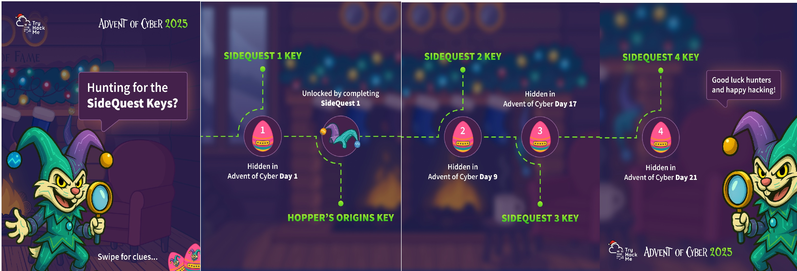

## Clue:

For those who consider themselves intermediate and want another challenge, check McSkidy’s hidden note in ``/home/mcskidy/Documents/`` to get access to the key for **Side Quest 1**! Accessible through our Side Quest Hub!

```
https://tryhackme.com/room/linuxcli-aoc2025-o1fpqkvxti
https://tryhackme.com/adventofcyber25/sidequest
```


Now we have the login credentials.

```
Access the user account:
username: eddi_knapp
password: S0mething1Sc0ming
```

Along with three clues to find the fragments required to build the passcode for decrypting the message.

```
1)
I ride with your session, not with your chest of files.
Open the little bag your shell carries when you arrive.

2)
The tree shows today; the rings remember yesterday.
Read the ledger’s older pages.

3)
When pixels sleep, their tails sometimes whisper plain words.
Listen to the tail.
```

## Part 1: Finding the Fragments

First, we switch to the user eddi_knapp using the following command.

```
su eddi_knapp
S0mething1Sc0ming
cd ~ && ls -la
```


**This is a riddle pointing to ``.bashrc``**

**“I ride with your session, not with your chest of files.”**

- ``.bashrc`` is tied to your shell session, not your personal documents or stored files.
- It loads when a shell session starts, not when you access your home directory contents.

**“Open the little bag your shell carries when you arrive.”**

- When Bash starts, it “carries” a small configuration file with it.
- That “little bag” is the ``.bashrc`` file, which contains environment variables, aliases, and startup commands.

```
cat .bashrc
```

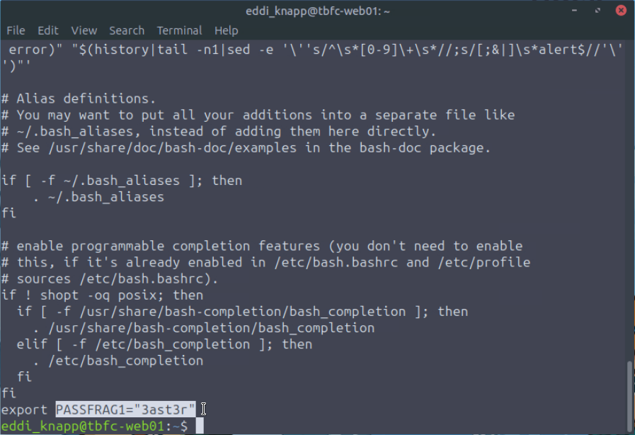

**This riddle points to ``.secret_git``**

**“The tree shows today; the rings remember yesterday.”**

- A tree represents the current working directory (what you see now).
- Rings in a tree record its past growth, just like Git history records past states of files.

**“Read the ledger’s older pages.”**

- A ledger is a record or log.
- Git is essentially a ledger of changes.
- “Older pages” clearly points to previous commits or history, not the latest version.

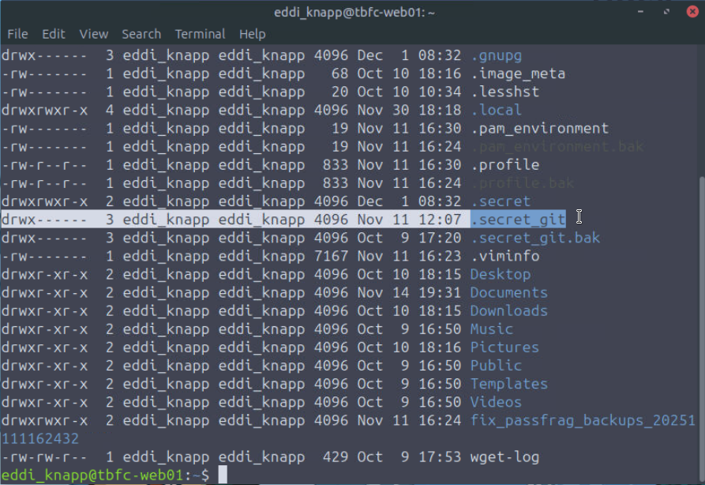

```
git log
```


```
git show d12875c8b62e089320880b9b7e41d6765818af3d
```

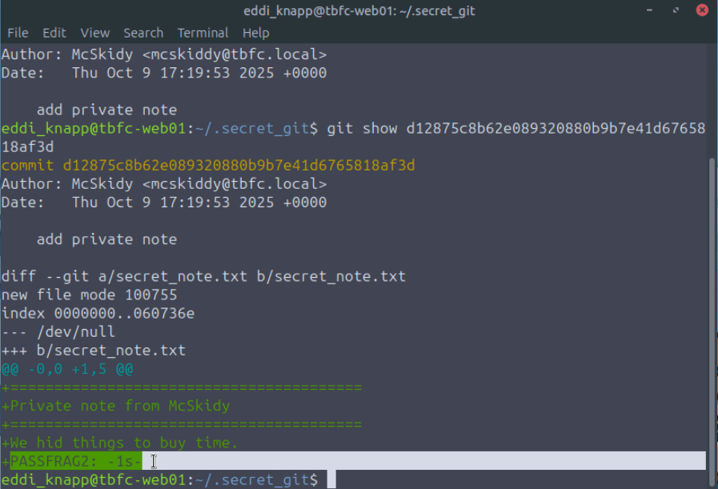

**This riddle points to the `Pictures` directory**

**“When pixels sleep, their tails sometimes whisper plain words.”**

- Pixels = images → photos, pictures.
- Sleep implies the image looks normal at first glance.
- Tails refers to the end of a file (EOF).

**“Listen to the tail.”**

- This suggests reading the end of files, not just viewing them.

```
cd /home/eddi_knapp/Pictures
ls -la
```


```
cat .easter_egg
```


Combining all the pieces leads to this.

```
3ast3r-1s-c0M1nG
```

---

## Part 2: Decode the Message

The ``/home/eddi_knapp/Documents`` directory contains two files: `mcskidy_note.txt.gpg` and `notes_on_photos.txt`.

Next, we decrypt `mcskidy_note.txt.gpg` using the following command:

```
cd /home/eddi_knapp/Documents
gpg --batch --yes --passphrase 3ast3r-1s-c0M1nG mcskidy_note.txt.gpg > mcskidy_note.txt
```


```
cat mcskidy_note.txt
```


---

## Part 3: Restore the Website

This text is currently displayed on the SOCMAS website. It has been hacked by the Bunny Gang, and we now need to restore it to its original state using McSkidy’s instructions.

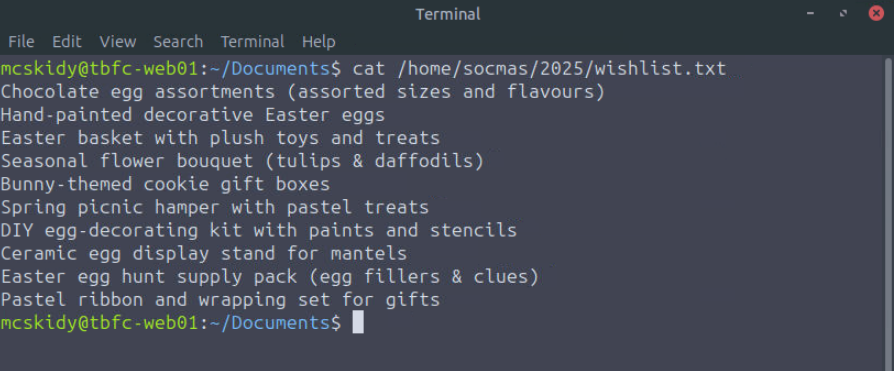


```
nano /home/socmas/2025/wishlist.txt

### replace with this text:
Hardware security keys (YubiKey or similar)
Commercial password manager subscriptions (team seats)
Endpoint detection & response (EDR) licenses
Secure remote access appliances (jump boxes)
Cloud workload scanning credits (container/image scanning)
Threat intelligence feed subscription
```


Refresh the page, and you’ll see the cipher text displayed below. 


Follow McSkidy’s instructions.
```
nano /tmp/websit_output.txt

### paste the cipher text
U2FsdGVkX1/7xkS74RBSFMhpR9Pv0PZrzOVsIzd38sUGzGsDJOB9FbybAWod5HMsa+WIr5HDprvK6aFNYuOGoZ60qI7axX5Qnn1E6D+BPknRgktrZTbMqfJ7wnwCExyU8ek1RxohYBehaDyUWxSNAkARJtjVJEAOA1kEOUOah11iaPGKxrKRV0kVQKpEVnuZMbf0gv1ih421QvmGucErFhnuX+xv63drOTkYy15s9BVCUfKmjMLniusI0tqs236zv4LGbgrcOfgir+P+gWHc2TVW4CYszVXlAZUg07JlLLx1jkF85TIMjQ3B91MQS+btaH2WGWFyakmqYltz6jB5DOSCA6AMQYsqLlx53ORLxy3FfJhZTl9iwlrgEZjJZjDoXBBMdlMCOjKUZfTbt3pnlHWEaGJD7NoTgywFsIw5cz7hkmAMxAIkNn/5hGd/S7mwVp9h6GmBUYDsgHWpRxvnjh0s5kVD8TYjLzVnvaNFS4FXrQCiVIcp1ETqicXRjE4T0MYdnFD8h7og3ZlAFixM3nYpUYgKnqi2o2zJg7fEZ8c=
```

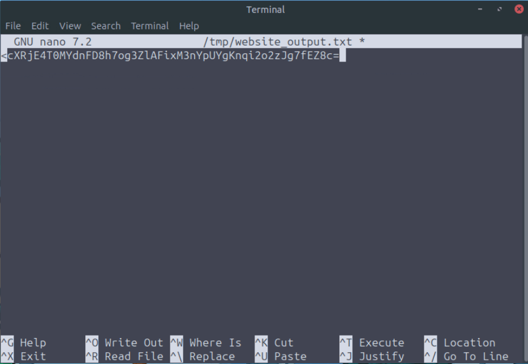

```
openssl enc -d -aes-256-cbc -pbkdf2 -iter 200000 -salt -base64 -in /tmp/website_output.txt -out /tmp/decoded_message.txt -pass pass:'91J6X7R4FQ9TQPM9JX2Q9X2Z'
```


```
cat /tmp/decoded_message.txt
```

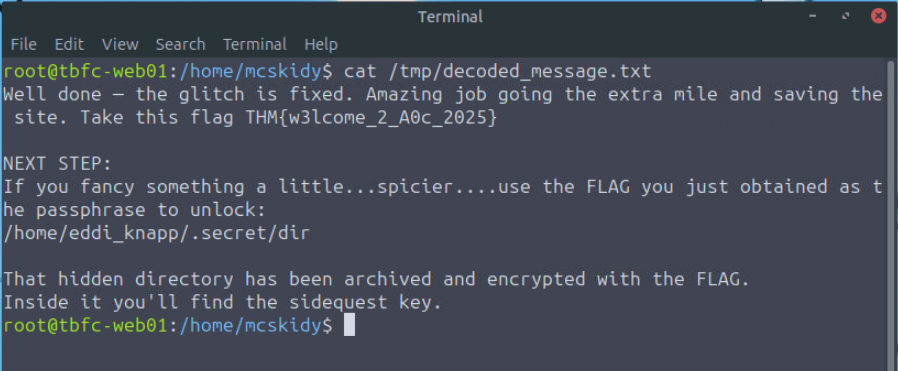

---

## Part 4: Get the Key

```
cd /home/eddi_knapp/.secret
gpg --batch --yes --passphrase THM{w3lcome_2_A0c_2025} dir.tar.gz.gpg > dir.tar.gz
```


```
tar -xzf dir.tar.gz
cd dir/
```

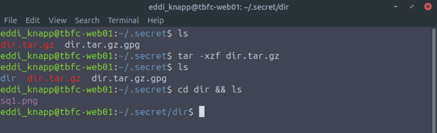

You can view the image on the machine in several ways. Be sure you are running as root.
```
eom /home/eddi_knapp/.secret/dir/sq1.png
libreoffice --draw /home/eddi_knapp/.secret/dir/sq1.png
display /home/eddi_knapp/.secret/dir/sq1.png
```

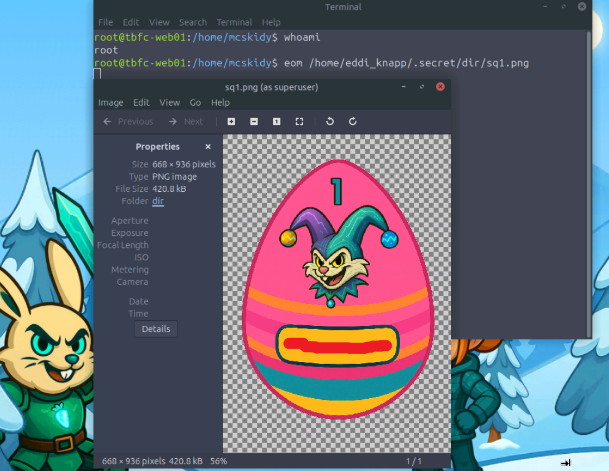

**The key for Side Quest 1**
```
now_you_see_me
```

---

## Part 5: Access the Side Quest

```
https://tryhackme.com/adventofcyber25/story
```

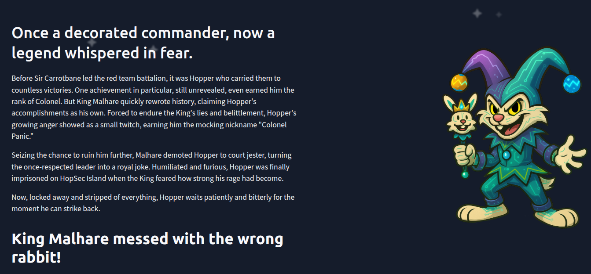

```
https://tryhackme.com/adventofcyber25/sidequest
```

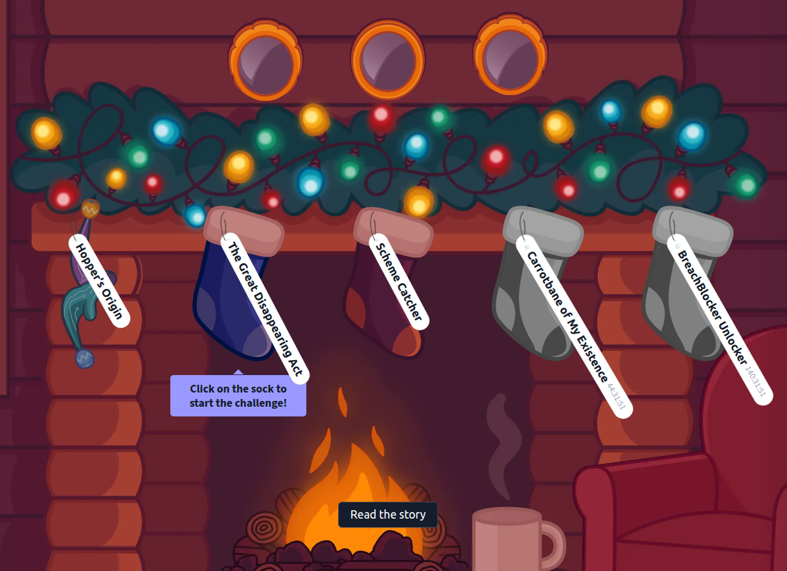

When you click on Hopper's Origin, a box will appear. If you enter the key, a message saying “invalid” may show up. Don’t worry—this happens to everyone.

```
https://static-labs.tryhackme.cloud/apps/hoppers-invitation/
```


When you start the machine in The Great Disappearing Act, it will prompt you for a key.

```
https://tryhackme.com/room/sq1-aoc2025-FzPnrt2SAu
```

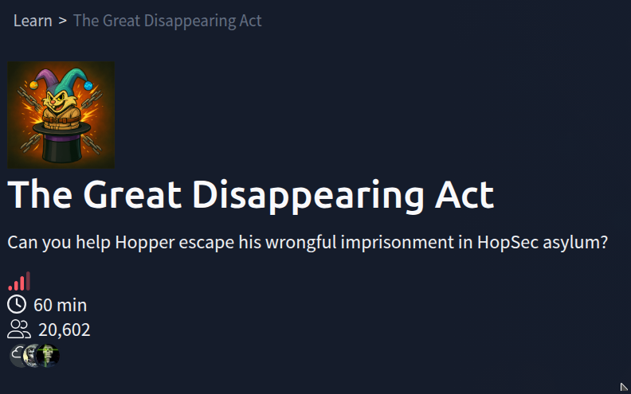


