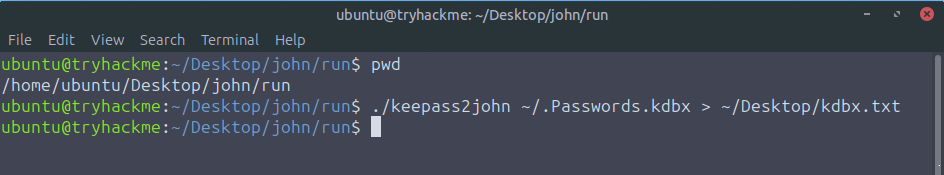
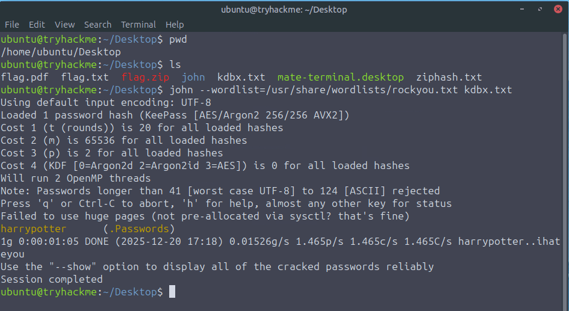
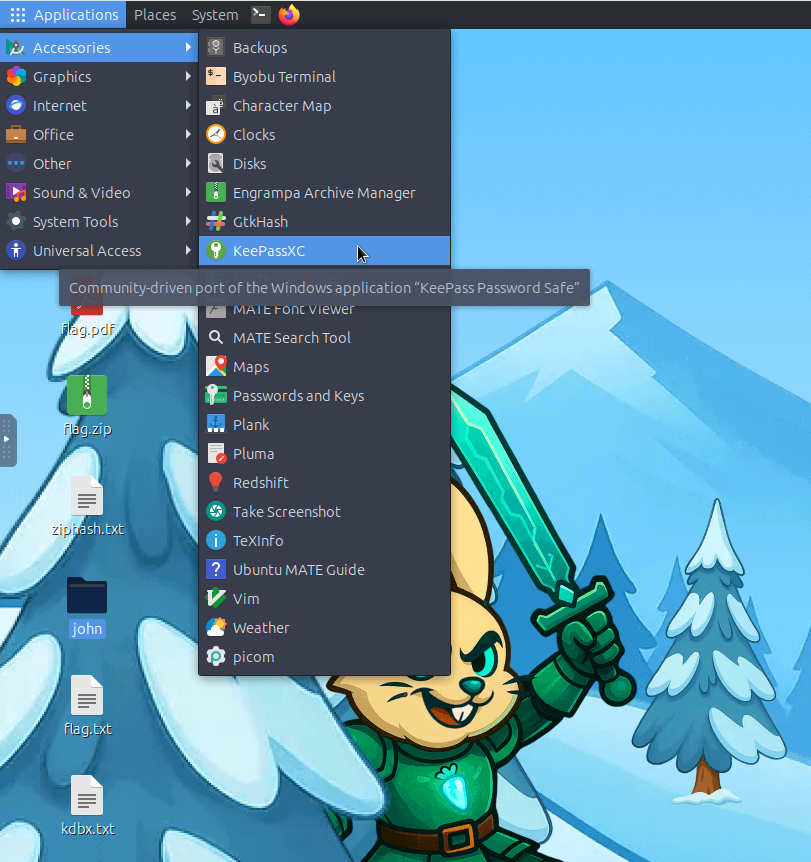
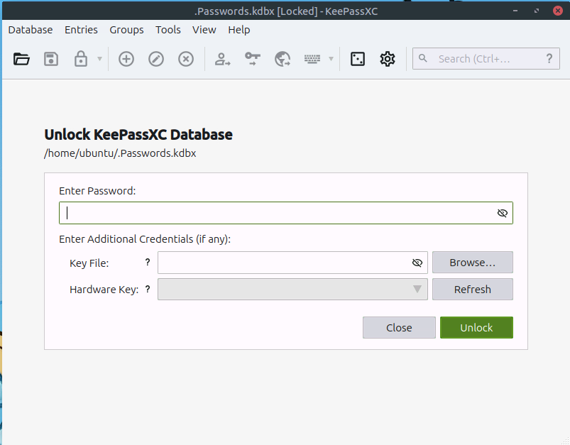
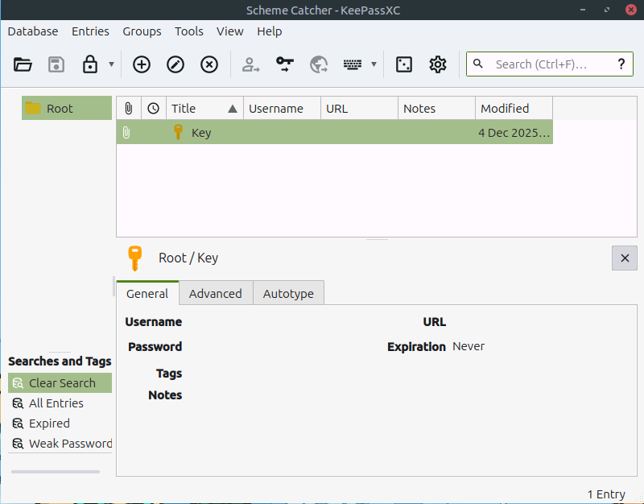
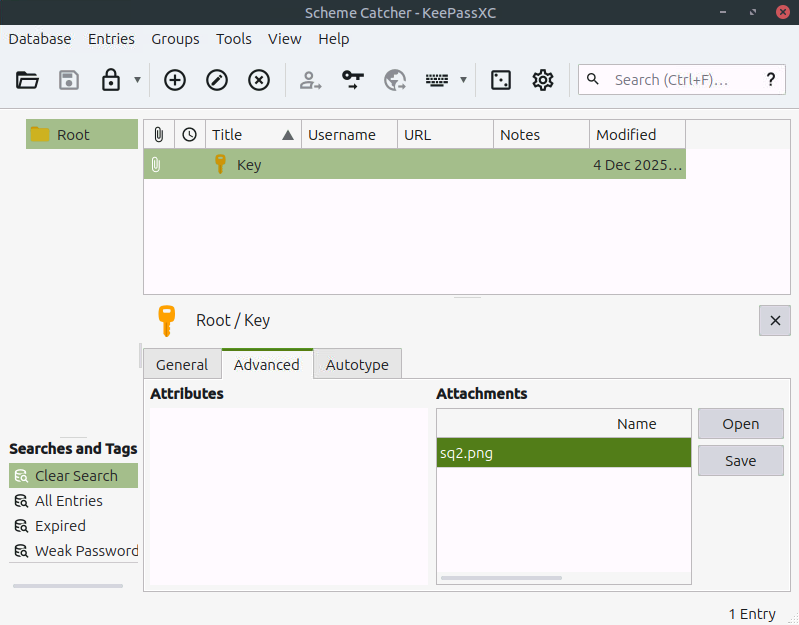
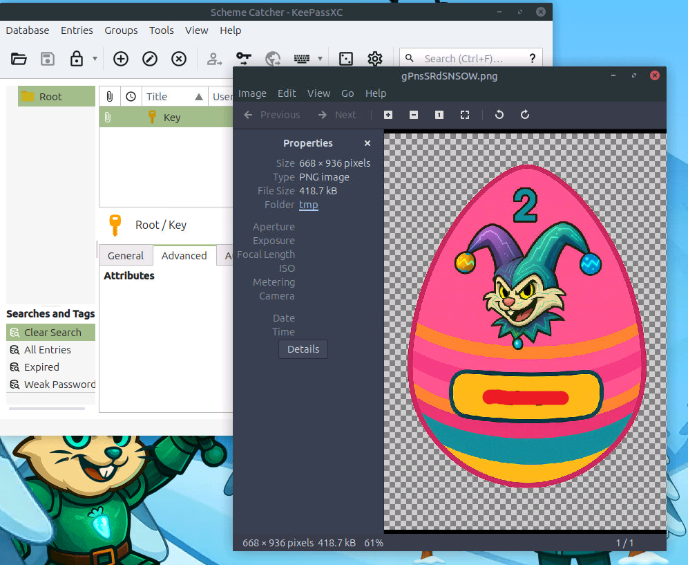

# Side Quest 2 Key 🔑


## Clue:

For those who want another challenge, have a look around the VM to get access to the key for **Side Quest 2**! Accessible through our Side Quest Hub!

```
https://tryhackme.com/room/attacks-on-ecrypted-files-aoc2025-asdfghj123
https://tryhackme.com/adventofcyber25/sidequest
```

When I looked at the VM on day 9, I came across an interesting file, ``.Passwords.kdbx``.


### What does the .kdbx file do?

A **KDBX** file is a password database created by KeePass Password Safe, which securely stores encrypted passwords and login credentials. It can only be accessed using a master password set by the user.

---

Next, we use **keepass2john** to extract the password hash and save it to the desktop for cracking.

```
cd /home/ubuntu/Desktop/john/run
./keepass2john ~/.Passwords.kdbx > ~/Desktop/kdbx.txt
```



```
john --wordlist=/usr/share/wordlists/rockyou.txt kdbx.txt
```



Go to the Applications menu and find the KeePassXC application.



After opening the application, input the password.



After that, head to the Advanced tab.



In the Advanced tab, you should see `sq2.png`, which is what we're looking for.



Just open the file, and we’ll get the key.




