# Side Quest 3 Key 🔑


```
https://tryhackme.com/room/encoding-decoding-aoc2025-s1a4z7x0c3
https://tryhackme.com/adventofcyber25/sidequest
```

## Clue:

Looking for the key to **Side Quest 3**? Hopper has left us this cyberchef link as a lead. See if you can recover the key and access the corresponding challenge in our Side Quest Hub!

```
https://gchq.github.io/CyberChef/#recipe=To_Base64('A-Za-z0-9%2B/%3D')Label('encoder1')ROT13(true,true,false,7)Split('H0','H0%5C%5Cn')Jump('encoder1',8)Fork('%5C%5Cn','%5C%5Cn',false)Zlib_Deflate('Dynamic%20Huffman%20Coding')XOR(%7B'option':'UTF8','string':'h0pp3r'%7D,'Standard',false)To_Base32('A-Z2-7%3D')Merge(true)Generate_Image('Greyscale',1,512)&input=SG9wcGVyIG1hbmFnZWQgdG8gdXNlIEN5YmVyQ2hlZiB0byBzY3JhbWJsZSB0aGUgZWFzdGVyIGVnZyBrZXkgaW1hZ2UuIEhlIHVzZWQgdGhpcyB2ZXJ5IHJlY2lwZSB0byBkbyBpdC4gVGhlIHNjcmFtYmxlZCB2ZXJzaW9uIG9mIHRoZSBlZ2cgY2FuIGJlIGRvd25sb2FkZWQgZnJvbTogCgpodHRwczovL3RyeWhhY2ttZS1pbWFnZXMuczMuYW1hem9uYXdzLmNvbS91c2VyLXVwbG9hZHMvNWVkNTk2MWM2Mjc2ZGY1Njg4OTFjM2VhL3Jvb20tY29udGVudC81ZWQ1OTYxYzYyNzZkZjU2ODg5MWMzZWEtMTc2NTk1NTA3NTkyMC5wbmcKClJldmVyc2UgdGhlIGFsZ29yaXRobSB0byBnZXQgaXQgYmFjayE
```

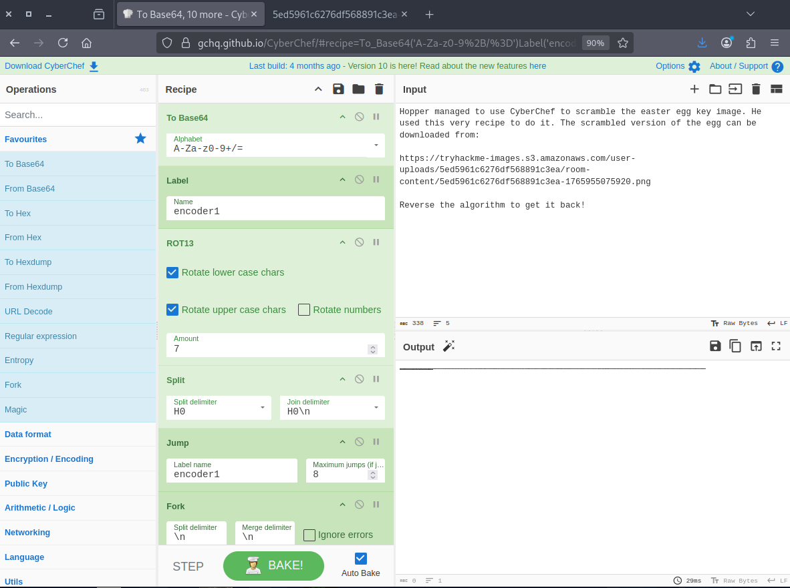

Follow the link in the note. It leads to a grayscale image with a width of 512 pixels.

```
https://tryhackme-images.s3.amazonaws.com/user-uploads/5ed5961c6276df568891c3ea/room-content/5ed5961c6276df568891c3ea-1765955075920.png
```


The next step is to test the recipe using a random image, which also produces a similar image.

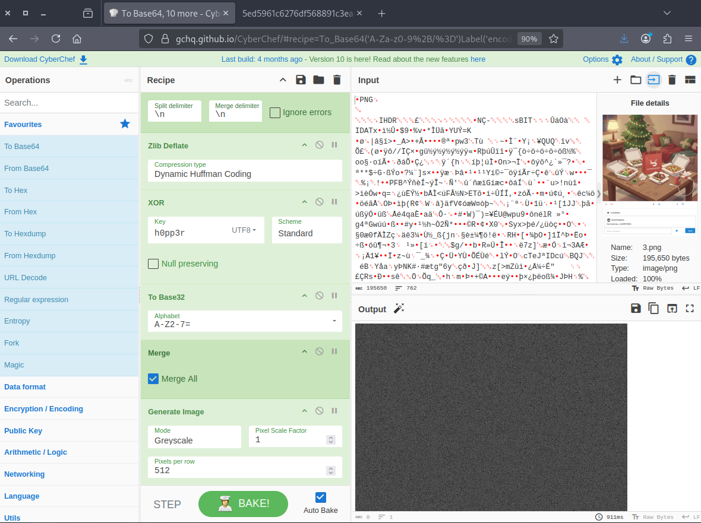


## Part 1: from Greyscale Image to Base32

Disabling **Generate Image** will display **Base32 data** with a `CCW` pattern until a newline, after which it will restart with `CCW`, no matter what image you upload.

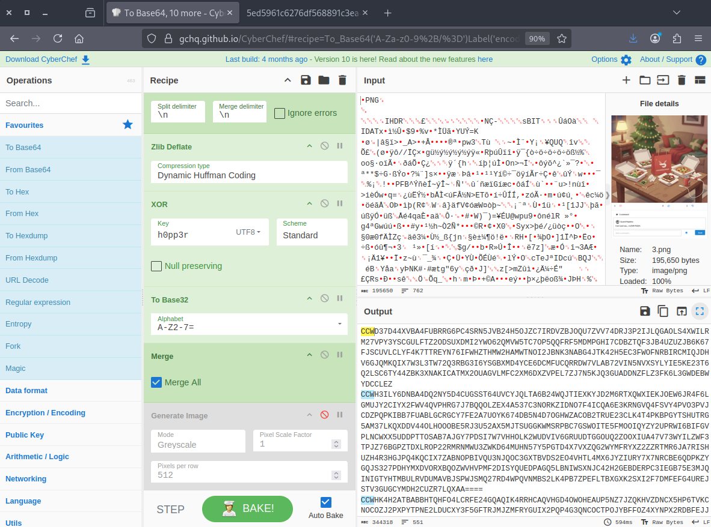

I tried reversing the original image using **CyberChef** but encountered an issue, getting `GAY` instead of `CCW`. This is likely due to the default pixel scale factor being set to `8`, whereas it should be `1`, with the image having a width of `512 pixels`.

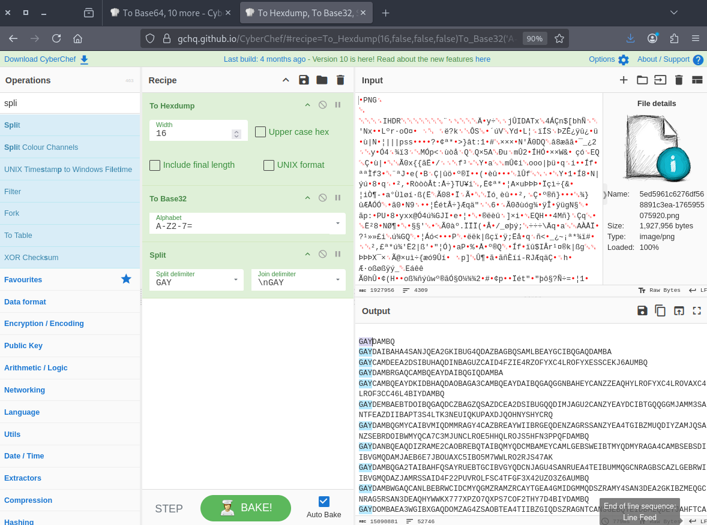

I asked **ChatGPT** to create a Python script that would perform the operation.

```
import sys
from PIL import Image

EXPECTED_WIDTH = 512

def grayscale_to_base32_text(image_path):
    # STEP 1: Load grayscale image
    img = Image.open(image_path).convert("L")
    width, height = img.size

    if width != EXPECTED_WIDTH:
        raise ValueError(f"Image width must be {EXPECTED_WIDTH}px, got {width}px")

    # STEP 2: Extract pixel data
    pixel_data = list(img.getdata())

    # Remove padding zeros that were added during encoding
    pixel_data = [p for p in pixel_data if p != 0]

    # STEP 3: Convert pixel values back to Base32 bytes
    base32_bytes = bytes(pixel_data)

    # Save Base32 data to text file
    output_path = "base32.txt"
    with open(output_path, "wb") as f:
        f.write(base32_bytes)

    print("Process complete:")
    print(f"- Image size: {width}x{height}")
    print(f"- Base32 data length: {len(base32_bytes)} bytes")
    print(f"- Saved as: {output_path}")

if __name__ == "__main__":
    if len(sys.argv) != 2:
        print("Usage: python3 script.py <grayscaleimage.png>")
        sys.exit(1)

    grayscale_to_base32_text(sys.argv[1])


```

We ran the script, and it gave us the output in a file called `base32.txt`.

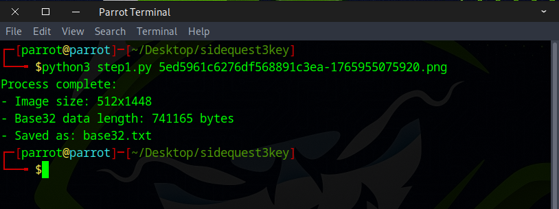

The data shows the `CCW` pattern, confirming that we're heading in the right direction.

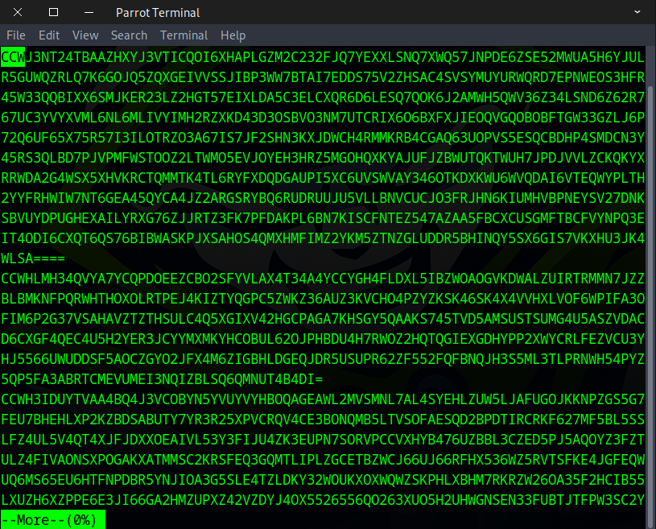

---

## Part 2: XOR, Zlib Inflate 

We went back to the sample image, **disabled** up to the zlib Deflate step, and saw base64 data with a newline pattern.

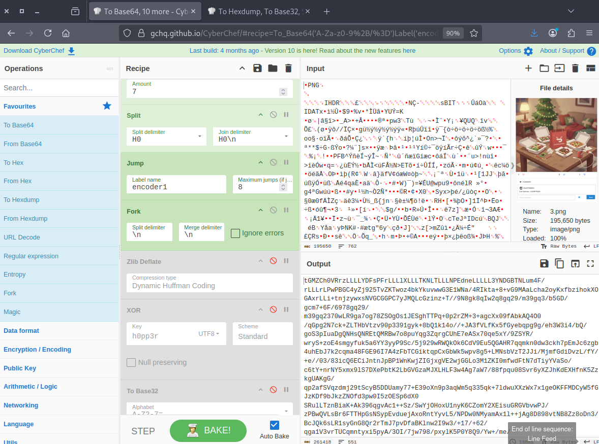

Once again, I tried to reverse it in **CyberChef**, but it failed. The reason is that the process involves zlib deflate followed by XORing the base64 data chunk by chunk, while the reverse process in **CyberChef** handles everything at once.


I asked **ChatGPT** a bunch of times to write a different Python script, but it kept failing. Finally, there’s a little bit of hope. The image has the same size as the other side quest images, and there’s a bit of pink at the top, like the top of an egg, but a lot of data is still missing.

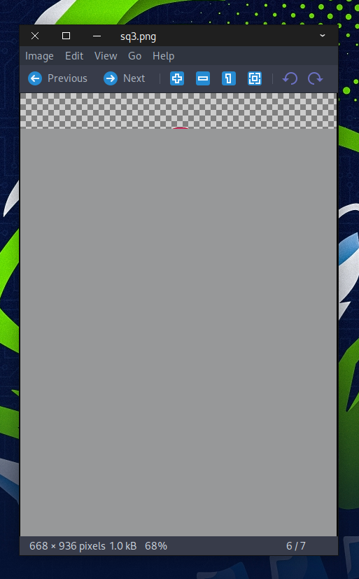

After many hours of manually debugging the code, I finally understood the reason behind the issue.

```
#!/usr/bin/env python3

import base64
import sys
import zlib

def xor_bytes(data: bytes, key: bytes) -> bytes:
    """XOR each byte of data with the key, repeating the key as needed."""
    key_len = len(key)
    return bytes([b ^ key[i % key_len] for i, b in enumerate(data)])

def pad_base32_line(line: str) -> str:
    """Pad a Base32 line to a multiple of 8 characters with '='."""
    line = line.strip()
    if not line:
        return line
    remainder = len(line) % 8
    if remainder != 0:
        line += '=' * (8 - remainder)
    return line


with open("base64.txt", "wb") as f:
    f.write(b'\x00')

def main():
    if len(sys.argv) != 2:
        print("Usage: python3 convert_base32.py base32.txt")
        sys.exit(1)

    input_file = sys.argv[1]

    # Read Base32 data line by line
    with open(input_file, "r") as f:
        lines = f.readlines()

    decoded_bytes = b''

    # Decode each line separately, preserving spaces/newlines
    for line in lines:
        line = line.rstrip('\n')
        if not line.strip():
            continue  # skip empty lines
        padded_line = pad_base32_line(line)
        try:
            decoded_line = base64.b32decode(padded_line, casefold=True)
        except Exception as e:
            print(f"Base32 decode failed on line: {line}")
            print("Error:", e)
            sys.exit(1)
        decoded_bytes = decoded_line
        
        # XOR with key
        key = b"h0pp3r"
        xored_bytes = xor_bytes(decoded_bytes, key)

        # zlib inflate
        try:
            inflated_bytes = zlib.decompress(xored_bytes)
            #print(inflated_bytes)
            with open("base64.txt", "ab") as f:
                f.write(inflated_bytes)

        except Exception as e:
            print("zlib decompression failed:", e)
            sys.exit(1)

    print("Success! Saved decompressed output to 'base64.txt'")


if __name__ == "__main__":
    main()


```

We ran the script, and it gave us a `base64.txt` file.


When we checked the file, the data looked pretty similar to the sample image, so that’s a good sign.

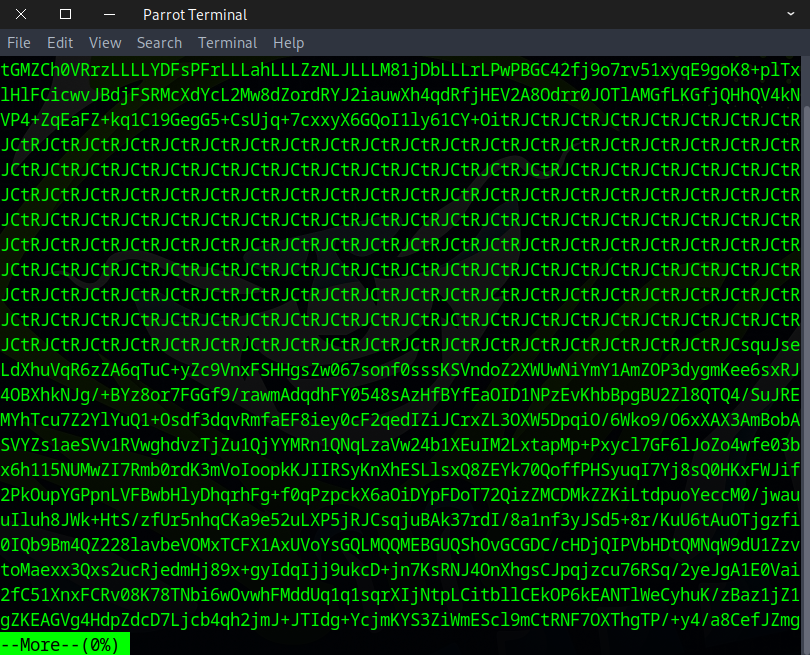

## Part 3: Jump, Split, ROT13, Base64

This step is way easier than the last two and is pretty straightforward. Just use the recipe below.

```
### Recipe
https://gchq.github.io/CyberChef/#recipe=Label('encoder1')Split('H0%5C%5Cn','H0')ROT13(true,true,false,-7)Jump('encoder1',8)From_Base64('A-Za-z0-9%2B/%3D',true,false)Render_Image('Raw')&oeol=CR
```

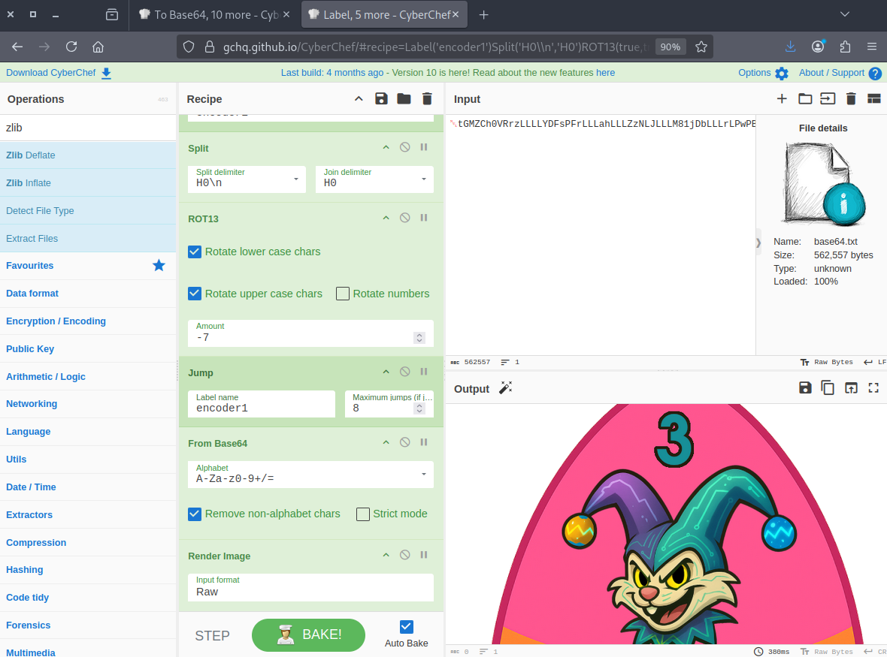

You can maximise it, download it, or just scroll to see the key.

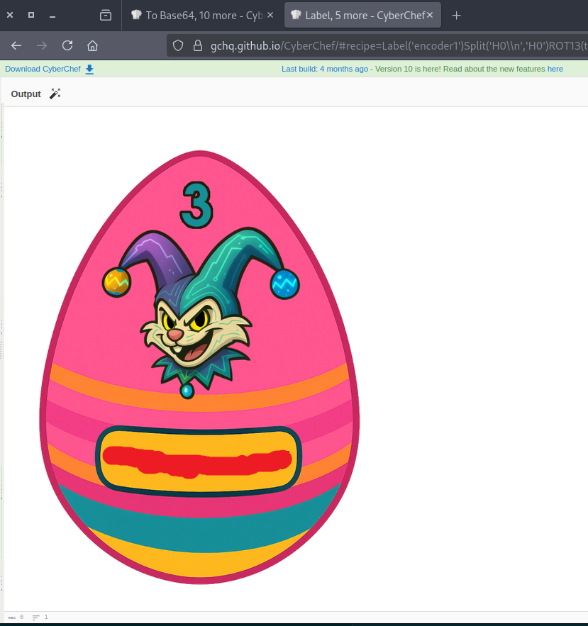


