# Side Quest 4 Key 🔑


```
https://tryhackme.com/room/htapowershell-aoc2025-p2l5k8j1h4
https://tryhackme.com/adventofcyber25/sidequest
```

## Clue:

For those who want another challenge, download the HTA file from here to get the key for **Side Quest 4**, accessible through our Side Quest Hub. The password for the file is ``CanYouREM3?``.

```
https://assets.tryhackme.com/additional/aoc2025/SQ4/NorthPole.zip
```

---

After extracting `NorthPole.zip`, we obtained an ``.hta`` file.

```
file:
NorthPole.zip
Pass:
CanYouREM3?

NorthPolePerformanceReview.hta
```

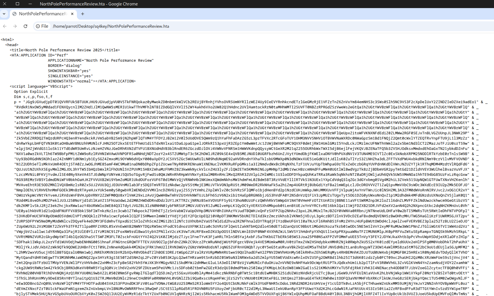

Upload the file to `CyberChef`, then remove the sections that are not Base64. 


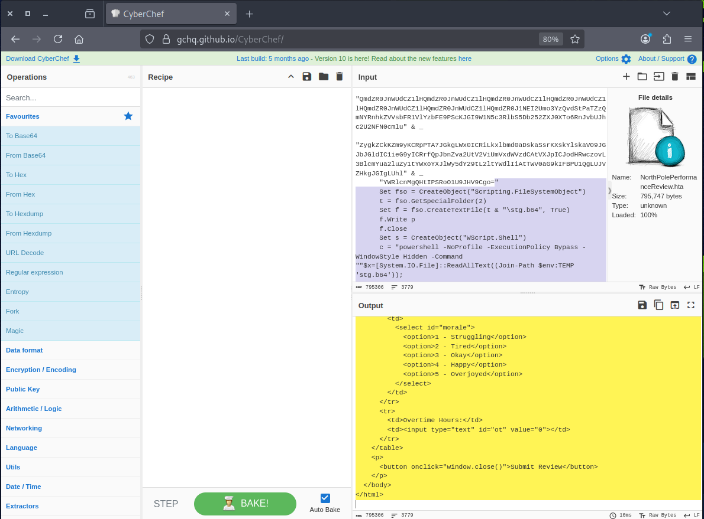

Use this recipe to remove the symbols and merge the Base64 data, then save the output as `base64.txt`.

```
https://gchq.github.io/CyberChef/#recipe=Find_/_Replace(%7B'option':'Regex','string':'%22%5C%5Cs*%26%5C%5Cs*_%5C%5Cs*%5C%5Cr?%5C%5Cn%5C%5Cs*%22'%7D,'',true,false,true,false)
```

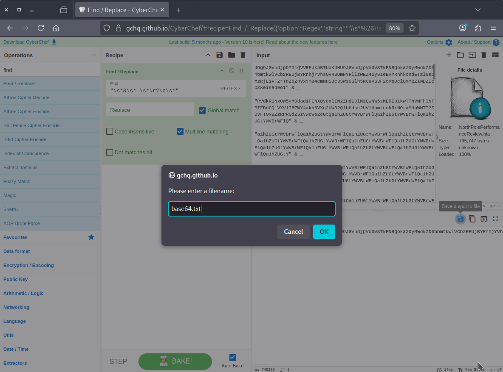

Apply this recipe to decode `base64.txt` and save the result as `text1.txt`.

```
https://gchq.github.io/CyberChef/#recipe=From_Base64('A-Za-z0-9%2B/%3D',true,false)
```

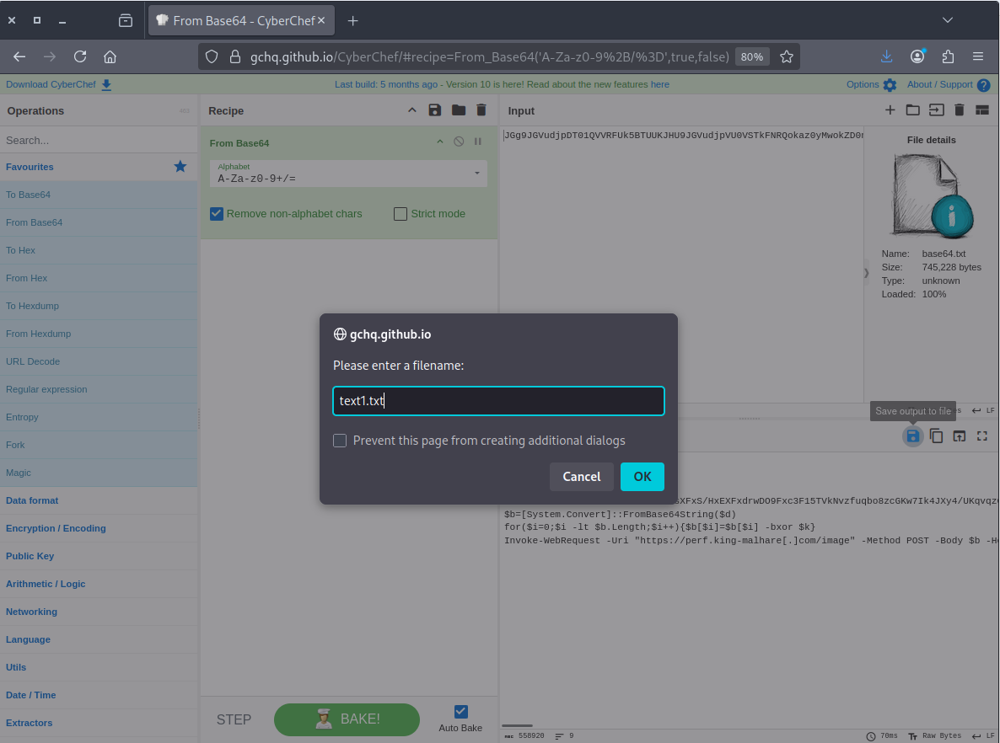

It seems that the content of `text1.txt` contains another layer of Base64-encoded data.

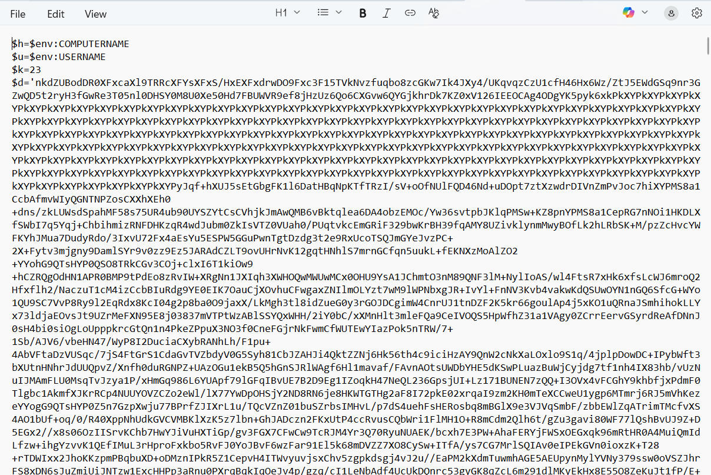

Manually remove the non-Base64 data from `text1.txt`.

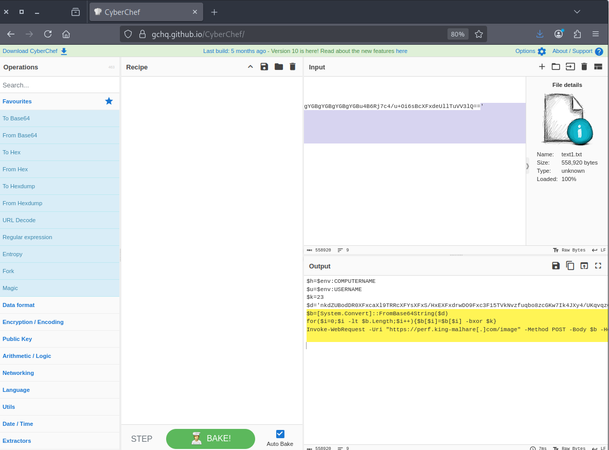
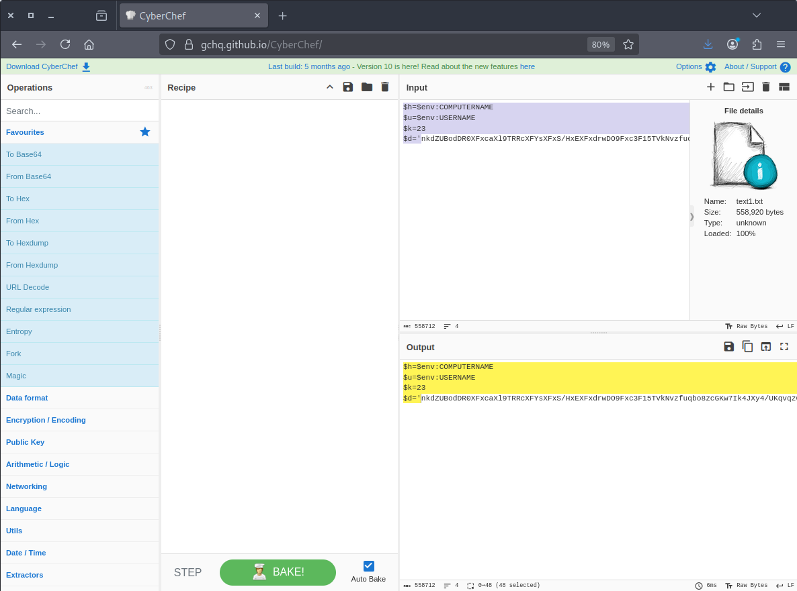

save the output as `text2.txt`.

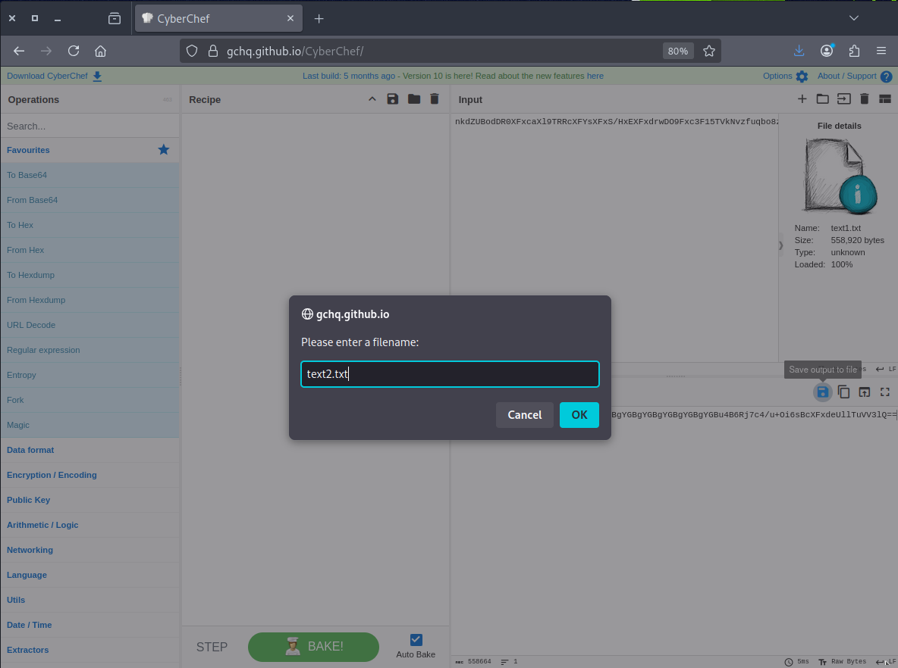

After applying this recipe to `text2.txt`, you should see some suggestions recipe for decode the data.

```
https://gchq.github.io/CyberChef/#recipe=From_Base64('A-Za-z0-9%2B/%3D',true,false)Magic(3,true,false,'')&oeol=FF 

```

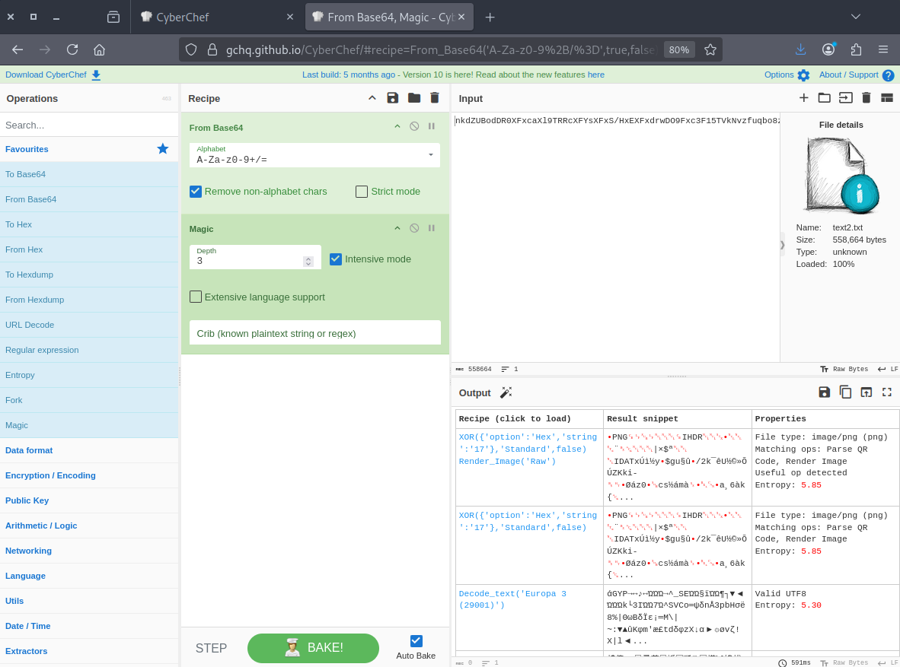

Using the suggested recipe, we obtained the following result.

```
### without render image
https://gchq.github.io/CyberChef/#recipe=From_Base64('A-Za-z0-9%2B/%3D',true,false)XOR(%7B'option':'Hex','string':'17'%7D,'Standard',false)&oeol=CR
### with render image
https://gchq.github.io/CyberChef/#recipe=From_Base64('A-Za-z0-9%2B/%3D',true,false)XOR(%7B'option':'Hex','string':'17'%7D,'Standard',false)Render_Image('Raw')
```

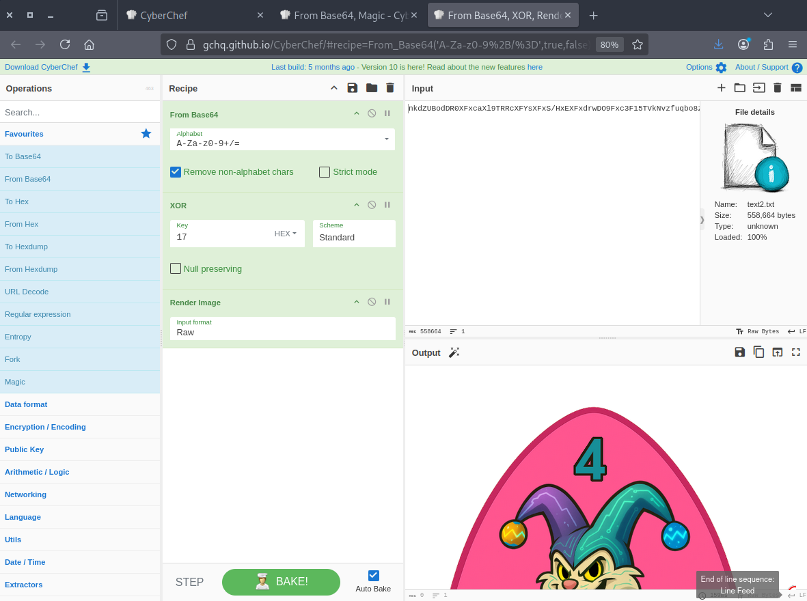

By maximizing the output, we revealed the key.

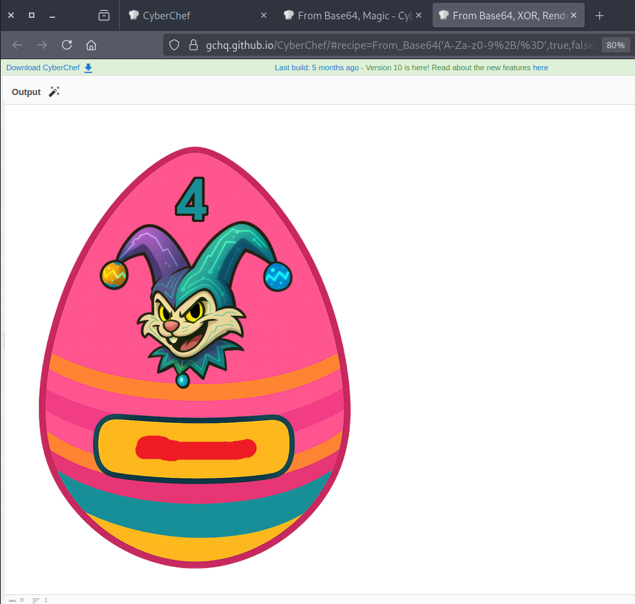


