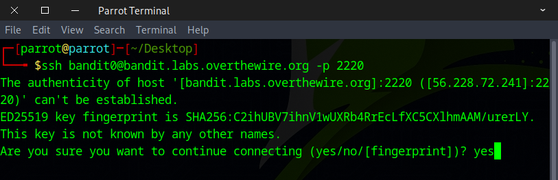
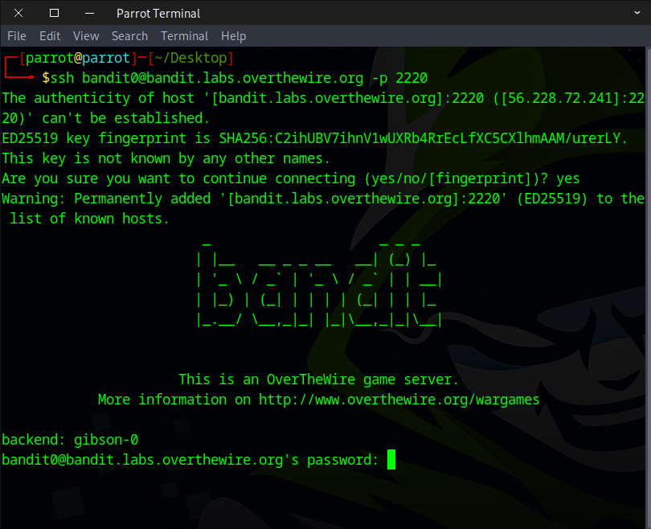
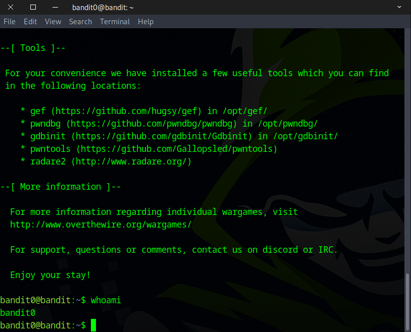

# Bandit Intro

## Level Goal

The goal of this level is for you to log into the game using SSH. The host to which you need to connect is **bandit.labs.overthewire.org**, on port **2220**. The username is **bandit0** and the password is **bandit0**. Once logged in, go to the Level 1 page to find out how to beat Level 1.

### Commands you may need to solve this level

    ssh

### Helpful Reading Material

    Secure Shell (SSH) on Wikipedia
    How to use SSH with a non-standard port on It’s FOSS
    How to use SSH with ssh-keys on wikiHow

### 🔑 Solution

    Info
    Host: bandit.labs.overthewire.org
    Port: 2220
    User: bandit0
    Pass: bandit0

```bash
ssh bandit0@bandit.labs.overthewire.org -p 2220
```
You'll see a prompt asking "Are you sure you want to continue connecting?" — type **yes** and hit **Enter** to proceed.
  

Then the prompt will ask for a password. Type **bandit0** and press **Enter**.
Don’t worry if nothing appears as you type — this is normal behavior on Linux. It works differently from Windows, and the input is hidden for security reasons.


#### ⌨️helpful shortcut:
    Ctrl + C    Copy
    Ctrl + V    Paste
    Ctrl + Shift + C    Copy on Terminal
    Ctrl + Shift + V    Paste on Terminal


If you’re seeing this message, that means your first SSH login was successful — well done!👏🎉🎊



