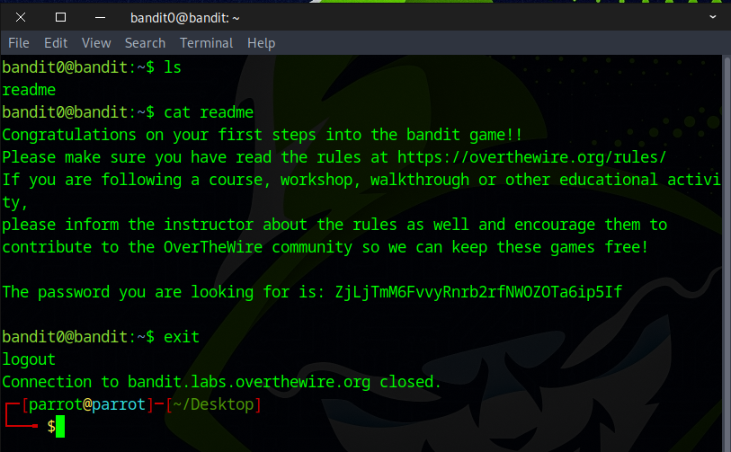

# Bandit Level 0 → Level 1

## Level Goal

The password for the next level is stored in a file called readme located in the home directory. Use this password to log into bandit1 using SSH. Whenever you find a password for a level, use SSH (on port 2220) to log into that level and continue the game.

## Commands you may need to solve this level

    ls , cd , cat , file , du , find

**TIP**: Create a file for notes and passwords on your local machine!

Passwords for levels are not saved automatically. If you do not save them yourself, you will need to start over from bandit0.

Passwords also occasionally change. It is recommended to take notes on how to solve each challenge. As levels get more challenging, detailed notes are useful to return to where you left off, reference for later problems, or help others after you’ve completed the challenge.

### 🔑 Solution

```bash
ssh bandit0@bandit.labs.overthewire.org -p 2220
```
Type **bandit0** as the password and press **Enter**.

Next, use the command **ls** to view the list of files. You’ll see one called **readme** — that’s the one you need!
```
ls
```

Now type **cat readme** to read the file. 🎉 Congrats — you’ve just captured your first flag!
```
cat readme
```



🎯 Got the flag? Great!
Be sure to **save it in a text file** on your desktop — you’ll need it for the next room.
When you're done, type **exit** to close the connection and get ready for the next challenge.


