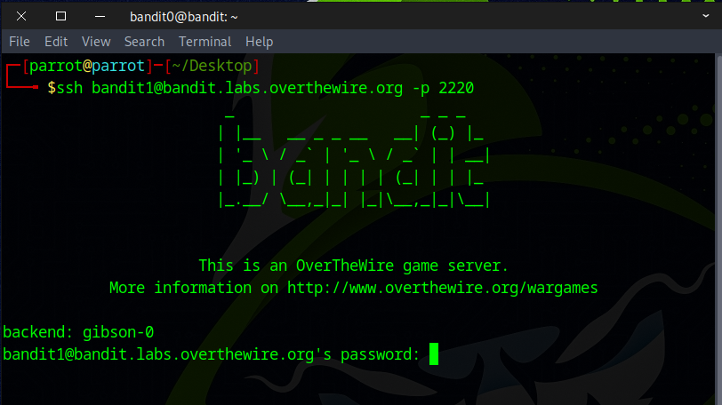
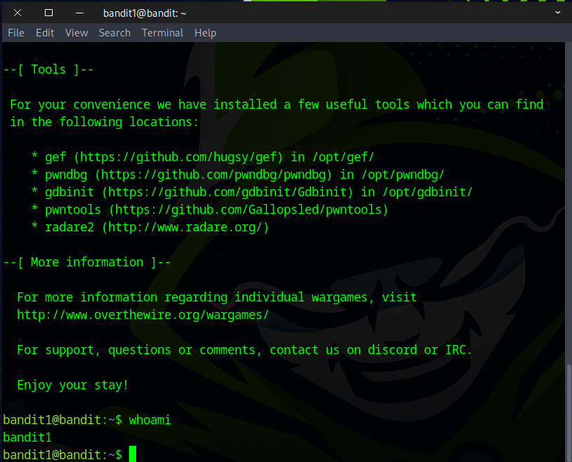
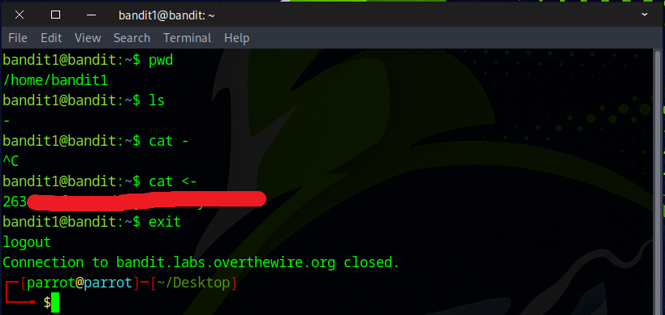

# Bandit Level 1 → Level 2

## Level Goal

The password for the next level is stored in a file called - located in the home directory

## Commands you may need to solve this level

    ls , cd , cat , file , du , find

## Helpful Reading Material

    Google Search for “dashed filename”
    Advanced Bash-scripting Guide - Chapter 3 - Special Characters

### 🔑 Solution

#### ⌨️helpful shortcut:
    Ctrl + C    Copy
    Ctrl + V    Paste
    Ctrl + Shift + C    Copy on Terminal
    Ctrl + Shift + V    Paste on Terminal

```bash
ssh bandit1@bandit.labs.overthewire.org -p 2220
```
Then, enter the **password** (flag) you captured from the previous challenge to log in.


Once you're logged in, you can confirm your current user by typing the command **whoami**.
The result should display: **bandit1**.


Next, you can use the **clear** command to clean up your terminal screen.
Then, type **pwd** to print your current working directory.
Use **ls** to list all the files — you should see a file named -.
To view its contents, use the command:
```
cat <-
```


The file is named -, which can confuse the terminal because - is usually interpreted as an option flag.
< – this is input redirection in the shell. It tells the shell:
“Take input for this command from the file that follows.”

###### 📝 Alternative Way to View a File Named -
```
cat ./-
or
cat -- -
```
./- specifies the exact path to the file, avoiding confusion with options or stdin.

-- is a common Unix/Linux convention used to prevent commands from misinterpreting filenames that start with dashes.

🎉 Nice job — you found the flag! Don’t forget to save it for the next challenge.


