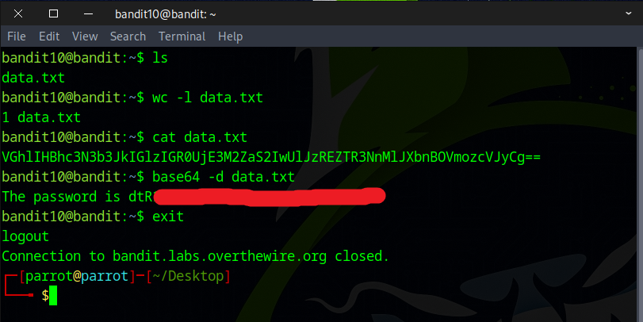

# Bandit Level 10 → Level 11

## Level Goal

The password for the next level is stored in the file data.txt, which contains base64 encoded data

## Commands you may need to solve this level

    grep, sort, uniq, strings, base64, tr, tar, gzip, bzip2, xxd

## Helpful Reading Material

    Base64 on Wikipedia


### 🔑 Solution

```
ssh bandit10@bandit.labs.overthewire.org -p 2220
```
Then pop in the password you found in the previous challenge.

Start by using the `ls` command to list the files. Then, use the `cat` command to display the contents of the file. You'll notice the line of text is encoded in Base64. To decode it, run the following command:
```
base64 -d data.txt
```


Another easy way to decode this is with an online tool like CyberChef.  

CyberChef is a free, web-based tool created by GCHQ (a UK intelligence agency) that helps you analyze, decode, encode, and transform data — kind of like a digital Swiss Army knife for data and text. https://gchq.github.io/CyberChef/  


You’ve got the flag — on to the next challenge!

