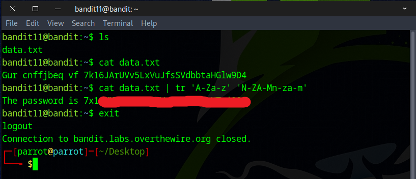
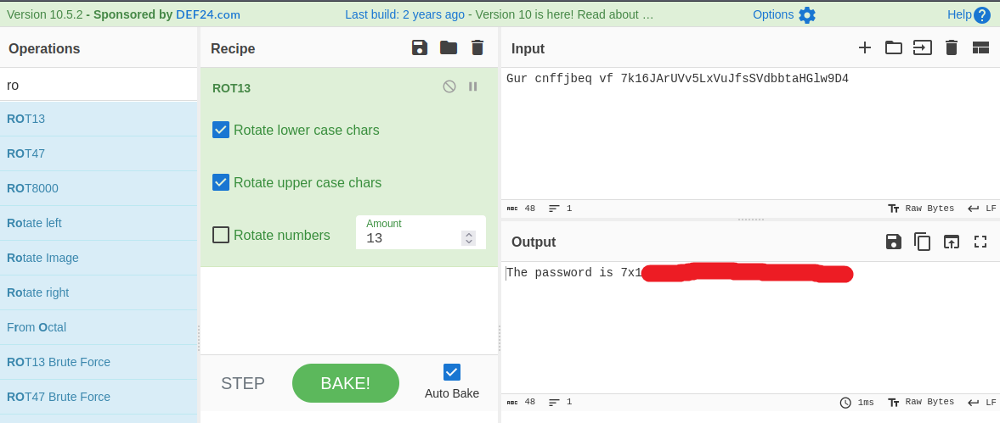

# Bandit Level 11 → Level 12

## Level Goal

The password for the next level is stored in the file data.txt, where all lowercase (a-z) and uppercase (A-Z) letters have been rotated by 13 positions

## Commands you may need to solve this level

    grep, sort, uniq, strings, base64, tr, tar, gzip, bzip2, xxd

## Helpful Reading Material

    Rot13 on Wikipedia

### 🔑 Solution

```
ssh bandid11@bandit.labs.overthewire.org -p 2220
```
Then enter the password obtained from the previous challenge.

After using the `ls` and `cat` commands to examine the data, we determined from the instructions that it is a ciphertext encoded with a **ROT13** cipher.

**ROT13** (Rotate by 13) is a type of Caesar cipher, which is a substitution cipher where each letter in the alphabet is replaced by another letter a fixed number of positions away.

The following command can be used to decode the cipher.
```
cat data.txt | tr 'A-Za-z' 'N-ZA-Mn-za-m'
```
`tr` stands for translate. It replaces characters in the input.  
``'A-Za-z'`` means: all uppercase A to Z and lowercase a to z.  
``'N-ZA-Mn-za-m'`` means: shift each letter 13 places (ROT13 logic). A–M → N–Z, N–Z → A–M, Same for lowercase



Alternatively, the cipher can be decoded manually using a table.

| #  | Plain | ROT13 |   | Plain | ROT13 |
| -- | ----- | ----- | - | ----- | ----- |
| 1  | A     | N     |   | N     | A     |
| 2  | B     | O     |   | O     | B     |
| 3  | C     | P     |   | P     | C     |
| 4  | D     | Q     |   | Q     | D     |
| 5  | E     | R     |   | R     | E     |
| 6  | F     | S     |   | S     | F     |
| 7  | G     | T     |   | T     | G     |
| 8  | H     | U     |   | U     | H     |
| 9  | I     | V     |   | V     | I     |
| 10 | J     | W     |   | W     | J     |
| 11 | K     | X     |   | X     | K     |
| 12 | L     | Y     |   | Y     | L     |
| 13 | M     | Z     |   | Z     | M     |

There’s also a web-based tool called **CyberChef** that can help with deciphering this.




Congratulations! You’ve found the flag for the next challenge.
