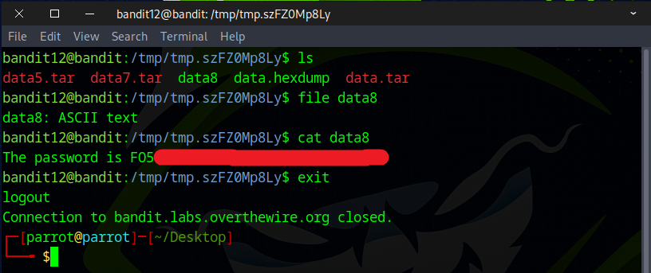

# Bandit Level 12 → Level 13

## Level Goal

The password for the next level is stored in the file data.txt, which is a hexdump of a file that has been repeatedly compressed. For this level it may be useful to create a directory under /tmp in which you can work. Use mkdir with a hard to guess directory name. Or better, use the command “mktemp -d”. Then copy the datafile using cp, and rename it using mv (read the manpages!)

## Commands you may need to solve this level

    grep, sort, uniq, strings, base64, tr, tar, gzip, bzip2, xxd, mkdir, cp, mv, file

## Helpful Reading Material

    Hex dump on Wikipedia


### 🔑 Solution

```
ssh bandid12@bandit.labs.overthewire.org -p 2220
```
Next, input the password you retrieved in the previous challenge.

According to the instructions, we first need to create a directory inside the ``/tmp`` directory using either the `mkdir` or `mktemp -d` command.
The next step is to copy the data file to that directory.

You can accomplish this with the following command.
```
mkdir /tmp/folder123
cd /tmp/folder123
cp ~/data.txt .
```


Alternatively, consider using the command below
```
cd /tmp
mktemp -d
cd /tmp/tmp.ek44rvikoc
cp ~/data.txt .
```


You can also use the following command instead
```
cd /tmp
hard_to_guess=$(mktemp -d)
cd $hard_to_guess
cp ~/data.txt .
```


### 💡Here’s a set of helpful Linux commands to work with compressed files—ideal for this challenge.
| Format        | Extension        | How to Compress                      | How to Decompress                                   |
| ------------- | ---------------- | ------------------------------------ | --------------------------------------------------- |
| Gzip          | .gz              | `gzip file.txt`                      | `gunzip file.txt.gz` or `gzip -d file.txt.gz`       |
| Bzip2         | .bz2             | `bzip2 file.txt`                     | `bunzip2 file.txt.bz2` or `bzip2 -d file.txt.bz2`   |
| XZ            | .xz              | `xz file.txt`                        | `unxz file.txt.xz` or `xz -d file.txt.xz`           |
| Tar           | .tar             | `tar -cf archive.tar folder/`        | `tar -xf archive.tar`                               |
| Tar + Gzip    | .tar.gz / .tgz   | `tar -czf archive.tar.gz folder/`    | `tar -xzf archive.tar.gz`                           |
| Tar + Bzip2   | .tar.bz2         | `tar -cjf archive.tar.bz2 folder/`   | `tar -xjf archive.tar.bz2`                          |
| Tar + XZ      | .tar.xz          | `tar -cJf archive.tar.xz folder/`    | `tar -xJf archive.tar.xz`                           |
| Zip           | .zip             | `zip archive.zip file1 file2`        | `unzip archive.zip`                                 |
| 7-Zip         | .7z              | `7z a archive.7z files/`             | `7z x archive.7z`                                   |


Since data.txt is a hexdump of a file that's been repeatedly compressed, the first step is to convert it back into its binary form with the command below.
```
mv data.txt data.hexdump && ls
xxd -r data.hexdump data.bin && ls
```
`xxd`	A command-line tool that creates a hex dump from a binary file — or reverses a hex dump back into binary.  
``-r``	Reverse mode — tells xxd to convert from a hex dump back to binary.  
`data.hexdump`	The input file, which contains a hex dump (text representation of binary data).  
`data.bin`	The output file, where the resulting binary data will be written.  


You can check what kind of file `data.bin` is by using the `file` command. The output indicates that the file is compressed using **gzip**.  


Next, use the following mv command to rename data.bin to data.gz, reflecting its gzip format.
```
mv data.bin data.gz && ls
```


Run the command below to decompress.
```
gunzip data.gz && ls
```


Now that we have the file named data, use the `file` command to check its format. If it’s identified as a bzip2 file, rename it using `mv` to give it a .bz2 extension.

```
file data
mv data data.bz2 && ls
```


Execute the following command to extract the contents.
```
bzip2 -d data.bz2 && ls
```


Repeat the same steps with the data file. The output will indicate that it is a **gzip** file.


Rename the file to have a .gz extension to indicate it’s a gzip file.


Apply the following command to decompress the file.
```
gzip -d data.gz && ls
or
gunzip data.gz && ls
```


Repeat the same process, and this time the output shows it is a **tar** file.


Modify the file’s name to mark it as a tar archive.


Execute the following command to extract the contents.
```
tar -xf data.tar && ls
```


Following the same steps for `data5.bin`, the output shows it is a **tar** file.


Adjust the filename to mark it as a tar archive.


To decompress, run the following command.
```
tar -xf data5.tar && ls
```


Following the same steps for the data6.bin file, it is identified as a bzip2 file.


Rename the file to have a .bz2 extension to indicate it’s a bzip2 file.


Apply the following command to decompress the file.
```
bunzip2 data6.bz2 && ls
or 
bzip2 -d data6.bz2 && ls
```


Repeat the steps for the data6 file — it is identified as a **tar** archive.


Change the filename to include the .tar extension.


Run the following command to unpack the archive.
```
tar -xf data7.tar && ls
```


Using the same steps as before for `data8.bin` file — it is identified as a gzip-compressed file.


Change the file’s name to end with .gz to match its compression type.


Decompress the file using the command below.
```
gzip -d data8.gz && ls
or
gunzip data8.gz && ls
```


Continuing with the same approach, process the data8 file — it is identified as ASCII text, which is exactly what we were looking for.


Reveal the flag by running `cat` on the file.



Big congratulations for cracking the challenge and finding the flag! Excellent job! 🎊👏


