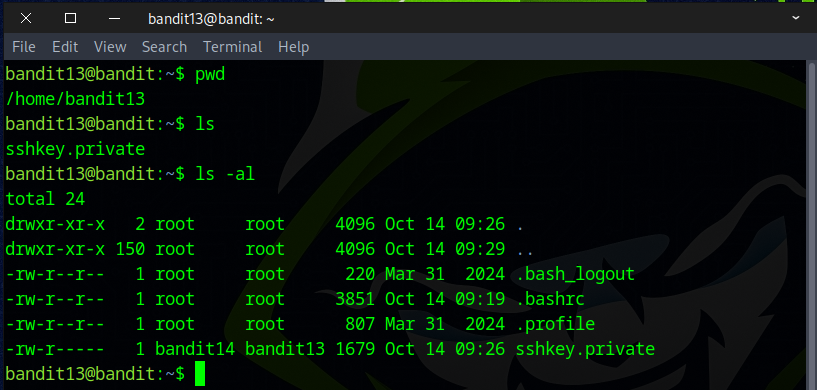
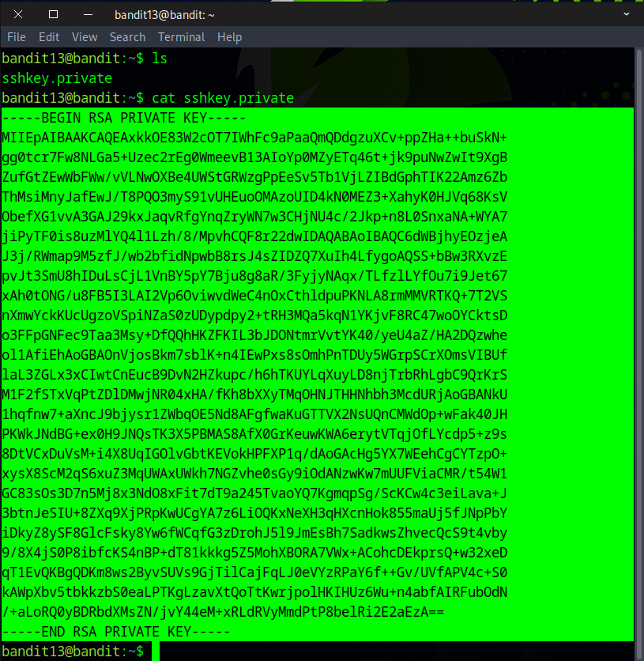
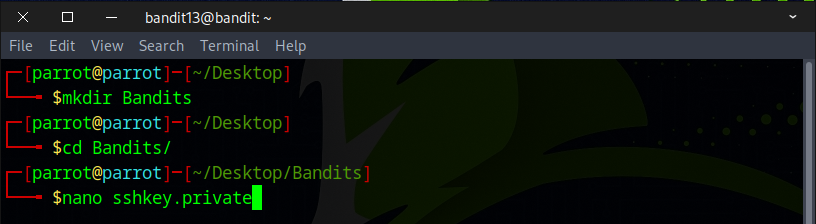
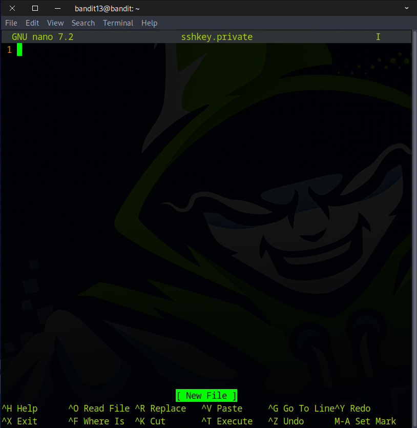
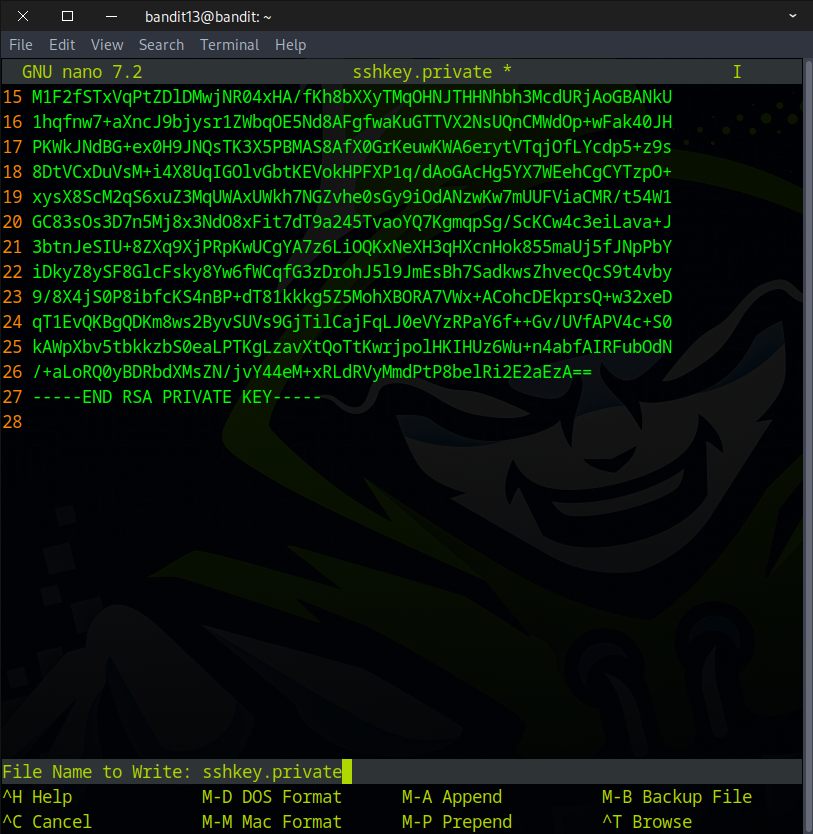
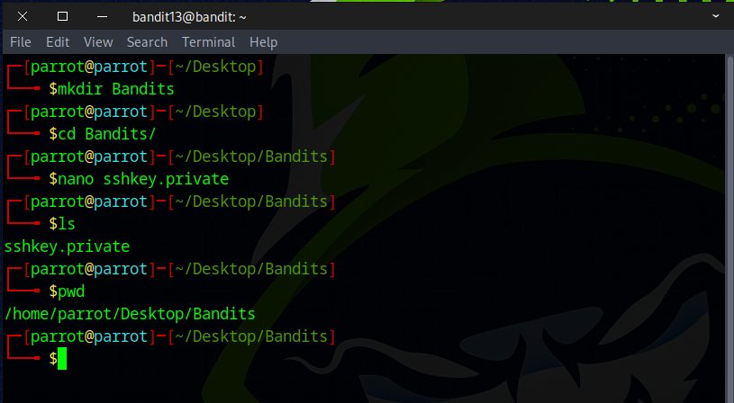
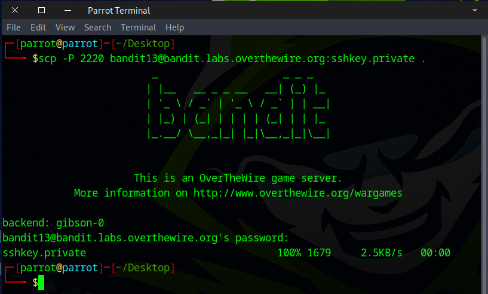

# Bandit Level 13 → Level 14

## Level Goal

The password for the next level is stored in /etc/bandit_pass/bandit14 and can only be read by user bandit14. For this level, you don’t get the next password, but you get a private SSH key that can be used to log into the next level. Note: localhost is a hostname that refers to the machine you are working on

## Commands you may need to solve this level

    ssh, telnet, nc, openssl, s_client, nmap

## Helpful Reading Material

    SSH/OpenSSH/Keys

### 🔑 Solution

```
ssh bandit13@bandit.labs.overthewire.org -p 2220
```
Now type in the password you grabbed from the last challenge.

Rather than capturing a password as before, this challenge involves retrieving the private key for SSH authentication.



Use the `cat` command to display the contents of the SSH private key. Then, select all the text, right-click to copy, or press Ctrl + Shift + C. Finally, type exit to close the session.



Next, create a directory, navigate into it using `cd`, and use the `nano` command to create a new file.



In the new session, press **Ctrl + Shift + V** to paste the content you copied earlier.



Then, press **Ctrl + X**, respond with **Y**, and press **Enter** to complete the process.



With the new session closed, you return to the prior session. Congrats on successfully creating and saving your new file!



Alternatively, you can use `scp` to copy the sshkey.private file.  

**SCP (Secure Copy Protocol)** is a command-line tool used to securely transfer files between computers over a network. It uses SSH (Secure Shell) to provide encryption, ensuring that data is safely transmitted without being intercepted.

You can do this by running the command below:
```
scp -P 2220 bandit13@bandit.labs.overthewire.org:sshkey.private .
```


You’ve got the key — on to the next challenge!


