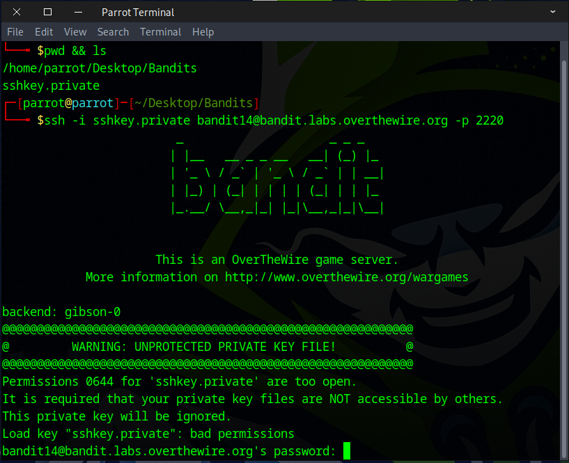
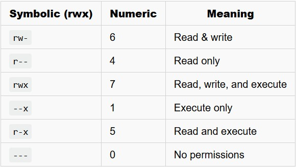
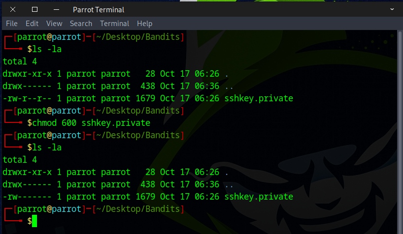
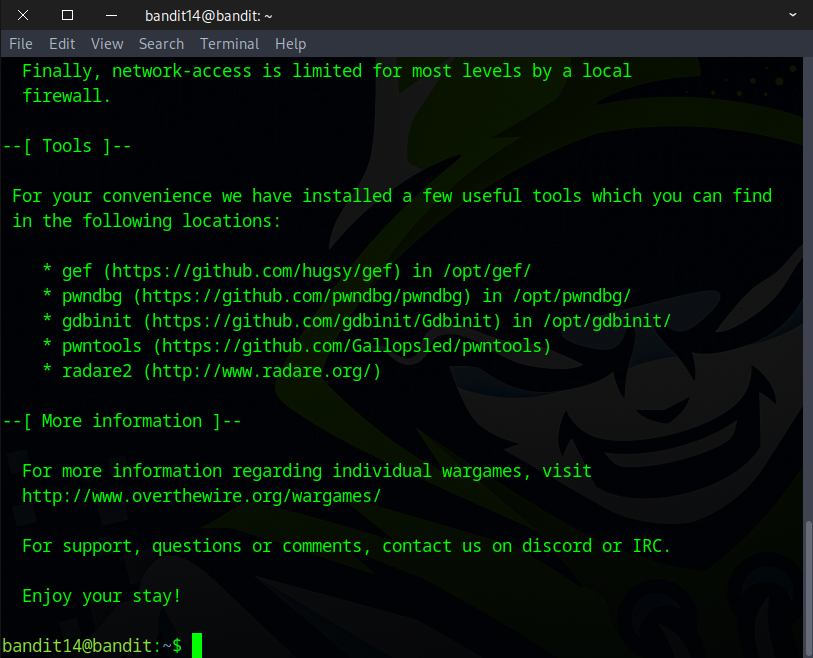
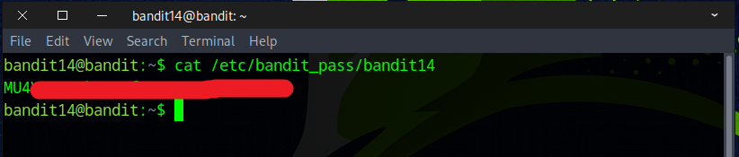
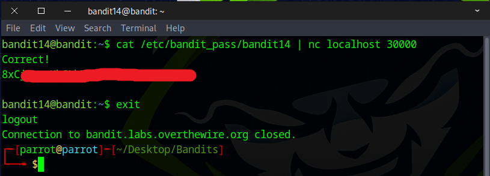

# Bandit Level 14 → Level 15

## Level Goal

The password for the next level can be retrieved by submitting the password of the current level to port 30000 on localhost.

## Commands you may need to solve this level

    ssh, telnet, nc, openssl, s_client, nmap

## Helpful Reading Material

    How the Internet works in 5 minutes (YouTube) (Not completely accurate, but good enough for beginners)
    IP Addresses
    IP Address on Wikipedia
    Localhost on Wikipedia
    Ports
    Port (computer networking) on Wikipedia

### 🔑 Solution

Logging into Bandit 14 is slightly different, as it requires the ``-i`` flag this time. Ensure you are in the directory where you saved the SSH key from the previous challenge.

```
ssh -i sshkey.private bandit14@bandit.labs.overthewire.org -p 2220
```


⚠️ Oops, the server responded with a message about an **unprotected private key file** and **bad permissions**.

### Common Permission Examples


SSH private keys are **sensitive and must be kept secret**. If the permissions are too open (like 644), it means other users on the system can read your private key.

SSH enforces **strict permissions** on private keys as a security measure — if the key file is accessible by others, SSH refuses to use it to protect you from potential unauthorized access.

No worries — this can be fixed using the `chmod` command.  
``6 = rw- for the user (owner)``  
`0 = --- for the group`  
`0 = --- for others`  
```
chmod 600 sshkey.private
```


Try logging into Bandit14 again — this time, it should work without any issues.
```
ssh -i sshkey.private bandit14@bandit.labs.overthewire.org -p 2220
```


As noted earlier, the password is stored at /etc/bandit_pass/bandit14
```
cat /etc/bandit_pass/bandit14
```


As outlined in the instruction, submit the password for this level to port **30000** on **localhost** to retrieve the password for the next level.

To accomplish this, run the following command:
```
cat /etc/bandit_pass/bandit14 | nc localhost 30000
or
echo MU4V====================== | nc localhost 30000
```
`nc` Stands for **netcat** — a command-line utility used for reading from and writing to network connections using TCP or UDP.  
`localhost` Refers to the **local machine** — IP address **127.0.0.1**. This means the connection stays on your computer.  
`30000`: The **port number** to connect to.



Awesome! You’ve successfully found the flag for the next stage.


