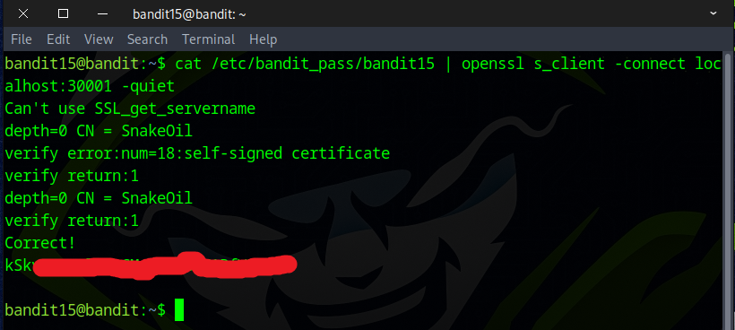
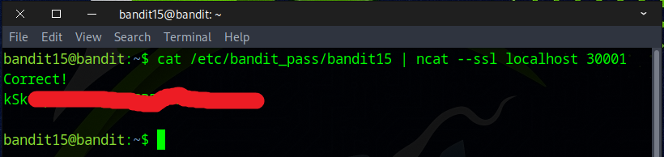
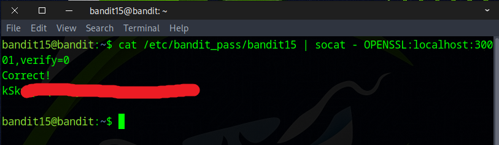

# Bandit Level 15 → Level 16

## Level Goal

The password for the next level can be retrieved by submitting the password of the current level to port 30001 on localhost using SSL/TLS encryption.

Helpful note: Getting “DONE”, “RENEGOTIATING” or “KEYUPDATE”? Read the “CONNECTED COMMANDS” section in the manpage.

## Commands you may need to solve this level

    ssh, telnet, nc, ncat, socat, openssl, s_client, nmap, netstat, ss

## Helpful Reading Material

    Secure Socket Layer/Transport Layer Security on Wikipedia
    OpenSSL Cookbook - Testing with OpenSSL

### 🔑 Solution

```
ssh bandid15@bandit.labs.overthewire.org -p 2220
```
Then enter the password obtained from the previous challenge.

The task is to securely send the bandit15 password to **localhost** on port **30001** using an encrypted protocol like **SSL/TLS**.
There are multiple methods to do this, depending on which tools are already installed on the machine.

One way to do this is with the ``openssl`` command.
```
cat /etc/bandit_pass/bandit15 | openssl s_client -connect localhost:30001 -quiet
or
cat /etc/bandit_pass/bandit15 | openssl s_client -connect 127.0.0.1:30001 -quiet
```


Another option is to use `ncat`, which is already installed on the machine.
```
cat /etc/bandit_pass/bandit15 | ncat --ssl localhost 30001
or 
cat /etc/bandit_pass/bandit15 | ncat --ssl 127.0.0.1 30001
```


You can also do this with the `socat` command.
```
cat /etc/bandit_pass/bandit15 | socat - OPENSSL:localhost:30001,verify=0
or
cat /etc/bandit_pass/bandit15 | socat - OPENSSL:127.0.0.1:30001,verify=0
```


Great job! That’s the flag you’ll need for the next challenge.


