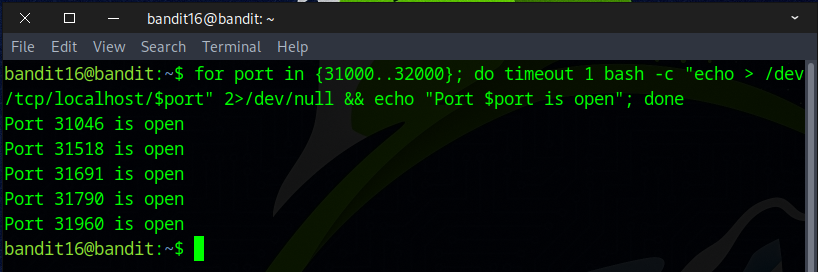
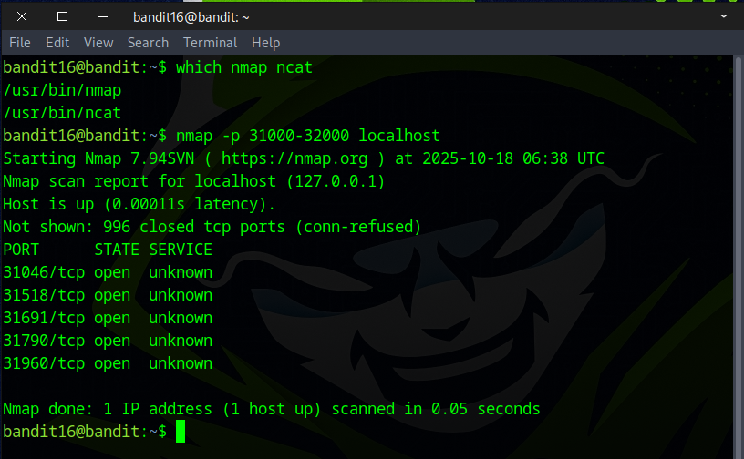
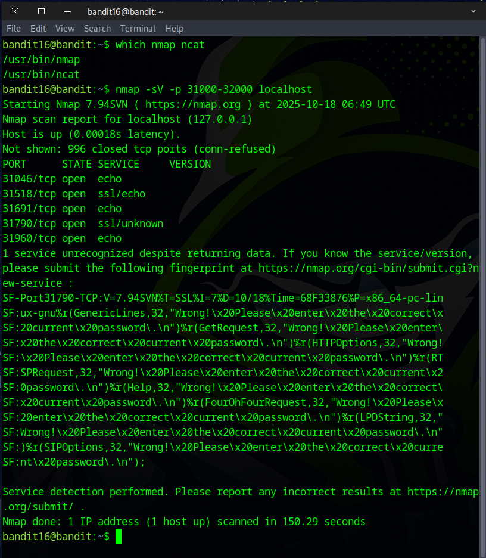
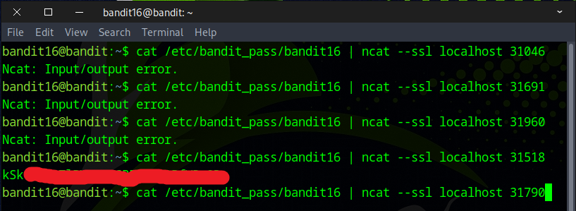
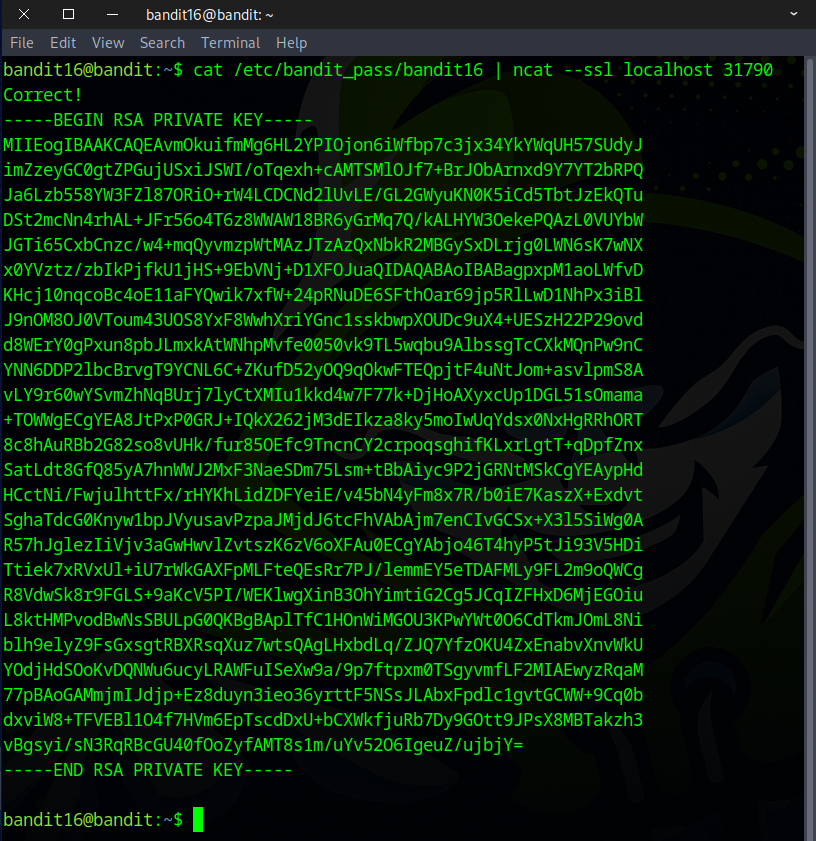
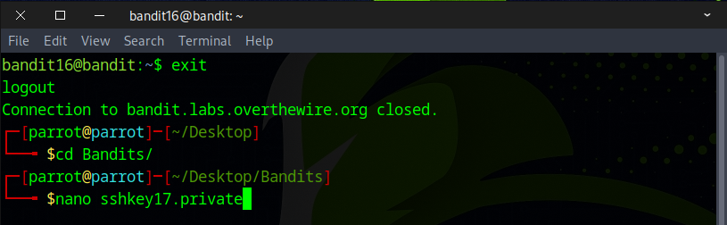
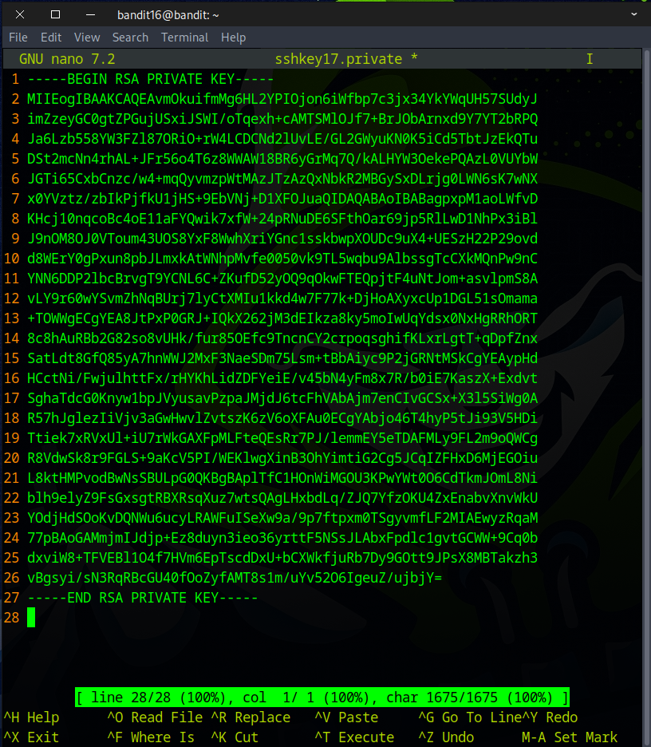
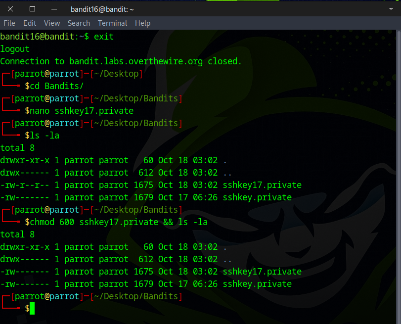

# Bandit Level 16 → Level 17

## Level Goal

The credentials for the next level can be retrieved by submitting the password of the current level to a port on localhost in the range 31000 to 32000. First find out which of these ports have a server listening on them. Then find out which of those speak SSL/TLS and which don’t. There is only 1 server that will give the next credentials, the others will simply send back to you whatever you send to it.

Helpful note: Getting “DONE”, “RENEGOTIATING” or “KEYUPDATE”? Read the “CONNECTED COMMANDS” section in the manpage.

## Commands you may need to solve this level

    ssh, telnet, nc, ncat, socat, openssl, s_client, nmap, netstat, ss

## Helpful Reading Material

    Port scanner on Wikipedia


### 🔑 Solution

```
ssh bandid16@bandit.labs.overthewire.org -p 2220
```
Next, input the password you retrieved in the previous challenge.

First scan **localhost** for an open port in the range **31000–32000**, then submit the bandit16 password to that port over **SSL/TLS**.

There are multiple ways to find an open port on the system; if you enjoy bash scripting, this approach will suit you.
```
for port in {31000..32000}; do
  timeout 1 bash -c "echo > /dev/tcp/localhost/$port" 2>/dev/null && echo "Port $port is open"
done

```
The advantage of this approach is speed — it’s very fast and works on systems that lack port-scanning tools. The drawbacks are that the command is hard to remember, easy to mistype (quotes or commas), and limited in functionality.  



Fortunately, `nmap` is present on the machine — a much simpler way to get the same outcome.
```
nmap -p 31000-32000 localhost
or 
nmap -p 31000-32000 127.0.0.1
```


Nmap is a powerful tool — it does far more than just find open ports; for example, ``-sV`` performs service version detection.
```
nmap -sV -p 31000-32000 localhost
or 
nmap -sV -p 31000-32000 127.0.0.1
```
Be aware that ``-sV`` is slower than a basic port scan — in this case it took about 150 seconds versus under a second for a simple port probe. 



As we can see from the previous scan, there are five open ports. Most of them are running simple echo services that either return nothing or just echo back whatever data you send.



When we sent data to the port running an SSL/unknown service, it returned an SSH private key — this serves as the flag for the next challenge.

Select the output, then press **Ctrl+Shift+C** to copy — or **right-click** and choose **Copy**.



Exit the current session, and run `nano` followed by the filename to create a new file.



Press **Ctrl+Shift+V** to paste the copied output, then press **Ctrl+X**, followed by **Y**, and finally **Enter** to save and exit.



Next, change the file permissions to `400`, `600`, or `700` to avoid permission issues when logging in for the next challenge.



You’ve got the flag — on to the next challenge!

