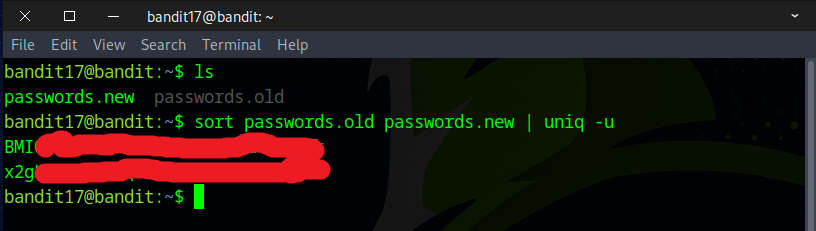

# Bandit Level 17 → Level 18


## Level Goal

There are 2 files in the homedirectory: passwords.old and passwords.new. The password for the next level is in passwords.new and is the only line that has been changed between passwords.old and passwords.new

NOTE: if you have solved this level and see ‘Byebye!’ when trying to log into bandit18, this is related to the next level, bandit19

## Commands you may need to solve this level

    cat, grep, ls, diff


### 🔑 Solution

First, ensure you're in the directory where you saved the SSH private key from the previous challenge, and that its permissions are set to `400`, `600`, or `700`.
```
ssh -i sshkey17.private bandit17@bandit.labs.overthewire.org -p 2220
```


There are two files: `passwords.new` and `passwords.old`. Only **one line was altered** in `passwords.new`, and that line holds the flag.

Use `diff` command to accomplish that:
```
diff passwords.old passwords.new
```


Alternatively, you can find the change using the `sort` and `uniq` commands.
```
sort passwords.old passwords.new | uniq -u
```


Congratulations! You’ve found the flag for the next challenge. 


