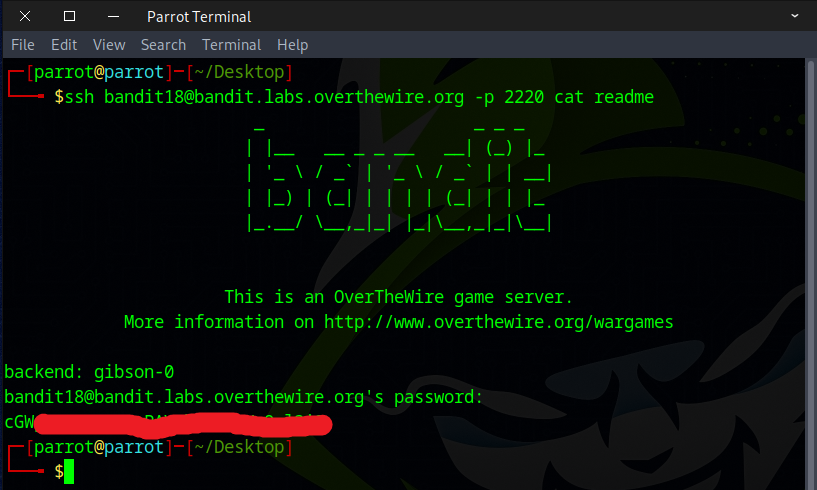
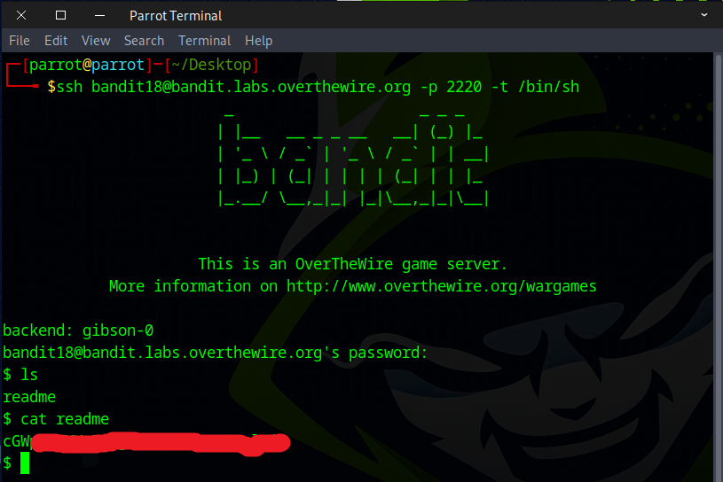
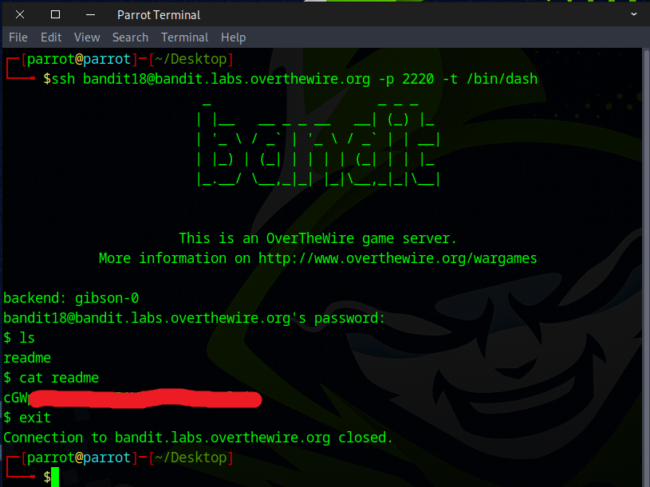

# Bandit Level 18 → Level 19

## Level Goal

The password for the next level is stored in a file readme in the homedirectory. Unfortunately, someone has modified .bashrc to log you out when you log in with SSH.

## Commands you may need to solve this level

    ssh, ls, cat


### 🔑 Solution

```
ssh bandit18@bandit.labs.overthewire.org -p 2220
```
Then enter the password obtained from the previous challenge.


Oops! The connection closes right after you log in. As mentioned in the instructions, someone has edited the ``.bashrc`` file to log you out upon SSH login.


To work around this, you can add a command at the end of your SSH command to execute before the forced logout happens.
As you can see, the `ls` command executed before the session was closed.
```
ssh bandit18@bandit.labs.overthewire.org -p 2220 ls
```


When we appended the `cat` command to our SSH command, it executed before the session closed, and we got the flag.



Alternatively, we can use the ``-t`` flag in the SSH command along with a different shell path to forces a pseudo-terminal.

This option might bypass the logout behavior in ``.bashrc``.
```
ssh bandit18@bandit.labs.overthewire.org -p 2220 -t /bin/sh
```


### 🐚 Common Linux Shells

| **Shell Name** | **Typical Path**               | **Interactive Features**           | **POSIX Compliant** |
| -------------- | ------------------------------ | ---------------------------------- | ------------------- |
| **Bash**       | `/bin/bash`                    | ✅ Yes (completion, history, etc.) | ✅ Mostly            |
| **Sh**         | `/bin/sh` (symlink)            | ❌ Minimal                         | ✅ Yes               |
| **Dash**       | `/bin/dash`                    | ❌ Very minimal                    | ✅ Yes               |
| **Zsh**        | `/bin/zsh` or `/usr/bin/zsh`   | ✅ Rich features                   | ✅ Yes               |
| **Fish**       | `/usr/bin/fish` or `/bin/fish` | ✅ Modern, user-friendly           | ❌ No                |
| **Ksh**        | `/bin/ksh` or `/usr/bin/ksh`   | ✅ Moderate features               | ✅ Yes               |
| **Tcsh**       | `/usr/bin/tcsh`                | ✅ Command-line editing            | ❌ No                |
| **Csh**        | `/bin/csh`                     | ✅ Basic                           | ❌ No                |

This method can also work if we use the **Dash shell** instead.
```
ssh bandit18@bandit.labs.overthewire.org -p 2220 -t /bin/dash
```


The command `cat /etc/shells` is used to display the list of valid login shells available on a Unix or Linux system. This file contains the paths to all the shells installed on the system that users can choose from.

Well done — you’ve discovered the flag needed for the next challenge.


