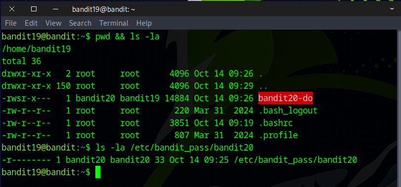
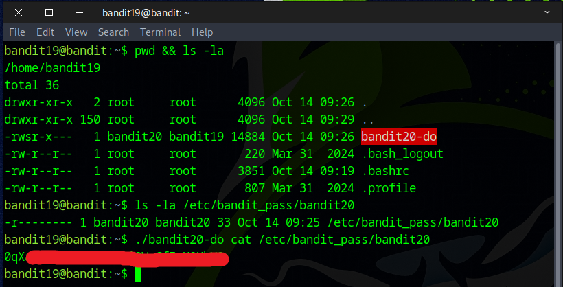

# Bandit Level 19 → Level 20

## Level Goal

To gain access to the next level, you should use the setuid binary in the homedirectory. Execute it without arguments to find out how to use it. The password for this level can be found in the usual place (/etc/bandit_pass), after you have used the setuid binary.

## Helpful Reading Material

    setuid on Wikipedia


### 🔑 Solution

```
ssh bandit19@bandit.labs.overthewire.org -p 2220
```
Proceed by submitting the password acquired from the prior challenge.

After running the `ls` command, we noticed a strange file with ``-rwsr-x---`` permissions.

The goal is to read ``/etc/bandit_pass/bandit20``, but we don't have permission to read it.



**setuid (set user ID on execution)** is a UNIX/Linux permission bit that makes a program run with the user ID of the file’s owner rather than with the user ID of the user who launched it.

In short: when a binary has the setuid bit and you execute it, the process’s effective UID (euid) becomes the owner of that file for the duration of execution.

⚠️ **Setuid** can be dangerous if used incorrectly — it opens the door for *privilege escalation* if the executable has bugs or can be manipulated.

Invoke the setuid executable to access the flag with **bandit20’s privileges**.
```
./bandit20-do cat /etc/bandit_pass/bandit20
```


Awesome! You’ve successfully found the flag for the next stage.

