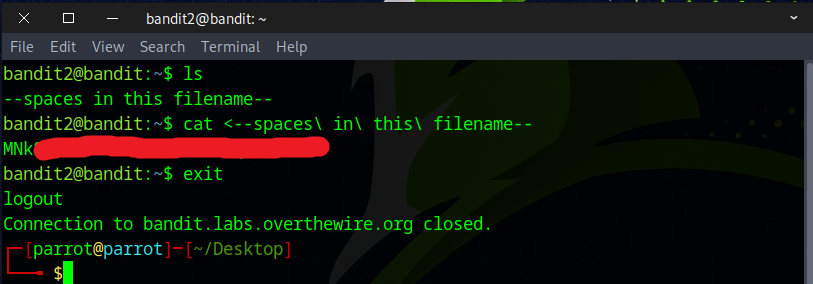

# Bandit Level 2 → Level 3

## Level Goal

The password for the next level is stored in a file called --spaces in this filename-- located in the home directory

## Commands you may need to solve this level

    ls , cd , cat , file , du , find

## Helpful Reading Material

    Google Search for “spaces in filename”

### 🔑 Solution

```
ssh bandit2@bandit.labs.overthewire.org -p 2220
```
Then enter the **password** obtained from the previous challenge.

Use `ls` to list files. Notice the file named ``--spaces in this filename--``
To view the file, use the command:
```
cat <--spaces\ in\ this\ filename--
```



Great job! That’s the flag you’ll need for the next challenge.


