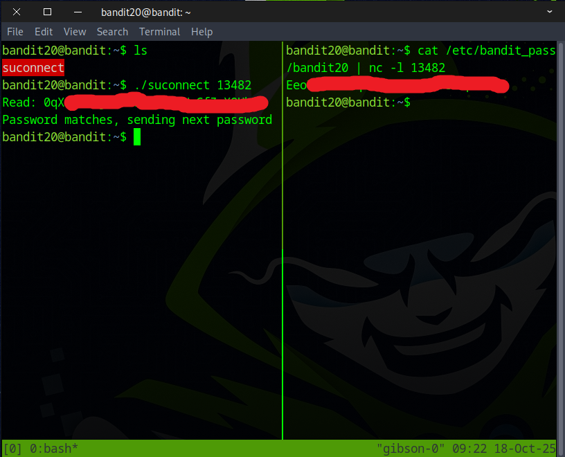
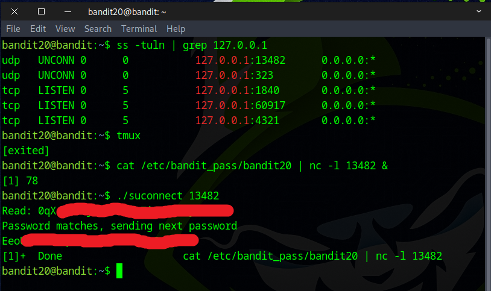

# Bandit Level 20 → Level 21

## Level Goal

There is a setuid binary in the homedirectory that does the following: it makes a connection to localhost on the port you specify as a commandline argument. It then reads a line of text from the connection and compares it to the password in the previous level (bandit20). If the password is correct, it will transmit the password for the next level (bandit21).

NOTE: Try connecting to your own network daemon to see if it works as you think

## Commands you may need to solve this level

    ssh, nc, cat, bash, screen, tmux, Unix ‘job control’ (bg, fg, jobs, &, CTRL-Z, …)


### 🔑 Solution

```
ssh bandit20@bandit.labs.overthewire.org -p 2220
```
Now type in the password you grabbed from the last challenge.

According to the instructions, in the home directory there is a **setuid binary**. When you run it with a **port number**, it connects to localhost on that port, reads one line of input, compares that line to the **bandit20 password**, and—if correct—outputs the **bandit21 password**.


Start by using the ``ss`` command to display all listening ports on localhost. `ss` — socket statistics tool (like a modern netstat).
```
ss -tuln | grep 127.0.0.1
```
This command list all listening TCP and UDP sockets (using numeric IPs/ports) and then keep only those that are bound to 127.0.0.1.


We have several options to reach our goal, and one method is to use the `tmux` command. After running the `tmux` command, a new tmux session will start.


### 📚 tmux Shortcut Reference Table


Press **Ctrl + b**, then **Shift + %** to split the current window into two vertical panes.
In one of the terminals, type this command and press Enter.
```
cat /etc/bandit_pass/bandit20 | nc -l 13482
```
After pressing **Ctrl + b**, press the left or right **arrow key** to move to a different pane, then type your command and press Enter.
```
./suconnect 13482
```
After that, the flag for the next challenge should be displayed.



We can accomplish this without using tmux, but this method has drawbacks and may not always work.
To proceed, use the following command.
```
cat /etc/bandit_pass/bandit20 | nc -l 13482 &
```
```
./suconnect 13482
```


You can also try it this way, with the command below and a shortcut key.
```
cat /etc/bandit_pass/bandit20 | nc -l 13482
press Ctrl + Z
bg
```
```
./suconnect 13482
```


Congratulations! You’ve found the flag for the next challenge.

