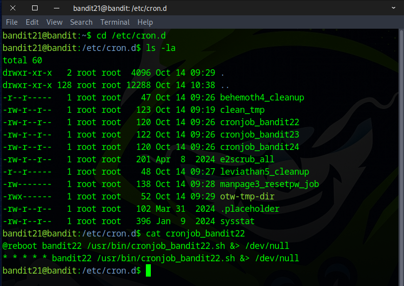
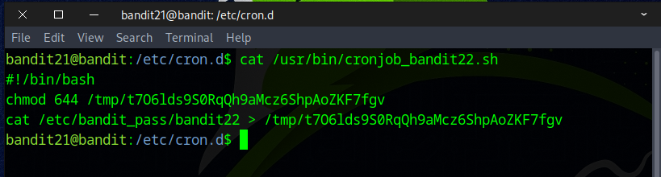
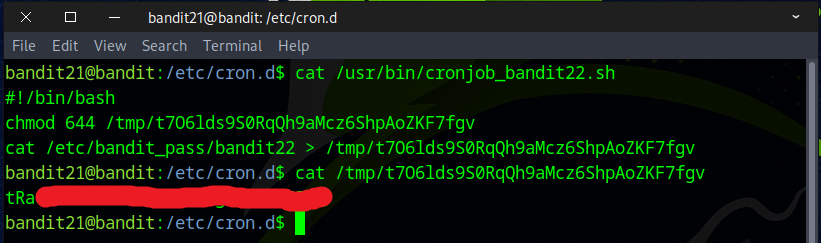

# Bandit Level 21 → Level 22

## Level Goal

A program is running automatically at regular intervals from cron, the time-based job scheduler. Look in /etc/cron.d/ for the configuration and see what command is being executed.

## Commands you may need to solve this level

    cron, crontab, crontab(5) (use “man 5 crontab” to access this)


### 🔑 Solution

```
ssh bandit21@bandit.labs.overthewire.org -p 2220
```
Then enter the password obtained from the previous challenge.

We started by navigating to the ``/etc/cron.d`` directory, where we discovered an interesting file named `cronjob_bandit22`. We then used the `cat` command to inspect its contents.
We came across an intriguing script located at ``/usr/bin/cronjob_bandit22.sh``.



We ran `cat` again to read the script; it appears to write the **bandit22 password** to a strangely named file in ``/tmp``.



Once again, we used the `cat` command to display the contents of the file located in the ``/tmp`` directory.



Great job! That’s the flag you’ll need for the next challenge.
