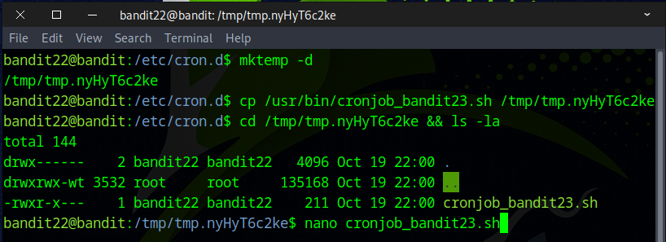
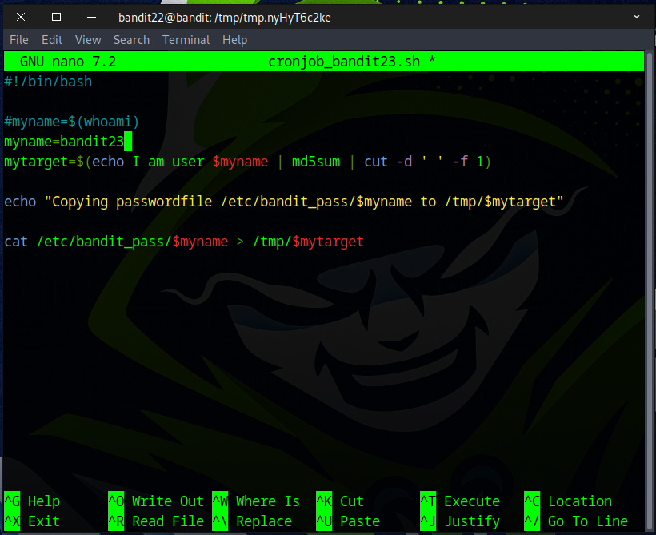
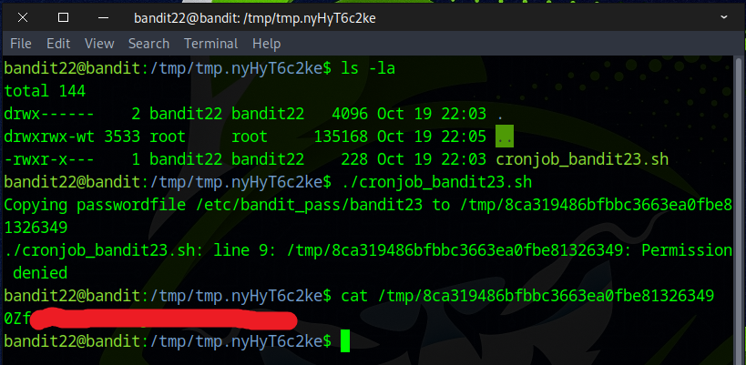

# Bandit Level 22 → Level 23

## Level Goal

A program is running automatically at regular intervals from cron, the time-based job scheduler. Look in /etc/cron.d/ for the configuration and see what command is being executed.

NOTE: Looking at shell scripts written by other people is a very useful skill. The script for this level is intentionally made easy to read. If you are having problems understanding what it does, try executing it to see the debug information it prints.

## Commands you may need to solve this level

    cron, crontab, crontab(5) (use “man 5 crontab” to access this)


### 🔑 Solution

```
ssh bandit22@bandit.labs.overthewire.org -p 2220
```
Enter the password captured from the previous challenge.

We began by exploring the ``/etc/cron.d`` directory and found a notable file called `cronjob_bandit23`. To examine its contents, we used the `cat` command. This led us to an interesting script found at ``/usr/bin/cronjob_bandit23.sh``.


Viewing the file with `cat` command revealed the script obtains a user’s password and saves it to a file in the ``/tmp`` directory.


Next, we made a temp folder under ``/tmp`` with `mktemp -d` command, used `cp` command to copy the file into that folder, then edited it with `nano` command.



We set the `myname` variable to bandit23, then saved the file by pressing **Ctrl+X**, **Y**, and **Enter**.
```
#!/bin/bash

#myname=$(whoami)
myname=bandit23 
mytarget=$(echo I am user $myname | md5sum | cut -d ' ' -f 1)
                                                             
echo "Copying passwordfile /etc/bandit_pass/$myname to /tmp/$mytarget"
                                                                      
cat /etc/bandit_pass/$myname > /tmp/$mytarget 
```


We attempted to run the script and received a “permission denied” error, but we were still able to see the filename in /tmp where the bandit23 password was stored; we then used `cat` to display it.



Congratulations! You’ve found the flag for the next challenge.
