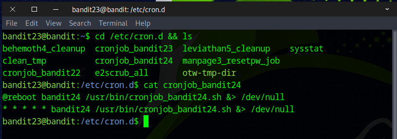
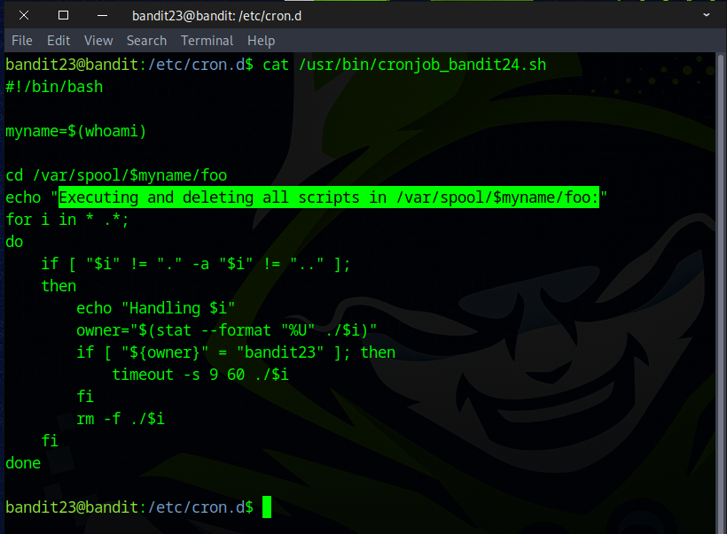
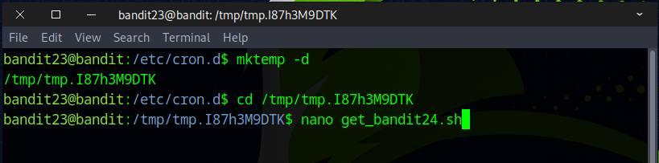
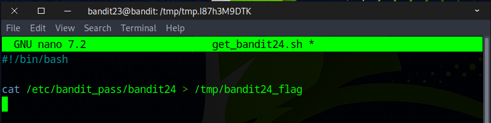
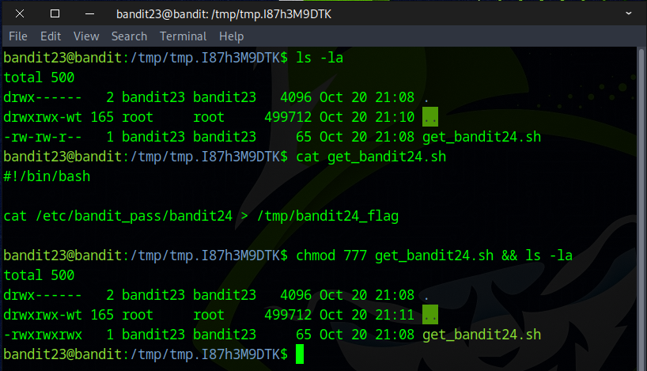
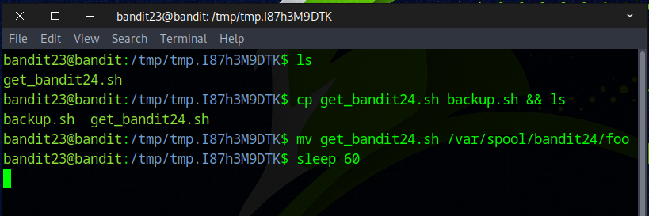
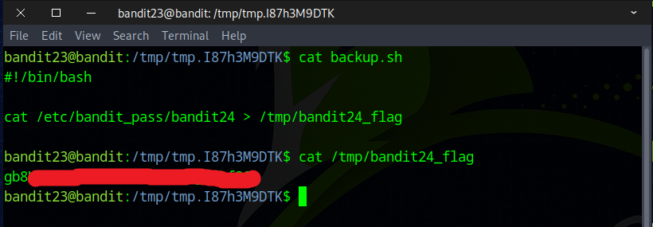

# Bandit Level 23 → Level 24

## Level Goal

A program is running automatically at regular intervals from cron, the time-based job scheduler. Look in /etc/cron.d/ for the configuration and see what command is being executed.

NOTE: This level requires you to create your own first shell-script. This is a very big step and you should be proud of yourself when you beat this level!

NOTE 2: Keep in mind that your shell script is removed once executed, so you may want to keep a copy around…

## Commands you may need to solve this level

    chmod, cron, crontab, crontab(5) (use “man 5 crontab” to access this)


### 🔑 Solution

```
ssh bandit23@bandit.labs.overthewire.org -p 2220
```
Proceed by submitting the password acquired from the prior challenge.

We started by looking into the ``/etc/cron.d`` directory, where we discovered a noteworthy file named `cronjob_bandit24`. Using the `cat` command, we viewed its contents, which pointed us to an intriguing script located at ``/usr/bin/cronjob_bandit24.sh``.



Use the `cat` command to read the script. In summary, the script navigates to the ``/var/spool/bandit24/foo`` directory, executes each file owned by `bandit23` with a **60-second timeout**, and then deletes all the files.



We begin by creating a temporary directory using `mktemp -d`, navigate into it with `cd`, and then use `nano` to write our custom script.



Although we lack permission to read ``/etc/bandit_pass/bandit24`` as our current user, the cronjob runs with **bandit24 privileges**. When the script executes under that account it can access the file and will save the result to ``/tmp/bandit24_flag``.
```
#!/bin/bash

cat /etc/bandit_pass/bandit24 > /tmp/bandit24_flag
```


Next, run `chmod 777` to set the file’s permissions so anyone can read, write, and execute it.
```
chmod 777 get_bandit24.sh
```


As a precaution, make a backup copy of the script—use `cp` to duplicate it—because the script be deleted from ``/var/spool/bandit24/foo`` after it runs and you may want to restore the original if something goes wrong.

Move your script to /var/spool/bandit24/foo using the mv command. After that, wait around 60 seconds to give the cronjob time to run it.
```
mv get_bandit24.sh /var/spool/bandit24/foo
sleep 60
```


After the cronjob has run, display the contents of ``/tmp/bandit24_flag`` with the cat command.



Nicely done — you found the flag for the next challenge and created your first working script.


