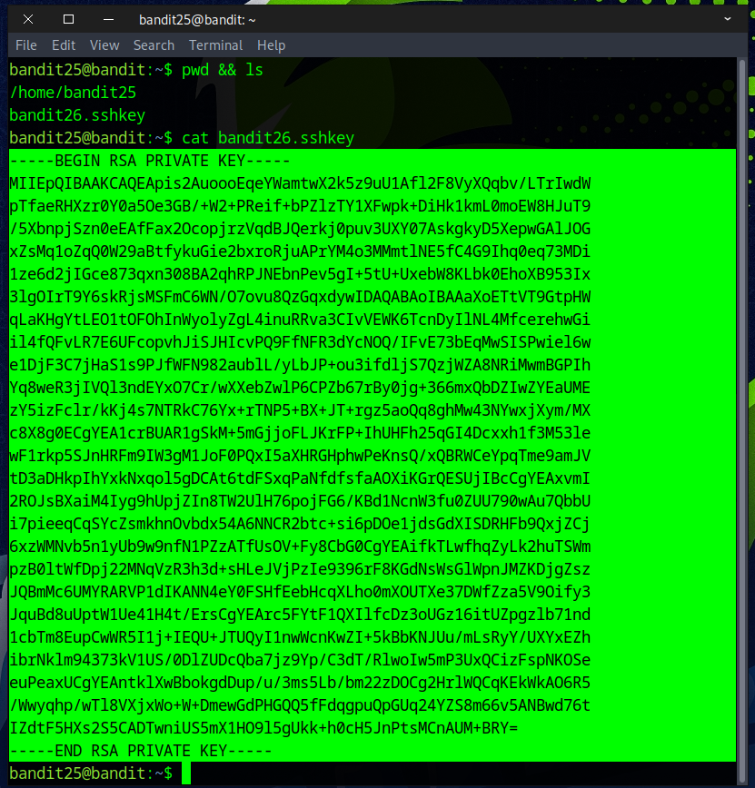
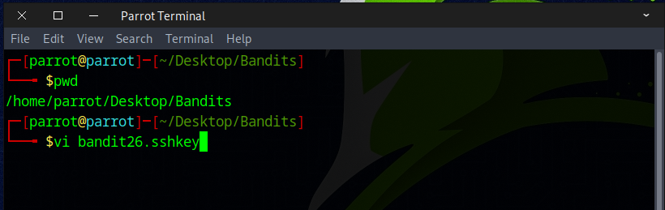
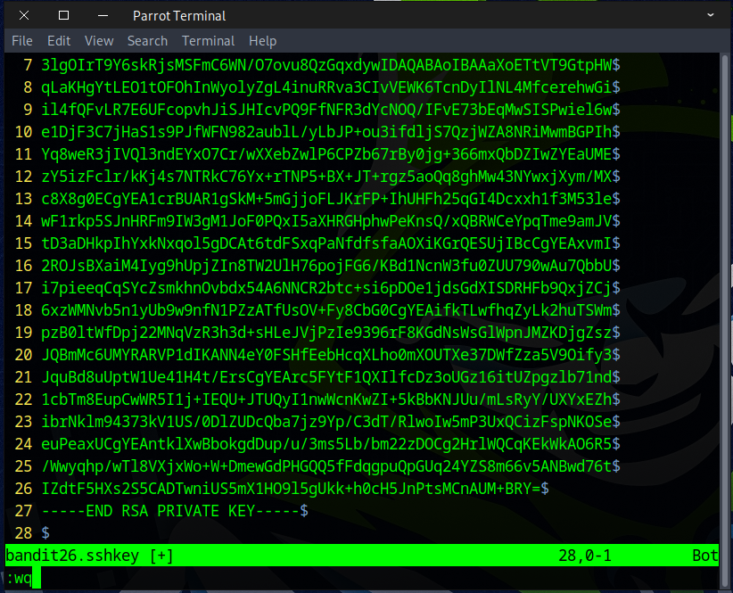
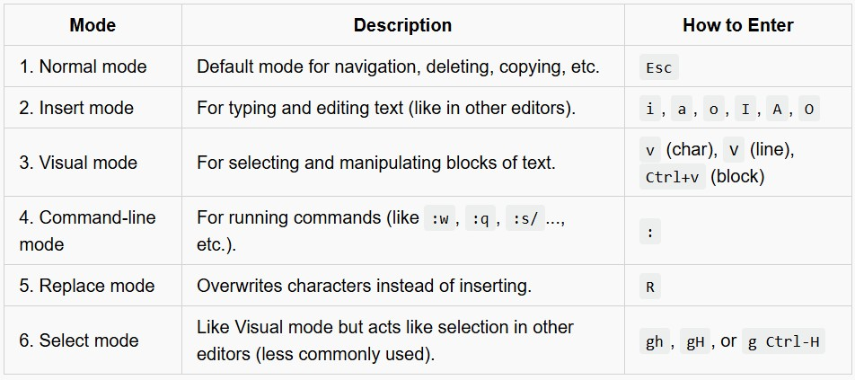
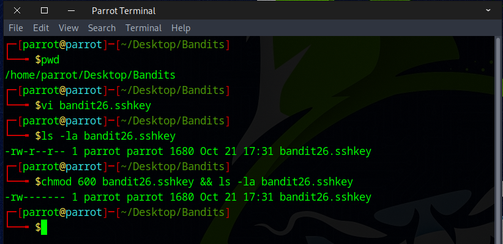
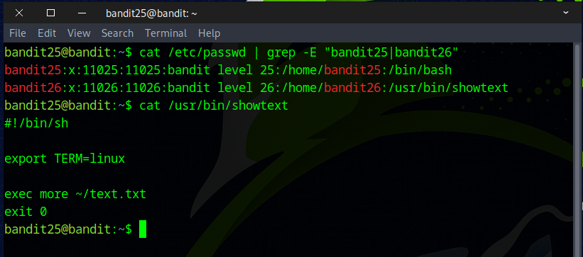

# Bandit Level 25 → Level 26

## Level Goal

Logging in to bandit26 from bandit25 should be fairly easy… The shell for user bandit26 is not /bin/bash, but something else. Find out what it is, how it works and how to break out of it.

    NOTE: if you’re a Windows user and typically use Powershell to ssh into bandit: Powershell is known to cause issues with the intended solution to this level. You should use command prompt instead.

## Commands you may need to solve this level

    ssh, cat, more, vi, ls, id, pwd


### 🔑 Solution

```
ssh bandit25@bandit.labs.overthewire.org -p 2220
```
Then enter the password obtained from the previous challenge.

We used the `ls` command to list the files and discovered the **SSH private key** for *bandit26*. It feels like this level is surprisingly easy to complete. However, according to the instructions, we should be looking for a clue that helps with the next level, which is supposed to be much more difficult.



Start by copying the **SSH private key**. Then, open a new terminal, move to the directory where you want to save it, and use the `vi` editor to create the file.



After opening the vi editor, press `i` to switch to insert mode. Paste the key using `Ctrl + Shift + V`. Then, press `Esc` to return to normal mode and type ``:wq`` to save and exit the editor.



If you're not familiar with `vi`, `vim`, or `nvim`, here are the **six primary modes** you should know about.

🧭 The 6 Main Vim Modes


Next, ensure you change the file permission to `400`, `600`, or `700` to prevent any errors in the upcoming challenge.



The shell for user **bandit26** isn't ``/bin/bash``; it's something different. Before we finish this challenge, we must identify it because it'll be useful for the next one.
To identify the user's shell, run the following command.
```
cat /etc/passwd | grep -E "bandit25|bandit26"
or
cat /etc/passwd | grep -e "bandit25" -e "bandit26"
```


The shell for the *bandit26* user is ``/usr/bin/showtext``, which runs the command `more ~/text.txt` and then exits.

We've found the clue; now it's time to proceed to the next challenge.

