# Bandit Level 26 → Level 27

## Level Goal

Good job getting a shell! Now hurry and grab the password for bandit27!

## Commands you may need to solve this level

    ls


### 🔑 Solution

```
ssh -i bandit26.sshkey bandit26@bandit.labs.overthewire.org -p 2220 
```
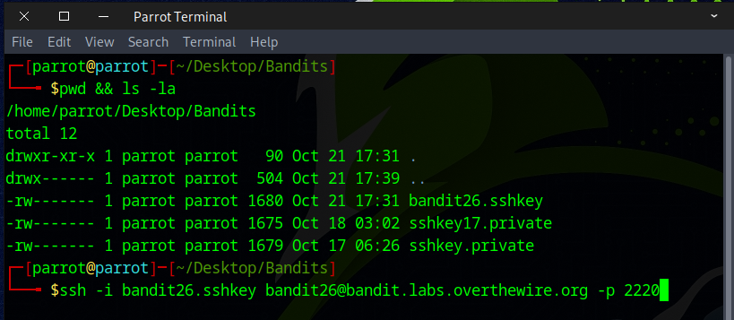

Strange — the session terminates right after a successful login.

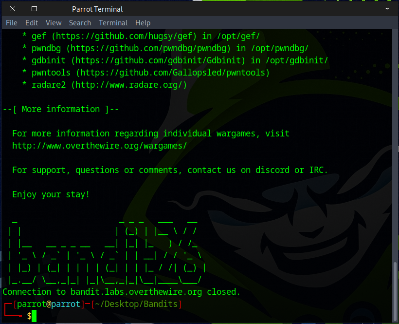

As we remember from the previous challenge, the shell for user *bandit26* is set to ``/usr/bin/showtext``, which runs `more ~/text.txt` and then exits.

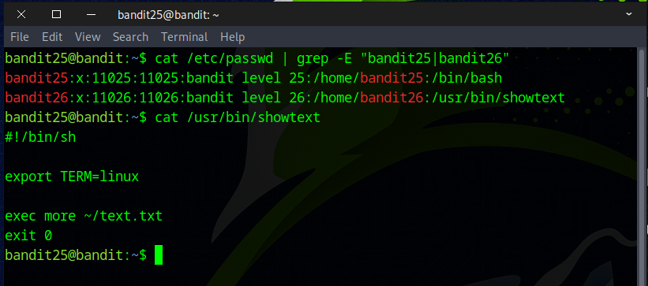

We then used the `ssh` command with the ``-t`` option followed by `more` to force a pseudo-terminal. This produced some output, but the message seemed shorter than usual — which matches the expected behavior of the *bandit26* shell. As mentioned earlier, it simply runs `more ~/text.txt` and then exits. The file `text.txt` just contains the word 'bandit26' in ASCII art.
```
ssh -i bandit26.sshkey bandit26@bandit.labs.overthewire.org -p 2220 -t more
```
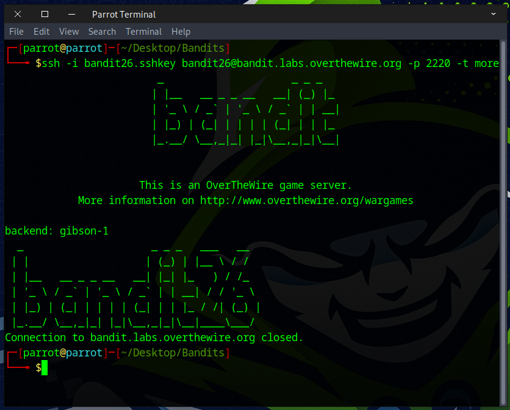

### How does the `more` command work? 
If you try to view a large file — like `rockyou.txt`, which contains around 14 million lines — using the `cat` command, it would be overwhelming because it displays the entire content at once.

Using the `more` command to view a file lets you read the content one page at a time by pressing the `spacebar`, or one line at a time by pressing `Enter` — depending on your terminal's window size.

The `more` command continues displaying the content until you either reach the end of the file or exit manually by pressing `q`.

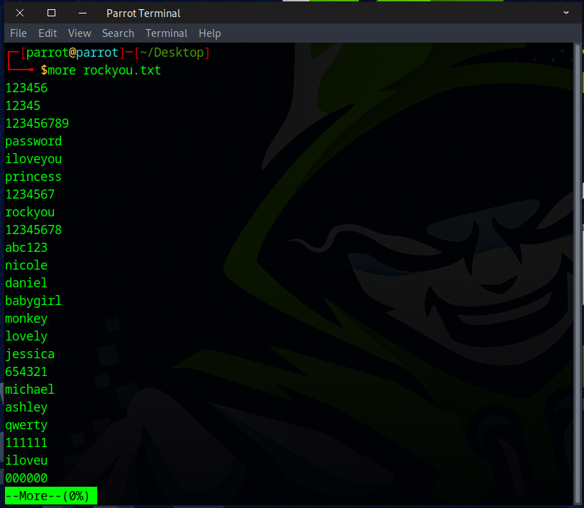

To take advantage of the `more` command’s behavior, we can reduce the size of our terminal window significantly and then run the command again.

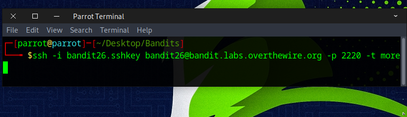

Next, restore your terminal to its normal size. As expected, more displays only half of text.txt. Pressing `Spacebar`, `Enter`, or `q` causes more ~/text.txt to finish and exit — which we don’t want, because we intend to exploit this behavior.

To take advantage of this, press `V` to enter vi's visual mode.

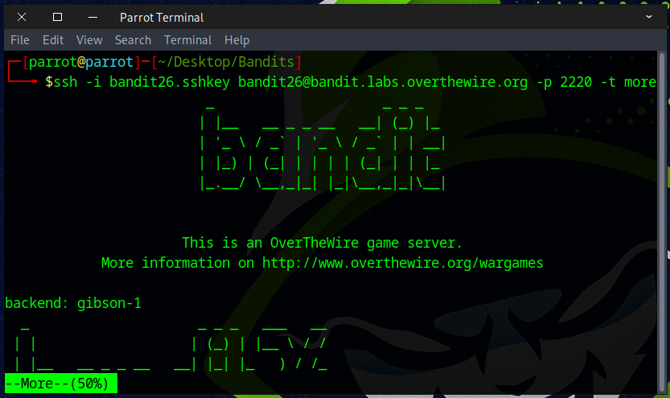

🧭 The 6 Main Vim Modes
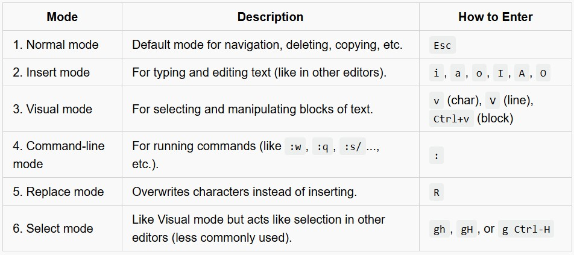

Now that we're viewing `text.txt` in the vi editor, we can manipulate it.

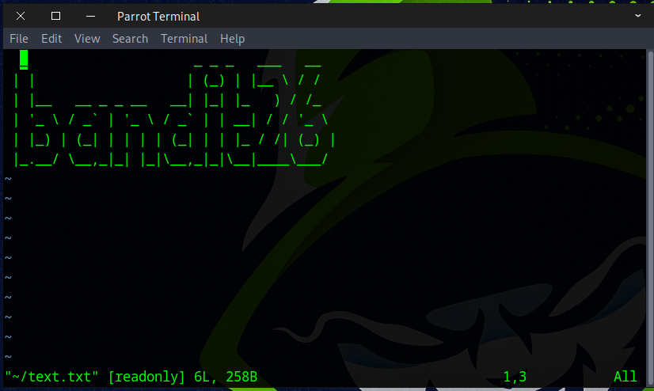

Run the following command to gain access to a regular bash shell.
```
:set shell=/bin/bash
Enter
:shell
Enter
```
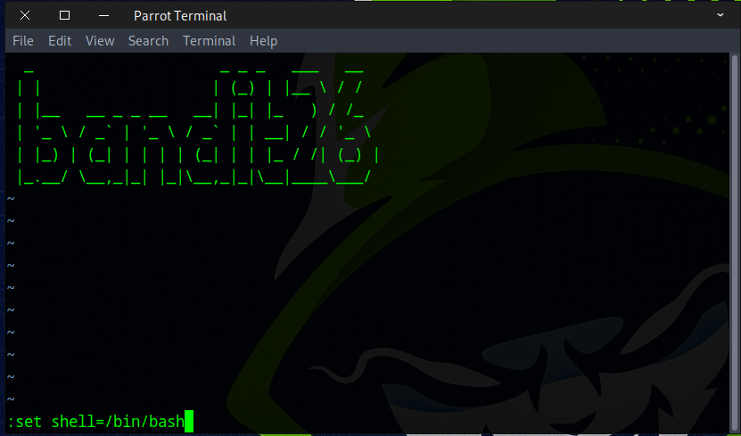
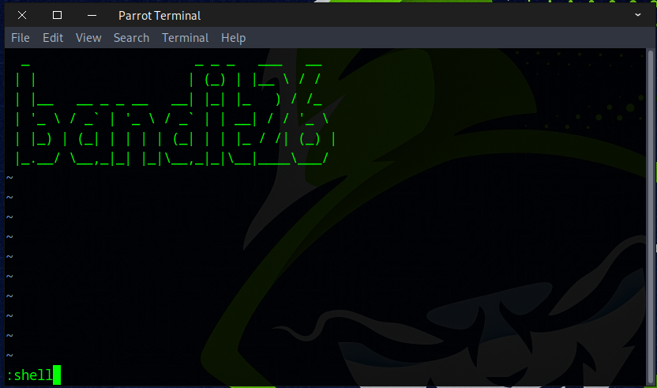

Run `whoami` and `pwd` to verify that you are logged in as user *bandit26*.

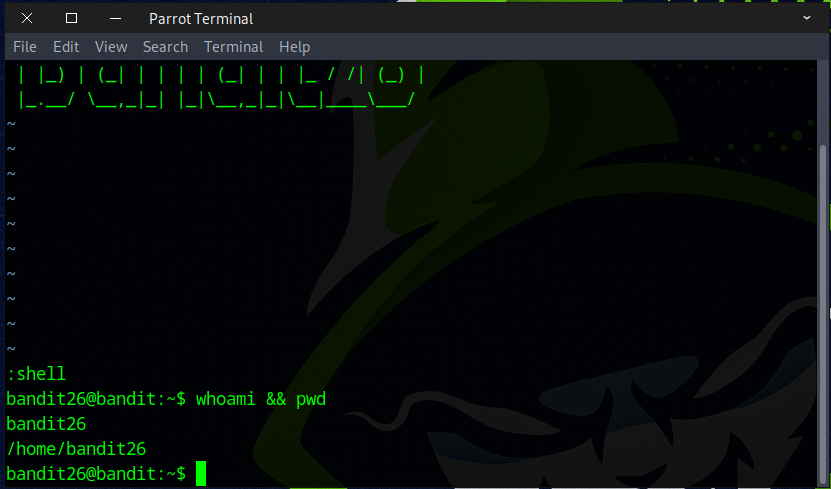

List the files in the home directory with `ls`; we discovered a setuid program that lets us run commands with *bandit27* privileges.

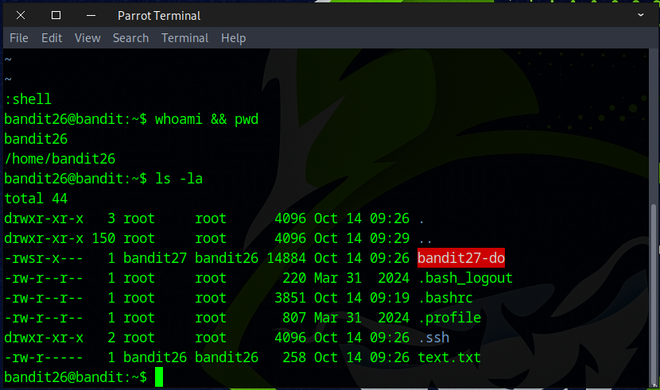

Execute the command below to reveal the bandit27 password.
```
./bandit27-do cat /etc/bandit_pass/bandit27
```

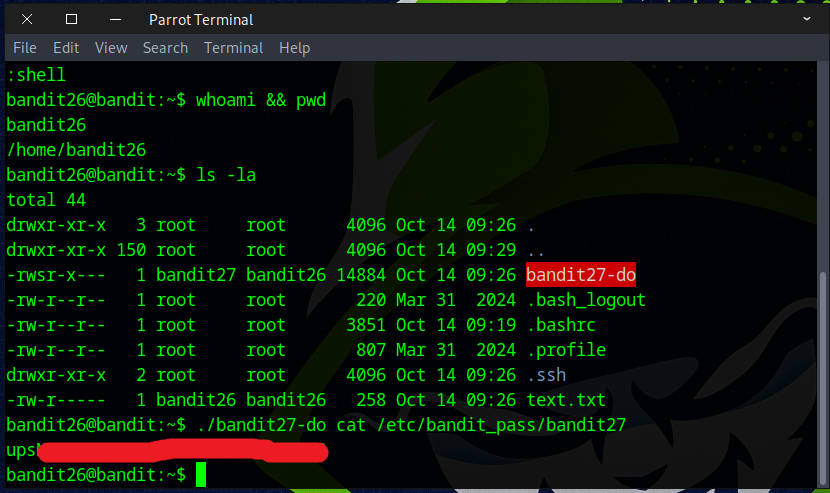

🎉🎉 CHEERS — YOU’VE SECURED THE FLAG TO ADVANCE TO THE NEXT CHALLENGE! 🎉🎉