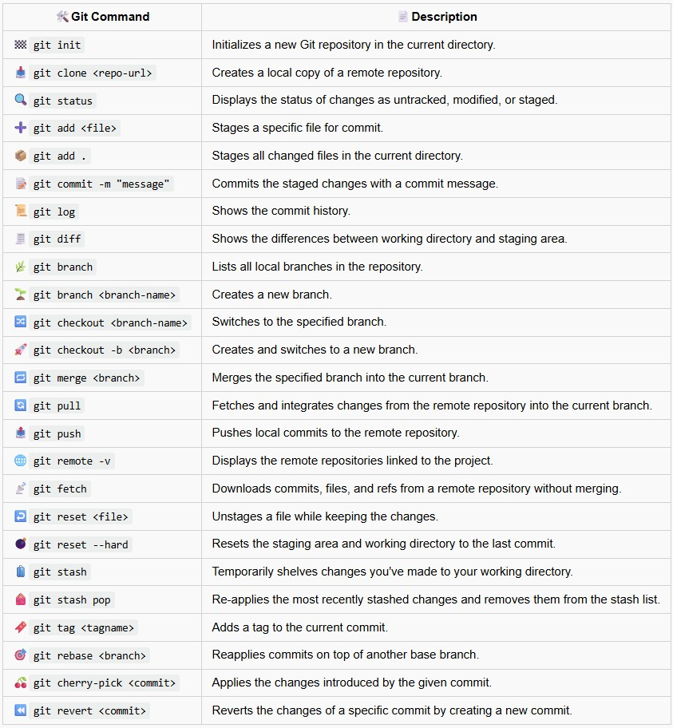
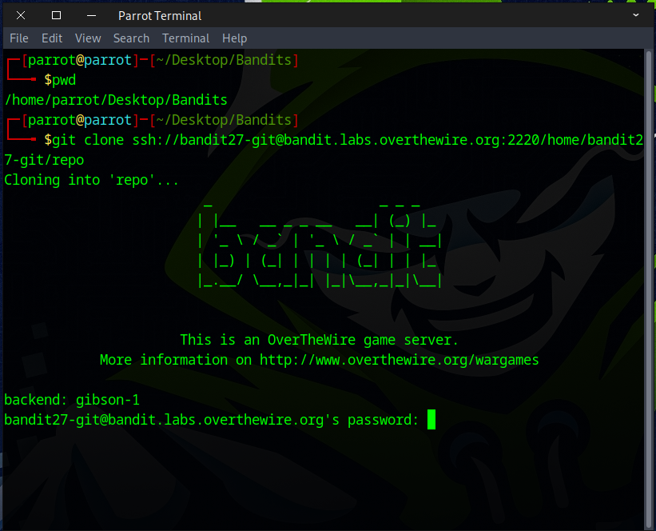
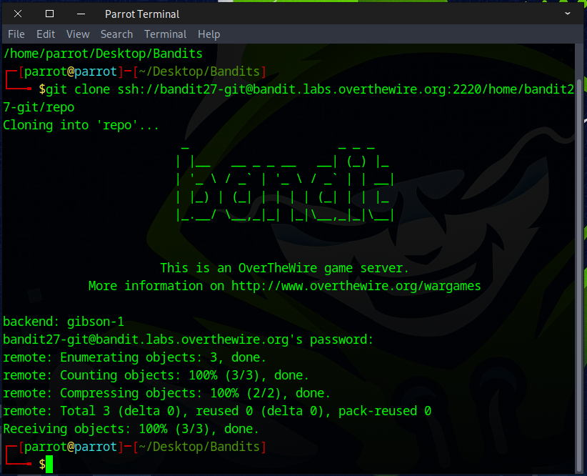
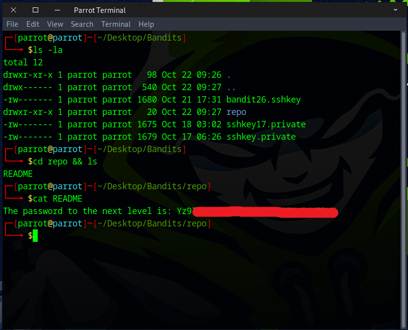

# Bandit Level 27 → Level 28

## Level Goal

There is a git repository at ssh://bandit27-git@bandit.labs.overthewire.org/home/bandit27-git/repo via the port 2220. The password for the user bandit27-git is the same as for the user bandit27.

Clone the repository and find the password for the next level.

## Commands you may need to solve this level

    git


### 🔑 Solution

### 📋 Useful Git Command


Navigate to your desired directory using `cd`, then run the `git clone` command to clone the Bandit27 Git repository.
```
git clone ssh://bandit27-git@bandit.labs.overthewire.org:2220/home/bandit27-git/repo
```


Enter the password obtained from the previous challenge. Everything should work correctly without any errors.



Next, run the `ls` command to list the contents—you should see a `repo` folder. Navigate into it using `cd`, then use cat to read the `README` file.



🎉🎉🎉Congratulations on completing the challenge and successfully cloning your first Git repository! Now, let’s move on to the next level and continue building your Git skills.

