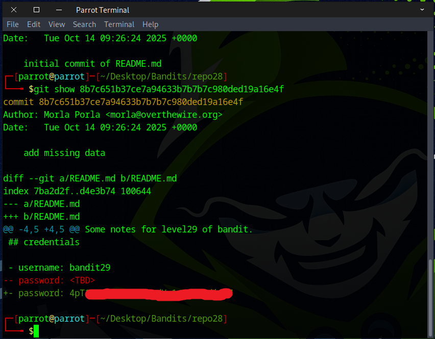

# Bandit Level 28 → Level 29

## Level Goal

There is a git repository at ssh://bandit28-git@bandit.labs.overthewire.org/home/bandit28-git/repo via the port 2220. The password for the user bandit28-git is the same as for the user bandit28.

Clone the repository and find the password for the next level.

## Commands you may need to solve this level

    git


### 🔑 Solution

### 📋 Useful Git Command


Use the `cd` command to go to the folder where you want to work, then execute `git clone` to download the *Bandit28* Git repository.
```
git clone ssh://bandit28-git@bandit.labs.overthewire.org:2220/home/bandit28-git/repo ~/Desktop/Bandits/repo28
```


Enter the password you get from the previous challenge. Everything should work smoothly—if you encounter any errors, read the error message carefully and verify your syntax.


If the clone was successful, you’ll see a folder named `repo28`. Go into that directory using `cd repo28`, then list its contents with `ls` and display the `README.md` file using `cat`. You’ll notice that the password has been removed.


By running the `git log` command, we see three commits, one of which has the intriguing message ``"add missing data"``.


Next, we use the `git checkout` command.
```
git checkout 8b7c651b37ce7a94633b7b7b7c980ded19a16e4f
```


You should see a message indicating that we are switching to that commit.


Next, use the `cat` command to view the `README.md` file again. This time, you should see the password of bandit29.


You can also use the `git show` command as an alternative to `git checkout`.
```
git log
git show 8b7c651b37ce7a94633b7b7b7c980ded19a16e4f
```


Awesome! You’ve successfully found the flag for the next stage.


