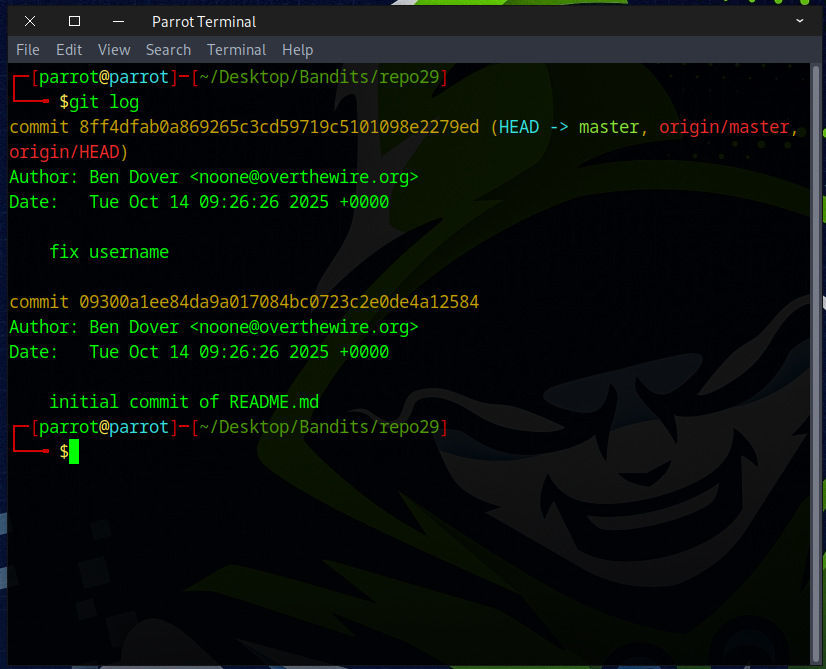

# Bandit Level 29 → Level 30

## Level Goal

There is a git repository at ssh://bandit29-git@bandit.labs.overthewire.org/home/bandit29-git/repo via the port 2220. The password for the user bandit29-git is the same as for the user bandit29.

Clone the repository and find the password for the next level.

## Commands you may need to solve this level

    git


### 🔑 Solution

### 📋 Useful Git Command


Navigate to the folder where you want to work using `cd`, and then use `git clone` to clone the *Bandit29* repository.
```
git clone ssh://bandit29-git@bandit.labs.overthewire.org:2220/home/bandit29-git/repo repo29
```
  

Type in the password from the previous level. It should work fine, but if you run into any errors, read the message carefully and make sure your command is correct.


The hint for this challenge is *no passwords in production!*


We ran the `git log` command and checked both commits, but there was nothing there. What should we do next?



Next, run `git branch -a` to see if there are any branches other than *main* or *master*.
Sometimes the password is hidden in a different branch (e.g., *dev*, *feature*, or *testing*).
```
git branch -a
```


The `remotes/origin/dev` branch looks interesting, so we used the `git show` command to inspect it.
```
git show remotes/origin/dev
```


Alternatively, we can use the `git log` command along with `grep` to search for the password with the following command.
```
git log --all -p | grep -i "password"
```
``git log`` — Shows the commit history of a repository.  
``--all`` — Includes all branches (not just the current one).  
``-p`` — Shows the patches (the actual code changes, i.e., the diff) introduced in each commit.  
``grep -i`` — Makes the search case-insensitive (so it matches “Password”, “password”, “PASSWORD”, etc.).


Great job! That’s the flag you’ll need for the next challenge.


