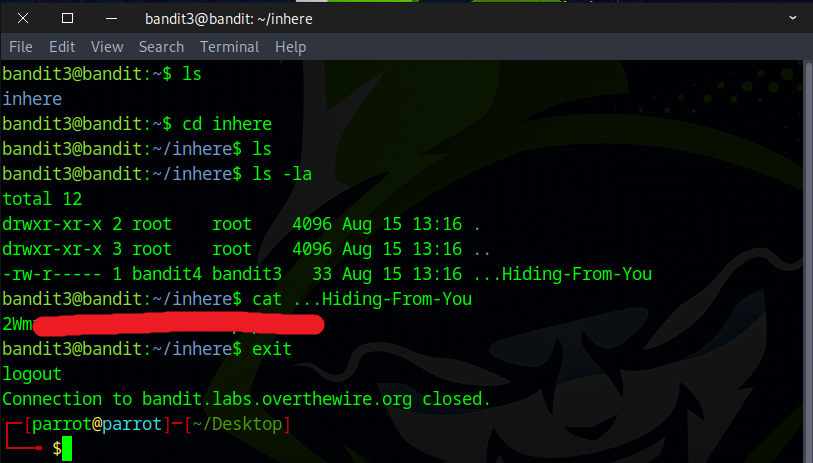

# Bandit Level 3 → Level 4

## Level Goal

The password for the next level is stored in a hidden file in the inhere directory.

## Commands you may need to solve this level

    ls , cd , cat , file , du , find

### 🔑 Solution

```
ssh bandit3@bandit.labs.overthewire.org -p 2220
```
Next, input the password you retrieved in the previous challenge.

Use the command `ls` to list the contents of the current directory.
You will see a folder named `inhere`.
Change into that directory using `cd inhere`.
Then, run `ls -al` to list all files, including hidden ones.
Finally, use the cat command to view the contents of the hidden file. 
```
cat ...Hiding-From-You
```


Awesome! You’ve successfully found the flag for the next stage.

