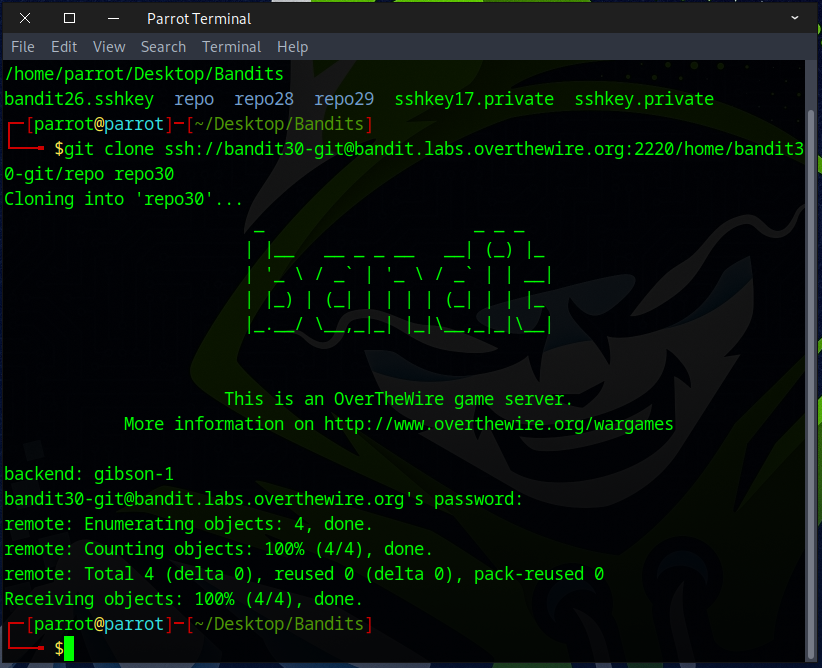
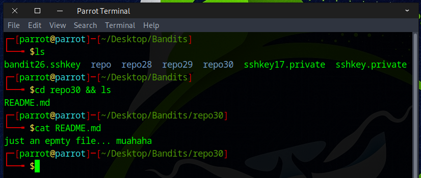
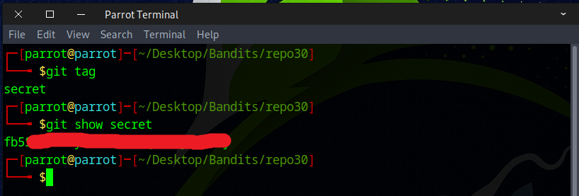

# Bandit Level 30 → Level 31

## Level Goal

There is a git repository at ssh://bandit30-git@bandit.labs.overthewire.org/home/bandit30-git/repo via the port 2220. The password for the user bandit30-git is the same as for the user bandit30.

Clone the repository and find the password for the next level.

## Commands you may need to solve this level

    git


### 🔑 Solution

### 📋 Useful Git Command


Navigate to the folder where you want to work using `cd`, and then use `git clone` to clone the *Bandit30* repository.
```
git clone ssh://bandit30-git@bandit.labs.overthewire.org:2220/home/bandit30-git/repo repo30
```


Use the password from the previous stage. Everything should function correctly, but if an error appears, read the message carefully and double-check your command.



We used `git log`, `git show`, and `git branch`, but came up empty. What should we try next?



Running `git tag` revealed an interesting tag called *secret*, so we checked it with `git show`.
```
git tag
git show secret
```


You’ve got the flag — on to the next challenge!
